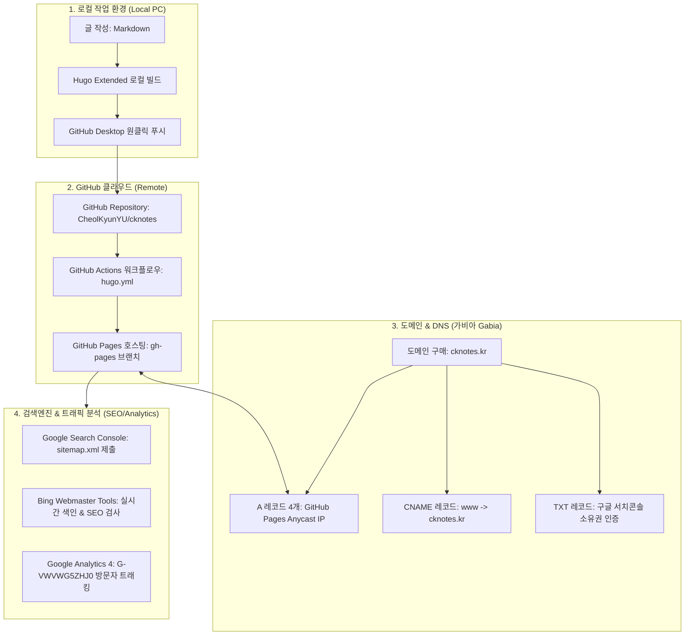

# 📘 CK notes 블로그 구축 & 인프라 복구 매뉴얼 (DR Guide)

> **문서 목적**: PC 교체나 포맷 등 재해 상황(Disaster Recovery) 발생 시 10분 내에 블로그 운영 환경을 복원하고, 다른 사용자에게 블로그 아키텍처와 운영 원칙(AEO/GEO/SEO)을 완벽히 인수인계하기 위한 종합 기술 가이드입니다.

---

## 🛠️ 1. 사용 중인 기술 스택 & 툴 (Tech Stack & Tools)

블로그 구축 및 운영에 실제로 사용된 모든 도구와 서비스 목록입니다:

| 구분 | 도구 / 서비스명 | 용도 및 역할 | 설치 / 접속 링크 |
|---|---|---|---|
| **정적 사이트 생성기** | **Hugo (Extended)** | Markdown 문서를 초고속 HTML 웹사이트로 컴파일하는 엔진 | [gohugo.io](https://gohugo.io/) |
| **블로그 테마** | **PaperMod** | 빠르고 깔끔한 미니멀리즘 반응형 블로그 테마 (다크모드 지원) | [PaperMod GitHub](https://github.com/adityatelange/hugo-PaperMod) |
| **버전 관리 (VCS)** | **Git** | 블로그 소스 코드 및 글 히스토리 버전 추적 | [git-scm.com](https://git-scm.com/) |
| **GUI 배포 클라이언트** | **GitHub Desktop** | 터미널 명령어 없이 원클릭으로 커밋 & 푸시하여 실시간 자동 배포 | [desktop.github.com](https://desktop.github.com/) |
| **코드 저장소 & 호스팅** | **GitHub (Repo & Pages)** | 원격 저장소(`cknotes`) 및 무료 정적 웹 호스팅(GitHub Pages) | [github.com](https://github.com/) |
| **CI/CD 자동 빌드 배포** | **GitHub Actions** | Git 푸시 시 클라우드에서 Hugo 빌드를 자동 수행하여 배포(`hugo.yml`) | GitHub 내장 기능 |
| **도메인 등록 & DNS** | **가비아 (Gabia)** | 나만의 고유 도메인(`cknotes.kr`) 구매 및 Anycast IP 네임서버 매핑 | [gabia.com](https://www.gabia.com/) |
| **보안 인증서 (SSL)** | **Let's Encrypt (무료)** | `https://` 보안 프로토콜을 위한 공식 SSL/TLS 인증서 자동 갱신 | GitHub Pages 자동 제공 |
| **검색엔진 최적화 (구글)**| **Google Search Console** | 구글 검색 로봇 크롤링 제어, 사이트맵(`sitemap.xml`) 제출, 색인 현황 분석 | [search.google.com](https://search.google.com/search-console) |
| **검색엔진 최적화 (Bing)**| **Bing Webmaster Tools** | Bing 검색 및 Microsoft Copilot AI 검색 색인 등록 및 실시간 SEO 검사 | [bing.com/webmasters](https://www.bing.com/webmasters) |
| **방문자 트래픽 통계** | **Google Analytics 4 (GA4)**| 일별 방문자 수, 체류 시간, 실시간 접속자, 인기 글 유입 경로 분석 | [analytics.google.com](https://analytics.google.com/) |
| **AI 페어 프로그래밍** | **Google Antigravity** | 블로그 인프라 구성, 에러 트러블슈팅, 자동화 스크립트 작성 보조 AI | Google Deepmind |

---

## 🏗️ 2. 전체 아키텍처 구성도 (Architecture Overview)



---

## 🔄 3. PC 포맷/교체 시 10분 만에 복구하기 (Disaster Recovery)

PC가 초기화되거나 새 노트북으로 교체했을 때, 다음 3단계만 실행하면 예전 상태 그대로 100% 복원됩니다.

### Step 1. 필수 도구 설치
1. **Git 설치**: [git-scm.com](https://git-scm.com/) 다운로드 후 기본값으로 설치
2. **GitHub Desktop 설치**: [desktop.github.com](https://desktop.github.com/) 설치 후 본인 GitHub 계정 로그인
3. **Hugo Extended 바이너리 다운로드**:
   - [Hugo Releases](https://github.com/gohugoio/hugo/releases)에서 `hugo_extended_X.XX.X_windows-amd64.zip` 다운로드
   - 압축을 풀고 `hugo.exe` 파일을 블로그 루트 폴더에 넣기만 하면 끝 (또는 Windows PATH 환경변수에 등록).

### Step 2. 저장소 Clone (내려받기)
1. GitHub Desktop 실행 → 상단 메뉴 `File` > `Clone repository...` 클릭
2. `CheolKyunYU/cknotes` 저장소를 선택하고 원하는 로컬 경로(예: `C:\Users\...\GitHub\cknotes`)로 Clone.

### Step 3. 로컬 테스트 및 배포 확인
```powershell
# 1. 터미널(PowerShell)에서 블로그 폴더로 이동
cd <블로그_저장소_경로>

# 2. 로컬 미리보기 웹서버 구동 (초안/미래 글 포함)
.\hugo.exe server -D

# 3. 브라우저에서 실시간 확인
# http://localhost:1313/ 접속
```
- 평소처럼 마크다운 글을 작성/저장한 뒤, **GitHub Desktop**에서 **[Commit] → [Push origin]**을 누르면 GitHub Actions가 1분 안에 알아서 빌드하여 `cknotes.kr`에 전 세계 배포를 완료합니다.

---

## 🌐 4. 도메인 & DNS 네트워킹 설정값 (가비아)

가비아(Gabia)의 DNS 관리 콘솔에 등록되어 있는 실제 레코드 매핑 정보입니다:

| 타입 | 호스트(이름) | 값(Value / IP) | 역할 및 설명 |
|---|---|---|---|
| **A** | `@` | `185.199.108.153` | GitHub Pages 공식 Anycast 글로벌 IP 1 |
| **A** | `@` | `185.199.109.153` | GitHub Pages 공식 Anycast 글로벌 IP 2 |
| **A** | `@` | `185.199.110.153` | GitHub Pages 공식 Anycast 글로벌 IP 3 |
| **A** | `@` | `185.199.111.153` | GitHub Pages 공식 Anycast 글로벌 IP 4 |
| **CNAME** | `www` | `cknotes.kr.` | `www.cknotes.kr` 접속 시 메인 도메인으로 리다이렉트 |
| **TXT** | `@` | `google-site-verification=dr0Q6_PYk2R4JOUSa884LZJjb8hrAqlRxTg5j-XnkgY` | 구글 서치콘솔 도메인 전체 소유권 인증 키 |

> **⚠️ GitHub Pages 설정 확인사항**:
> - 저장소 루트 및 static 폴더 내 `CNAME` 파일 존재: `cknotes.kr`
> - GitHub 저장소 `Settings` → `Pages` → Custom domain: `cknotes.kr` 및 **Enforce HTTPS 체크** 필수.

---

## 📈 5. 검색엔진 & 통계 분석 연동 정보

### ① Google Search Console (구글 서치콘솔)
- **속성 유형**: 도메인 속성 (`cknotes.kr`)
- **제출 사이트맵**: `https://cknotes.kr/sitemap.xml` (Status: 성공)

### ② Bing 웹마스터 도구 (Bing Webmaster Tools)
- **등록 방식**: 구글 서치콘솔 연동으로 자동 가져오기 완료.
- **Bing SEO 통과 핵심 조치**:
  - 홈 타이틀 글자 수 충족 (`Title too short` 해결).
  - 페이지당 오직 1개의 `<h1>` 태그만 존재하도록 시맨틱 태그 정리 (`More than one h1 tag` 통과).

### ③ Google Analytics 4 (GA4)
- **측정 ID**: `G-VWVWG5ZHJ0`
- **삽입 위치**: `layouts/_partials/extend_head.html`에 Google tag(`gtag.js`) 적용.
- **통계 확인**: [구글 애널리틱스 콘솔](https://analytics.google.com/) 접속 후 `보고서` → `실시간` 또는 `트래픽 획득`에서 일일 방문자 및 페이지뷰 조회.

---

## ✍️ 6. AEO / GEO / SEO 콘텐츠 작성 원칙

검색엔진 봇뿐만 아니라 **ChatGPT, Perplexity, Claude, Bing Copilot 등 생성형 AI**가 신뢰할 수 있는 기술 문서로 인용(Citation)하도록 만드는 작성 규칙입니다.

### 💡 개념 이해
- **SEO (Search Engine Optimization)**: 검색엔진 키워드 상위 노출
- **AEO (Answer Engine Optimization)**: 사용자의 질문에 AI가 답변을 생성할 때 내 글의 문장을 '직접 정답'으로 채택하도록 최적화
- **GEO (Generative Engine Optimization)**: 복합적인 질문에 대해 AI가 여러 소스를 비교/요약할 때 내 블로그를 출처로 추천하도록 최적화

### 📝 앞으로 지킬 5가지 작성 원칙
1. **URL은 무조건 영문 소문자 케밥케이스(kebab-case) 사용**:
   - ⭕ `content/posts/cisco-mds-snmp-setup-guide/index.md`
   - ❌ `content/posts/시스코-MDS-SNMP-가이드/index.md` (한글 URL 절대 금지, 깨짐 및 AI 크롤러 누락 방지)
2. **시맨틱 헤딩(Heading) 계층 준수**:
   - 본문 내 최상단 제목은 Frontmatter의 `title`이 담당합니다.
   - 본문 안에서는 `#` (H1)을 쓰지 말고, 반드시 `##` (H2)로 대주제를 나누고 그 아래는 `###` (H3)으로 구성합니다.
3. **직관적인 문제-해결 구조 (AEO 최적화)**:
   - 각 소단락 시작 시 *"이 작업이 왜 필요한가?"* 와 *"핵심 해결책 요약"*을 1~2줄로 먼저 제시합니다. (AI가 가장 인용하기 좋아하는 포맷)
4. **구체적인 실무 고유 명사 명시 (GEO 최적화)**:
   - 막연한 설명 대신 정확한 OS 버전, 모델명, CLI 명령어를 그대로 기재합니다. (`HPE SimpliVity 6.2.0`, `NX-OS 9.3(2)`, `MDS 9148S` 등)
5. **작성자 브랜딩 통일 & 개인정보 보호**:
   - 작성자명은 항상 **`CK notes`**로 표기하고, 실명은 노출하지 않습니다.
