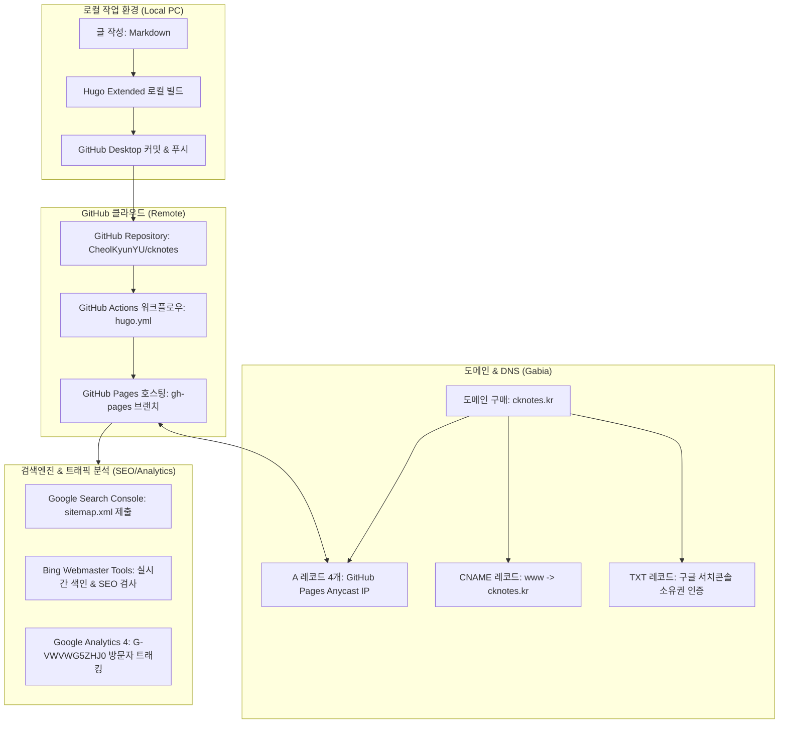

# 📘 CK notes 블로그 구축 & 인프라 복구 매뉴얼 (DR Guide)

> **문서 목적**: PC 교체나 포맷 등 재해 상황(Disaster Recovery) 발생 시 10분 내에 블로그 운영 환경을 복원하고, 다른 사용자에게 블로그 아키텍처와 운영 원칙(AEO/GEO/SEO)을 완벽히 인수인계하기 위한 종합 기술 가이드입니다.

---

## 1. 전체 아키텍처 구성도 (Architecture Overview)



---

## 2. PC 포맷/교체 시 10분 만에 복구하기 (Disaster Recovery)

PC가 초기화되거나 새 노트북으로 교체했을 때, 다음 3단계만 실행하면 예전 상태 그대로 복구됩니다.

### Step 1. 필수 도구 설치
1. **Git 설치**: [git-scm.com](https://git-scm.com/) 다운로드 및 기본값 설치
2. **GitHub Desktop 설치**: [desktop.github.com](https://desktop.github.com/) 설치 후 GitHub 계정 로그인
3. **Hugo Extended 바이너리 다운로드**:
   - [Hugo Releases](https://github.com/gohugoio/hugo/releases)에서 `hugo_extended_X.XX.X_windows-amd64.zip` 다운로드
   - 압축 해제 후 `hugo.exe`를 블로그 프로젝트 루트 폴더에 넣거나 시스템 환경변수(PATH)에 등록.

### Step 2. 저장소 Clone (내려받기)
1. GitHub Desktop 실행 → `File` > `Clone repository...` 선택
2. `CheolKyunYU/cknotes` 저장소 선택 후 원하는 로컬 경로(예: `C:\Users\...\GitHub\cknotes`)에 Clone.

### Step 3. 로컬 테스트 및 배포 확인
```powershell
# 1. 저장소 폴더로 이동
cd <블로그_폴더_경로>

# 2. 로컬 미리보기 서버 구동 (초안 및 미래 포스트 포함)
.\hugo.exe server -D

# 3. 브라우저에서 확인
# http://localhost:1313/ 접속
```
- 글 작성 후 저장한 뒤 GitHub Desktop에서 **[Commit] → [Push origin]**을 누르면 GitHub Actions가 자동으로 빌드하여 `cknotes.kr`에 자동 배포됩니다.

---

## 3. 네트워킹 & 도메인 설정 정보 (Gabia DNS)

가비아(Gabia)의 DNS 관리 콘솔 설정 내역입니다:

| 타입 | 호스트(이름) | 값(Value / IP) | 용도 |
|---|---|---|---|
| **A** | `@` | `185.199.108.153` | GitHub Pages 공식 Anycast IP 1 |
| **A** | `@` | `185.199.109.153` | GitHub Pages 공식 Anycast IP 2 |
| **A** | `@` | `185.199.110.153` | GitHub Pages 공식 Anycast IP 3 |
| **A** | `@` | `185.199.111.153` | GitHub Pages 공식 Anycast IP 4 |
| **CNAME** | `www` | `cknotes.kr.` | 서브도메인 리다이렉트 연결 |
| **TXT** | `@` | `google-site-verification=dr0Q6_...` | 구글 서치콘솔 도메인 속성 인증 토큰 |

> **GitHub Pages 설정 주의점**:
> - 저장소 `static/CNAME` 파일 내용: `cknotes.kr`
> - GitHub Repository `Settings` → `Pages` → Custom domain: `cknotes.kr` 및 **Enforce HTTPS** 필수 체크.

---

## 4. 검색엔진 & 트래픽 분석 설정

### ① Google Search Console (구글 서치콘솔)
- **등록 방식**: 도메인 속성 (`cknotes.kr`) 등록 (가비아 TXT 레코드로 인증 완료).
- **제출 사이트맵**: `https://cknotes.kr/sitemap.xml`

### ② Bing 웹마스터 도구
- **등록 방식**: Google Search Console 연동으로 자동 가져오기 완료.
- **Bing SEO 필수 규칙 (트러블슈팅 완료)**:
  - 홈페이지 타이틀은 15자 이상 상세히 기술되어야 함 (`Title too short` 방지).
  - 페이지당 `<h1>` 태그는 반드시 **정확히 1개**만 존재해야 함 (`More than one h1 tag` 방지).

### ③ Google 애널리틱스 (GA4)
- **측정 ID**: `G-VWVWG5ZHJ0`
- **적용 위치**: `layouts/_partials/extend_head.html`에 Google tag(`gtag.js`) 삽입.
- **방문자 확인**: [Google Analytics 콘솔](https://analytics.google.com/) → `보고서` → `실시간` 또는 `트래픽 획득`에서 일일 방문자 수 및 체류 시간 확인 가능.

---

## 5. AEO / GEO / SEO 콘텐츠 작성 원칙

인공지능 검색 엔진(Perplexity, ChatGPT Search, Bing Copilot) 및 구글 봇이 가장 신뢰하는 콘텐츠로 인식하게 만드는 작성 규칙입니다.

### 💡 용어 정리:
- **SEO (Search Engine Optimization)**: 구글, 네이버 같은 기존 검색엔진 상위 노출 최적화
- **AEO (Answer Engine Optimization)**: AI가 질문에 답변할 때 내 글의 문장을 직접 정답으로 채택하도록 만드는 최적화
- **GEO (Generative Engine Optimization)**: 생성형 AI가 복합적인 정보를 요약하고 추천할 때 내 블로그를 인용(Citation)하도록 만드는 최적화

### 📝 필수 작성 규칙
1. **URL은 100% 영문 소문자 케밥케이스(kebab-case) 사용**:
   - ⭕ `content/posts/cisco-mds-snmp-setup-guide/index.md`
   - ❌ `content/posts/시스코-MDS-SNMP-설정/index.md` (한글 URL 절대 금지)
2. **시맨틱 태그 계층 준수**:
   - 문서 제목은 Frontmatter의 `title`만 담당 (본문 안에서 `# 대제목` 사용 금지).
   - 본문 내 소제목은 `## 소제목(H2)`으로 시작하고, 그 아래 세부 항목은 `### 세부제목(H3)`으로 단계적 작성.
3. **직관적인 문제 정의 & 명확한 답변 (AEO 최적화)**:
   - 각 문단의 첫머리에 **"이 글에서 해결하려는 문제"**와 **"핵심 해결책"**을 요약 문장으로 먼저 제시.
   - 예: `Cisco MDS 스위치에서 트랩 폭풍을 방지하려면 snmp-server enable traps 대신 필요한 MIB 카테고리만 지정해야 합니다.`
4. **구체적인 실무 고유 명사 명시 (GEO 최적화)**:
   - 모호한 표현("스위치 설정", "서버 업데이트") 대신 정확한 펌웨어 버전, 모델명, CLI 명령어 명시 (`HPE SimpliVity 6.2.0`, `NX-OS 9.3(2)`, `MDS 9148S`).
5. **실명 노출 금지**:
   - 블로그 작성자명은 항상 **`CK notes`**로 통일.
