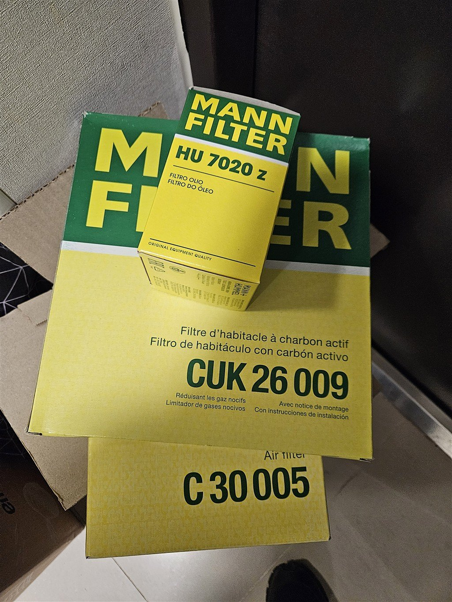
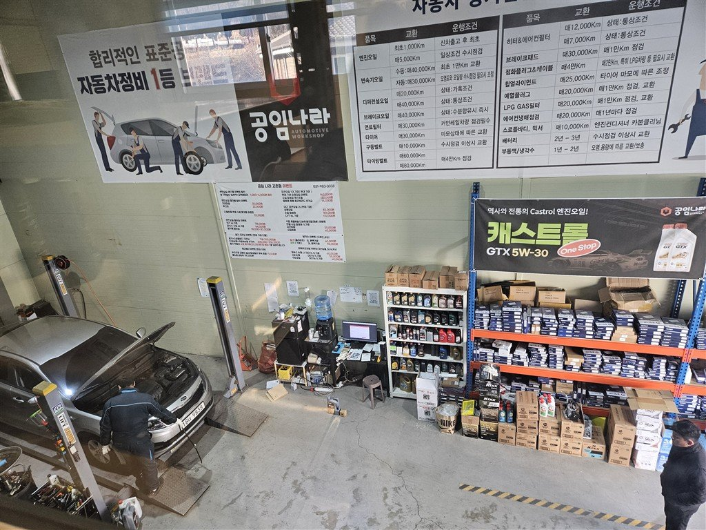
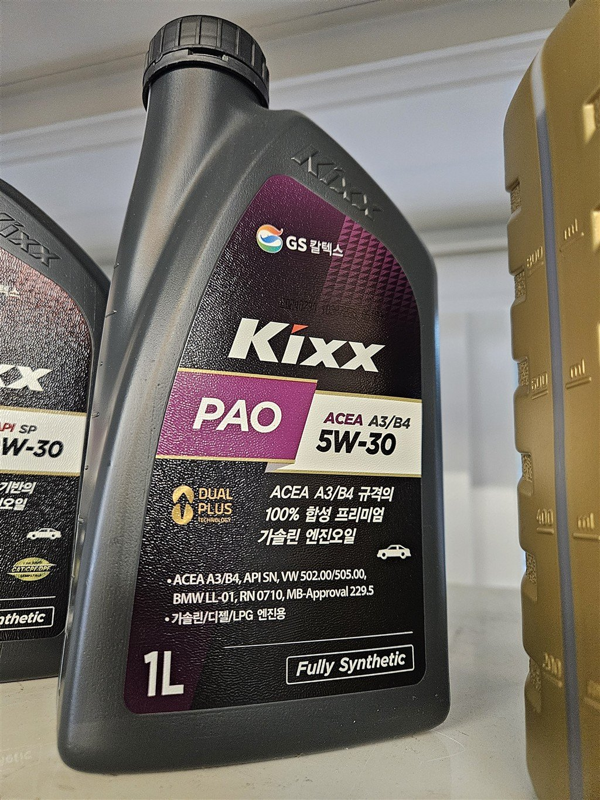
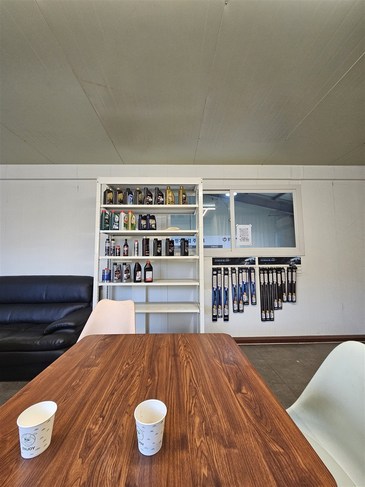
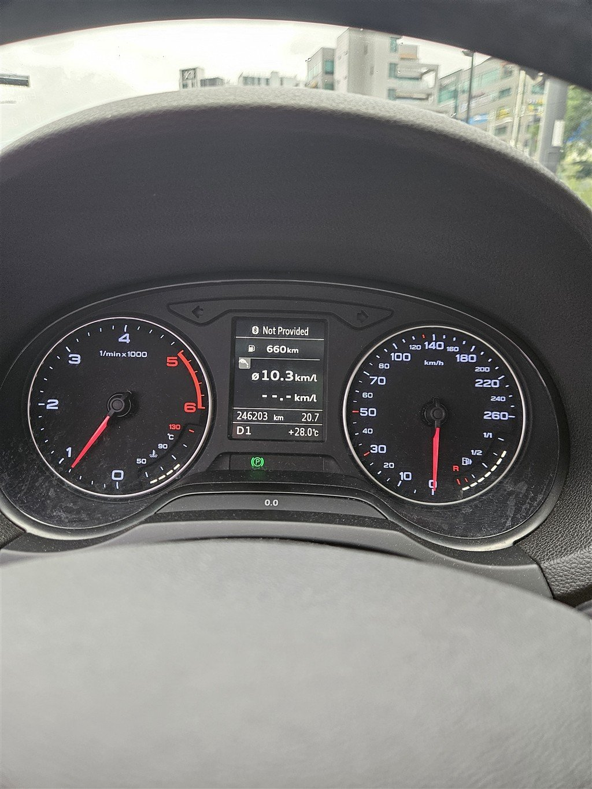
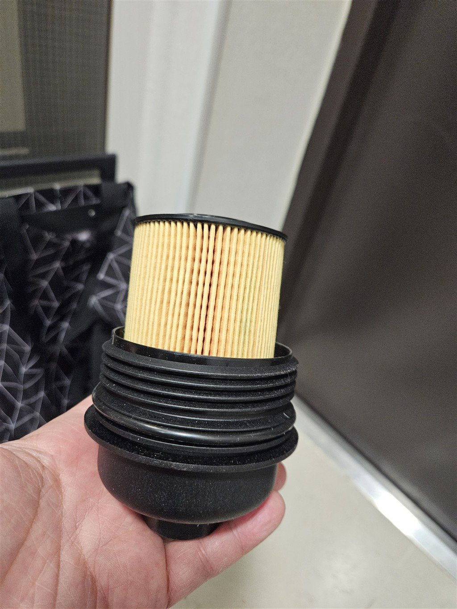
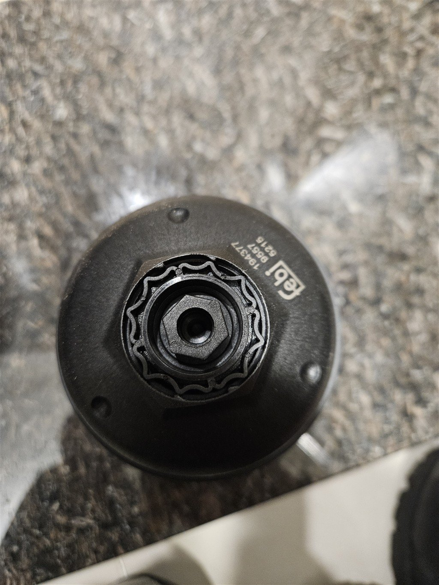
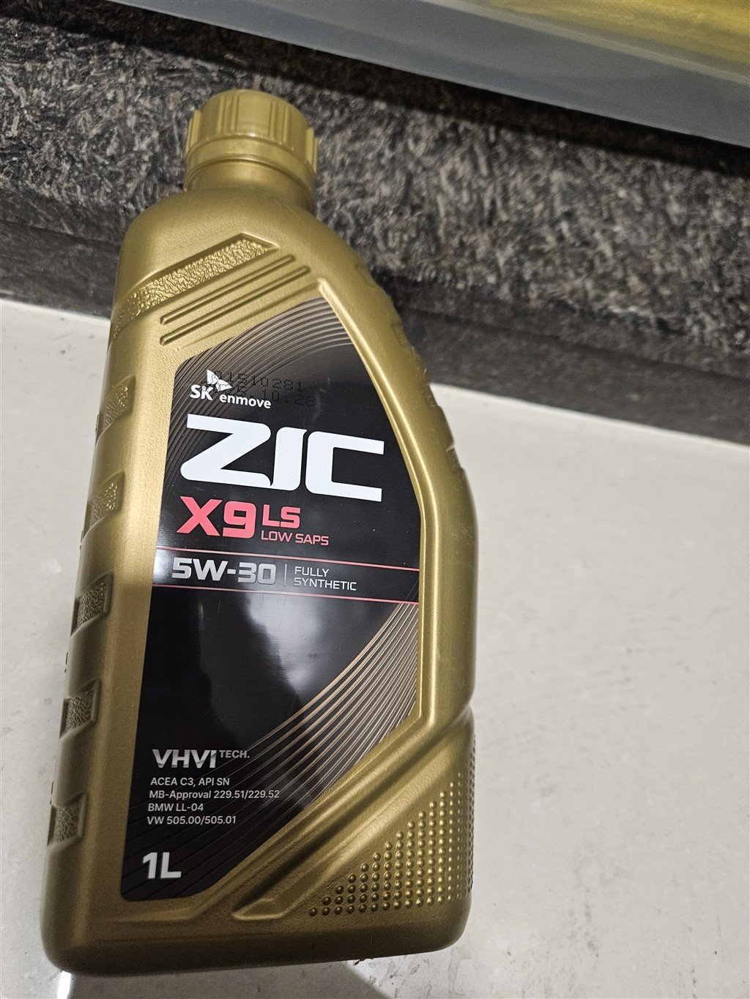

hello! **It's a little late, but from now on, I'm going to keep a record of my daily life and car maintenance on the blog.**

Today, I would like to write about my colleague and partner, who always supports me every time I go out to work at a customer site, and the engine oil changer for my vehicle.

As we travel all over the country and work hard together, I take care of my consumables meticulously with the thought, **"I have to take care of my partner's condition myself!"**. I've already changed the engine oil twice in the first half of this year alone.

## First engine oil change in January (approximately 234,000 km)

I had my first engine oil change early this year, on January 9th, when the mileage had just exceeded 234,000 kilometers.

*(Photo: MANN filter boxes prepared in advance)*

Before going to the repair shop, I purchased various filters, including oil filters and air filters, at low prices through Naver Shopping. The filter was prepared with **MANN FILTER**, which I trust, and the engine oil was prepared with **ZIC**, which I always use.

**💡 Small resolutions related to filters**
Of course, the performance of the MANN filter is undoubtedly good, but the next time you change engine oil, I will look for a 'more reasonable cost-effective filter combination' that can save you a little more money, and I will be sure to introduce it to you in the next post!

I loaded the parts into the trunk and headed to **'Labor Nara'** where I had made a reservation in advance.

*(Photo: A mechanic opens the bonnet and thoroughly repairs the vehicle)*

At Gongimnara, you can buy the parts you want and receive maintenance by paying a reasonable standard labor fee. This is the best system for people like me who want to save money and be meticulous in selecting the parts for their partner. 👍

*(Photo: Kixx oil on display in the store)*

For reference, when I looked around the store, there was an oil that matched my car's specifications. When I checked, it was a **Kixx** product. If you are busy and cannot prepare oil in advance, you may want to use the oil available at the store right away.

*(Photo: 2nd floor lounge where we rested comfortably while waiting for maintenance)*

I left my car and went up to the lounge on the second floor. The waiting area was well-maintained and comfortable, so I was able to rest comfortably until the maintenance was completed.

**💡 Mechanic’s thorough check and advice**
After completing the maintenance, the mechanic informed me that **the drain bolt side of the oil filter cap was worn**. He said that if you continue to ride like this and do not replace the O-ring in time, the O-ring may eventually wear out and cause engine oil leakage. **It is recommended that the entire oil filter cap be replaced the next time.
I could have easily missed it, but I was very fortunate to be able to clearly check for hidden factors of deteriorating physical condition with the eagle eye of an expert.

## In July, replacement cycle and parts repair returned (246,203km)

As I was diligently going about my business with my business partner, it was already July 10th! The mileage has increased to about 12,000 km.

*(Photo: Instrument panel proof shot showing 246,203km mileage)*

When I saw **246,203km** stamped on the dashboard, it was time to replace it again after 6 months. When replacing this July, I did not forget the advice from the mechanic last January and prepared the parts in advance!

*(Photo: New oil filter cap purchased in advance from Naver for about 60,000 won)*

I purchased an oil filter cap through Naver for about 60,000 won. When changing the engine oil this time, I also took this part and replaced it with a new one! I feel reassured that I can ride safely without worrying about oil leaks.

*(Photo: ZIC engine oil was still selected during replacement in July)*

For this July replacement, we used **ZIC engine oil** just like last January. After emptying out the old oil and replacing it with new ZIC oil, **the engine became noticeably quieter and the car felt much smoother**. The drive to my next client felt much more refreshing! I am so satisfied with this smooth driving feeling that I will probably replace it with ZIC without hesitation the next time I change engine oil.

## finish

The mileage has exceeded 240,000 kilometers and its age is accumulating, but it is still running strong due to the meticulous management of consumables. There is a sense of pride in taking care of my partner at work, and it kills two birds with one stone as it not only reduces maintenance costs but also prevents accidents or breakdowns (oil leaks, etc.).

If you are someone who uses your car as a reliable business partner every day, I highly recommend that you try to manage the condition of your car economically and reliably with the combination of **'direct purchase of parts + free labor'** like me!
