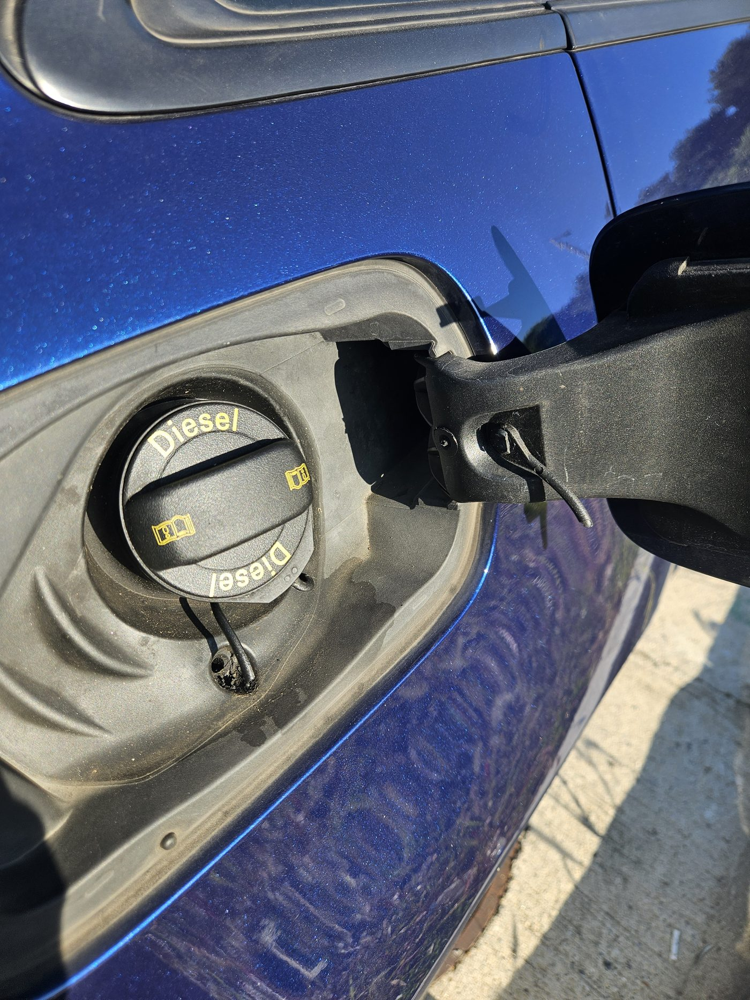
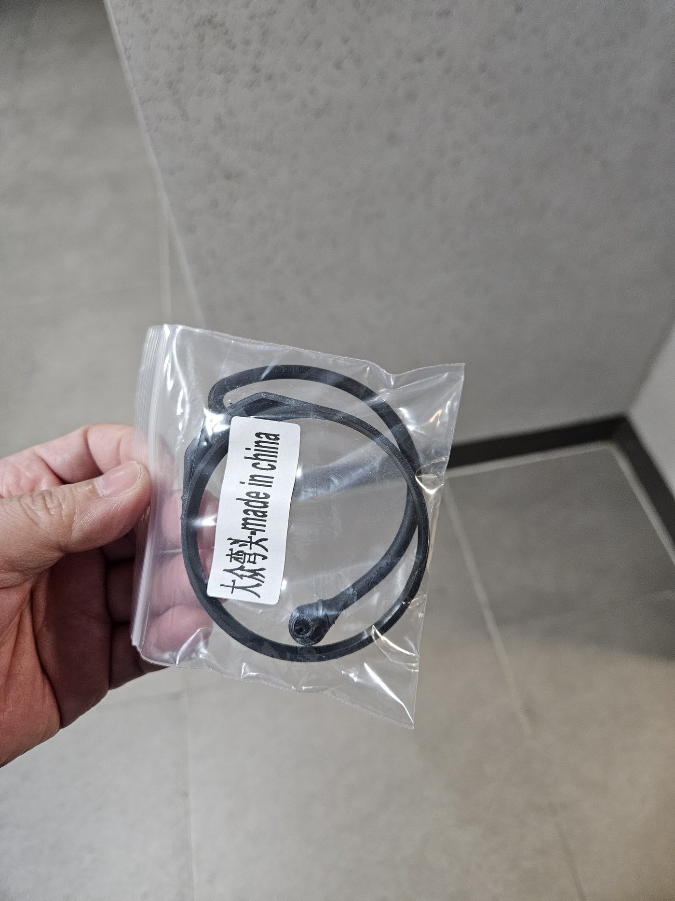
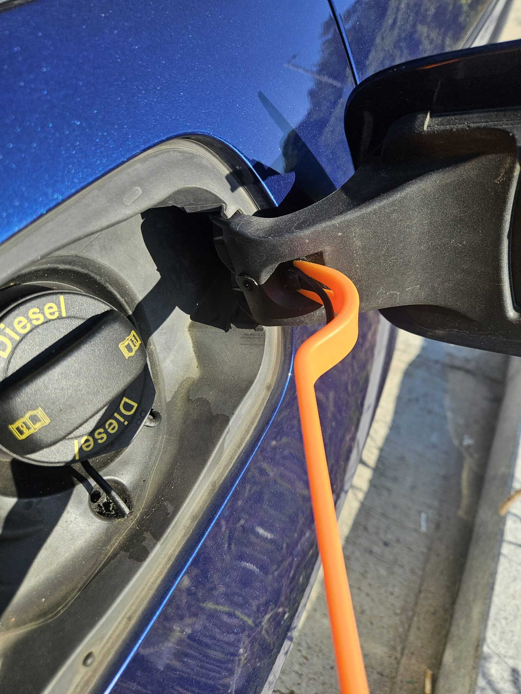
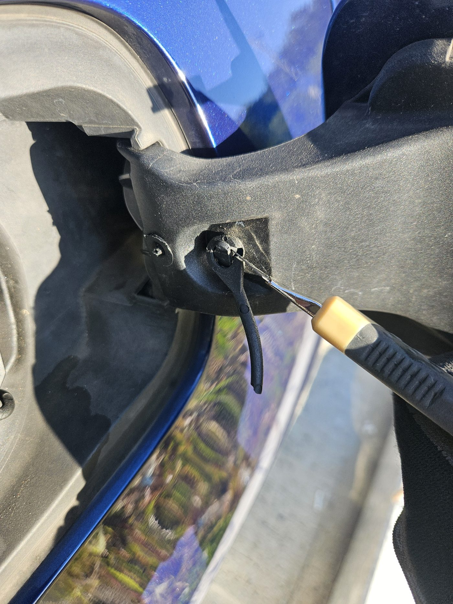
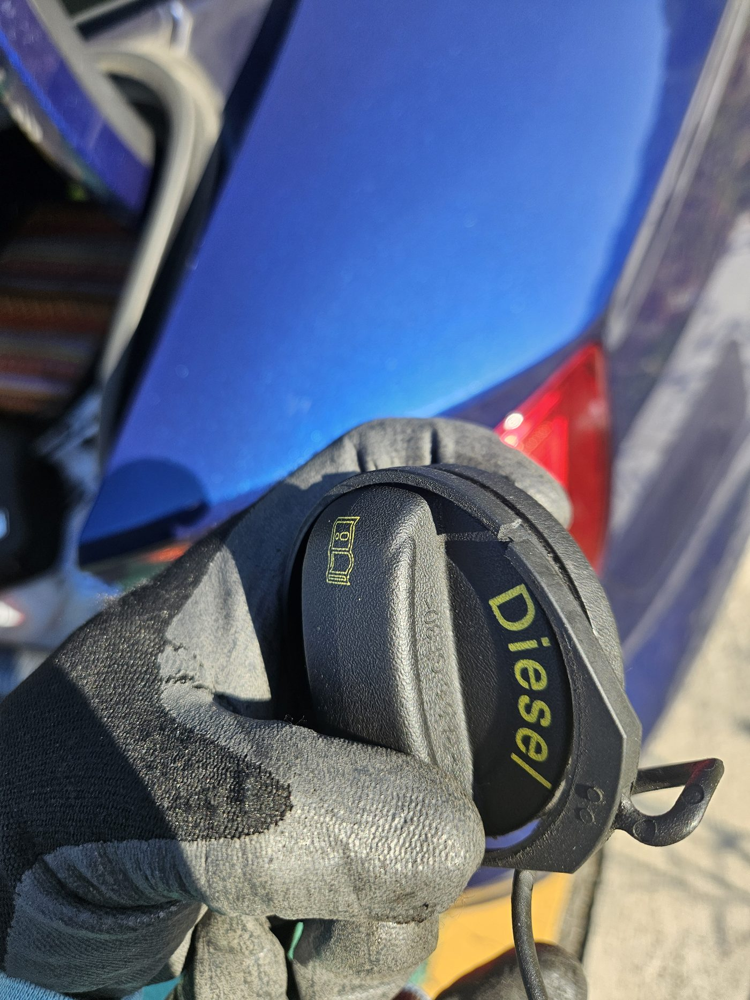
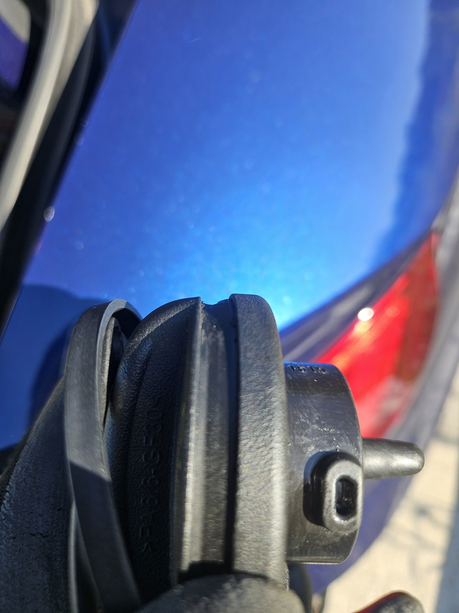
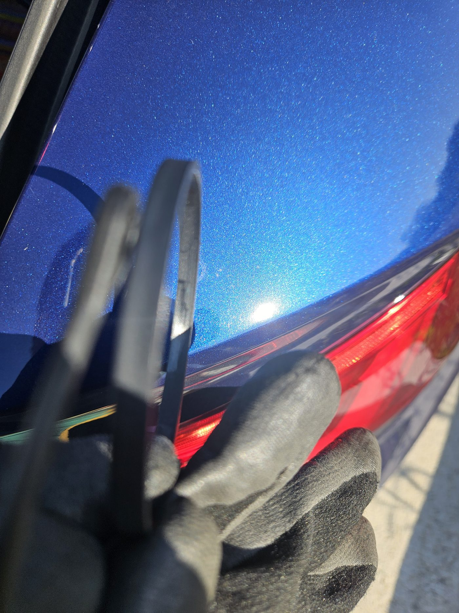
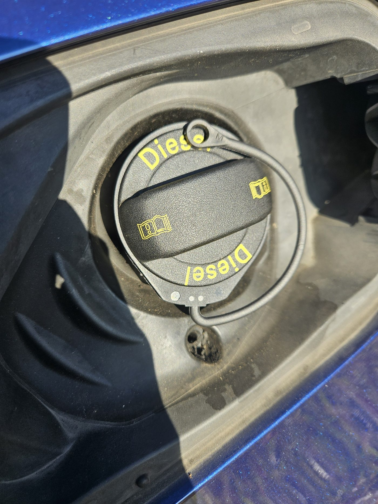
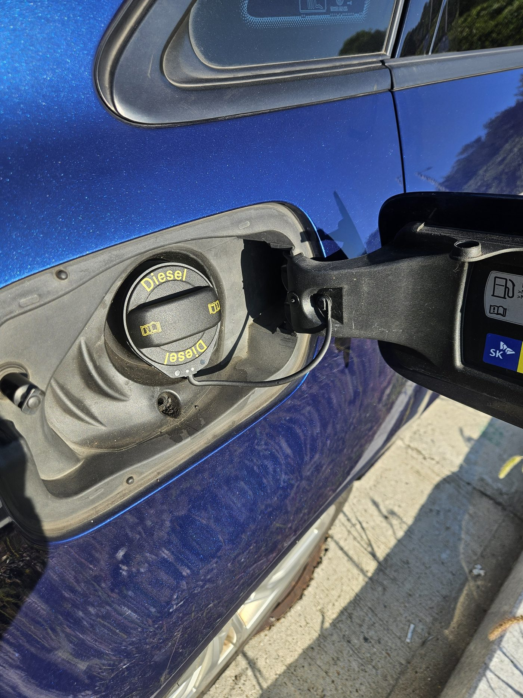
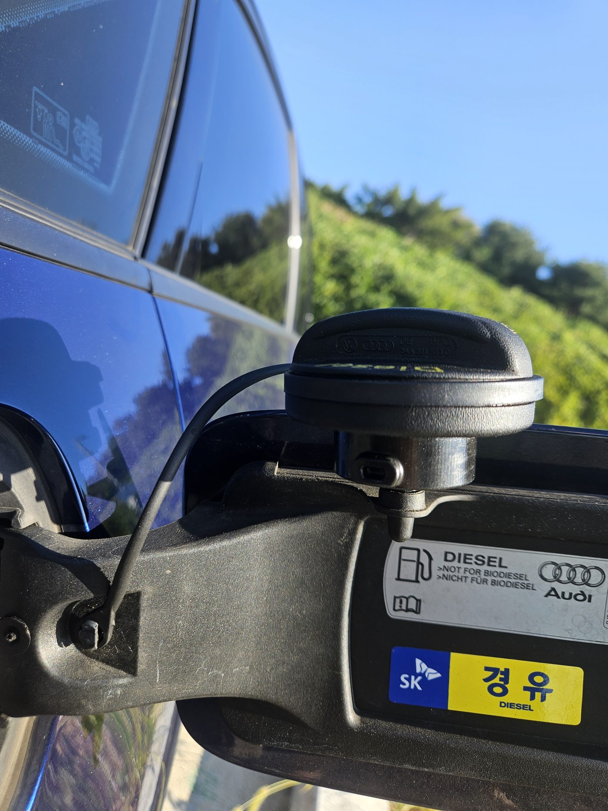

アウディ（Audi）やフォルクスワーゲン（Volkswagen）の車両を長年乗り続けていると、給油のたびに地味にストレスとなるトラブルが発生します。給油口キャップと車体をつなぐゴム製の脱落防止ストラップ（テザー）が経年劣化でぷつりと切れてしまう現象です。

ストラップが切れると、セルフ給油時に外したキャップの置き場に困り、計量機の上に不安定に置いたり、ボディ塗装面に触れて傷がつかないか気を遣うことになります。

正規ディーラーに相談した場合、ゴムストラップ単体での部品供給はなく、キャップアセンブリ（Assembly）ごとの丸ごと交換となるため、工賃込みで数千円から1万円以上の整備費用が発生します。

しかし、ネット通販で千円台の互換ゴムリングパーツとカッターナイフを1本用意すれば、車体に一切の傷をつけずわずか5分で綺麗にDIY交換できます。同一構造を採用しているアウディA3、A4、A6やフォルクスワーゲン ゴルフ、ティグアンなどの車種にも共通して適用できる作業手順と注意点をまとめます。

---

### 作業概要および準備物

| 項目 | 内容 |
| :--- | :--- |
| **対象車種** | アウディ A3（VW ゴルフ、パサート、ティグアン、アウディ A4、A6など共通構造） |
| **準備パーツ** | 給油口キャップ互換ゴムリングストラップ（曲線型オプション、送料込み約1,200円前後） |
| **所要工具** | カッターナイフ、作業用手袋（内張りはがしやドライバーは不要） |
| **作業時間** | 約5分程度 |
| **難易度** | 低（切断と弾性を活かした押し込み結合のみ） |

---

## 1. ストラップ断線の原因と交換パーツの準備

*(写真：10年以上の歳月と度重なる給油による繰り返しの曲げ疲労と経年劣化で切れたゴムストラップ)*

今回の断線は、キャップ自体の気密性低下や燃料蒸気漏れといった機能的な不具合によるものでは決してありません。10年以上にわたる愛車の運用の中で、数百回に及ぶ給油のたびにキャップを開閉し、ゴムストラップが繰り返しねじれや曲げ疲労（Bending Fatigue）を受けたことが根本原因です。これに四季の外気温差が長年加わったことで、ゴム素材が自然に弾性を失って徐々に硬化し、疲労限界を迎えてぷつりと破断した形です。キャップ本体の密閉性や内部バルブは健全そのものであるため、ストラップのみを交換すれば完璧に復旧できます。

*(写真：キャップ側固定リングと車体側結合ホールが一体成形された互換パーツ)*

今回用意した互換パーツです。給油口キャップ外周に嵌めるリングとストラップコード、車体側ピンに固定する円形アイレットホールが一体成形された構造となっています。

薄すぎず、純正同等の適度な厚みと復元弾性を備えており、耐久性も良好です。注文時は車両のキャップ形状に合わせて「曲線型」または「直線型」の適合オプションを選択します（アウディA3は曲線型が適合）。

---

## 2. 作業における最重要原則：車体側ピンの取り外し厳禁

*(写真：車体給油口ハウジングに固定されたプラスチックピンのブラケット構造)*

作業を開始する前に、**最も注意すべき物理的注意事項**があります。

ネット上の整備記事を参考にして、車体側リッド（カバー）に埋め込まれているプラスチック固定ピンを内張りはがしやマイナスドライバーでテコの原理を使って無理に引き抜こうとするケースが見られます。しかし、年式の経過した樹脂ブラケットは硬化が進んでおり、無理な力を加えるとピンやブラケット根元が破損します。ブラケットが破損すると給油口リッドアセンブリ全体の交換という大規模な修理に発展してしまいます。

したがって、**車体側のピンには一切手を触れず**、切れた古いゴムの残骸だけを切断して除去し、新しいゴムの柔軟性を利用して押し込む方式で作業するのが最も安全です。

---

## 3. 残留ゴムの切除と古いリングの取り外し

*(写真：プラスチックピンを傷つけないよう残ったゴムスリーブのみをカッターで切除する様子)*

まず、車体側の固定ピンに残っている古いゴムの切れ端をカッターナイフで慎重に切除します。内部のプラスチックピンの頭を削らないよう、外側のゴム部分だけに軽く刃を当てて切れ込みを入れれば、簡単に剥がれ落ちます。

*(写真：給油口キャップ外周の溝に固定されていた古いプラスチックリングを切断除去)*

続いて、キャップ本体の溝に嵌まっている古いリングを取り外します。手では溝に固着して外しにくいため、カッターナイフでリング外周の一箇所をスパッと切断すると、張力が抜けて簡単に外れます。

---

## 4. テーパー形状の確認と新品ゴムリングの装着

*(写真：給油口キャップ本体のリング装着溝に見られる内向きの傾斜テーパー)*

古いリングを外したキャップ本体を観察すると、リングが収まる溝が直角ではなく、内側に向かって傾斜（テーパー）がついていることが分かります。

*(写真：新品互換リングの内側傾斜角度とキャップ装着方向の確認)*

新品の互換ゴムリング内側の断面も、キャップ本体のテーパー傾斜角度と正確に噛み合うように成形されています。

傾斜の向きを確認後、キャップの片側から溝に引っ掛け、親指で外周に沿って均等に押し込んでいくと、ゴムの弾性により「パチン」と気持ちよく溝内部に嵌まります。工具を使わず素手だけでスムーズに装着可能です。

---

## 5. アライメント角度の確認と車体ピンへの最終固定

*(写真：給油口キャップを軽く締めてストラップのねじれやクリアランス角度を事前確認)*

キャップにリングを取り付けたら、給油口キャップをネジ山に合わせて軽く締め込んでみます。キャップを閉めた状態でストラップがねじれたり無理なテンションがかからず、車体側ピンの位置と自然に一致する角度を確認するためです。

*(写真：新品ストラップの先端ホールを車体固定ピンの頭に押し込み装着を完了した状態)*

角度を確認したら、ストラップ先端の円形ホールを車体固定ピンの頭に当て、親指で奥へグッと押し込みます。ゴムの柔軟な弾性により、ピンのツバを乗り越えてカチッと確実に嵌合します。工具で車体側ピンを分解する必要が全くない理由がここにあります。

---

## 6. 作業結果の検証と費用比較

*(写真：キャップ開放時にボディ塗装面に干渉せず安定して吊り下げられている完成状態)*

取り付け後、給油口キャップを開けて保持状態を確認しました。手を離してもボディのフェンダー塗装面に直接接触せず、適度なクリアランスを保ちながら安定して吊り下がっています。

これで給油時のキャップ紛失リスクやボディへの傷の心配が完全に解消されました。

### ディーラーアセンブリ交換 vs 互換パーツDIY交換の比較

| 評価項目 | 正規ディーラー（Assy丸ごと交換） | 互換パーツによる自力交換（DIY） |
| :--- | :--- | :--- |
| **修理方法** | 給油口キャップアセンブリ一式交換 | 切れたゴムストラップパーツのみ1:1交換 |
| **発生費用** | 約5,000円〜10,000円以上（部品代＋工賃） | **部品代 約1,200円（通販送料込み）** |
| **所要時間** | 入庫予約および工場待機 | **わずか5分（その場で完了）** |
| **車体破損リスク** | ピン強制脱着による破損リスクあり | **車体側ピン非脱着（破損リスク0%）** |
| **仕上がり満足度** | 純正新品同等 | **純正同様の保持・脱落防止機能を完全復元** |

---

## 7. フィールドエンジニアの整備メモ

1. **車体側ピンは絶対に無理に引き抜かないこと**:  
   ピンを外そうとしてブラケットを破損させると、給油口リッドアセンブリ全体の交換という大掛かりな修理になってしまいます。古いゴムのみを精密に切除し、新品の弾性を活かして押し込む方式が最も安全確実です。
2. **冬場の作業アドバイス**:  
   気温が低い冬場はゴムが硬化して硬くなっている場合があります。ぬるま湯に1〜2分浸して柔軟性を出したり、薄い石鹸水を微量塗布してから押し込むと、より一層スムーズに装着できます。
3. **フォルクスワーゲン・アウディグループ（VAG）共通性**:  
   アウディA3のほか、A4、A6、Q3、Q5、VWゴルフ7、パサート、ティグアンなど、同世代の共通プラットフォームを採用する多数の車種で全く同一の構造と手順で作業が可能です。
