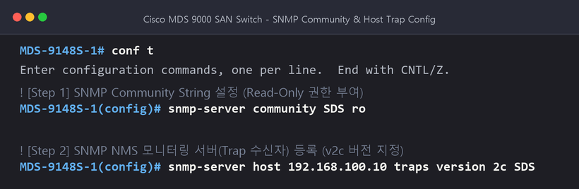
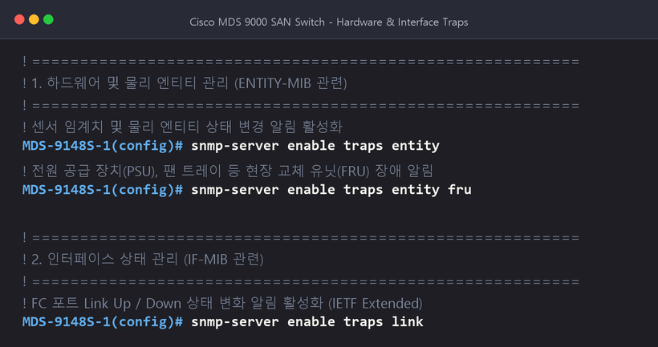
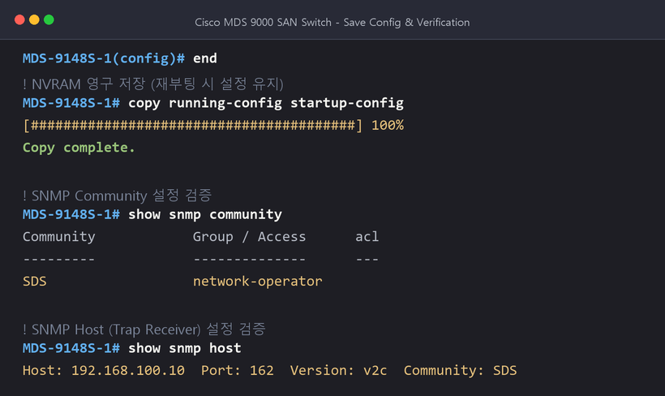

* 著者：CK log（年次ITフィールドエンジニア）
* 対象機器：Cisco MDS 9000 Series Fabric Switch（MDS 9148、9396、9700など）
* オペレーティングシステム：Cisco NX-OS / SAN-OS

---

こんにちは！ 年次ITシステムエンジニア。

データセンターでコアストレージを接続するバックボーンである**Cisco MDS SANスイッチ**を安定的に運用するには、スイッチのハードウェア状態（ファン、パワーサプライ、温度）、ポートリンク障害、ファブリック（Fabric）構成の変更などを、**統合監視システム（NMS：Zabbix、PRTG、What's Up、Zenossなど）**と連携して実施します。

Cisco MDSスイッチでSNMPを設定するときに最も一般的な間違いは、 `snmp-server enable traps`コマンドで**すべての通知を一度にオンにすることです。これにより、マイナーなデバッグ性イベントまでNMSに注がれて**トラップストーム(Trap Storm)**が発生し、スイッチCPUとモニタリングサーバに不要な負荷を与えます。

したがって、現業では、**リファレンスガイドに基づいて監視する必要があるコアMIB通知のみを選択的に有効にする**ことが標準的なベストプラクティスです。

この記事では、** SNMP v2c基本設定（Community、Host）**から**必須MIB通知のスクリーニングを有効にする**、**設定の保存と検証**、および**NMSサーバー用の必須MIBファイルのダウンロードパス**まで、作業指示に基づいてきれいに整理します。

---

## 1. 事前準備とパラメータ設定例

練習および現場適用環境の基本パラメータは、以下のように定義されます。

| アイテム | 例設定値 | 説明 |
| :--- | :--- | :--- |
| **装備モデル** | Cisco MDS 9148S | SANファブリックスイッチ |
| **SNMP バージョン** | **v2c** | 実際に最も広く使用されている標準 SNMP バージョン |
| **Community String** | **`SDS`**(例) | セキュリティのためにデフォルトの `public`の代わりに組織標準名を使用する |
| **アクセス権限** | **`ro`(Read-Only)** | NMS収集のための読み取り専用権限 |
| **NMS監視サーバーIP** | **`192.168.100.10`** | Trapイベントを受信する監視サーバーのIP |
| **Trap 受信ポート** | **UDP 162** | 標準SNMP Trapポート |

---

## 2. デフォルトの SNMP 環境設定 (Community & Host Trap)

まず、ターミナルコンソールまたはSSHでMDSスイッチに接続し、グローバル設定モード（ `config terminal`）に入ります。

### 2.1。命令実行

```text
# 전역 설정 모드 진입
conf t

# 1. SNMP Community String 생성 및 Read-Only(ro) 권한 부여
snmp-server community SDS ro

# 2. NMS 모니터링 서버로 SNMP Trap 전송 설정 (버전 v2c)
snmp-server host 192.168.100.10 traps version 2c SDS
```

### 2.2.端末実行画面



> [!TIP]
> **Communityセキュリティの推奨事項**
> 監視目的のコミュニティは、必ず** `ro`（Read-Only）**に設定する必要があります。 `rw`（Read-Write）に設定すると、SNMPの脆弱性によってスイッチ設定が外部からランダムに変更される危険があります。

---

## 3. リファレンスガイドベースの主なMIB通知個別の有効化

ソースおよび公式のリファレンスガイドで重要に扱われるMIBのリストに基づいて、実務で絶対に見逃すべきではない通知のみを個別に有効にします。

### 3.1。ハードウェアおよびエンティティ管理(「ENTITY-MIB」関連)

スイッチシャーシの物理部品、電源装置（PSU）、冷却ファントレイなどの物理的な障害を即座に検出するための必須設定です。

```text
# 물리적 엔티티 및 센서(온도, 전압 등) 상태 변경 알림
snmp-server enable traps entity

# 현장 교체 가능 유닛(FRU: 파워서플라이, 팬 등) 장애/탈착 알림
snmp-server enable traps entity fru
```

### 3.2。インタフェース状態管理(`IF-MIB`関連)

サーバーHBAまたはストレージポートに接続されているFC（Fibre Channel）ポートのリンクアップ/ダウン状態の変化を検出します。

```text
# FC 포트 링크 상태 변경 알림 (기본적으로 IETF extended 알림 활성화)
snmp-server enable traps link
```

*注：必要に応じて、 `snmp-server enable traps link cisco`または `ietf`オプションを追加して通知タイプを細分化できます。

### 3.3。ハードウェアおよびインターフェース通知端末画面



---

### 3.4。ファブリックおよび仮想SAN管理(「CISCO-DM」、「FCNS」、「ZONE」MIB関連)

SANスイッチ独自の重要な機能であるFCドメイン、ネームサーバー、ゾーン設定の変更をリアルタイムで監視します。ストレージパスの損失または不正ゾーンの変更をキャッチするための重要な通知です。

```text
# FC 도메인 관리 알림 (도메인 ID 변경, 리컨피규레이션 등)
snmp-server enable traps fcdomain

# 네임 서버(FCNS) 알림 (신규 서버 포트 플러그인 / 로그인 해제 감지)
snmp-server enable traps fcns

# 존(Zone) 구성 및 활성 Zoneset 변경 알림
snmp-server enable traps zone
```

### 3.5。セキュリティとシステム管理（「AAA」、「SNMPv2-MIB」関連）

スイッチログイン認証サーバとの通信問題や、間違ったコミュニティを介した不正アクセス試行を検出します。

```text
# AAA 서버(TACACS+ / RADIUS) 연동 및 인증 알림
snmp-server enable traps aaa

# SNMP 인증 실패(잘못된 커뮤니티 접근 등) 알림
snmp-server enable traps snmp authentication
```

### 3.6。ファブリックおよびセキュリティ通知端末画面


---

## 4. 設定永久保存と検証(Save & Verification)

Cisco MDSスイッチはNX-OSベースであるため、現在実行中のメモリ設定（ `running-config`）をNVRAMの起動設定（ `startup-config`）として保存する必要があります。再起動後も設定は保持されます。

### 4.1。設定の保存 (Save Config)

```text
# 설정 모드 종료
end

# NVRAM 영구 저장
copy running-config startup-config
```

### 4.2。構成検証命令(Verification)

通常、コミュニティとホストトラップが登録されていることを確認してください。

```text
# 1. 등록된 SNMP Community 확인
show snmp community

# 2. 등록된 Trap 수신 호스트(NMS) 확인
show snmp host

# 3. 활성화된 Trap 항목 전체 확인
show snmp trap
```

### 4.3。保存と検証端末画面



---

## 5. NMSサーバーに必要なMIBファイルガイド

NMS監視サーバー（Zabbix、PRTGなど）がMDSスイッチから受信したOID番号（「.1.3.6.1.4.1.9 ...」など）を人が読める名前（「ciscoMds ...」、「entPhysicalDescr」）に変換するには、** Cisco MIBファイル**をNMSサーバーに登録する必要があります。

### 5.1。必須MIBファイルのリスト

以下の6つのMIBファイルは、今回の投稿で設定した通知を解釈するためのコアファイルです。

1. ** `SNMPv2-SMI.my`**：SNMPv2構造定義基本MIB
2. ** `SNMPv2-MIB.my`**：システム基本情報と認証トラップMIB
3. ** `RFC1213-MIB.my`**: MIB-II標準管理MIB
4. ** `IF-MIB.my`**：インターフェイス（FCポート）ステータスとトラフィックMIB
5. ** `CISCO-SMI.my`**：シスコ固有のEnterprise OIDルート定義MIB
6. ** `ENTITY-MIB.my`**：シャーシ、スロット、パワー、ファンなど物理エンティティ管理MIB

### 5.2。 Cisco 公式 MIB ダウンロードパス

Cisco公式GitHubリポジトリからMDS 9000シリーズ用MIBファイルを直接無料でダウンロードできます。

🔗 **Cisco MIBの公式GitHubリポジトリへのショートカット**：
👉 [https://github.com/cisco/cisco-mibs/tree/main/supportlists/mds9000](https://github.com/cisco/cisco-mibs/tree/main/supportlists/mds9000)

> [!NOTE]
> **NMS MIB ロード順序のヒント**
> MIBファイルをコンパイルまたはNMSにインポートするときは依存関係があるため、最初にルート定義ファイル「SNMPv2-SMI.my」と「CISCO-SMI.my」をロードしてから、サブMIB（「ENTITY-MIB.my」、「IF-MIB.my」など）をロードしなければ解析エラー（Parsing Error）は発生しません。

---

## 6. まとめと実践のヒントを一目で見る

| ステップ | コア命令 | 主な目的 |
| :--- | :--- | :--- |
| **基本設定** | `snmp-server community <文字列> ro`と `host <IP> traps` | Polling 収集権限と NMS Trap 転送パスの指定 |
| **ハードウェア監視** | `snmp-server enable traps entity` / `entity fru` | ファン、パワー（PSU）、温度センサー障害の即時検出 |
| **ポート監視** | `snmp-server enable traps link` | FCポートリンクダウン/アップ障害検出 |
| **ファブリック監視** | `snmp-server enable traps fcdomain`/`fcns`/`zone` | SANファブリックおよびゾーン変更の検出 |
| **セキュリティ監視** | `snmp-server enable traps aaa` / `snmp authentication` | 許可されていないアクセスと認証失敗の検出 |
| **保存** | `copy running-config startup-config` | 再起動後も設定を保持 |

Cisco MDS SANスイッチ監視を構築するときは、上記のガイドを参照して設定してください。不要なトラップ負荷なしで必要な重要な障害だけをきれいに制御することができます！ 🚀
