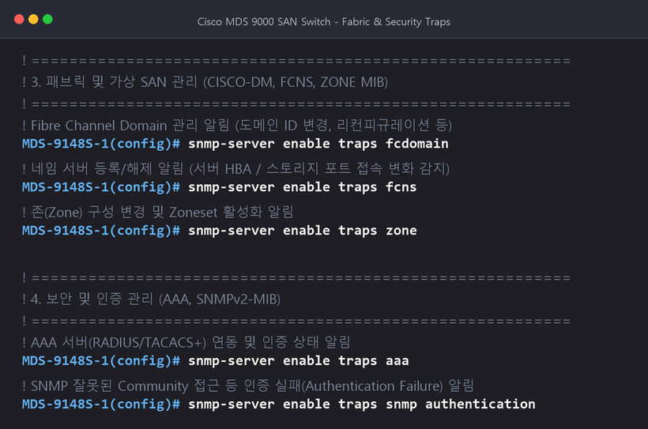

* 작성자: CK log (년 차 IT 필드 엔지니어)
* 대상 장비: Cisco MDS 9000 Series Fabric Switch (MDS 9148, 9396, 9700 등)
* 운영체제: Cisco NX-OS / SAN-OS

---

안녕하세요! 년 차 IT 시스템 엔지니어입니다.

데이터센터에서 핵심 스토리지를 연결하는 백본인 **Cisco MDS SAN 스위치**를 안정적으로 운영하려면, 스위치의 하드웨어 상태(팬, 파워서플라이, 온도), 포트 링크 장애, 패브릭(Fabric) 구성 변경 등을 **통합 모니터링 시스템(NMS: Zabbix, PRTG, What's Up, Zenoss 등)**과 연동하여 실시간으로 감지해야 합니다.

Cisco MDS 스위치에서 SNMP를 구성할 때 가장 흔히 하는 실수가 바로 `snmp-server enable traps` 명령어로 **모든 알림을 한꺼번에 켜버리는 것**입니다. 이렇게 하면 사소한 디버그성 이벤트까지 NMS로 쏟아져 들어와 **트랩 폭풍(Trap Storm)**이 발생하고, 스위치 CPU와 모니터링 서버에 불필요한 부하를 주게 됩니다.

따라서 현업에서는 **Reference Guide를 기반으로 반드시 감시해야 하는 핵심 MIB 알림만 선별적으로 활성화**하는 것이 표준 모범 사례(Best Practice)입니다.

이번 글에서는 **SNMP v2c 기본 설정(Community, Host)**부터 **필수 MIB 알림 선별 활성화**, **설정 저장 및 검증**, 그리고 **NMS 서버용 필수 MIB 파일 다운로드 경로**까지 실무 명령어를 기준으로 깔끔하게 정리해 드립니다.

---

## 1. 사전 준비 및 설정 파라미터 예시

실습 및 현장 적용 환경의 기본 파라미터는 아래와 같이 정의합니다:

| 항목 | 예시 설정값 | 설명 |
| :--- | :--- | :--- |
| **장비 모델** | Cisco MDS 9148S | SAN Fabric Switch |
| **SNMP 버전** | **v2c** | 실무에서 가장 널리 쓰이는 표준 SNMP 버전 |
| **Community String** | **`SDS`** (예시) | 보안을 위해 기본 `public` 대신 조직 표준 명칭 사용 |
| **접근 권한** | **`ro` (Read-Only)** | NMS 수집을 위한 읽기 전용 권한 |
| **NMS 모니터링 서버 IP** | **`192.168.100.10`** | Trap 이벤트를 수신할 모니터링 서버 IP |
| **Trap 수신 포트** | **UDP 162** | 표준 SNMP Trap 포트 |

---

## 2. 기본 SNMP 환경 설정 (Community & Host Trap)

먼저 터미널 콘솔 또는 SSH로 MDS 스위치에 접속한 후 전역 설정 모드(`config terminal`)로 진입합니다.

### 2.1. 명령어 실행

```text
# 전역 설정 모드 진입
conf t

# 1. SNMP Community String 생성 및 Read-Only(ro) 권한 부여
snmp-server community SDS ro

# 2. NMS 모니터링 서버로 SNMP Trap 전송 설정 (버전 v2c)
snmp-server host 192.168.100.10 traps version 2c SDS
```

### 2.2. 터미널 실행 화면


> [!TIP]
> **Community 보안 권장사항**  
> 모니터링 목적의 Community는 반드시 **`ro` (Read-Only)**로 설정해야 합니다. `rw` (Read-Write)로 설정할 경우 SNMP 취약점을 통해 스위치 설정이 외부에서 임의로 변경될 위험이 있습니다.

---

## 3. Reference Guide 기반 주요 MIB 알림 개별 활성화

소스 및 공식 레퍼런스 가이드에서 중요하게 다루는 MIB 리스트를 기준으로, 실무에서 절대 놓쳐서는 안 되는 알림만 개별적으로 활성화합니다.

### 3.1. 하드웨어 및 엔티티 관리 (`ENTITY-MIB` 관련)

스위치 섀시의 물리 부품, 전원 공급 장치(PSU), 쿨링팬 트레이 등 물리적 장애를 즉각 감지하기 위한 필수 설정입니다.

```text
# 물리적 엔티티 및 센서(온도, 전압 등) 상태 변경 알림
snmp-server enable traps entity

# 현장 교체 가능 유닛(FRU: 파워서플라이, 팬 등) 장애/탈착 알림
snmp-server enable traps entity fru
```

### 3.2. 인터페이스 상태 관리 (`IF-MIB` 관련)

서버 HBA나 스토리지 포트와 연결된 FC(Fibre Channel) 포트의 Link Up / Down 상태 변화를 감지합니다.

```text
# FC 포트 링크 상태 변경 알림 (기본적으로 IETF extended 알림 활성화)
snmp-server enable traps link
```

*참고: 필요에 따라 `snmp-server enable traps link cisco` 또는 `ietf` 옵션을 추가하여 알림 유형을 세분화할 수 있습니다.*

### 3.3. 하드웨어 및 인터페이스 알림 터미널 화면


---

### 3.4. 패브릭 및 가상 SAN 관리 (`CISCO-DM`, `FCNS`, `ZONE` MIB 관련)

SAN 스위치 고유의 핵심 기능인 FC 도메인, 네임 서버, 존(Zone) 구성 변경을 실시간 감시합니다. 스토리지 경로 유실이나 비인가 존 변경을 잡아내는 핵심 알림입니다.

```text
# FC 도메인 관리 알림 (도메인 ID 변경, 리컨피규레이션 등)
snmp-server enable traps fcdomain

# 네임 서버(FCNS) 알림 (신규 서버 포트 플러그인 / 로그인 해제 감지)
snmp-server enable traps fcns

# 존(Zone) 구성 및 활성 Zoneset 변경 알림
snmp-server enable traps zone
```

### 3.5. 보안 및 시스템 관리 (`AAA`, `SNMPv2-MIB` 관련)

스위치 로그인 인증 서버와의 통신 문제나, 잘못된 Community를 통한 비인가 접근 시도를 감지합니다.

```text
# AAA 서버(TACACS+ / RADIUS) 연동 및 인증 알림
snmp-server enable traps aaa

# SNMP 인증 실패(잘못된 커뮤니티 접근 등) 알림
snmp-server enable traps snmp authentication
```

### 3.6. 패브릭 및 보안 알림 터미널 화면



---

## 4. 설정 영구 저장 및 검증 (Save & Verification)

Cisco MDS 스위치는 NX-OS 기반이므로, 현재 실행 중인 메모리 설정(`running-config`)을 NVRAM의 시작 설정(`startup-config`)으로 저장해야 재부팅 후에도 설정이 보존됩니다.

### 4.1. 설정 저장 (Save Config)

```text
# 설정 모드 종료
end

# NVRAM 영구 저장
copy running-config startup-config
```

### 4.2. 구성 검증 명령어 (Verification)

정상적으로 커뮤니티와 호스트 트랩이 등록되었는지 확인합니다:

```text
# 1. 등록된 SNMP Community 확인
show snmp community

# 2. 등록된 Trap 수신 호스트(NMS) 확인
show snmp host

# 3. 활성화된 Trap 항목 전체 확인
show snmp trap
```

### 4.3. 저장 및 검증 터미널 화면


---

## 5. NMS 서버를 위한 필수 MIB 파일 안내

NMS 모니터링 서버(Zabbix, PRTG 등)가 MDS 스위치로부터 수신한 OID 숫자(예: `.1.3.6.1.4.1.9...`)를 사람이 읽을 수 있는 이름(`ciscoMds...`, `entPhysicalDescr`)으로 변환(Parsing)하려면 **Cisco MIB 파일**을 NMS 서버의 MIB 디렉토리에 등록해야 합니다.

### 5.1. 필수 MIB 파일 리스트

아래 6개의 MIB 파일은 이번 포스팅에서 설정한 알림들을 해석하기 위한 핵심 파일입니다:

1. **`SNMPv2-SMI.my`**: SNMPv2 구조 정의 기본 MIB
2. **`SNMPv2-MIB.my`**: 시스템 기본 정보 및 인증 트랩 MIB
3. **`RFC1213-MIB.my`**: MIB-II 표준 관리 MIB
4. **`IF-MIB.my`**: 인터페이스(FC 포트) 상태 및 트래픽 MIB
5. **`CISCO-SMI.my`**: 시스코 고유 Enterprise OID 루트 정의 MIB
6. **`ENTITY-MIB.my`**: 섀시, 슬롯, 파워, 팬 등 물리 엔티티 관리 MIB

### 5.2. Cisco 공식 MIB 다운로드 경로

시스코 공식 GitHub 저장소에서 MDS 9000 시리즈용 MIB 파일을 직접 무료로 다운로드할 수 있습니다:

🔗 **Cisco MIB 공식 GitHub 저장소 바로가기**:  
👉 [https://github.com/cisco/cisco-mibs/tree/main/supportlists/mds9000](https://github.com/cisco/cisco-mibs/tree/main/supportlists/mds9000)

> [!NOTE]
> **NMS MIB 로딩 순서 팁**  
> MIB 파일을 컴파일하거나 NMS에 임포트할 때는 의존성 관계가 있으므로, 먼저 루트 정의 파일인 `SNMPv2-SMI.my`와 `CISCO-SMI.my`를 로드한 뒤 하위 MIB(`ENTITY-MIB.my`, `IF-MIB.my` 등)를 로드해야 구문 분석 오류(Parsing Error)가 발생하지 않습니다.

---

## 6. 요약 및 실무 팁 한눈에 보기

| 단계 | 핵심 명령어 | 주요 목적 |
| :--- | :--- | :--- |
| **기본 세팅** | `snmp-server community <문자열> ro` 및 `host <IP> traps` | Polling 수집 권한 및 NMS Trap 전송 경로 지정 |
| **하드웨어 감시** | `snmp-server enable traps entity` / `entity fru` | 팬, 파워(PSU), 온도 센서 장애 즉각 감지 |
| **포트 감시** | `snmp-server enable traps link` | FC 포트 Link Down/Up 장애 감지 |
| **패브릭 감시** | `snmp-server enable traps fcdomain` / `fcns` / `zone` | SAN 패브릭 및 Zone 변경 감지 |
| **보안 감시** | `snmp-server enable traps aaa` / `snmp authentication` | 비인가 접근 및 인증 실패 감지 |
| **저장** | `copy running-config startup-config` | 재부팅 후에도 설정 유지 |

Cisco MDS SAN 스위치 모니터링을 구축하실 때 위 가이드를 참고하여 설정해 보세요. 불필요한 트랩 부하 없이 꼭 필요한 핵심 장애만 깔끔하게 관제하실 수 있습니다! 🚀
