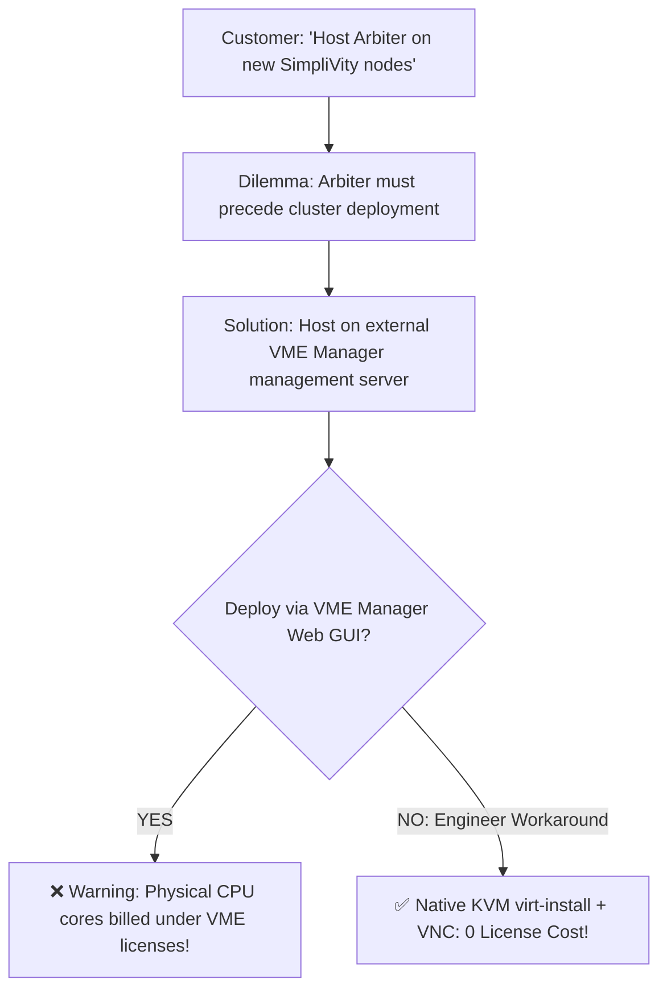

> **Author**: 16-Year IT Systems Field Engineer (CK notes)  
> **Environment**: HPE SimpliVity 6.2.0, HPE VM Essentials (VME), KVM / libvirt Management Host  
> **Arbiter OS**: Ubuntu 22.04.5 LTS Server

---

When delivering an HPE SimpliVity with VME (VM Essentials) 2-node cluster to an enterprise customer, you will almost invariably hear the client's IT team request:

> *"Please just host the Arbiter VM directly on the newly delivered SimpliVity nodes."*

To an experienced systems engineer, this request highlights **two critical architectural and commercial dilemmas**.

---

## 1. The Field Dilemmas: Chicken-and-Egg & The Licensing Trap

### Dilemma 1: The Arbiter Must Exist Before SimpliVity Storage is Created
A 2-node SimpliVity cluster requires active network communication with an Arbiter IP before the cluster creation wizard can even begin. If the SimpliVity nodes haven't been initialized and no storage pool exists, where can you run the Arbiter VM? It is a classic **chicken-and-egg paradox**.

Furthermore, because the Arbiter acts as an impartial quorum tie-breaker during node communication failures to prevent **Split-Brain scenarios**, it must **never reside on the very storage it arbitrates**.

### Dilemma 2: Creating It in the VME GUI Triggers Costly Licensing
The natural location for the Arbiter is the **external standalone management host running the VME Manager appliance (which runs on KVM)**.

However, if an engineer tries to take the easy route by registering this management host into the VME Manager web GUI to deploy the Arbiter VM, **the VME licensing engine will immediately count all physical CPU cores on that host toward the paid license entitlement!** Purchasing expensive enterprise software licenses just to run a lightweight 2-core tie-breaker VM is unacceptable.



---

## 2. The 16-Year Engineer's Workaround: KVM CLI + VNC

The solution is elegant and zero-cost:  
The underlying operating system of the VME Manager host is **standard Linux KVM with libvirt**.

By bypassing the VME Manager GUI and creating the VM directly at the host CLI level using `virt-install`, the Arbiter VM operates completely outside VME licensing scope. We can then attach a lightweight VNC Viewer (`virsh vncdisplay`) for the initial Ubuntu OS setup, achieving a **100% compliant, independent Arbiter VM at zero software license cost**.

---

## 3. Step 1: Stage Ubuntu 22.04 LTS ISO

SimpliVity Arbiter officially supports Windows Server or **Ubuntu 22.04 LTS**. Copy the ISO to the libvirt images folder:

```bash
cp ubuntu-22.04.5-live-server-amd64.iso /var/lib/libvirt/images/
ls -lh /var/lib/libvirt/images/
```

---

## 4. Step 2: Provision VM via `virt-install`

Create a dedicated VM storage folder and write the provisioning script:

```bash
mkdir -p /var/morpheus/kvm/vms/arbiter
vi /root/create_arbiter.sh
```

```bash
#!/bin/bash
sudo virt-install \
  --name arbiter \
  --ram 4096 \
  --vcpus 2 \
  --cpu host-passthrough \
  --disk path=/var/morpheus/kvm/vms/arbiter/arbiter.qcow2,size=40,format=qcow2,bus=virtio \
  --cdrom /var/lib/libvirt/images/ubuntu-22.04.5-live-server-amd64.iso \
  --network network=Management,model=virtio \
  --graphics vnc,listen=0.0.0.0,password=P@ssw0rd \
  --boot uefi \
  --noautoconsole \
  --autostart
```

Execute the script:
```bash
sh -x /root/create_arbiter.sh
```

---

## 5. Step 3: Connect via VNC for OS Installation

Check the assigned VNC display port:
```bash
virsh vncdisplay arbiter
```
If the output is `:1`, connect your VNC Client (e.g., MobaXterm or RealVNC) to `Management-Host-IP:5901` (Password: `P@ssw0rd`). Complete the standard Ubuntu server installation with a static Management IP.

---

## 6. Step 4: Configure Autostart & Power On

After installation, the VM will power off (`shut off`). Set it to autostart and boot it:
```bash
virsh autostart arbiter
virsh start arbiter
```

---

## 7. Step 5: Enable Serial Console (`ttyS0`) for Easy Management

Modify `/etc/default/grub` inside the Arbiter VM to enable direct console access:
```bash
sudo vi /etc/default/grub
# Set: GRUB_CMDLINE_LINUX="console=ttyS0"
sudo update-grub
```

Now you can attach directly from the host terminal without VNC:
```bash
virsh console arbiter
# (Press Ctrl + ] to exit)
```

---

## 8. Step 6: Install the HPE SimpliVity Arbiter Package

Install the official `svtarb` deb package:
```bash
sudo dpkg -i ./svtarb_6.0.0.39_amd64.deb
sudo systemctl status svtarb
```

---

## Summary

1. **Independent Arbiter**: Placing the Arbiter on an external management server guarantees quorum integrity and prevents split-brain.
2. **Zero License Impact**: By utilizing raw KVM CLI (`virt-install`), you avoid triggering expensive VME CPU core licensing fees.
3. **Flawless Deployment**: With this pre-configured Arbiter IP in hand, your SimpliVity 2-node cluster deployment will complete without a single quorum hiccup.
