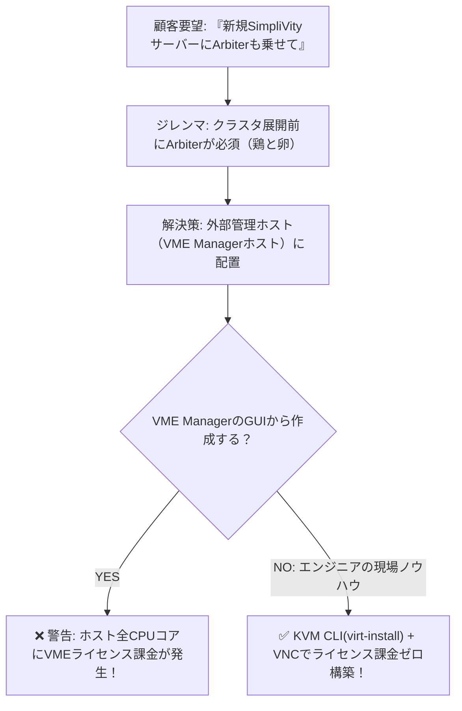

> **執筆者**: 16年目ITシステムエンジニア (CK notes)  
> **検証環境**: HPE SimpliVity 6.2.0, HPE VM Essentials (VME), KVM / libvirt 管理ホスト  
> **Arbiter OS**: Ubuntu 22.04.5 LTS Server

---

HPE SimpliVity with VME (VM Essentials) の2ノードクラスタを顧客先に導入する際、ほぼ確実に担当者から次のように要望されます：

> *「新しく導入した高スペックなSimpliVityサーバー2台の中に、Arbiter（仲裁者）VMも一緒に乗せて全部動かしてください。」*

しかし、現場を知るインフラエンジニアであれば、この要望には**2つの重大なジレンマ**が存在することに即座に気づきます。

---

## 1. 現場のジレンマ：『鶏と卵の矛盾』と『ライセンスの罠』

### ジレンマ1：SimpliVityストレージ作成前にArbiterが起動していなければならない
2ノードのSimpliVityクラスタは、**展開ウィザードを実行する前にArbiter IPとの通信が確立していなければ**クラスタ作成を開始できません。まだノード初期化も終わっておらずストレージプールも存在しない状態で、SimpliVity上にArbiter VMを作成することは不可能です（鶏と卵の矛盾）。

さらに、Arbiterはスプリットブレインを防ぐ「審判」の役割を果たすため、**自身が判定するストレージ基盤の内側に同居させることは絶対的な禁忌**です。

### ジレンマ2：VME GUIから作ると高額な有料ライセンスが請求される
では、Arbiterはどこに配置すべきか？ 答えは**VME Managerアプライアンスが稼働している外部管理ホスト（KVMベース）**です。

しかし、ここでVME ManagerのWeb GUIコンソールから管理ホストを正式登録してVMを作成しようとすると、**管理ホストの全物理CPUコアがVMEの有料ライセンス対象としてカウント**されてしまいます！ わずか2コアの軽量なArbiter VMのために高価なライセンスを追加購入するのは現実的ではありません。



---

## 2. 16年目エンジニアの実践的解決策：KVM CLI + VNCの組み合わせ

解決策は非常にシンプルです。  
VME ManagerホストのOS（BaseOS）は**標準のLinux KVM / libvirt基盤**です。

VME GUIを経由せず、**ホストのCLIレベルで直接 `virt-install` コマンドを実行してKVM仮想マシンを生成**すれば、VMEのライセンス管理対象に一切含まれません。OSインストール画面は `virsh vncdisplay` とVNCクライアントを利用して操作すれば、わずか10分で**ライセンス費用ゼロの独立したArbiter VM**が完成します。

---

## 3. 実践手順1：Ubuntu 22.04 LTS ISOの配置

```bash
cp ubuntu-22.04.5-live-server-amd64.iso /var/lib/libvirt/images/
ls -lh /var/lib/libvirt/images/
```

---

## 4. 実践手順2：`virt-install` によるVM作成

```bash
mkdir -p /var/morpheus/kvm/vms/arbiter
vi /root/create_arbiter.sh
```

```bash
#!/bin/bash
sudo virt-install \
  --name arbiter \
  --ram 4096 \
  --vcpus 2 \
  --cpu host-passthrough \
  --disk path=/var/morpheus/kvm/vms/arbiter/arbiter.qcow2,size=40,format=qcow2,bus=virtio \
  --cdrom /var/lib/libvirt/images/ubuntu-22.04.5-live-server-amd64.iso \
  --network network=Management,model=virtio \
  --graphics vnc,listen=0.0.0.0,password=P@ssw0rd \
  --boot uefi \
  --noautoconsole \
  --autostart
```

スクリプトを実行します：
```bash
sh -x /root/create_arbiter.sh
```

---

## 5. 実践手順3：VNCによるOSインストール

```bash
virsh vncdisplay arbiter
# 出力が :1 の場合、ポート 5901 で待受中
```

VNCクライアント（MobaXterm等）から `管理ホストIP:5901` に接続し、固定Management IPを設定してUbuntuインストールを完了します。

---

## 6. 実践手順4：自動起動設定とVM起動

```bash
virsh autostart arbiter
virsh start arbiter
```

---

## 7. 実践手順5：シリアルコンソール（ttyS0）の有効化

Arbiter VM内部の `/etc/default/grub` で `GRUB_CMDLINE_LINUX="console=ttyS0"` を設定し `sudo update-grub` を実行します。以降はホスト端末から `virsh console arbiter` で直接ログイン可能です。

---

## 8. 実践手順6：HPE SimpliVity Arbiterパッケージの導入

```bash
sudo dpkg -i ./svtarb_6.0.0.39_amd64.deb
sudo systemctl status svtarb
```

---

## まとめ

1. **Arbiterの独立性**: SimpliVityクラスタ外部の管理ホストに配置してクォーラムの健全性を維持。
2. **ライセンスの節約**: KVM CLI（`virt-install`）を活用することで、VMEの不要なCPUコア課金を完全回避。
3. **完璧な事前準備**: 事前にArbiter IPを準備しておくことで、SimpliVity 2ノードクラスタの初期展開がノーエラーで完了します。
