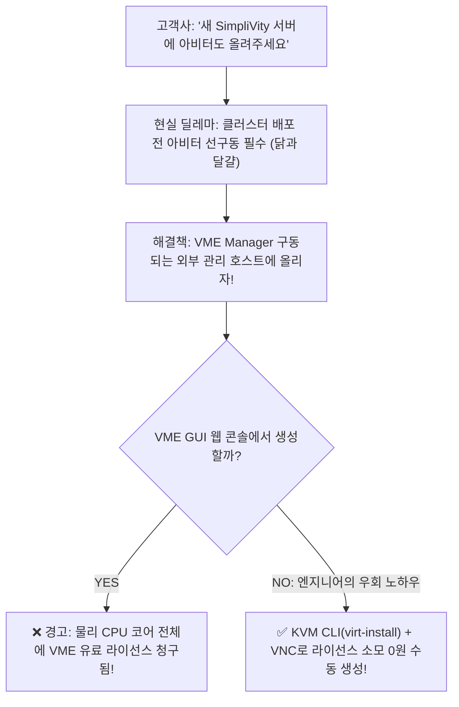

> **글쓴이**: 16년 차 IT 시스템 엔지니어 (CK notes)  
> **대상 환경**: HPE SimpliVity 6.2.0, HPE VM Essentials (VME), KVM / libvirt 기반 관리 호스트  
> **아비터 OS**: Ubuntu 22.04.5 LTS (Server)

---

HPE SimpliVity with VME (VM Essentials) 2노드 클러스터를 납품하러 현장에 나가면, 십중팔구 고객사 전산 담당자에게서 똑같은 요구를 받게 됩니다:

> *"이번에 새로 들어온 고성능 SimpliVity 서버 2대에 아비터(Arbiter) VM도 같이 올려서 다 알아서 돌려주세요."*

하지만 인프라를 조금이라도 아는 엔지니어라면 이 요구가 마주하는 **치명적인 딜레마 2가지**를 즉시 떠올릴 수밖에 없습니다.

---

## 1. 현장에서 마주하는 '닭과 달걀의 딜레마'와 '라이선스 함정'

### 딜레마 1: SimpliVity 스토리지 생성 전 아비터가 먼저 살아있어야 한다
2노드 SimpliVity 클러스터는 **배포 위저드가 돌아가기 전에 아비터(Arbiter) IP와 통신이 되어야만** 클러스터 생성이 진행됩니다. 그런데 아직 노드 초기화도 안 끝났고 스토리지 풀도 생성되지 않은 상태에서 SimpliVity 위에 아비터 VM을 어떻게 올릴 수 있을까요? 완벽한 **닭과 달걀의 모순**입니다.

게다가 아비터는 2개 노드가 장애로 통신이 끊겼을 때 스플릿 브레인(Split-Brain)을 판정해 주는 '재판관'이므로, **절대로 본인이 판정해야 할 SimpliVity 내부 스토리지에 올라가면 안 됩니다.**

### 딜레마 2: VME GUI에서 만들면 유료 라이선스 비용이 청구된다
그렇다면 아비터는 어디에 올려야 할까요? 정답은 **VME Manager가 구동되고 있는 외부 독립 관리 호스트(KVM 기반)**입니다.

그런데 여기서 큰 문제가 생깁니다.  
많은 엔지니어들이 편하게 작업하려고 VME Manager 웹 GUI 콘솔에서 관리 호스트를 정식 등록하고 아비터 VM을 생성하려 합니다. 하지만 VME Manager 정책상, **콘솔에 호스트를 등록하는 순간 해당 물리 서버의 모든 CPU 코어가 VME 유료 라이선스 카운트에 포함**됩니다! 아비터 하나 띄우자고 수백~수천만 원 상당의 소프트웨어 라이선스를 추가 구매할 수는 없는 노릇입니다.



---

## 2. 16년 차 엔지니어의 실무 우회 해법: KVM CLI + VNC 조합

해법은 의외로 간단하고 강력합니다.  
VME Manager 호스트의 밑바탕 OS(BaseOS)는 **표준 리눅스 KVM / libvirt 기반**입니다.

즉, VME Manager GUI를 통하지 않고, **호스트 CLI 레벨에서 직접 `virt-install` 명령어로 KVM 가상머신을 생성**하면 VME 라이선스 관리 영역에 전혀 잡히지 않습니다. 그리고 설치 GUI 화면은 `virsh vncdisplay`와 VNC Viewer(MobaXterm)를 이용해 띄우면 10분 만에 **라이선스 소모 0원의 완벽한 독립 Arbiter VM**이 완성됩니다.

---

## 3. 실전 구축 1단계: Ubuntu 22.04 LTS ISO 배치

SimpliVity Arbiter는 공식적으로 Windows Server 또는 **Ubuntu 22.04 LTS**만 지원합니다. 관리 호스트에 최신 Ubuntu 22.04 서버 ISO를 배치합니다.

```bash
# ISO 이미지를 libvirt 기본 이미지 경로로 복사
cp ubuntu-22.04.5-live-server-amd64.iso /var/lib/libvirt/images/

# 파일 배치 확인
ls -lh /var/lib/libvirt/images/
```

---

## 4. 실전 구축 2단계: `virt-install` 스크립트로 VM 생성

VM 디스크가 저장될 전용 디렉터리를 만들고, KVM 가상머신 생성 스크립트를 작성합니다.

```bash
# VM 이미지 전용 디렉터리 생성
mkdir -p /var/morpheus/kvm/vms/arbiter

# 생성 스크립트 작성
vi /root/create_arbiter.sh
```

### `create_arbiter.sh` 스크립트 내용
```bash
#!/bin/bash
sudo virt-install \
  --name arbiter \
  --ram 4096 \
  --vcpus 2 \
  --cpu host-passthrough \
  --disk path=/var/morpheus/kvm/vms/arbiter/arbiter.qcow2,size=40,format=qcow2,bus=virtio \
  --cdrom /var/lib/libvirt/images/ubuntu-22.04.5-live-server-amd64.iso \
  --network network=Management,model=virtio \
  --graphics vnc,listen=0.0.0.0,password=P@ssw0rd \
  --boot uefi \
  --noautoconsole \
  --autostart
```

> 💡 **주요 파라미터 체크리스트**:
> * `--ram 4096 --vcpus 2`: 아비터는 초경량 데몬이므로 2코어 4GB 메모리면 평생 차고 넘칩니다.
> * `--disk ... size=40`: 40GB Thin(qcow2) 할당으로 호스트 디스크 낭비를 최소화합니다.
> * `--graphics vnc,listen=0.0.0.0`: 어디서든 VNC로 붙을 수 있게 0.0.0.0 바인딩을 줍니다.
> * `--autostart`: 관리 서버가 재부팅되어도 아비터 VM이 자동으로 함께 켜지도록 필수 등록합니다.

스크립트 실행:
```bash
sh -x /root/create_arbiter.sh
```

```text
Starting install...
Allocating 'arbiter.qcow2' ...
Creating domain...
Domain is still running. Installation may be in progress.
```

---

## 5. 실전 구축 3단계: VNC 포트 확인 및 OS 설치 진행

VM이 백그라운드에서 실행되었으니, 화면을 보면서 Ubuntu 설치를 진행해야 합니다.

```bash
# VNC 바인딩 포트 번호 확인
virsh vncdisplay arbiter
```

출력 결과가 `:1` 로 나온다면:
* VNC 기본 포트(5900) + 1 = **5901 포트**로 열려 있다는 뜻입니다.
* MobaXterm이나 RealVNC Viewer를 열고 `관리서버IP:5901` (비밀번호: `P@ssw0rd`)로 접속합니다.

접속하면 친숙한 Ubuntu 서버 설치 화면이 나타납니다.  
네트워크 IP(SimpliVity 노드들이 통신할 Management IP)를 고정으로 세팅하고 기본 설치를 마칩니다.

---

## 6. 실전 구축 4단계: 설치 완료 후 자동 시작 등록

Ubuntu 설치가 끝나고 재부팅(Reboot)을 선택하면 VM이 자동으로 꺼집니다(`shut off`).

```bash
# VM 상태 확인
virsh list --all
```

```text
Id   Name      State
--------------------------
 1   vmemgr    running
 -   arbiter   shut off
```

이제 VM 자동 기동(`autostart`)을 활성화하고 전원을 켭니다:
```bash
# 호스트 부팅 시 자동 시작
virsh autostart arbiter

# 아비터 VM 전원 켜기
virsh start arbiter
```

---

## 7. 실전 구축 5단계: 관리 편의를 위한 Serial Console (ttyS0) 개방

VNC는 초기 설치용으로 좋지만, 평상시에는 호스트 콘솔에서 `virsh console arbiter` 한 줄로 바로 붙는 것이 훨씬 편합니다.

아비터 VM에 SSH로 접속하거나 VNC 콘솔에서 GRUB 설정을 한 줄 수정해 줍니다:

```bash
# /etc/default/grub 파일 편집
sudo vi /etc/default/grub

# 아래 라인 수정 또는 추가
GRUB_CMDLINE_LINUX="console=ttyS0"

# 커널 설정 업데이트
sudo update-grub
```

이제 호스트 터미널에서 아래 명령어로 즉시 아비터 쉘로 직행할 수 있습니다:
```bash
virsh console arbiter
# (빠져나올 때는 Ctrl + ] 누름)
```

---

## 8. 실전 구축 6단계: HPE SimpliVity Arbiter 패키지 설치

아비터 VM에 SimpliVity 공식 아비터 패키지(`svtarb`)를 설치합니다.

```bash
# Arbiter deb 패키지 설치
sudo dpkg -i ./svtarb_6.0.0.39_amd64.deb
```

```text
Do you accept the End User License Agreement (y/n) y
Certificate request self-signature ok
subject=CN = arbiter
Created symlink /etc/systemd/system/multi-user.target.wants/svtarb.service -> /lib/systemd/system/svtarb.service.
```

설치가 완료되면 `svtarb.service` 데몬이 systemd에 자동 등록되어 24시간 가동을 시작합니다:

```bash
# 데몬 상태 확인
sudo systemctl status svtarb
```

---

## 16년 차 엔지니어의 현장 총평

1. **아비터의 독립성**:  
   아비터는 반드시 SimpliVity 클러스터 외부의 관리 호스트에 띄워야 스플릿 브레인을 방지할 수 있습니다.
2. **라이선스 비용 절감**:  
   VME Manager GUI에서 호스트를 등록해 VM을 생성하지 마세요. **기반 KVM CLI(`virt-install`)를 활용하면 라이선스 비용 0원으로 100% 독립된 안전한 아비터 VM을 구축**할 수 있습니다.
3. **완벽한 선행 준비**:  
   이렇게 준비해 둔 아비터 IP를 들고 SimpliVity 클러스터 배포 위저드로 진입하면, 단 한 번의 오류나 타임아웃 없이 완벽한 2노드 클러스터 구축에 성공하게 됩니다.
