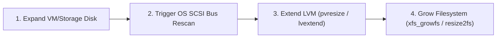

> **Author**: 16-Year IT Systems Field Engineer (CK notes)  
> **Target OS**: RHEL / Rocky Linux / CentOS 7–9, Ubuntu 20.04–24.04 LTS  
> **Target Filesystems**: XFS, EXT4 (over LVM)

---

When production database or application servers reach 90%+ disk utilization, scheduling emergency maintenance downtime is rarely an acceptable option. In modern virtualization (VMware, KVM, Nutanix, SimpliVity) and cloud infrastructures, performing **100% online, non-disruptive storage expansion** is an essential skill for system engineers.

Here is the battle-tested standard operating procedure for triggering a kernel SCSI bus rescan, extending LVM physical/logical volumes, and expanding filesystems without unmounting.

---

## 1. The 4-Step Process



---

## 2. Step 1: Trigger SCSI Bus Rescan in Linux Kernel

After increasing disk size in your hypervisor or SAN storage (e.g., 100GB to 200GB), the Linux kernel does not automatically notice the change. You can trigger a rescan without rebooting:

```bash
# Verify disk name
lsblk

# Trigger rescan on specific disk (e.g. /dev/sdb)
echo 1 > /sys/class/block/sdb/device/rescan
```

*To rescan all SCSI hosts at once:*
```bash
for host in /sys/class/scsi_host/host*/scan; do echo "- - -" > ${host}; done
```

Check `dmesg` and `lsblk` to verify the new capacity:
```bash
dmesg | tail -n 15
lsblk /dev/sdb
```

---

## 3. Step 2: Resize Partition Table (If Partitioned)

If the entire raw disk was formatted directly as an LVM Physical Volume (`pvcreate /dev/sdb`), skip to Step 3.  
If partitioned (`/dev/sdb1`), grow the partition using `growpart`:

```bash
# Install growpart if not already present
# RHEL/Rocky: yum install -y cloud-utils-growpart
# Ubuntu: apt install -y cloud-guest-utils

# Expand partition 1 on /dev/sdb
growpart /dev/sdb 1
```

---

## 4. Step 3: Extend LVM Physical & Logical Volumes

### 1) Update Physical Volume (PV)
```bash
pvresize /dev/sdb
# (or pvresize /dev/sdb1 if using a partition)

# Verify new Free Space
pvs
vgs
```

### 2) Extend Logical Volume (LV)
```bash
# Add 50GB
lvextend -L +50G /dev/mapper/vg_data-lv_data

# Or allocate 100% of remaining free space in Volume Group (most common)
lvextend -l +100%FREE /dev/mapper/vg_data-lv_data
```

---

## 5. Step 4: Online Filesystem Growth (XFS vs EXT4)

Identify your filesystem type:
```bash
df -Th /data
```

### For XFS (Default on RHEL / Rocky / CentOS):
Specify the **mount point directory**:
```bash
xfs_growfs /data
```

> ⚠️ **Important Field Note**: XFS supports online expansion seamlessly, but **cannot be shrunk**. Never over-allocate if you expect to reduce storage later.

### For EXT4 (Default on Ubuntu / Debian):
Specify the **logical volume block device path**:
```bash
resize2fs /dev/mapper/vg_data-lv_data
```

---

## 6. Verification

Confirm the new usable capacity:
```bash
df -h /data
```

The available storage updates immediately without zero impact on active I/O workloads.
