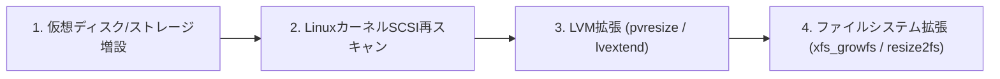

> **執筆者**: 16年目ITシステムエンジニア (CK notes)  
> **対象OS**: RHEL / Rocky Linux / CentOS 7〜9, Ubuntu 20.04〜24.04 LTS  
> **ファイルシステム**: XFS, EXT4 (LVM構成)

---

24時間365日稼働する本番DBやサービスサーバーのディスク使用率が90%を超えた際、メンテナンス停止を伴わずに**「オンライン状態で安全にディスクを拡張できるか」**は現場エンジニアの必須スキルです。

仮想化（VMware、KVM、Nutanix、SimpliVity）やクラウド環境において、**サーバーの再起動やアンマウント（umount）を行わず、完全無停止でディスクを拡張する標準手順**をまとめました。

---

## 1. 全体作業フロー（4ステップ）



---

## 2. Step 1: SCSIバス再スキャンによる容量認識

ハイパーバイザ側でディスクサイズを拡張後（例: 100GB -> 200GB）、Linuxカーネルに再認識させます：

```bash
# 対象ディスクが /dev/sdb の場合
echo 1 > /sys/class/block/sdb/device/rescan

# 認識確認
lsblk /dev/sdb
dmesg | tail -n 15
```

---

## 3. Step 2: パーティションテーブルの拡張（必要な場合）

パーティション（`/dev/sdb1`）を切っている場合は `growpart` で拡張します（ディスク直PVの場合は不要）：

```bash
growpart /dev/sdb 1
```

---

## 4. Step 3: LVM物理ボリューム（PV）および論理ボリューム（LV）の拡張

### 1) PVのリサイズ
```bash
pvresize /dev/sdb
pvs
vgs
```

### 2) LVの拡張
```bash
# ボリュームグループの空き容量を100%割り当てる場合
lvextend -l +100%FREE /dev/mapper/vg_data-lv_data
```

---

## 5. Step 4: ファイルシステムのオンライン拡張（XFS vs EXT4）

```bash
# ファイルシステムの種類を確認
df -Th /data
```

* **XFSの場合（RHEL / Rocky Linux標準）**:
  マウント先ディレクトリを指定します。
  ```bash
  xfs_growfs /data
  ```
  *(注意: XFSは拡張のみ可能で、縮小は不可です)*

* **EXT4の場合（Ubuntu標準）**:
  LVデバイスパスを指定します。
  ```bash
  resize2fs /dev/mapper/vg_data-lv_data
  ```

---

## 6. 完了確認

```bash
df -h /data
```

サービスI/Oを一切止めることなく、数秒で使用可能容量が増加していることが確認できます。
