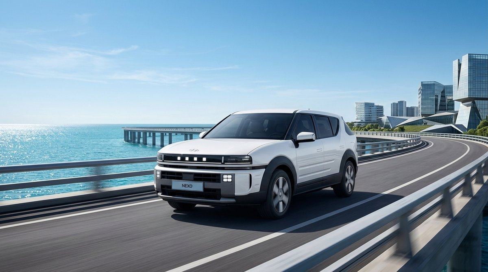
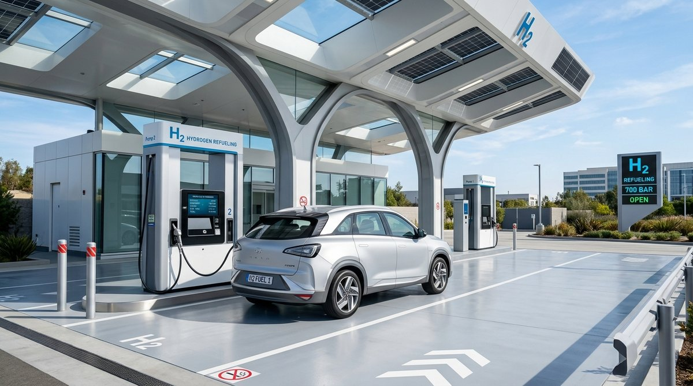
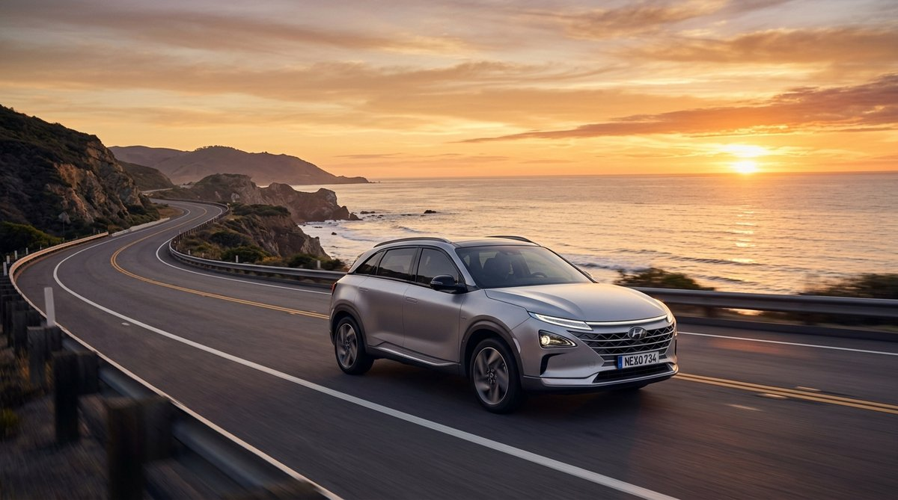

こんにちは！ 年間インフラストラクチャの現場を維持したITシステムエンジニア** CK log**。

今日はサーバーやネットワークのような硬いIT技術の話の代わりに、最近私の頭の中を最も複雑にしている**私の日常の中で最大の悩み（車両選択）**の話を楽に解こうとしています。 🚗

最近、出退勤と全国の顧客会社の外勤を共にする新たな足を悩みながら、現代自動車の水素電気自動車「ネクソ」を真剣にウィッシュリストに載せました。

昨日、私のネイバーブログにもこの悩みを軽く打ち明けましたが、やはり職業が職業なので、頭の中で「費用計算機」が自動的にきちんと帰りました。 ㅎㅎ

特にイニシウム（INITIUM）コンセプトベースの強靭な本格的なバクシー（Boxy）SUVラインと次世代ピクセルライティングを装備して出てくる**'ディオール・ニュー・ネクソ（The All-New NEXO）****実物を見ると目が折り返しました。

しかし、現実に戻り、購入方法を考える瞬間に深いジレンマが始まります。

> **「新車を私の値段（実際の購入が約3,800万〜4,000万ウォン）すべて与え、買い物3年後に減価償却が怖くて...半額以下の1,500万ウォン前後に落ちた「第1世代中古ネクソ」を買うかどうか」新型ディオールニューネクソに乗りましょうか？」**

エンジニアの視点で計算機を慎重に叩いてみて下した率直で現実的な考えをまとめてみました。

---

## 1. 日常の現実的ファクト：「どうせ3年乗ると1,000万～2,000万ウォンは消える」

新車でも中古車でも車を買うとき、単に「車両価格」だけを見れば見逃すことがあります。まさに**減価償却（時間の経過とともに消えるお金）**です。

* **新車（ディオールニューネクソ）の3年減価現実**：
自治体補助金を受けて実買買が4,000万ウォンに新車を出庫しても、水素車特有の急な減価のため3～4年後、中古相場は約2,000万～2,300万ウォン水準に落ちます。
👉 **つまり、3年間、私の通帳で減価償却でただ「蒸発する」純粋な損失額だけ約1,700万～2,000万ウォンです。 **

* **第1世代中古ネクソの相場現実**:
現在エンカナK Carで2019～2021年式第1世代ネクソ無事故中古車相場は**約1,400万～1,700万ウォン**に形成されています。
👉 **驚くべきことに、第1世代中古ネクソ1台を丸ごと買うお金が、新車ディオールニューネクソを3年乗ったときに虚空に飛ぶ減価償却損失額とほぼ同じです！ **

結局、この悩みの本質は**「どうせ私のポケットから3年間で1,500万～2,000万ウォンが出たら、その費用で何を得てどんな危険を避けるのか？」**という選択の問題であるわけです。

---

## 2. 悩み1：新型「ディオールニューネクソ」+負担ダウンプログラム

完全に新しくなった第2世代ディオールニューネクソに乗りながら、水素車減価爆弾を防御するオプションです。

### 💡 日常の中核メリット：「減価損失と故障心配の打ち出し」
現代自動車の**「負担ダウンプログラム」**は低初期費用に猶予分納方式を適用し、3年後に満期になったとき金融会社が**中古車残存価値(約55～60%)を確定保障**してくれる方式です。

日常から直接車を転がす車主の立場で、この方式の利点はかなり明確です。
1. **消える減価を月分納で楽に支払う**: 3年間虚空に飛んでいく1,500万～2,000万ウォンの減価損失を月20～30万ウォン台の負担少ない納入金で割り出して乗れます。
2. **中古車相場暴落ストレスゼロ**: 3年後に水素車相場が床を打っても、車を金融会社に返却(Buy-back)してしまうと損失なく清潔に契約が終わります。
3. **最新の新車の利便性と修理費「0ウォン」**：
   - 改良された第3世代高耐久性燃料電池スタック（冬季始動性、耐久性改善）
   - 650km以上の寛大な走行距離とアウトドアキャンプ/車で有用な屋内外3.6kW V2Lをサポート
   - 最新のccNCワイヤレスナビゲーションと走行支援システム
   - 3年運行期間中、新車10年16万km無償保証 ➔ **修理費心配終了**

---

## 3. 悩み2：コスパの終わり版王「第1世代中古ネクソ」直購入

すでに価格が落ちるように抜けて床に安着した第1世代中古ネクソを1,500万ウォンラインに購入する方式です。

### 👍メリット：最悪の場合でも失うお金が決まっている（Max Loss限定）
* 1,500万ウォンに買って3年に乗って中古相場が500万ウォンに落ちても、最悪の場合廃車をしても**私が失うことができる最大金額は1,500万ウォンにぴったり決まって(Cap)あります**。
* 当時出荷が7,000万ウォンの高級SUVの広々とした空間とアダプティブクルーズ、リモートスマート駐車場、換気シートなど豊富なオプションをアバンテ中古価格で味わえます。
* 高速道路通行料50％割引、公営駐車場半額、年自動車13万ウォンなど水素車の蜂蜜​​のような維持費の恩恵は新車と100％同じです。

### ⚠️現実的な心配：そろそろ来る保証満了の圧迫
* 1,500万ウォンの中古売り物は通常年式が4～6年ほど経過し、累積走行距離が6万～10万km水準です。
* 現代自動車の水素専用部品無償保証は**10年/16万km**です。つまり、**保証の余裕が半分しか残っていない状態**です。
* 万が一保証期間が終わった後に燃料電池スタックに欠陥が発生すると、交換見積もりだけ4千万ウォン以上が出てくるので、事実上車を放棄しなければならない可能性があるという点が心一角を踏みます。

---

## 4. 16年目のエンジニアの日常比較表

3年間車両を運用すると仮定し、2つの選択肢を表で並べて比較してみました：

| 区分 | 1世代中古ネクソ直購入（2019～2021年型） | ディオールニューネクソ+負担ダウンプログラム（新車） |
| :--- | :--- | :--- |
| **3年の予想消滅費用** | **車両減価損失約700万～1,000万ウォン** | **3年総納入金（減価分）約1,200万～1,800万ウォン** |
| **初期の負担負担** | **約1,400万～1,700万ウォン**（木돈一時支出） | **選手金0ウォン〜数百万ウォン線**（木の節約） |
| **車両商品性** | 第1世代モデル / V2L未サポート / 前世代インフォ | **第2世代フルチェンジ（第3世代スタック、V2L、ccNC）** |
| **スタック残り保証** | 残余4～5年／残余6万～9万km | **新車10年/16万kmフル保証（修理費0ウォン）** |
| **重大故障リスク** | **注意が必要**(保証終了後はスタック交換不可) | **心配なし**（保証期間内100％無償ケア） |
| **3年後の処分** | 中古車ディーラーに直接売却（相場監修） | **返却時の残存価値保証でスッキリ終了** |

---

## 5.結論：日常の私の選択基準は？

結局、とにかく3年間で**1,000万〜2,000万ウォン前後のお金が減価で消えるという現実**を認めた後、選択の基準は思ったよりシンプルになります。

### 🎯第1世代中古ネクソが似合う方
* *「3年間出て行く減価費用さえもできるだけ減らして極強のコスパを引き出したい！」*
* 年間走行距離が1万km未満と短く、何年も乗っても16万km保証満了の心配がない方
* 1,500万ウォンのラインでパッと乗って残存価値（500万～800万ウォン）を回収したい失速派

### 🎯ディオールニューネクソ+負担らしいプログラムが似合う方
* *「どうせ3年乗れば1,500万ウォン減価でなくなるお金なのに、むしろ最新新車に故障心配なく楽に乗る！」*
* キャンプ/車泊V2L電気活用と素敵な第2世代パクシーデザイン、最新の先端走行補助を満喫したい方
* 1世代スタック耐久性不安や後で中古車を売る際に経験するストレスなく、3年後にクールに返却して次の車に進みたい方

日常でお茶を選んで維持することはいつもときめきながらも悩みの連続のようです。皆さんなら**'1,500万ウォンの中庭1世代中古ネクソ'**と**'3年減価を分納して享受する新型ディオールニューネクソ'**のどんな選択にもっと心が惹かれますか？ 😊
