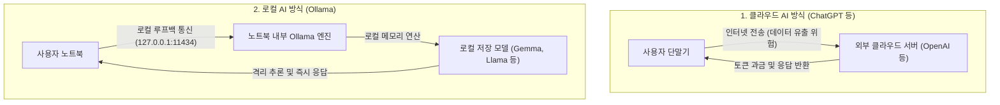
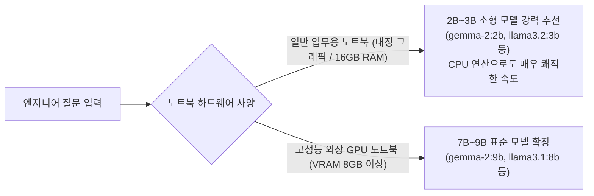

> **Author**: IT field engineer with 15 years of experience
> **Environment**: Based on Windows 11 environment (for general business laptops)

> 📌 **Local LLM running on my PC: Ollama practical series table of contents**
> 
> - **[Current post] [Part 1. What is Ollama, a local AI that runs for free on my PC? (Concept and Features)](./)**
> - **[Part 2. Windows 11 environment Ollama installation and first model download & operation guide](../ollama-02-windows-install-guide/)**
> - **[Part 3. How to use Ollama in practice: From terminal conversations to WebUI & API integration](../ollama-03-cli-webui-api/)**

---

Hello! I am an IT field engineer with 15 years of experience.

Recently, generative AI (LLM) has become an essential tool in daily life and work, but the working environment for field engineers is not so easy. Customer sites with strict security, such as financial IT centers, public institutions, power plants, and national defense, are mostly **air-gap (closed network) environments** where the external Internet is 100% blocked**.

In sites where the Internet is not available, you cannot use the commonly used ChatGPT or Google search at all, and uploading confidential data such as in-house source code, system error logs, and network routing rulesets to external cloud AI is itself a serious violation of security regulations.

The magical solution that allows you to run a smart AI engineering assistant 100% offline with just your laptop in a closed-network field is 'Ollama'**.

In this first part, from an engineer's perspective, we will provide a detailed overview of **Ollama's basic concepts, differences from cloud AI, the value of utilizing closed networks (air-gap), and a recommended model optimized for general laptops**.

---

## 1. What is Ollama?

**Ollama** is a free open source tool that allows you to install and run the latest powerful open source large language models (LLMs), including Meta's Llama 3.2, Google's latest lightweight model (Gemma lineup), Qwen, and DeepSeek, on your personal PC or laptop with just one line of commands.

* 🌐 **Ollama Official Website**: [https://ollama.com/](https://ollama.com/)
* 📚 **Official model repository (library)**: [https://ollama.com/library](https://ollama.com/library)
* 🐙 **Official GitHub repository**: [https://github.com/ollama/ollama](https://github.com/ollama/ollama)

In the past, to run an AI model on a local PC, you had to go through complex processes such as creating a Python virtual environment (venv), C++ compilation (llama.cpp), matching the CUDA driver version, and manually downloading the quantization GGUF file.

However, Ollama has greatly simplified all these complex backend engineering processes, just like dealing with a 'Docker' container:
* With just one command line (`ollama run gemma2:2b` or `ollama run llama3.2:3b`), everything from model download to weight memory loading to interactive CLI prompt is completed in one step.
* It resides as a Windows background service and basically opens **REST API (default port: `http://localhost:11434`)**, so it is very flexible in linking with Web UI (web interface) and other in-house programs.

---

## 2. Cloud AI vs local AI (Ollama) structure comparison

The difference in data flow between cloud-based AI (ChatGPT, Claude) and Ollama's local operation is shown in the diagram below.

| Compare items | Cloud AI (ChatGPT / Claude) | Local AI (Ollama) |
| :--- | :--- | :--- |
| **Data Security** | Transmission to external server (risk of leakage of company secrets) | **Not a single byte leaves my laptop (100% safe)** |
| **Internet Connection** | Internet connection required (will not work if communication is not possible) | **Full support for air-gap closed networks with 0% internet blocking** |
| **Cost** | Monthly subscription fee ($20~) or per API token | **Completely free (only uses laptop battery and hardware resources)** |
| **Speed/Latency** | External server traffic and network delays occur | **Instant streaming output based on local memory** |
| **Model Selection** | Forced dependency on service provider policies | **Freely replace any open source model (Gemma, Llama, etc.) of your choice** |

---

## 3. Key reasons why engineers should pay attention to a local LLM

### ① A relief pitcher in an air-gap closed network without internet
When working on infrastructure at sites disconnected from the Internet, such as customer computer rooms, financial IDCs, and government offices, it is often difficult to encounter obstacles such as writing complex shell scripts, analyzing unfamiliar error logs, or creating firewall iptables rules. If you download the lightweight model on your laptop Ollama in advance, you can use it as an 'offline dedicated shooter' who can query commands and receive troubleshooting guidance in real time even in a field without Internet.

### ② 100% safe data privacy (Zero Data Leakage)
You can safely parse and summarize your customer's actual host name, internal private IP, account setup script, system dump log, etc. only inside your laptop without pasting it into an external AI.

### ③ Unlimited free inquiries
You can analyze thousands of lines of log files over and over again without paying API token fees or monthly subscriptions.

---

## 4. Which model is suitable for a general laptop? (Reason for model recommendation and selection)

Recently, various high-performance models, such as Meta's Llama 3.2 and Google's latest Gemma lineup, are coming out quickly in the open source camp.

So, which model should you choose for **"a general business laptop without a separate, expensive external GPU"**?

### 💡 General laptop highly recommended: **2B ~ 3B small language model (sLLM)**
* **Google `gemma-2:2b`** (Capacity: approximately 1.6 GB)
* **Meta `llama3.2:3b`** (or ultralight `llama3.2:1b`) (Capacity: approximately 2.0 GB)
* **Alibaba `qwen2.5:3b`** (Coding and multilingual specialization)

### 🤔 Why are 2B~3B class models best suited for general laptops?

1. **Optimized memory (RAM) usage (around 2GB)**
On a typical Windows 11 laptop (16GB RAM), the Windows OS and default background apps already use 6-8GB. The 2B~3B models only take up about 1.5GB~2.5GB of memory when running, so they can reside lightly with other work programs without running out of memory (OOM) or causing the laptop to stutter.
2. **Comfortable speed with just CPU without external graphics (VRAM)**
Even on laptops without NVIDIA external graphics such as Intel Iris
3. **Coding/script intelligence that is perfect for practical engineer work**
The latest sLLM models have maximized knowledge compression technology. It performs key tasks required for field engineering practice, such as writing Python/Bash shell scripts, generating regular expressions (Regex), verifying Linux command grammar, and analyzing the cause of system errors, as well as the 70B giant model.
4. **Minimize battery consumption and heat/noise**
If you run a model heavier than 7B with the CPU, the cooling fan will make a loud noise and the battery will discharge quickly, but the 2B~3B models consume less power, so they can be operated stably without straining the battery even on business trips.

---

## 5. Hardware specification guide for Windows 11 laptops

| Category | General laptop (2B~3B small models recommended) | High-performance laptop (when running 7B~9B models) |
| :--- | :--- | :--- |
| **Operating System** | **Windows 11 (64-bit)** | **Windows 11 (64-bit)** |
| **CPU** | Intel Core i5/i7 (11th generation or higher) or AMD Ryzen 5/7 | Intel Core i7/i9 or AMD Ryzen 7/9 |
| **System RAM** | **16 GB** (comfortable multitasking) | 32 GB recommended |
| **Graphics (GPU)** | **Intel/AMD CPU built-in graphics (sufficient)** | **NVIDIA RTX 3060 / 4060 Laptop (VRAM 6GB~8GB)** |
| **Storage Space** | NVMe SSD 20 GB or more free space | 50 GB or more free NVMe SSD space |

---

## 6. Conclusion and preview of Part 2

Ollama is a groundbreaking local AI tool that serves as a reliable assistant to engineers even in air-gap sites where the external Internet is completely blocked. In particular, by using the 2B to 3B lightweight models, you can immediately build a comfortable AI environment on the Windows 11 laptop that you carry every day without an expensive GPU server.

In the next **Part 2, we will go through in detail the practical process** of downloading and installing the official Ollama installer in a Windows 11 environment, receiving the first lightweight model optimized for general laptops, and running it in the terminal!

### 🔗 Go to serial series

| previous steps | next steps |
| :---: | :---: |
| **Series begins (current post)** | **[Part 2. Windows 11 environment Ollama installation guide and first model operation guide ➡️](../ollama-02-windows-install-guide/)** |

---
If you have any questions or a model you would like to try in a laptop environment, please feel free to leave a comment!