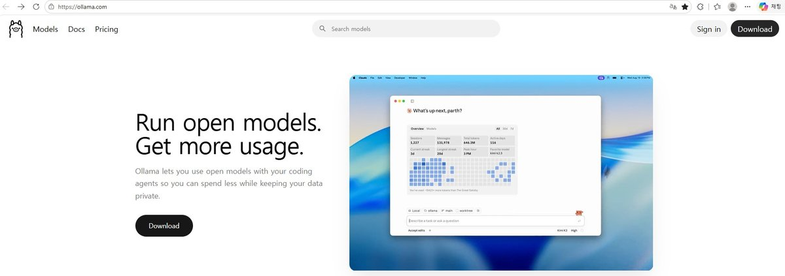
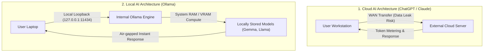
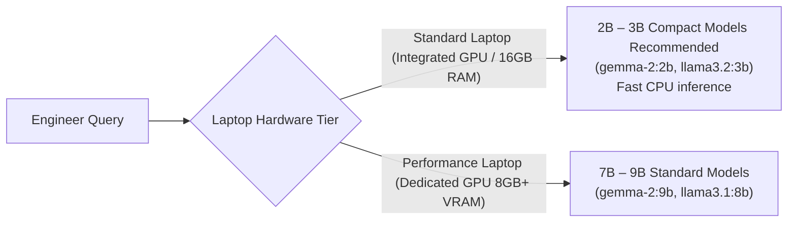

> 📌 **Local LLM on Personal Workstation: Practical Series Table of Contents**
> 
> - **[Current Post] [Part 1. What is Ollama, a Local AI Running Free on Your PC? (Concepts & Features)](./)**
> - **[Part 2. Windows 11 Ollama Installation & First Model Setup Guide](../ollama-02-windows-install-guide/)**
> - **[Part 3. Practical Usage: From CLI Mastery to WebUI & API Integration](../ollama-03-cli-webui-api/)**

---

Generative AI has become integral to software engineering workflows, but datacenter field operations present unique constraints. High-security enterprise environments—including financial transaction centers, defense installations, power plants, and public infrastructure—operate in air-gapped isolation with zero outbound internet connectivity.

In these environments, cloud-based assistants (ChatGPT, Claude) are inaccessible, and piping proprietary infrastructure configurations, error logs, or routing policies to external endpoints violates core security compliance mandates.

Ollama addresses this constraint by executing optimized open-source large language models locally and offline on commodity laptop hardware.

This article reviews the architecture of Ollama, technical contrasts with SaaS AI models, air-gap engineering utility, and lightweight model options well suited for standard corporate laptops.

---

## 1. What is Ollama?

**Ollama** is a free open source tool that allows you to install and run the latest powerful open source large language models (LLMs), including Meta's Llama 3.2, Google's latest lightweight model (Gemma lineup), Qwen, and DeepSeek, on your personal PC or laptop with just one line of commands.

* 🌐 **Ollama Official Website**: [https://ollama.com/](https://ollama.com/)
* 📚 **Official model repository (library)**: [https://ollama.com/library](https://ollama.com/library)
* 🐙 **Official GitHub repository**: [https://github.com/ollama/ollama](https://github.com/ollama/ollama)

In the past, to run an AI model on a local PC, you had to go through complex processes such as creating a Python virtual environment (venv), C++ compilation (llama.cpp), matching the CUDA driver version, and manually downloading the quantization GGUF file.

However, Ollama has greatly simplified all these complex backend engineering processes, just like dealing with a 'Docker' container:
* With just one command line (`ollama run gemma2:2b` or `ollama run llama3.2:3b`), everything from model download to weight memory loading to interactive CLI prompt is completed in one step.
* It resides as a Windows background service and basically opens **REST API (default port: `http://localhost:11434`)**, so it is very flexible in linking with Web UI (web interface) and other in-house programs.

---

## 2. Cloud AI vs Local AI (Ollama) Architecture Comparison

The difference in data flow between cloud-based AI (ChatGPT, Claude) and Ollama's local operation is shown in the diagram below.

```mermaid
flowchart TD
    subgraph CloudAI["1. Cloud AI Architecture (ChatGPT / Claude)"]
        User1["User Workstation"] -->|"WAN Transfer (Data Leak Risk)"| CloudServer["External Cloud Server"]
        CloudServer -->|"Token Metering & Response"| User1
    end

    subgraph LocalAI["2. Local AI Architecture (Ollama)"]
        User2["User Laptop"] -->|"Local Loopback (127.0.0.1:11434)"| OllamaEngine["Internal Ollama Engine"]
        OllamaEngine -->|"System RAM / VRAM Compute"| LocalModels["Locally Stored Models (Gemma, Llama)"]
        LocalModels -->|"Air-gapped Instant Response"| User2
    end
```

| Dimension | Cloud AI (ChatGPT / Claude) | Local AI (Ollama) |
| :--- | :--- | :--- |
| **Data Security** | Transmission to external server (risk of leakage of company secrets) | **Not a single byte leaves my laptop (100% safe)** |
| **Internet Connection** | Internet connection required (will not work if communication is not possible) | **Full support for air-gap closed networks with 0% internet blocking** |
| **Cost** | Monthly subscription fee ($20+) or per API token | **Completely free (only uses laptop battery and hardware resources)** |
| **Speed/Latency** | External server traffic and network delays occur | **Instant streaming output based on local memory** |
| **Model Selection** | Forced dependency on service provider policies | **Freely replace any open source model (Gemma, Llama, etc.) of your choice** |

---

## 3. Key Reasons Why Engineers Rely on Local LLMs

### ① A Lifesaver in Air-Gapped Closed Networks
When working on infrastructure at sites disconnected from the Internet, such as customer computer rooms, financial IDCs, and government offices, it is often difficult to encounter obstacles such as writing complex shell scripts, analyzing unfamiliar error logs, or creating firewall iptables rules. Having a lightweight model preloaded in Ollama turns your laptop into an offline mentor that responds immediately to queries.

### ② 100% Safe Data Privacy (Zero Data Leakage)
You can safely parse and summarize customer hostnames, internal private IPs, account setup scripts, and system dump logs entirely inside your laptop without pasting them into external AI services.

### ③ Unlimited Free Inquiries
You can analyze thousands of lines of log files over and over again without paying API token fees or monthly subscriptions.

---

## 4. Model Selection Guide for Standard Laptops

Which model should you choose for **"a standard business laptop without an expensive discrete GPU"**?

```mermaid
flowchart LR
    Prompt["Engineer Query"] --> MemCheck{"Laptop Hardware Tier"}
    MemCheck -->|"Standard Laptop (Integrated GPU / 16GB RAM)"| sLLM["2B – 3B Compact Models Recommended<br/>(gemma-2:2b, llama3.2:3b)<br/>Fast CPU inference"]
    MemCheck -->|"Performance Laptop (Dedicated GPU 8GB+ VRAM)"| LLM8B["7B – 9B Standard Models<br/>(gemma-2:9b, llama3.1:8b)"]
```

### 💡 General Laptop Highly Recommended: **2B – 3B Small Language Models (sLLM)**
* **Google `gemma-2:2b`** (Capacity: ~1.6 GB)
* **Meta `llama3.2:3b`** (or ultralight `llama3.2:1b`) (Capacity: ~2.0 GB)
* **Alibaba `qwen2.5:3b`** (Coding and multilingual specialization)

### 🤔 Why Are 2B – 3B Class Models Best Suited for General Laptops?

1. **Optimized Memory (RAM) Usage (~2 GB)**  
   On a typical Windows 11 laptop (16 GB RAM), the OS and default background apps already use 6 – 8 GB. The 2B – 3B models only take up about 1.5 GB – 2.5 GB of memory when running, so they can reside lightly alongside other work programs without out-of-memory (OOM) errors.
2. **Comfortable Speed With Pure CPU Computation**  
   Even on laptops without NVIDIA discrete graphics (e.g., Intel Iris Xe or AMD Radeon), CPU execution delivers **20 – 30 tokens/sec**, exceeding human reading speed.
3. **High Capability for Everyday Engineering Tasks**  
   Latest sLLM models excel at writing Python/Bash scripts, generating regular expressions, validating Linux syntax, and diagnosing error logs.
4. **Minimal Battery Consumption and Noise**  
   7B+ models running on CPU cause cooling fans to spin loudly and drain the battery quickly. 2B – 3B models consume modest power, making them ideal for field trips.

---

## 5. Hardware Specification Guide for Windows 11 Laptops

| Category | General Laptop (2B – 3B Models Recommended) | High-Performance Laptop (7B – 9B Models) |
| :--- | :--- | :--- |
| **Operating System** | **Windows 11 (64-bit)** | **Windows 11 (64-bit)** |
| **CPU** | Intel Core i5/i7 (11th Gen+) or AMD Ryzen 5/7 | Intel Core i7/i9 or AMD Ryzen 7/9 |
| **System RAM** | **16 GB** (Comfortable multitasking) | 32 GB Recommended |
| **Graphics (GPU)** | **Intel / AMD Built-in Graphics (Sufficient)** | **NVIDIA RTX 3060 / 4060 Laptop (6 GB – 8 GB VRAM)** |
| **Storage Space** | NVMe SSD 20 GB+ free space | NVMe SSD 50 GB+ free space |

---

## 6. Summary

Ollama delivers an effective solution for deploying private, locally hosted language models in air-gapped datacenter facilities using standard corporate laptop hardware.

Deploying optimized 2B – 3B parameter models provides responsive local inference powered solely by system CPU and RAM, enabling reliable technical assistance without risking proprietary data leakage.

The next article, **[Part 2: Windows 11 Ollama Installation & Initial Model Setup](../ollama-02-windows-install-guide/)**, walks through installer deployment, model acquisition, and interactive CLI prompts.

---

### 🔗 Series Navigation

| Previous Step | Next Step |
| :---: | :---: |
| **Series Start (Current)** | **[Part 2. Windows 11 Ollama Installation & First Model Setup ➡️](../ollama-02-windows-install-guide/)** |
