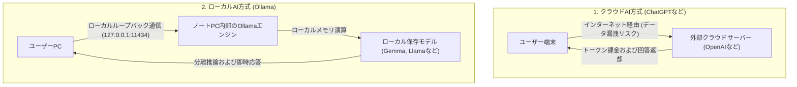
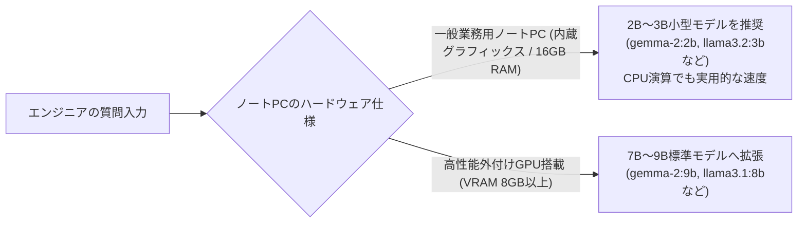

> **作成者**: CK notes
> **環境**：Windows 11環境基準（一般業務用ノートブック対象）

> 📌 **私のPCで駆動するローカルLLM：Ollama本番連載目次**
> 
> - **[現在の記事] [1編。私のPCから無料で回すローカルAI、Ollamaとは何ですか？ (概念と特徴)](./)**
> - **[2編。 Windows 11環境Ollamaのインストールと初モデルのダウンロード＆ドライブガイド](../ollama-02-windows-install-guide/)**
> - **[3編。 Ollamaの実践活用法：ターミナル会話からWebUI＆API連動まで](../ollama-03-cli-webui-api/)**

---

生成AIが急速に普及していますが、インフラエンジニアが作業する現場の環境は決して容易ではありません。金融機関の電算室、公共機関、発電所、防衛関連などセキュリティ要件が厳しいサイトでは、外部インターネットから完全に遮断されたエアギャップ（Air-gap、閉鎖網）環境が一般的です。

外部接続が遮断された環境では、検索エンジンやクラウドAI（ChatGPT、Claudeなど）の利用が不可能なだけでなく、社内のソースコードやシステムエラーログ、ルーティングテーブルといった機密データを外部に持ち出すこと自体がセキュリティ違反となります。

こうした閉鎖網の現場において、一般業務用ノートPC単体で、100%オフラインのままローカルAIモデルを安全に稼働させられるツールが「Ollama」です。

本記事では、OllamaのアーキテクチャやクラウドAIとの技術的相違点、閉鎖網環境での実務的活用価値、および一般ノートPCのハードウェア仕様に適した軽量モデルの選定基準を解説します。

---

## 1. Ollamaとは何ですか？

**Ollama（オラマ）**は、MetaのLlama 3.2、Googleの最新軽量モデル（Gemmaラインナップ）、Qwen、DeepSeekなど、**強力で最新のオープンソース巨大言語モデル（LLM）を、私の個人PCやノートパソコンに1行の命令でインストールして駆動できるようにする無料のオープンソースツール**です。

* 🌐 **Ollama公式ウェブサイト**: [https://ollama.com/](https://ollama.com/)
* 📚 **公式モデルリポジトリ（ライブラリ）**：[https://ollama.com/library](https://ollama.com/library)
* 🐙**公式GitHubリポジトリ**：[https://github.com/ollama/ollama](https://github.com/ollama/ollama)

過去のローカルPCでAIモデルを回すには、Python仮想環境（venv）、C ++コンパイル（llama.cpp）、CUDAドライババージョンのマッチング、量子化（Quantization）GGUFファイルの手動ダウンロードなどの複雑なプロセスを経なければなりませんでした。

しかし、Ollamaは、これらすべての複雑なバックエンドエンジニアリングプロセスを**まるで「Docker」コンテナを扱うように非常に単純化**しました：
* コマンドが1行（`ollama run gemma2:2b`または`ollama run llama3.2:3b`）であれば、モデルのダウンロードからウェイトメモリのロード、インタラクティブCLIプロンプト駆動まで一度に完了します。
* Windowsバックグラウンドサービスとして常駐し、基本的に**REST API（デフォルトポート： `http://localhost：11434`）**を開くので、Web UI（Webインターフェース）や他の社内プログラムとの連携も非常に柔軟です。

---

## 2. クラウドAIとローカルAI(Ollama)構造の比較

クラウドベースのAI（ChatGPT、Claude）とOllamaローカル駆動方式のデータフローの違いは、下の図のようになります。

| 比較項目 | クラウドAI(ChatGPT/Claude) | ローカルAI(Ollama) |
| :--- | :--- | :--- |
| **データセキュリティ** | 外部サーバー転送(社内機密漏洩リスク) | **マイノートパソコンから1バイトも出ない（100％安全）** |
| **インターネット接続** | インターネット接続が必須 | **インターネット0％ブロックされたエアギャップ閉鎖ネットワークの完全サポート** |
| **費用** | 月の購読料（$ 20〜）またはAPIトークンあたりの課金 | **完全無料（ノートブックバッテリーとハードウェアリソースのみを使用）** |
| **速度/遅延** | 外部サーバーのトラフィックとネットワーク遅延の発生 | **ローカルメモリベースの即時ストリーミング出力** |
| **モデルオプション** | サービスプロバイダーポリシーに強制依存 | **希望するオープンソースモデル（Gemma、Llamaなど）の自由交換** |

---

## 3. エンジニアがローカルLLMに注目しなければならない主な理由

### ① インターネットのないエアギャップ（Air-gap）閉鎖網の救援投手
顧客会社の電算室、金融IDC、役所など、インターネットが断絶されたサイトでインフラストラクチャを作業するとき、複雑なシェルスクリプトの作成や不慣れなエラーログの分析、ファイアウォールのiptablesルールの生成など、詰まった部分が生じると難しいことが多いです。事前にノートパソコンOllamaに軽量モデルを受け入れておけば、**インターネットのない現場でもリアルタイムで命令を問い合せ、トラブルシューティングガイドを受ける「オフライン専任射手」**として活用できます。

### ② 100% 安全なデータプライバシー (Zero Data Leakage)
顧客の実際のホスト名、内部プライベートIP、アカウント設定スクリプト、システムダンプログなどを外部AIに貼り付けることなく、自分のラップトップ内でのみ安全に解析してまとめることができます。

### ③無制限の無料クエリ
APIトークン料金や月額定額支払いなしで、何千行ものログファイル分析をいくらでも繰り返し実行できます。

---

## 4. 一般ノートパソコンにはどのモデルが適しているか？ (モデル推薦・選定理由)

最近、オープンソース陣営では、MetaのLlama 3.2、Googleの最新Gemmaラインナップなど、様々な高性能モデルが急速に注がれています。

それでは**「別途の高価な外付けGPUがない一般業務用ノートブック」**では、どのモデルを選ぶべきでしょうか？

### 💡一般的なノートパソコンの強力推奨：**2B〜3B級コンパクト言語モデル（sLLM）**
* **Google `gemma-2:2b`** (容量:約1.6 GB)
* **Meta `llama3.2:3b`** (または超軽量 `llama3.2:1b`) (容量:約2.0 GB)
* **Alibaba `qwen2.5:3b`** (コーディングと多言語特化)

### 🤔なぜ2B〜3Bクラスのモデルが一般的なラップトップに最適ですか？

1. **メモリ（RAM）シェアの最適化（2GB内外）**
一般的なWindows 11ノートブック（16GB RAM）は、Windows OSとデフォルトのバックグラウンドアプリがすでに6〜8GBを使用しています。 2B～3Bモデルは、駆動時にメモリを約1.5GB～2.5GBしか占めていないため、メモリ不足（OOM）やノートパソコンを一杯にすることなく、他の業務プログラムと一緒に軽く常駐できます。
2. **外部グラフィックス（VRAM）なしでCPUだけでも快適な速度**
NVIDIA外付けグラフィックスのないIntel Iris XeまたはAMD内蔵グラフィックノートブックでも、純粋なCPU演算だけで**毎秒20～30トークン（人が読む速度以上）**の速い速度で、回答が詰まらず酒術出力されます。
3. **エンジニアの実務作業に溢れたコーディング/スクリプトインテリジェンス**
最新のsLLMモデルは、知識圧縮技術が最大化されています。 Python / bacheシェルスクリプトの作成、正規表現（Regex）の作成、Linuxコマンド文法の検証、システムエラーの原因分析など、フィールドエンジニアリングの実践に必要な重要な作業を70B巨大モデルうらやましく実行します。
4. **バッテリーの消耗と発熱/騒音の最小化**
7B以上の重いモデルをCPUに回すと、クーリングファンがすばらしくバッテリーが急速に放電しますが、2B～3Bモデルは消費電力が少なく、出張現場でもバッテリーの負担なく安定して駆動できます。

---

## 5. Windows 11ノートブックベースのハードウェア仕様ガイド

| 区分 | 一般ノートパソコン（2B～3B小型モデル推奨） | 高性能ノートパソコン（7B～9Bモデル駆動時） |
| :--- | :--- | :--- |
| **運営体制** | **Windows 11(64-bit)** | **Windows 11(64-bit)** |
| **CPU** | Intel Core i5/i7（11世代以上）またはAMD Ryzen 5/7 | Intel Core i7/i9 または AMD Ryzen 7/9 |
| **システムRAM** | **16 GB**（快適なマルチタスク） | 32 GB推奨 |
| **グラフィック（GPU）** | **Intel/AMD CPU内蔵グラフィック(十分)** | **NVIDIA RTX 3060 / 4060 Laptop (VRAM 6GB～8GB)** |
| **保存スペース** | NVMe SSD 空き容量 20 GB 以上 | NVMe SSD 空き容量 50 GB 以上 |

---

## 6. まとめ

Ollamaは、外部インターネットが遮断された閉鎖網環境であっても、一般的な業務用ノートPC上でプライベートLLMを手軽に運用可能にする実用的なツールです。

2B〜3B規模の最新軽量モデルを採用することで、高価な外付けGPUがなくともCPUとシステムRAMのみで実用的な推論速度が得られ、現場でのデータ漏洩リスクを完全に排除しながらエンジニアリング支援を受けられます。

続く**[第2編: Windows 11環境 Ollamaインストールおよび初モデル駆動ガイド](../ollama-02-windows-install-guide/)**では、公式インストーラーのセットアップから最初の軽量モデルのダウンロード、ターミナルでの対話手順を解説します。

---

### 🔗連載シリーズショートカット

| 前のステップ | 次のステップ |
| :---: | :---: |
| **シリーズ開始（現在の記事）** | **[2編。 Windows 11 環境 Ollama インストールおよび初モデル駆動ガイド ➡️](../ollama-02-windows-install-guide/)** |