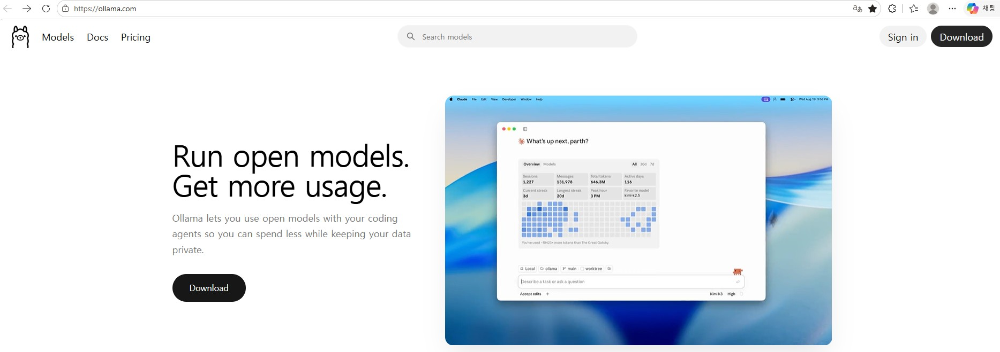
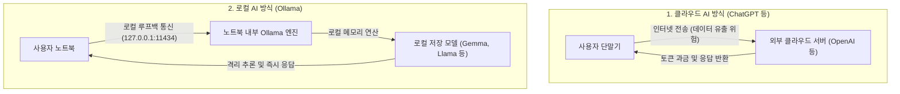
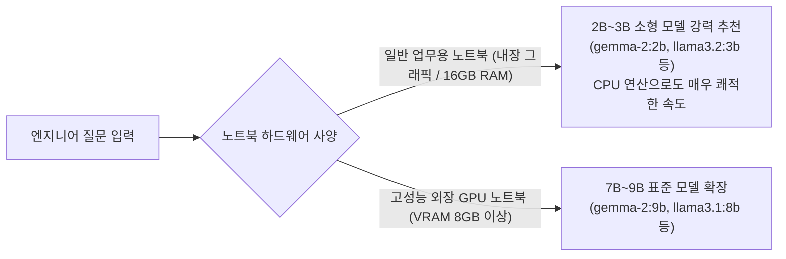

> **작성자**: 15년 차 IT 필드 엔지니어  
> **환경**: Windows 11 환경 기준 (일반 업무용 노트북 대상)

> 📌 **내 PC에서 구동하는 로컬 LLM: Ollama 실전 연재 목차**
> 
> - **[현재글] [1편. 내 PC에서 무료로 돌리는 로컬 AI, Ollama란 무엇인가? (개념 및 특징)](./)**
> - **[2편. Windows 11 환경 Ollama 설치 및 첫 모델 다운로드 & 구동 가이드](../ollama-02-windows-install-guide/)**
> - **[3편. Ollama 실전 활용법: 터미널 대화부터 WebUI & API 연동까지](../ollama-03-cli-webui-api/)**

---

안녕하세요! 15년 차 IT 필드 엔지니어입니다.

최근 생성형 AI(LLM)가 일상과 업무의 필수 도구로 자리 잡았지만, 현장 필드 엔지니어의 작업 환경은 그리 녹록지 않습니다. 금융권 전산실, 공공기관, 발전소, 국방 등 보안이 엄격한 고객사 사이트는 **외부 인터넷이 100% 원천 차단된 에어갭(Air-gap, 폐쇄망) 환경**인 경우가 대부분입니다. 

인터넷이 되지 않는 현장에서는 평소 유용하게 쓰던 ChatGPT나 구글 검색을 일절 활용할 수 없으며, 사내 소스코드나 시스템 에러 로그, 네트워크 라우팅 룰셋 등의 기밀 데이터를 외부 클라우드 AI에 올리는 것 자체가 심각한 보안 규정 위반이 됩니다.

이러한 **폐쇄망 현장에서 내 노트북 하나만으로 100% 오프라인 상태에서 똑똑한 AI 엔지니어링 비서를 구동할 수 있는 마법 같은 솔루션이 바로 'Ollama(올라마)'**입니다.

이번 1편에서는 엔지니어 관점에서 **Ollama의 기본 개념, 클라우드 AI와의 차이점, 폐쇄망(Air-gap) 활용 가치, 그리고 일반 노트북에 최적화된 추천 모델**을 상세히 정리해 드리겠습니다.

---

## 1. Ollama란 무엇인가?

**Ollama(올라마)**는 Meta의 Llama 3.2, Google의 최신 경량 모델(Gemma 라인업), Qwen, DeepSeek 등 **강력한 최신 오픈소스 거대 언어 모델(LLM)을 내 개인 PC나 노트북에서 단 한 줄의 명령어로 설치하고 구동할 수 있도록 해주는 무료 오픈소스 도구**입니다.

* 🌐 **Ollama 공식 웹사이트**: [https://ollama.com/](https://ollama.com/)
* 📚 **공식 모델 저장소(라이브러리)**: [https://ollama.com/library](https://ollama.com/library)
* 🐙 **공식 GitHub 저장소**: [https://github.com/ollama/ollama](https://github.com/ollama/ollama)

과거 로컬 PC에서 AI 모델을 돌리려면 Python 가상환경(venv), C++ 컴파일(llama.cpp), CUDA 드라이버 버전 매칭, 양자화(Quantization) GGUF 파일 수동 다운로드 등 복잡한 과정을 거쳐야 했습니다.

하지만 Ollama는 이러한 모든 복잡한 백엔드 엔지니어링 과정을 **마치 'Docker' 컨테이너를 다루듯 극도로 단순화**했습니다:
* 명령어 단 한 줄(`ollama run gemma2:2b` 또는 `ollama run llama3.2:3b`)이면 모델 다운로드부터 가중치 메모리 로드, 대화형 CLI 프롬프트 구동까지 한 번에 완료됩니다.
* 윈도우 백그라운드 서비스로 상주하며 기본적으로 **REST API (기본 포트: `http://localhost:11434`)**를 열어주므로, Web UI(웹 인터페이스)나 다른 사내 프로그램과의 연동도 매우 유연합니다.

---

## 2. 클라우드 AI vs 로컬 AI (Ollama) 구조 비교

클라우드 기반 AI(ChatGPT, Claude)와 Ollama 로컬 구동 방식의 데이터 흐름 차이는 아래 다이어그램과 같습니다.

| 비교 항목 | 클라우드 AI (ChatGPT / Claude) | 로컬 AI (Ollama) |
| :--- | :--- | :--- |
| **데이터 보안** | 외부 서버 전송 (사내 기밀 유출 위험) | **내 노트북 밖으로 1바이트도 나가지 않음 (100% 안전)** |
| **인터넷 연결** | 인터넷 연결 필수 (통신 불가 시 먹통) | **인터넷 0% 차단된 에어갭(Air-gap) 폐쇄망 완벽 지원** |
| **비용** | 월 구독료($20~) 또는 API 토큰당 과금 | **완전 무료 (노트북 배터리와 하드웨어 자원만 사용)** |
| **속도/지연** | 외부 서버 트래픽 및 네트워크 지연 발생 | **로컬 메모리 기반 즉각적인 스트리밍 출력** |
| **모델 선택권** | 서비스 제공업체 정책에 강제 종속 | **원하는 오픈소스 모델(Gemma, Llama 등) 자유 교체** |

---

## 3. 엔지니어가 로컬 LLM을 주목해야 하는 핵심 이유

### ① 인터넷 없는 에어갭(Air-gap) 폐쇄망의 구원투수
고객사 전산실, 금융 IDC, 관공서 등 인터넷이 단절된 사이트에서 인프라 작업을 할 때, 복잡한 쉘 스크립트 작성이나 생소한 에러 로그 분석, 방화벽 iptables 규칙 생성 등 막히는 부분이 생기면 난감할 때가 많습니다. 사전에 노트북 Ollama에 경량 모델을 받아두면 **인터넷이 없는 현장에서도 실시간으로 명령어를 질의하고 트러블슈팅 가이드를 받는 '오프라인 전담 사수'**로 활용할 수 있습니다.

### ② 100% 안전한 데이터 프라이버시 (Zero Data Leakage)
고객사의 실제 호스트명, 내부 사설 IP, 계정 설정 스크립트, 시스템 덤프 로그 등을 외부 AI에 붙여넣지 않고도 내 노트북 내부에서만 안전하게 파싱하고 요약할 수 있습니다.

### ③ 무제한 무료 질의
API 토큰 요금이나 월 정액제 결제 없이 수천 줄의 로그 파일 분석을 얼마든지 반복해서 수행할 수 있습니다.

---

## 4. 일반 노트북에는 어떤 모델이 적합할까? (모델 추천 및 선정 이유)

최근 오픈소스 진영에서는 Meta의 Llama 3.2, Google의 최신 Gemma 라인업 등 다양한 고성능 모델들이 빠르게 쏟아져 나오고 있습니다.

그렇다면 **"별도의 고가 외장 GPU가 없는 일반 업무용 노트북"**에서는 어떤 모델을 선택해야 할까요?

### 💡 일반 노트북 강력 추천: **2B ~ 3B급 소형 언어 모델 (sLLM)**
* **Google `gemma-2:2b`** (용량: 약 1.6 GB)
* **Meta `llama3.2:3b`** (또는 초경량 `llama3.2:1b`) (용량: 약 2.0 GB)
* **Alibaba `qwen2.5:3b`** (코딩 및 다국어 특화)

### 🤔 왜 2B~3B급 모델이 일반 노트북에 가장 적합한가?

1. **메모리(RAM) 점유율 최적화 (2GB 내외)**  
   일반적인 Windows 11 노트북(16GB RAM)은 윈도우 OS와 기본 백그라운드 앱들이 이미 6~8GB를 사용하고 있습니다. 2B~3B 모델은 구동 시 메모리를 약 1.5GB~2.5GB만 차지하므로, 메모리 부족(OOM)이나 노트북 버벅임 없이 다른 업무 프로그램과 함께 가볍게 상주할 수 있습니다.
2. **외장 그래픽(VRAM) 없이 CPU만으로도 쾌적한 속도**  
   NVIDIA 외장 그래픽이 없는 인텔 Iris Xe 또는 AMD 내장 그래픽 노트북에서도 순수 CPU 연산만으로 **초당 20~30토큰(사람이 읽는 속도 이상)**의 빠른 속도로 답변이 막힘없이 술술 출력됩니다.
3. **엔지니어 실무 작업에 차고 넘치는 코딩/스크립트 지능**  
   최신 sLLM 모델들은 지식 압축 기술이 극대화되어 있습니다. 파이썬/배시 쉘 스크립트 작성, 정규표현식(Regex) 생성, 리눅스 명령어 문법 검증, 시스템 에러 원인 분석 등 필드 엔지니어링 실무에 필요한 핵심 작업들을 70B 거대 모델 부럽지 않게 훌륭히 수행합니다.
4. **배터리 소모 및 발열/소음 최소화**  
   7B 이상의 무거운 모델을 CPU로 돌리면 쿨링팬이 굉음을 내며 배터리가 빠르게 방전되지만, 2B~3B 모델은 전력 소모가 적어 출장 현장에서도 배터리 부담 없이 안정적으로 구동할 수 있습니다.

---

## 5. Windows 11 노트북 기준 하드웨어 사양 가이드

| 구분 | 일반 노트북 (2B~3B 소형 모델 권장) | 고성능 노트북 (7B~9B 모델 구동 시) |
| :--- | :--- | :--- |
| **운영체제** | **Windows 11 (64-bit)** | **Windows 11 (64-bit)** |
| **CPU** | Intel Core i5/i7 (11세대 이상) 또는 AMD Ryzen 5/7 | Intel Core i7/i9 또는 AMD Ryzen 7/9 |
| **시스템 RAM** | **16 GB** (쾌적한 멀티태스킹) | 32 GB 권장 |
| **그래픽 (GPU)** | **Intel / AMD CPU 내장 그래픽 (충분함)** | **NVIDIA RTX 3060 / 4060 Laptop (VRAM 6GB~8GB)** |
| **저장공간** | NVMe SSD 여유 공간 20 GB 이상 | NVMe SSD 여유 공간 50 GB 이상 |

---

## 6. 결론 및 2편 예고

Ollama는 외부 인터넷이 완전히 차단된 에어갭(Air-gap) 현장에서도 엔지니어의 든든한 조력자가 되어주는 획기적인 로컬 AI 도구입니다. 특히 2B~3B급 경량 모델을 활용하면 고가의 GPU 서버 없이도 **내가 매일 들고 다니는 Windows 11 노트북에서 즉시 쾌적한 AI 환경을 구축**할 수 있습니다.

다음 **2편에서는 Windows 11 환경에서 Ollama 공식 인스톨러를 다운로드하여 설치하고, 일반 노트북에 최적화된 첫 경량 모델을 받아 터미널에서 구동하는 실전 과정**을 상세히 진행해 보겠습니다!

### 🔗 연재 시리즈 바로가기

| 이전 단계 | 다음 단계 |
| :---: | :---: |
| **시리즈 시작 (현재글)** | **[2편. Windows 11 환경 Ollama 설치 및 첫 모델 구동 가이드 ➡️](../ollama-02-windows-install-guide/)** |

---
궁금한 점이나 노트북 환경에서 돌려보고 싶은 모델이 있다면 댓글로 편하게 남겨주세요!