> **Author**: IT field engineer with 15 years of experience
> **Environment**: Windows 11 (based on general business laptop)

> 📌 **Local LLM running on my PC: Ollama practical series table of contents**
> 
> - **[Part 1. What is Ollama, a local AI that runs for free on my PC? (Concept and Features)](../ollama-01-local-llm-intro/)**
> - **[Current post] [Part 2. Windows 11 environment Ollama installation and first model download & operation guide](./)**
> - **[Part 3. How to use Ollama in practice: From terminal conversations to WebUI & API integration](../ollama-03-cli-webui-api/)**

---

Hello! I am an IT field engineer with 15 years of experience.

In [Part 1], we learned why local LLM is needed in air-gap (closed network) sites where the external Internet is blocked, and why 2B to 3B small models are most suitable for general business laptops.

Now that we've got the theory out of the way, let's get into the real world of installing Ollama directly on my Windows 11 laptop, downloading our first AI model, and talking to it in real time in the terminal.

The entire process, from actual installation to model download and first conversation, is organized step by step with 13 field capture screens**.

---

## 1. Practical installation workflow

The entire process flow from installation to first conversation is as follows.

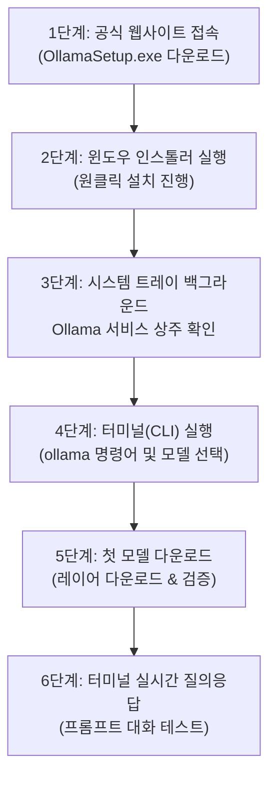

---

## 2. Step 1: Download Ollama Windows 11 installation file

1. Open your web browser and go to the Ollama official download page:
   * 🌐 **Official Download Link**: [https://ollama.com/download/windows](https://ollama.com/download/windows)
2. Click the **`Download for Windows`** button in the center of the screen.

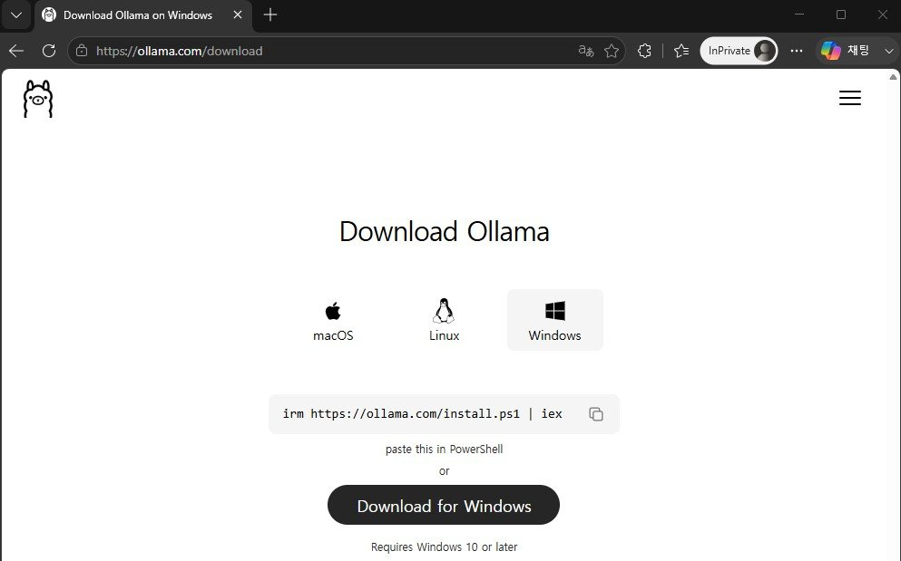

3. Once the download is complete, a **`OllamaSetup.exe`** installation file will be created in the download folder.


---

## 3. Step 2: Run the installer and complete the installation.

1. Double-click the downloaded `OllamaSetup.exe` file to run it.
2. When the Installation Wizard window appears, click the **`Install`** button.

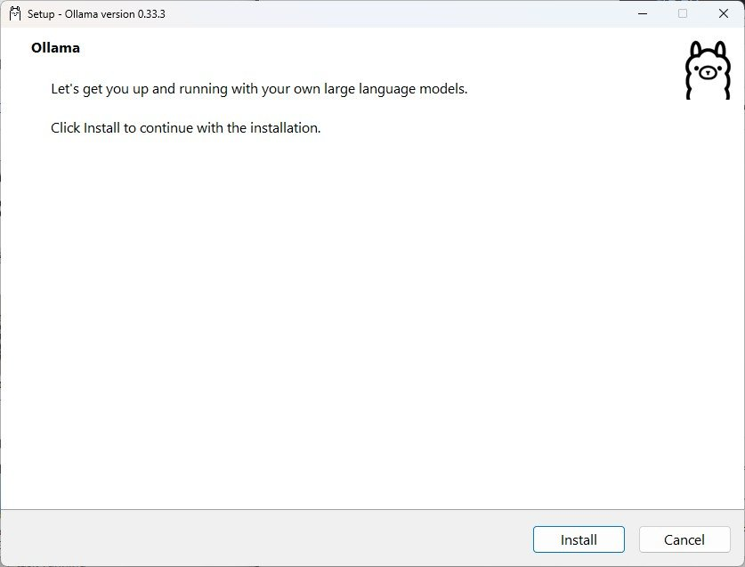

3. File decompression and service registration will proceed automatically (takes approximately 10 to 20 seconds).

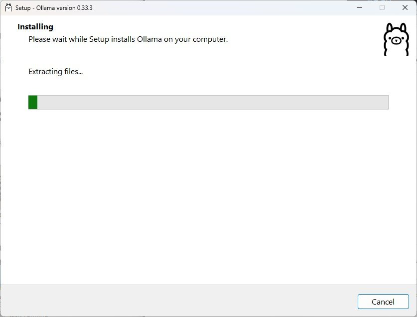

4. Once installation is complete, a cute Ollama icon** is registered in the bottom right corner of Windows 11's system tray (notification area) and begins residing in the background.

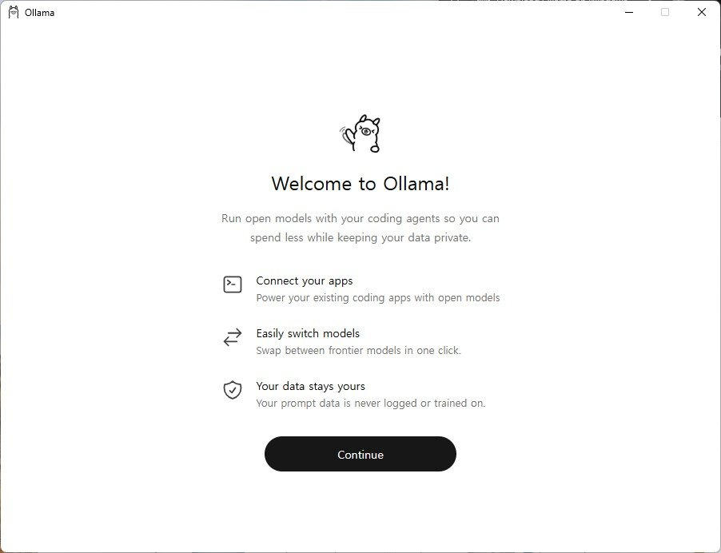

> 💡 **Default installation paths useful to know**:
> * **Program installation location**: `C:\Users\<user account>\AppData\Local\Programs\Ollama`
> * **Download model storage location**: `C:\Users\<user account>\.ollama\models`
> * Ollama automatically runs as a background service when Windows boots, and by default listens to the local REST API port **`11434`** (`http://localhost:11434`).

---

## 4. Step 3: Run Ollama and prepare the environment

Ollama automatically runs in the background immediately after installation or when Windows starts.

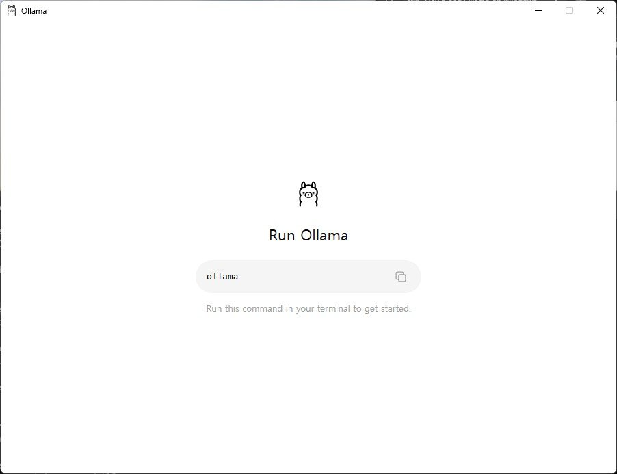

If necessary, you can link to the official website and log in with your account (this is optional; model download and local execution will work 100% normally even if you are not logged in).

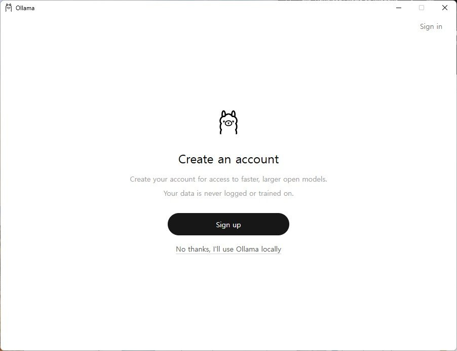

---

## 5. Step 4: Verify installation and explore model in terminal (CLI)

Right-click the Windows Start button and run **`Terminal`** or **`PowerShell`**.

If you type `ollama` in the terminal window and press Enter, the list of supported basic commands (`serve`, `create`, `show`, `run`, `stop`, `pull`, `push`, `list`, `ps`, `rm`) are displayed normally.

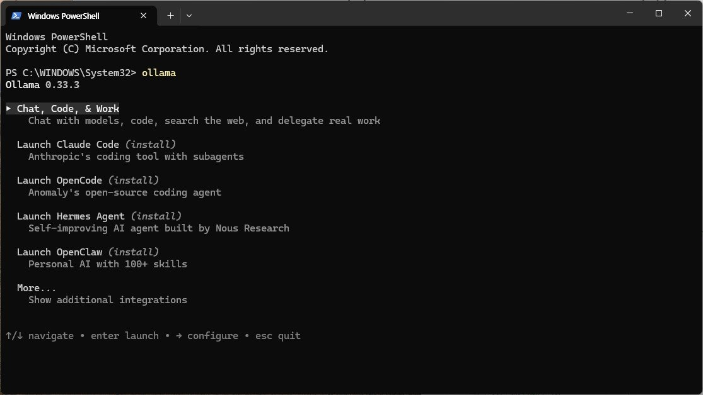

Then select the lightweight model from our library that best suits your typical laptop environment. As recommended in Part 1, for general office/business laptops, **2B~3B lightweight models (e.g. `gemma2:2b`, `llama3.2:3b`)** are the most comfortable without memory burden.

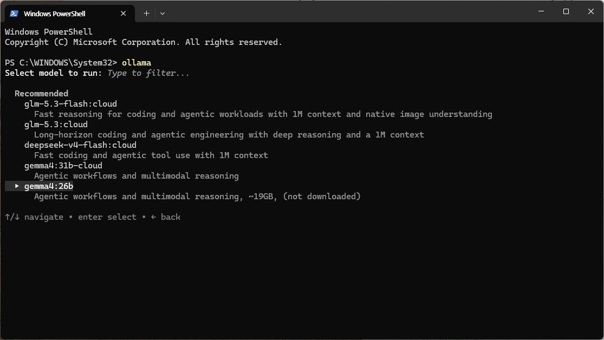

---

## 6. Step 5: Download the first model and check real-time progress (`ollama run`)

Start downloading and running the selected model by entering the command below in your terminal:

```powershell
# 일반 노트북 추천 모델 구동
ollama run gemma2:2b
```

When you run the command, Ollama will automatically start downloading the model weights file from the official repository.

1. **Receive Manifest file and start downloading layers**:
   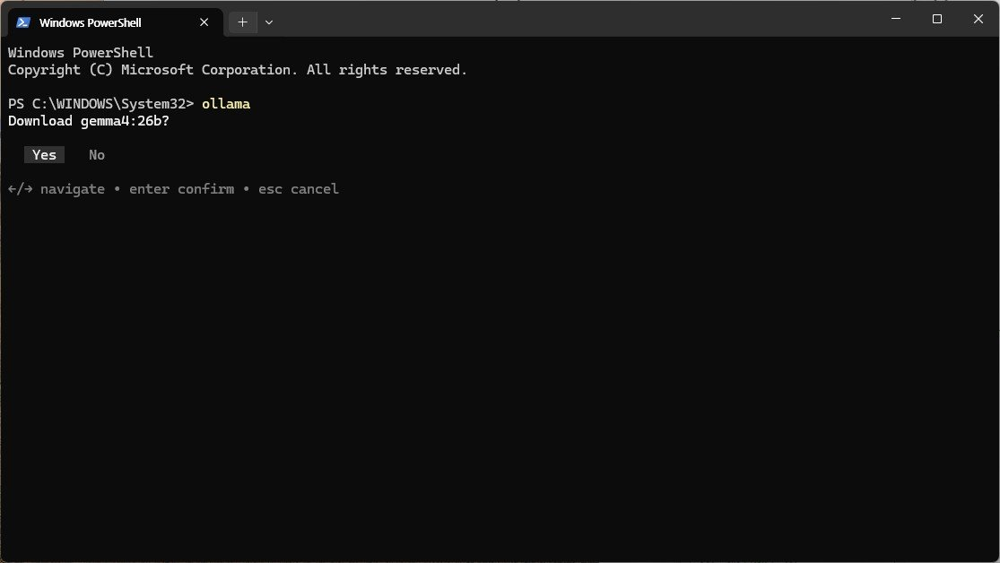

2. **Real-time download progress (%) and speed display**:
The size and download progress of each layer file are clearly displayed in a real-time progress bar.
   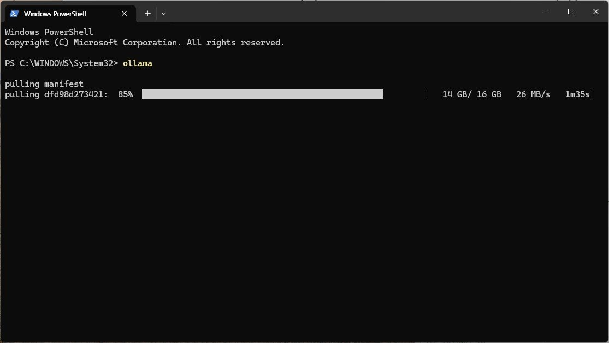

3. **Verifying sha256 digest and installation complete**:
When the download is 100% complete, an integrity check is performed and a **`success`** message is displayed.
   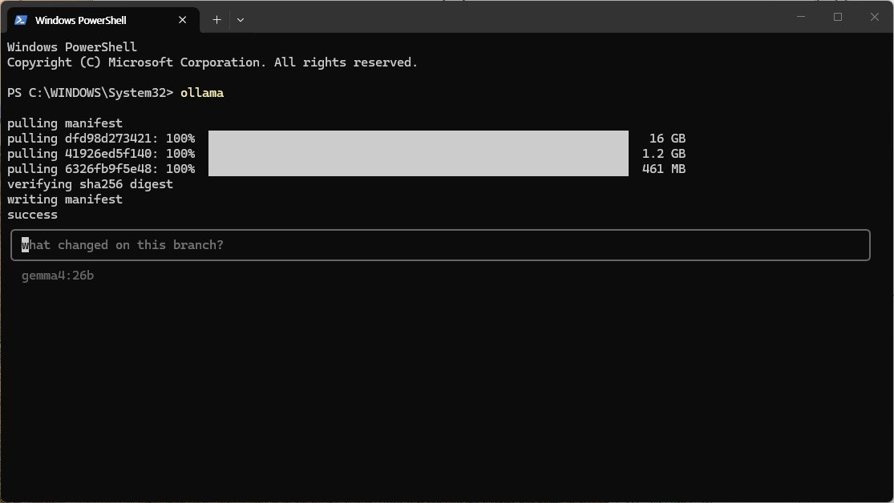

---

## 7. Step 6: Have a real-time AI conversation in your terminal

Once the download is complete, the prompt will immediately switch to **Interactive Interactive Mode** with the appearance of `>>>`. Now feel free to type your questions in Korean in the terminal window!

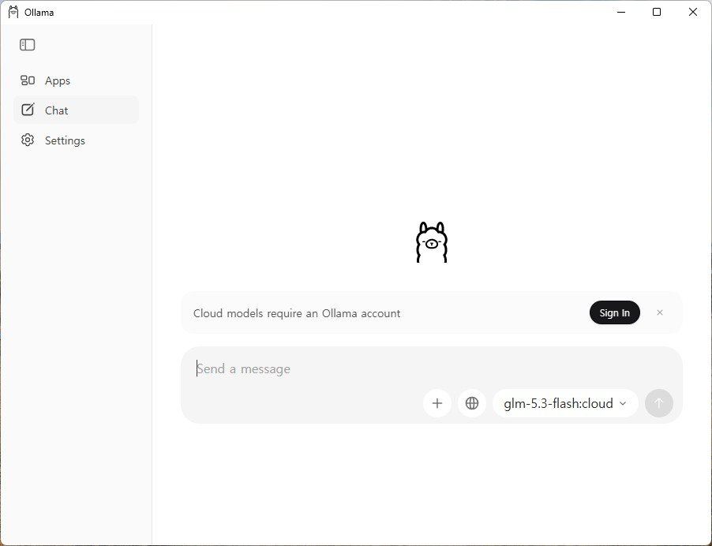

### 🛠️ Practical Engineering Question Test Examples

```text
>>> 리눅스 환경에서 100MB 이상 크기의 파일만 찾아서 용량 순으로 내림차순 정렬하는 find 명령어 작성해줘.
```

Even though it is a regular Intel/AMD internal graphics laptop without an external GPU, as soon as you press Enter, you can feel that your answers are output smoothly at a very fast speed of over 25 tokens per second!

### 🚪 How to end a conversation
To end a conversation and exit to a regular terminal shell:
* Type **`/bye`** and press Enter
* Or the keyboard shortcut **`Ctrl + D`** (`Ctrl + C` or `/bye` in PowerShell)

---

## 8. Practical tips from an engineer with 15 years of experience (Windows 11 environment)

### 💡 Tip 1: How to change the model storage path when C drive space is insufficient
If you download multiple models (Gemma, Llama, Qwen, etc.), your C drive may quickly run out of space. In this case, you can **change the model storage path to another partition such as the D drive**.

1. `Win + R` ➔ Enter `sysdm.cpl` (open system properties)
2. **Click [Advanced] tab ➔ [Environment Variables]**
3. Click [New] for **System Variables** or User Variables:
   * **Variable Name**: `OLLAMA_MODELS`
   * **Variable value**: `D:\ollama\models` (specify desired folder path)
4. Right-click the Ollama icon in the system tray, quit with **`Quit Ollama`**, and run it again. All models downloaded thereafter will be saved to the D drive!

### 💡 Tip 2: Know-how to distribute models offline to air-gap sites
If you need to go to a computer room without internet or an air gap site at a customer site:
1. Download the necessary models in advance on a laptop/PC with Internet access (`ollama run gemma2:2b`, etc.).
2. Copy the entire `C:\Users\<account>\.ollama\models` folder to a USB external drive.
3. After installing Ollama on a closed-network field laptop, just paste the contents of 'models' in the USB into the appropriate folder and **100% immediate offline operation is possible without an internet connection**.

---

## 9. Conclusion and preview of Part 3

Now your Windows 11 laptop has been completely transformed into a **standalone offline AI workstation** that provides intelligent answers just for you at any time, even when the internet is disconnected!

However, talking only from the terminal black screen (CLI) can be a bit frustrating when viewing long code or documents.

In the next **Part 3, we will cover how to conveniently communicate with a mouse by attaching a clean web browser chat screen (WebUI) like ChatGPT, and how to use it in practice** by connecting Ollama to my work automation script using Python and REST API.

### 🔗 Go to serial series

| previous steps | next steps |
| :---: | :---: |
| **[⬅️ Part 1. Summary of Ollama concepts and features](../ollama-01-local-llm-intro/)** | **[Part 3. How to use Ollama in practice: WebUI & API integration ➡️](../ollama-03-cli-webui-api/)** |

---
If you encounter any errors during installation or have any questions, please leave a comment!