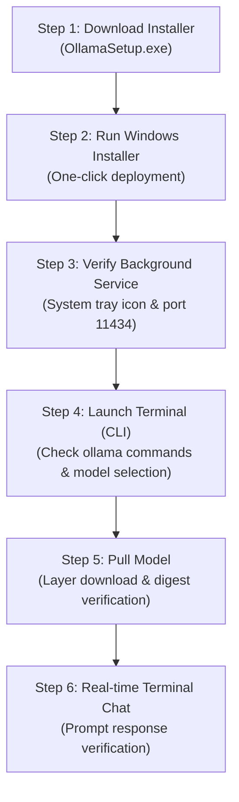

> **Author**: CK notes  
> **Environment**: Windows 11 (Standard business laptop)

> 📌 **Local LLM on My PC: Ollama Practical Series**
> 
> - **[Part 1. What is Ollama, a Local AI Running Free on My PC? (Concepts & Features)](../ollama-01-local-llm-intro/)**
> - **[Current Post] [Part 2. Windows 11 Ollama Installation & First Model Setup Guide](./)**
> - **[Part 3. Ollama Practical Applications: Terminal Chat, WebUI, and REST API](../ollama-03-cli-webui-api/)**

---

Following the foundational concepts discussed in Part 1 regarding why air-gapped environments benefit from local LLMs and why 2B–3B parameter models are best suited for standard business laptops, this guide walks through the hands-on deployment process.

We will cover installing Ollama via the Windows installer, verifying the background tray service, pulling and launching a lightweight model from the terminal, configuring model storage paths to save C-drive capacity, and transferring models offline to isolated data center sites.

---

## 1. Practical Installation Workflow

The end-to-end setup workflow is outlined below:



---

## 2. Step 1: Download Ollama Windows 11 installation file

1. Open your web browser and go to the Ollama official download page:
   * 🌐 **Official Download Link**: [https://ollama.com/download/windows](https://ollama.com/download/windows)
2. Click the **`Download for Windows`** button in the center of the screen.


3. Once the download is complete, a **`OllamaSetup.exe`** installation file will be created in the download folder.


---

## 3. Step 2: Run the installer and complete the installation.

1. Double-click the downloaded `OllamaSetup.exe` file to run it.
2. When the Installation Wizard window appears, click the **`Install`** button.


3. File decompression and service registration will proceed automatically (takes approximately 10 to 20 seconds).


4. Once installation is complete, the Ollama icon appears in the Windows 11 system tray (notification area), indicating that the background service is running.


> 💡 **Default installation paths**:
> * **Application binary**: `C:\Users\<user account>\AppData\Local\Programs\Ollama`
> * **Downloaded models**: `C:\Users\<user account>\.ollama\models`
> * Ollama automatically starts as a background service on system boot, listening on default local port **`11434`** (`http://localhost:11434`).

---

## 4. Step 3: Service Initialization and Account Setup

Ollama runs in the background automatically upon installation or system startup.


If desired, you can sign in with your Ollama account (optional; downloading models and executing local inference works completely without authentication).


---

## 5. Step 4: Verify Installation and Explore Models in CLI

Right-click the Windows Start button and open **Terminal** or **PowerShell**.

Type `ollama` and press Enter to display the supported command-line options (`serve`, `create`, `show`, `run`, `stop`, `pull`, `push`, `list`, `ps`, `rm`).


Select a lightweight model suited for your hardware. For standard business laptops with 16 GB of system RAM, compact 2B–3B parameter models such as `gemma2:2b` or `llama3.2:3b` provide optimal performance with minimal memory overhead (~2 GB).


---

## 6. Step 5: Pull and Launch the Model (`ollama run`)

Execute the following command in PowerShell to pull and initialize the model:

```powershell
# Run recommended lightweight model for laptops
ollama run gemma2:2b
```

Ollama automatically retrieves the model layers from the official registry:

1. **Manifest retrieval and layer download**:
   

2. **Real-time progress and transfer speed**:
   The transfer status for each layer is displayed via progress bars.
   

3. **Digest verification and completion**:
   Once downloaded, sha256 digests are verified, concluding with a `success` message.
   

---

## 7. Step 6: Interactive Terminal Prompt

Once initialization completes, the terminal switches to an interactive `>>>` prompt. Enter a prompt to test model inference:


### 🛠️ Practical Engineering Prompt Test

```text
>>> Write a find command in Linux that finds files larger than 100MB and sorts them in descending order by size.
```

Even on standard laptops relying solely on integrated Intel/AMD CPU graphics, responses stream smoothly at around 25 tokens per second.

### 🚪 Exiting the Session
To exit the interactive session and return to PowerShell:
* Type `/bye` and press Enter
* Or press `Ctrl + D` (`Ctrl + C` or `/bye` in PowerShell)

---

## 8. Practical Tips (Windows 11 Environment)

### 💡 Tip 1: Moving Model Storage to Another Drive
As you pull multiple models, system drive space may diminish. You can relocate the storage path to another partition (such as `D:\`) using environment variables:

1. Press `Win + R`, enter `sysdm.cpl`, and hit Enter.
2. Navigate to **Advanced** ➔ click **Environment Variables**.
3. Under System or User variables, click **New**:
   * **Variable name**: `OLLAMA_MODELS`
   * **Variable value**: `D:\ollama\models` (or your target path)
4. Right-click the Ollama tray icon, select **Quit Ollama**, and relaunch. Subsequent models will download to the new path.

### 💡 Tip 2: Deploying Models to Air-Gapped Data Centers
When heading to an isolated site without external internet access:
1. Pull all necessary models on an internet-connected PC beforehand (`ollama run gemma2:2b`, etc.).
2. Copy the entire `C:\Users\<account>\.ollama\models` directory to an external drive.
3. On the air-gapped target machine, install Ollama and place the copied `models` directory into the user profile folder. Local inference will operate immediately without network access.

---

## 9. Summary

Installing Ollama on Windows 11 provides a self-contained local AI environment that delivers fast technical assistance without sending a single byte over external networks.

If C-drive storage is limited, configuring the `OLLAMA_MODELS` environment variable enables flexible storage management across secondary drives. In addition, pre-downloaded model weights can be packaged and transferred to offline air-gapped data centers with minimal effort.

In **[Part 3: Ollama Practical Applications: Terminal Chat, WebUI, and REST API](../ollama-03-cli-webui-api/)**, we will explore connecting a browser-based WebUI and calling the local inference engine via Python REST APIs.

---

### 🔗 Series Navigation

| Previous Step | Next Step |
| :---: | :---: |
| **[⬅️ Part 1. Ollama Concepts and Architecture Overview](../ollama-01-local-llm-intro/)** | **[Part 3. Ollama Practical Applications: WebUI & API Integration ➡️](../ollama-03-cli-webui-api/)** |