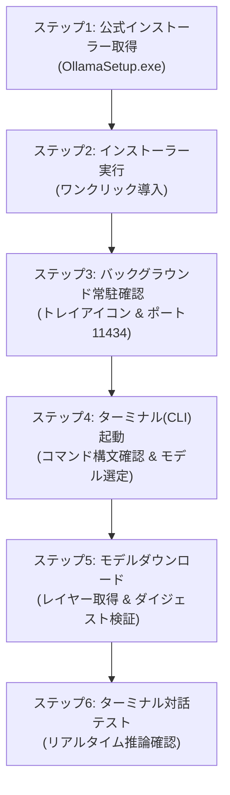

> **作成者**: CK notes  
> **環境**：Windows 11（一般業務用ノートPC基準）

> 📌 **私のPCで駆動するローカルLLM：Ollama実践連載目次**
> 
> - **[1編。私のPCから無料で回すローカルAI、Ollamaとは何ですか？ (概念と特徴)](../ollama-01-local-llm-intro/)**
> - **[現在の記事] [2編。 Windows 11 環境 Ollama のインストールと最初のモデルのダウンロード & 駆動ガイド](./)**
> - **[3編。 Ollamaの実践活用法：ターミナル会話からWebUI＆API連動まで](../ollama-03-cli-webui-api/)**

---

前回の第1編では、外部ネットワークが遮断された閉鎖網（Air-gap）環境においてローカルLLMが求められる背景と、一般業務用ノートPCに適した2B〜3B級小型モデルの選定理由を解説しました。

本記事では、Windows 11ノートPCにOllamaをセットアップし、軽量モデルをダウンロードしてターミナルの対話型プロンプト上で稼働させるまでの具体的な導入手順を整理します。

インストーラーによるセットアップ、バックグラウンドサービスの常駐確認、CLI対話テスト、Cドライブの容量圧迫を防ぐモデル保存先の変更、および閉鎖網へのオフライン持ち込み手法まで順を追って解説します。

---

## 1. 導入ワークフロー

全体の作業フローは以下の通りです。



---

## 2. ステップ1：Ollama Windows 11インストールファイルをダウンロードする

1. Webブラウザを開き、Ollamaの公式ダウンロードページにアクセスします。
   * 🌐 **公式ダウンロードリンク**: [https://ollama.com/download/windows](https://ollama.com/download/windows)
2. 画面中央の**`Download for Windows`**ボタンをクリックします。


3. ダウンロードが完了すると、ダウンロードフォルダに**`OllamaSetup.exe`**インストールファイルが作成されます。


---

## 3. ステップ2: インストーラの実行とインストールの完了

1. ダウンロードした `OllamaSetup.exe` ファイルをダブルクリックして実行します。
2. インストールウィザードウィンドウが表示されたら、**`Install`**ボタンをクリックします。


3. ファイルの解凍とサービス登録操作は自動的に行われます（約10〜20秒かかります）。


4. インストールが完了すると、Windows 11右下のタスクバーシステムトレイ（通知領域）にOllamaアイコンが常駐し、バックグラウンドサービスが稼働します。


> 💡 **デフォルトのインストール先**:
> * **プログラム配置先**: `C:\Users\<ユーザーアカウント>\AppData\Local\Programs\Ollama`
> * **モデル保存先**: `C:\Users\<ユーザーアカウント>\.ollama\models`
> * OllamaはWindows起動時にバックグラウンドサービスとして自動起動し、ローカルREST APIポート **`11434`** 番（`http://localhost:11434`）をリッスンします。

---

## 4. ステップ3: 実行と環境の確認

インストール直後、またはWindows起動時にOllamaは自動的にバックグラウンドで起動します。


必要に応じて公式サイトのアカウントでログインできます（任意項目であり、ログインを行わなくてもモデルのダウンロードおよびローカル実行は完全に動作します）。


---

## 5. ステップ4: ターミナル(CLI)での動作検証とモデル選定

Windowsスタートボタンを右クリックし、**ターミナル(Terminal)** または **PowerShell** を起動します。

ターミナルに `ollama` と入力してEnterキーを押すと、サポートされるコマンド一覧（`serve`, `create`, `show`, `run`, `stop`, `pull`, `push`, `list`, `ps`, `rm`）が表示されます。


続いて、ライブラリからノートPC環境に適した軽量モデルを選択します。一般ビジネスノートPCでは、メモリ専有量が2GB前後である2B〜3B級モデル（例: `gemma2:2b`, `llama3.2:3b`）が安定して動作します。


---

## 6. ステップ5: 初回モデルのダウンロードと進捗確認 (`ollama run`)

ターミナルで以下のコマンドを実行し、モデルの取得と起動を開始します:

```powershell
# 一般ノートPC推奨モデルの起動
ollama run gemma2:2b
```

コマンドを実行すると、公式リポジトリからモデル重みファイルの取得が始まります。

1. **Manifest取得およびレイヤーダウンロード開始**:
   

2. **進捗率(%)および転送速度の表示**:
   各レイヤーファイルのサイズと進捗状況がプログレスバーで表示されます。
   

3. **完全性検証(sha256 digest)および完了**:
   ダウンロードが完了するとハッシュ検証が行われ、`success` と表示されます。
   

---

## 7. ステップ6: ターミナルでの対話テスト

準備が整うと、プロンプトが `>>>` の対話型モードに切り替わります。質問を入力してローカル推論をテストします。


### 🛠️ 実務エンジニアリング質問テスト例

```text
>>> Linux環境で100MB以上のファイルのみを検索し、サイズ順に降順ソートするfindコマンドを書いてください。
```

外付けGPUを持たない内蔵グラフィックスノートPCであっても、CPU演算のみで毎秒25トークン前後の実用的な速度で回答が出力されます。

### 🚪 対話の終了方法
セッションを終了して通常のシェルに戻るには:
* `/bye` を入力してEnter
* またはショートカット `Ctrl + D` （PowerShell環境では `Ctrl + C` または `/bye`）

---

## 8. 実務Tips（Windows 11環境）

### 💡 Tips 1: Cドライブの空き容量を圧迫しない保存先変更手順
複数のモデルをダウンロードするとCドライブの容量が圧迫されることがあります。環境変数を設定して別ドライブ（Dドライブなど）に保存先を変更できます。

1. `Win + R` ➔ `sysdm.cpl` を入力（システムのプロパティ）
2. **詳細設定** タブ ➔ **環境変数** をクリック
3. システム環境変数またはユーザー環境変数で **新規** をクリック:
   * **変数名**: `OLLAMA_MODELS`
   * **変数値**: `D:\ollama\models` （任意のパスを指定）
4. システムトレイのOllamaアイコンを右クリックして **Quit Ollama** で終了し、再度起動します。以降ダウンロードされるモデルは指定したパスに保存されます。

### 💡 Tips 2: エアギャップ（閉鎖網）現場へのオフライン持ち込み手順
外部ネットワークのないデータセンター現場等に持ち込む場合:
1. 事前にインターネット環境のあるPCで必要なモデルを取得します（`ollama run gemma2:2b` など）。
2. `C:\Users\<アカウント>\.ollama\models` フォルダ全体を外付けUSBドライブ等にコピーします。
3. 現場PCにOllamaをインストール後、同パスにUSBの `models` フォルダ内容を配置すれば、ネットワーク接続なしで即座にオフライン推論が稼働します。

---

## 9. まとめ

Windows 11環境にOllamaを導入し軽量モデルを配置することで、外部ネットワークに依存しない安全なプライベートAI環境を迅速に立ち上げることができます。

Cドライブの容量管理には環境変数 `OLLAMA_MODELS` を活用し、事前に取得したモデルデータをオフライン持ち込みすることで、厳しいセキュリティ規定のある現場でも有効なエンジニアリング支援環境を構築できます。

続く**[第3編: Ollamaの実践活用法: ターミナル対話からWebUI＆API連動まで](../ollama-03-cli-webui-api/)**では、ブラウザベースのWebUI構築およびPythonスクリプトによるREST API連携手順を解説します。

---

### 🔗 連載シリーズショートカット

| 前のステップ | 次のステップ |
| :---: | :---: |
| **[⬅️ 1編。 Ollamaの概念と特徴総まとめ](../ollama-01-local-llm-intro/)** | **[3編。 Ollama 実践活用法: WebUI & API 連動 ➡️](../ollama-03-cli-webui-api/)** |