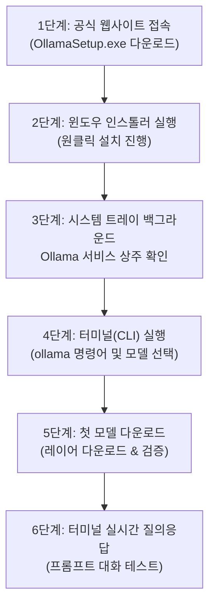

> **作成者**: 15年目のITフィールドエンジニア
> **環境**：Windows 11（一般業務用ノートパソコンベース）

> 📌 **私のPCで駆動するローカルLLM：Ollama本番連載目次**
> 
> - **[1編。私のPCから無料で回すローカルAI、Ollamaとは何ですか？ (概念と特徴)](../ollama-01-local-llm-intro/)**
> - **[現在の記事] [2編。 Windows 11 環境 Ollama のインストールと最初のモデルのダウンロード & 駆動ガイド](./)**
> - **[3編。 Ollamaの実践活用法：ターミナル会話からWebUI＆API連動まで](../ollama-03-cli-webui-api/)**

---

こんにちは！ 15年目のITフィールドエンジニアです。

[第1編]で外部インターネットが遮断されたエアギャップ（Air-gap、閉鎖網）現場でローカルLLMがなぜ必要なのか、そしてなぜ一般業務用ノートパソコンには2B～3B小型モデルが最も適しているのか調べました。

これで理論が終わったので、私のWindows 11ノートブックに**直接Ollamaをインストールし、最初のAIモデルをダウンロードしてターミナルでリアルタイムで会話する実践プロセス**を進めましょう。

実際のインストールからモデルのダウンロード、初対話までの全体の過程を**13枚の現場キャプチャ画面とともに段階的に分かりやすくまとめます。

---

## 1. 本番設置ワークフロー

インストールから最初の会話までの全体的な進捗は次のとおりです。



---

## 2. ステップ1：Ollama Windows 11インストールファイルをダウンロードする

1. Webブラウザを開き、Ollamaの公式ダウンロードページにアクセスします。
   * 🌐 **公式ダウンロードリンク**: [https://ollama.com/download/windows](https://ollama.com/download/windows)
2. 画面中央の**`Download for Windows`**ボタンをクリックします。


3. ダウンロードが完了すると、ダウンロードフォルダに**`OllamaSetup.exe`**インストールファイルが作成されます。


---

## 3. ステップ2: インストーラの実行とインストールの完了

1. ダウンロードした `OllamaSetup.exe` ファイルをダブルクリックして実行します。
2. インストールウィザードウィンドウが表示されたら、**`Install`**ボタンをクリックします。


3. ファイルの解凍とサービス登録操作は自動的に行われます（約10〜20秒かかります）。


4. インストールが完了すると、Windows 11の右下にある**タスクバーのシステムトレイ（通知領域）にかわいいラマ（Ollama）アイコン**が登録され、バックグラウンドでの常駐を開始します。


> 💡 **知っておくと便利なデフォルトのインストールパス**：
> * **プログラムのインストール場所**: `C:\Users\<ユーザーアカウント>\AppData\Local\Programs\Ollama`
> * **ダウンロードモデルの保存場所**: `C:\Users\<ユーザーアカウント>\.ollama\models`
> * OllamaはWindowsの起動時にバックグラウンドサービスとして自動的に実行され、ローカルREST APIポートである** `11434`**番（ `http://localhost：11434`）をデフォルトリスニングします。

---

## 4. ステップ3: Ollamaの実行と環境の準備

インストール直後またはWindowsの起動時にOllamaが自動的にバックグラウンドで駆動されます。


必要に応じて、公式ウェブサイトと連動して自分のアカウントでログインしておくことができます（オプションであり、非ログイン状態でもモデルのダウンロードとローカル実行は100％正常に動作します）。


---

## 5. ステップ 4: ターミナル (CLI) でのインストール検証とモデルの探索

ウィンドウのスタートボタンを右クリックし、** `ターミナル（Terminal）`**または** `PowerShell`**を実行します。

ターミナルウィンドウに `ollama` と入力してエンターを打つと、サポートされている基本命令のリスト (`serve`, `create`, `show`, `run`, `stop`, `pull`, `push`, `list`, `ps`, `rm`) が正常に出力されます。


次に、ライブラリから一般的なノートブック環境に最適な軽量モデルを選択します。 1編でお勧めしたように、一般事務用/業務用ノートパソコンには、**2B～3B級軽量モデル（例：`gemma2:2b`、`llama3.2:3b`）**がメモリ負担なく最も快適です。


---

## 6. ステップ 5: 最初のモデルのダウンロードとリアルタイムの進捗状況の確認 (`ollama run`)

端末に以下のコマンドを入力して、選択したモデルのダウンロードと実行を開始します。

```powershell
# 일반 노트북 추천 모델 구동
ollama run gemma2:2b
```

命令を実行すると、Ollamaは公式リポジトリからモデルの重みファイルを自動的にダウンロードし始めます。

1. **Manifest ファイルの受信とレイヤーのダウンロード開始**:
   

2. **リアルタイムダウンロードの進行状況（％）と速度を表示**：
各レイヤーファイルのサイズとダウンロードの進捗状況は、リアルタイムプログレスのすぐにきれいに表示されます。
   

3. **整合性検証（verifying sha256 digest）とインストール完了**：
ダウンロードが100％完了すると、整合性チェックを経て** `success`**メッセージが出力されます。
   

---

## 7. ステップ 6: 端末でリアルタイム AI 会話を分割する

ダウンロードが完了すると、プロンプトが `>>>` の形の ** 対話型インタラクティブモード** にすぐに切り替わります。今ターミナルウィンドウで韓国語で自由に質問を入力してみてください！


### 🛠️実務エンジニアリング質問テストの例

```text
>>> 리눅스 환경에서 100MB 이상 크기의 파일만 찾아서 용량 순으로 내림차순 정렬하는 find 명령어 작성해줘.
```

外付けGPUのない一般インテル/AMD内蔵グラフィックノートブックであるにもかかわらず、エンターを押すとすぐに**毎秒25トークン以上の非常に速いスピードで答えが詰まらず酒術出力**されることを体感できます！

### 🚪会話を終了する方法
会話を終えて通常のターミナルシェルに出るには：
* **`/bye`** 入力後のエンター
* またはキーボードショートカット** `Ctrl + D`**（PowerShellでは `Ctrl + C`または `/bye`

---

## 8. 15年目のエンジニアの実戦ハニーチップ（Windows 11環境）

### 💡ヒント1：Cドライブ容量が不足している場合のモデル保存パスの変更方法
複数のモデル（Gemma、Llama、Qwenなど）をダウンロードすると、Cドライブの容量がすぐに不足する可能性があります。このような場合は、**Dドライブなど他のパーティションにモデルの保存パスを変更**できます。

1. `Win+R` ➔ `sysdm.cpl` 入力(システムプロパティを開く)
2. **[詳細]タブ➔[環境変数]**をクリック
3. **システム変数**またはユーザー変数で[新規]をクリックします。
   * **変数名**： `OLLAMA_MODELS`
   * **変数値**: `D:\ollama\models` (必要なフォルダーのパスを指定)
4. システムトレイでOllamaアイコンを右クリックして**`Quit Ollama`**で終了して再度実行すると、今後ダウンロードされるすべてのモデルがDドライブとして保存されます。

### 💡ヒント2：閉鎖（Air-gap）シーンにモデルオフラインで展開するノウハウ
インターネットのないコンピュータ室または顧客のエアギャップの現場に行く必要がある場合：
1. 事前にインターネットになるラップトップ/ PCから必要なモデルをダウンロードしてください（ `ollama run gemma2：2b`など）。
2. `C:\Users\<アカウント>\.ollama\models` フォルダ全体を USB 外付けドライブにコピーします。
3. 閉鎖現場のノートパソコンにOllamaをインストールした後、そのフォルダにUSB内の `models` 内容をそのまま貼り付けるだけで**インターネット接続なしでも100%即時オフライン駆動**が可能です。

---

## 9. 結論及び3編予告

今、あなたのWindows 11ノートブックは、インターネットが途切れてもいつでも私だけのためにインテリジェントに答えてくれる**スタンドアロンオフラインAIワークステーション**に完全に変身しました！

ただし、ターミナルの黒い画面（CLI）でのみ話すことは、長いコードや文書を見ると少し面倒です。

次の**3編では、ChatGPTのようにすっきりとしたWebブラウザチャット画面（WebUI）を貼り付けてマウスで便利に会話する方法と、Python（Python）とREST APIで私の業務自動化スクリプトにOllamaを接続する本番活用法**を取り上げます。

### 🔗連載シリーズショートカット

| 前のステップ | 次のステップ |
| :---: | :---: |
| **[⬅️1編。 Ollamaの概念と特長総まとめ](../ollama-01-local-llm-intro/)** | **[3編。 Ollama 実践活用法: WebUI & API 連動 ➡️](../ollama-03-cli-webui-api/)** |

---
インストール中にエラーが発生したり、ご質問がある場合は、コメントとして残してください！