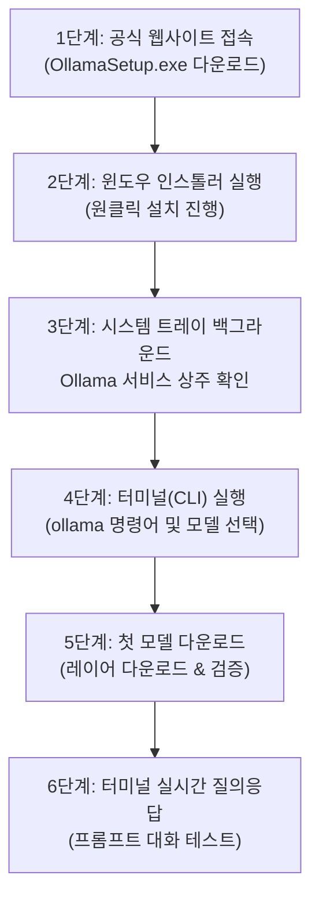

> **작성자**: CK notes  
> **환경**: Windows 11 (일반 업무용 노트북 기준)

> 📌 **내 PC에서 구동하는 로컬 LLM: Ollama 실전 연재 목차**
> 
> - **[1편. 내 PC에서 무료로 돌리는 로컬 AI, Ollama란 무엇인가? (개념 및 특징)](../ollama-01-local-llm-intro/)**
> - **[현재글] [2편. Windows 11 환경 Ollama 설치 및 첫 모델 다운로드 & 구동 가이드](./)**
> - **[3편. Ollama 실전 활용법: 터미널 대화부터 WebUI & API 연동까지](../ollama-03-cli-webui-api/)**

---

앞서 1편에서 에어갭(Air-gap, 폐쇄망) 환경에서 로컬 LLM이 필요한 이유와 일반 업무용 노트북에 적합한 2B~3B 소형 모델의 특징을 살펴보았습니다.

이번 글에서는 Windows 11 노트북 환경에 Ollama를 직접 설치하고, 첫 번째 경량 모델을 다운로드하여 터미널 인터랙티브 프롬프트에서 구동하는 절차를 정리합니다.

인스톨러 설치부터 백그라운드 서비스 상주 확인, CLI 대화 테스트, C드라이브 용량 관리를 위한 저장 경로 변경과 폐쇄망 오프라인 배포 팁까지 단계별로 확인해보겠습니다.

---

## 1. 실전 설치 워크플로우

설치부터 첫 대화까지의 전체 진행 흐름은 아래와 같습니다.



---

## 2. 1단계: Ollama Windows 11 설치 파일 다운로드

1. 웹 브라우저를 열고 Ollama 공식 다운로드 페이지에 접속합니다:
   * 🌐 **공식 다운로드 링크**: [https://ollama.com/download/windows](https://ollama.com/download/windows)
2. 화면 중앙의 **`Download for Windows`** 버튼을 클릭합니다.


3. 다운로드가 완료되면 다운로드 폴더에 **`OllamaSetup.exe`** 설치 파일이 생성됩니다.


---

## 3. 2단계: 인스톨러 실행 및 설치 완료

1. 다운로드한 `OllamaSetup.exe` 파일을 더블 클릭하여 실행합니다.
2. 설치 마법사 창이 나타나면 **`Install`** 버튼을 클릭합니다.


3. 파일 압축 해제 및 서비스 등록 작업이 자동으로 진행됩니다 (약 10~20초 소요).


4. 설치가 완료되면 Windows 11 우측 하단 작업표시줄 시스템 트레이(알림 영역)에 Ollama 아이콘이 등록되며 백그라운드 서비스가 상주합니다.


> 💡 **기본 설치 경로 참고**:
> * **프로그램 설치 위치**: `C:\Users\<사용자계정>\AppData\Local\Programs\Ollama`
> * **다운로드 모델 저장 위치**: `C:\Users\<사용자계정>\.ollama\models`
> * Ollama는 윈도우 부팅 시 백그라운드 서비스로 자동 실행되며, 로컬 REST API 포트인 **`11434`**번(`http://localhost:11434`)을 기본 리스닝합니다.

---

## 4. 3단계: Ollama 실행 및 환경 준비

설치 직후 또는 윈도우 시작 시 Ollama가 자동으로 백그라운드에서 구동됩니다.


필요한 경우 공식 웹사이트와 연동하여 계정 로그인을 진행할 수 있습니다 (선택 사항이며, 비로그인 상태로도 모델 다운로드 및 로컬 실행은 정상 동작합니다).


---

## 5. 4단계: 터미널(CLI)에서 설치 검증 및 모델 탐색

윈도우 시작 버튼을 우클릭하고 **터미널(Terminal)** 또는 **PowerShell**을 실행합니다.

터미널 창에 `ollama`를 입력하고 엔터를 치면, 지원되는 기본 명령어 목록(`serve`, `create`, `show`, `run`, `stop`, `pull`, `push`, `list`, `ps`, `rm`)이 출력됩니다.


이어서 라이브러리에서 일반 노트북 환경에 적합한 경량 모델을 선택합니다. 일반 사무용/업무용 노트북에서는 메모리 점유율이 2GB 내외인 2B~3B급 경량 모델(예: `gemma2:2b`, `llama3.2:3b`)이 안정적입니다.


---

## 6. 5단계: 첫 모델 다운로드 및 실시간 진행률 확인 (`ollama run`)

터미널에 아래 명령어를 입력하여 선택한 모델의 다운로드 및 실행을 시작합니다:

```powershell
# 일반 노트북 추천 모델 구동
ollama run gemma2:2b
```

명령어를 실행하면 Ollama가 공식 저장소에서 모델 가중치 파일을 자동으로 다운로드하기 시작합니다.

1. **Manifest 파일 수신 및 레이어 다운로드 시작**:
   

2. **실시간 다운로드 진행률(%) 및 속도 표시**:
   각 레이어 파일의 크기와 다운로드 진행 상황이 실시간 프로그레스 바로 표시됩니다.
   

3. **무결성 검증(verifying sha256 digest) 및 설치 완료**:
   다운로드가 완료되면 무결성 체크를 거쳐 `success` 메시지가 출력됩니다.
   

---

## 7. 6단계: 터미널에서 실시간 AI 대화 나누기

다운로드가 끝나면 프롬프트가 `>>>` 모양의 대화형 인터랙티브 모드로 즉시 전환됩니다. 이제 터미널 창에서 프롬프트 질문을 입력하여 테스트를 진행합니다.


### 🛠️ 실무 엔지니어링 질문 테스트 예시

```text
>>> 리눅스 환경에서 100MB 이상 크기의 파일만 찾아서 용량 순으로 내림차순 정렬하는 find 명령어 작성해줘.
```

외장 GPU가 없는 일반 내장 그래픽 노트북에서도 CPU 연산만으로 초당 25토큰 수준의 준수한 출력 속도를 확인할 수 있습니다.

### 🚪 대화 종료 방법
대화를 마치고 일반 터미널 쉘로 빠져나오려면:
* `/bye` 입력 후 엔터
* 또는 키보드 단축키 `Ctrl + D` (PowerShell에서는 `Ctrl + C` 또는 `/bye`)

---

## 8. 실전 팁 (Windows 11 환경)

### 💡 팁 1: C드라이브 용량 부족 시 모델 저장 경로 변경 방법
여러 모델(Gemma, Llama, Qwen 등)을 다운받다 보면 C드라이브 용량이 부족해질 수 있습니다. 이 경우 환경 변수를 통해 D드라이브 등 다른 볼륨으로 모델 저장 경로를 변경할 수 있습니다.

1. `Win + R` ➔ `sysdm.cpl` 입력 (시스템 속성 열기)
2. **[고급]** 탭 ➔ **[환경 변수]** 클릭
3. **시스템 변수** 또는 사용자 변수에 **[새로 만들기]** 클릭:
   * **변수 이름**: `OLLAMA_MODELS`
   * **변수 값**: `D:\ollama\models` (원하는 폴더 경로 지정)
4. 시스템 트레이에서 Ollama 아이콘을 우클릭하여 **`Quit Ollama`**로 종료 후 다시 실행하면, 이후 다운로드되는 모든 모델이 지정된 드라이브로 저장됩니다.

### 💡 팁 2: 폐쇄망(Air-gap) 현장으로 모델 오프라인 배포하는 노하우
인터넷이 없는 전산실이나 고객사 에어갭 현장에 반입해야 할 경우:
1. 사전에 인터넷이 연결된 PC에서 필요한 모델들을 다운로드합니다 (`ollama run gemma2:2b` 등).
2. `C:\Users\<계정>\.ollama\models` 폴더 전체를 USB 외장 드라이브에 복사합니다.
3. 폐쇄망 현장 노트북에 Ollama를 설치한 후, 해당 폴더에 USB 안의 `models` 내용을 그대로 붙여넣으면 인터넷 연결 없이도 즉시 오프라인 구동이 가능합니다.

---

## 9. 정리하며

Windows 11 환경에 Ollama를 설치하고 경량 모델을 다운로드하면, 외부 네트워크 연결 없이도 로컬 터미널에서 즉각적인 질의응답이 가능한 프라이빗 AI 환경이 완성됩니다.

C드라이브 용량이 제한적인 경우 환경 변수(`OLLAMA_MODELS`)를 활용해 데이터 드라이브로 경로를 분리하고, 사전에 내려받은 모델 폴더를 복사해 에어갭 현장에 반입하는 방식으로 유연하게 운용할 수 있습니다.

이어지는 **[3편: Ollama 실전 활용법: 터미널 대화부터 WebUI & API 연동까지](../ollama-03-cli-webui-api/)**에서는 브라우저 기반의 WebUI 연동과 파이썬 스크립트 기반의 REST API 호출 방법을 다룹니다.

---

### 🔗 연재 시리즈 바로가기

| 이전 단계 | 다음 단계 |
| :---: | :---: |
| **[⬅️ 1편. Ollama 개념 및 특징 총정리](../ollama-01-local-llm-intro/)** | **[3편. Ollama 실전 활용법: WebUI & API 연동 ➡️](../ollama-03-cli-webui-api/)** |