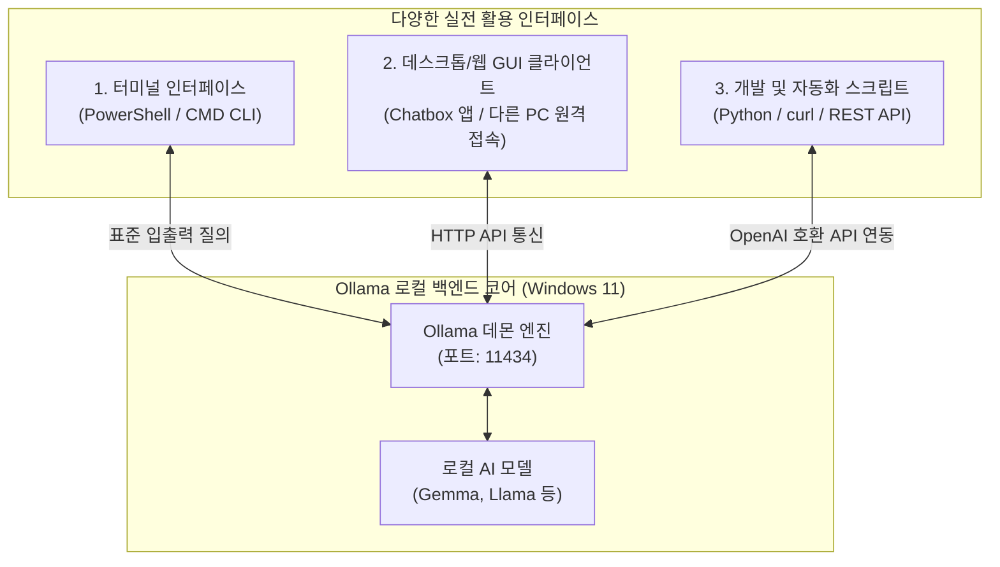
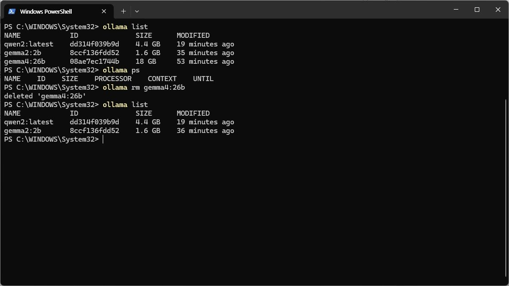
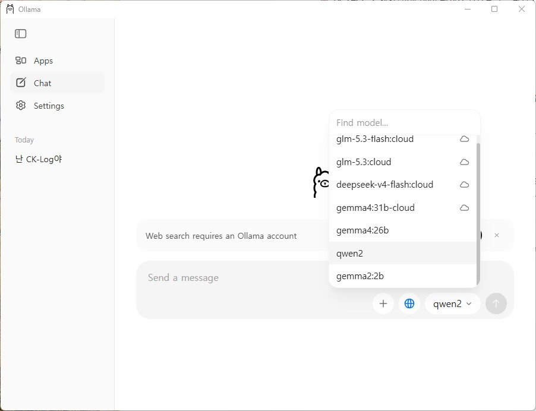
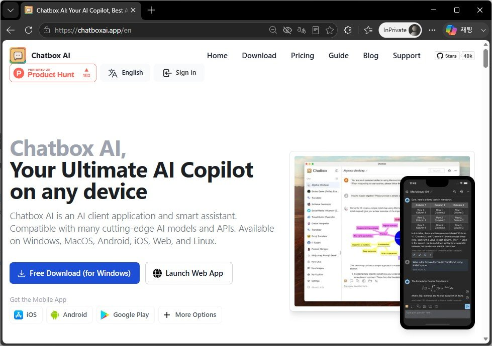
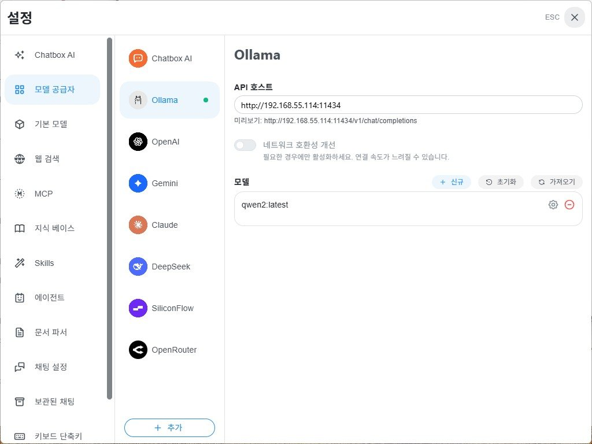
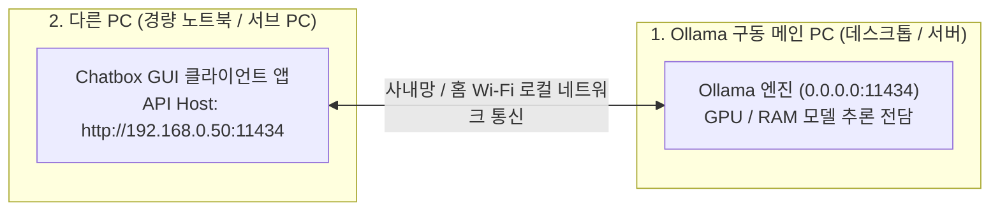
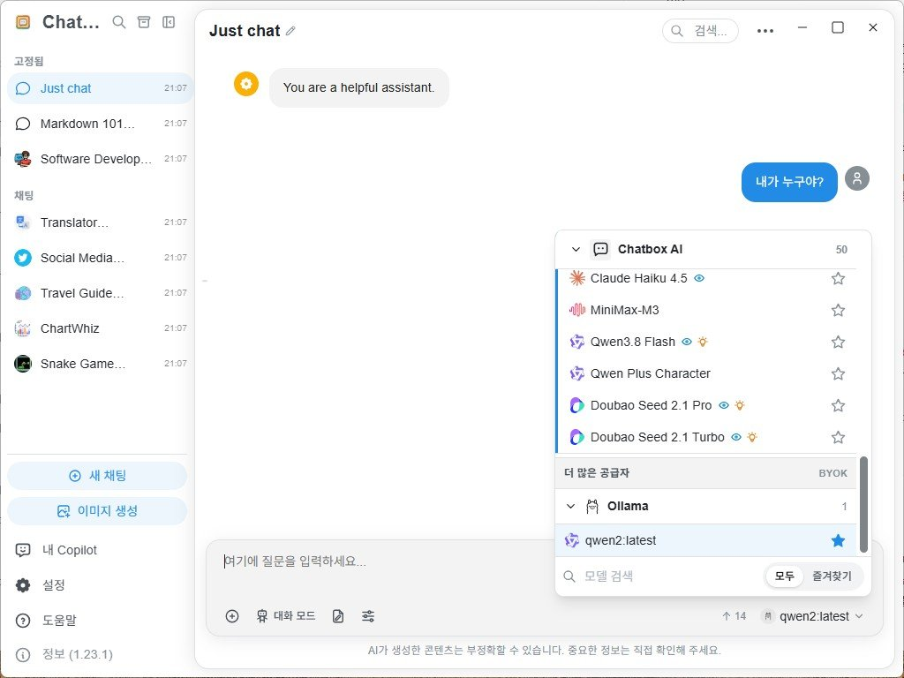

> **Author**: IT field engineer with 15 years of experience
> **Environment**: Windows 11 (based on general business laptop)

> 📌 **Local LLM running on my PC: Ollama practical series table of contents**
> 
> - **[Part 1. What is Ollama, a local AI that runs for free on my PC? (Concept and Features)](../ollama-01-local-llm-intro/)**
> - **[Part 2. Windows 11 environment Ollama installation and first model download & operation guide](../ollama-02-windows-install-guide/)**
> - **[Current post] [Part 3. How to use Ollama in practice: From CLI advanced tips to WebUI and API integration](./)**

---

Hello! I am an IT field engineer with 15 years of experience.

In [Part 1], we identified the need for local LLM and model selection criteria, and in [Part 2], we installed Ollama directly on a Windows 11 laptop and ran our first lightweight model.

Now, in the final third part, we will cover a practical guide to **"How to fully utilize the installed local AI in practical engineering work?"**.

From terminal shortcuts and advanced model management commands, **how to attach a pretty web browser chat box like ChatGPT**, **tips for leaving Ollama on your main PC and remotely accessing it from another lightweight laptop**, and **know-how to connect the AI brain to your work automation script using Python and REST API**, we provide an easy-to-understand summary with actual screen captures.

---

## 1. Architecture for practical use of local AI

Ollama is not just a terminal tool, but operates as a powerful **REST API server (`http://localhost:11434`)** in the background. Therefore, it can be easily expanded by combining with various interfaces as shown below.



---

## 2. Key terminal commands & tips for CLI power users

These are practical commands that efficiently manage models and improve conversation quality in a terminal (PowerShell) environment.

### 📋 Model life cycle management commands (`ollama list` & `ollama rm`)



```powershell
# 1. 로컬에 다운로드된 모델 목록 및 용량 확인
ollama list

# 2. 현재 메모리(VRAM/RAM)에 상주하여 구동 중인 모델 확인
ollama ps

# 3. 모델을 즉시 실행하지 않고 백그라운드로 다운로드만 받아두기
ollama pull llama3.2:3b

# 4. 안 쓰는 모델을 삭제하여 디스크 용량 확보하기
ollama rm gemma2:2b
```

### 💡 Useful shortcut commands inside the interactive prompt (`>>>`)

When you enter conversational mode with `ollama run <model name>`, you can control the session with the slash (`/`) command in the prompt window:

* **`/?`** or **`/help`**: Check the list of available shortcut commands.
* **`/show info`**: Check parameter size, context length, and architecture details of the current local model.
* **`/clear`**: Clear the previous conversation context (history) and start with a new topic.
* **`/set system "..."`**: Assign a specific role (persona) to AI
  ```text
  >>> /set system "너는 15년 차 시니어 리눅스 시스템 엔지니어 사수야. 모든 답변은 실무 위주 쉘 스크립트와 명령어 예시로 간결하게 설명해."
  ```
* **`/save <my_model_name>`**: Permanently save the system prompts you set and create your own custom AI model!
  ```text
  >>> /save my-linux-mentor
  ```
*(You can then immediately call your dedicated shooter with `ollama run my-linux-mentor` in the terminal)*
* **`/bye`**: End conversation and return to shell



---

## 3. As convenient as ChatGPT! Integrating GUI client (Chatbox)

The terminal black screen (CLI) is light and fast, but a graphic screen operated with a mouse is much more convenient for viewing long source code or classifying and managing previous conversation history.

The most recommended free tool for regular Windows 11 users is **`Chatbox`**. Integrates in just one minute with a single Windows-specific app installation file, without complicated Docker settings.



### 🛠️ How to set up and connect Chatbox in 1 minute

1. **Chatbox Download**: Download the **`Download for Windows`** installation file from the official website ([https://chatboxai.app/](https://chatboxai.app/)) and install it.
2. **Open the settings window**: After running the Chatbox, click the **[Settings]** icon in the bottom left.
3. **Select AI model provider**:
   * **Model Provider**: Select **`Ollama`**
   * **API Host**: Maintain the default value of `http://localhost:11434` (however, when connecting from another PC, refer to the tips below)
   * **Model**: Select the local model you have installed (e.g. `gemma2:2b`, `llama3.2:3b`, etc.)



4. **Start a conversation**: Now you can conveniently enjoy code highlighting, one-click code copy, Markdown table rendering, and conversation history saving features in the exact same beautiful UI as ChatGPT, all for free!

---

## 4. 💡 Special tip: How to use Ollama on one PC and connect to it from “another PC”!

> *"I work on a light sub-laptop in the living room or conference room. Is it not possible to remotely connect to Ollama on the main PC in my room (or a high-performance in-house server) and use it?"*

**Of course you can, and that's one of Ollama's strongest appeals!**

Heavy AI model calculations are handled by the high-performance main PC, and on a light laptop (another PC) with a low battery, you can conveniently ask questions and receive answers** remotely by simply turning on Chatbox.



### 🛠️ Super simple 2-step setup method for connecting to another PC

#### Step 1: Allow external access on the main PC where Ollama is installed
By default, Ollama is locked down to only receive requests from itself (`127.0.0.1`) for security reasons. Open an environment variable to allow access from other PCs on your corporate or home Wi-Fi network:

1. `Win + R` ➔ Enter `sysdm.cpl` (System Properties) ➔ Click **[Advanced] ➔ [Environment Variables]**
2. Click [New]:
   * **Variable Name**: **`OLLAMA_HOST`**
   * **Variable value**: **`0.0.0.0`** (All local IP connections allowed)
3. Right-click the Ollama icon in the taskbar system tray, quit with **`Quit Ollama`**, and run it again. (If the Windows Firewall notification window appears, click ‘Allow access’)
4. Check the internal IP address of your main PC (type `ipconfig` in PowerShell ➔ e.g. `192.168.0.50`).

#### Step 2: Just change the address in the Chatbox on another PC (sub-laptop)!
1. There is absolutely no need to install Ollama or a heavy model on a lightweight sub-notebook (another PC). **Install only the Chatbox app**.
2. In the Chatbox settings window, enter the **API Host** address as **`http://192.168.0.50:11434`** (IP of the main PC) instead of `http://localhost:11434`.
3. Now, on your sub-laptop, you can freely connect to the powerful AI engine of your main PC remotely and chat like ChatGPT, without fan noise or battery consumption!



---

## 5. Connect AI to my automation script (API & Python)

Another powerful weapon of Ollama is that it can be used as an ‘intelligent module’ in my business automation pipeline by linking with programming languages.

### ① Directly call API with `curl` in Windows PowerShell

You can immediately receive a JSON response in one line from a Windows terminal without a separate development environment:

```powershell
curl.exe http://localhost:11434/api/generate -d '{
  "model": "gemma2:2b",
  "prompt": "리눅스 디스크 용량 확인 명령어만 한 줄로 알려줘",
  "stream": false
}'
```

### ② Integrate with the Python official library (only 5 lines of code)

You can create a chatbot very easily by installing the Ollama dedicated package in a Python environment:

```bash
pip install ollama
```

```python
import ollama

# 로컬 Ollama 모델 호출
response = ollama.chat(
    model='gemma2:2b',
    messages=[
        {'role': 'system', 'content': '너는 인프라 엔지니어 조수야.'},
        {'role': 'user', 'content': 'Nginx 기본 리버스 프록시 설정 예제 코드 작성해줘'}
    ]
)

# 답변 출력
print(response['message']['content'])
```

### ③ OpenAI compatible API endpoint support (`/v1`)
Ollama provides its own **OpenAI API compatibility specification (`http://localhost:11434/v1`)**.
Therefore, if you change the endpoint URL to `http://localhost:11434/v1` in LangChain code written based on the existing ChatGPT API or VS Code's AI coding assistant extension (Continue, etc.), it will immediately switch to local AI without worrying about billing!

---

## 6. 3 scenarios for practical use of local LLM by an engineer with 15 years of experience

These are the three utilization patterns that I find most useful in actual field engineering sites:

### 🎯 Scenario 1: Confidential error log parsing and cause analysis
When a failure occurs in a customer's computer room, a big problem can arise if the system dump log containing the server's internal IP and account information is pasted to an external AI. If you put the entire log chunk into Ollama on your laptop and query *"Analyze the cause and resolution command of the fatal error in this error log"*, you can get **an analysis report** in 10 seconds with 0% worry about data leakage.

### 🎯 Scenario 2: Writing complex infrastructure automation scripts
* "Write a PowerShell PowerCLI script to get the uptime and CPU utilization of VMware ESXi hosts."
* “Write a Bash script that finds log files older than 30 days old in a specific directory, compresses them with gzip, and moves them to the backup directory.”
If you explain the logic you have in mind in words, a complete script without grammatical errors will be generated immediately.

### 🎯 Scenario 3: Air-gap on-site offline technical encyclopedia
When working behind a data center rack where the external Internet is blocked, you can instantly ask and resolve the meaning of regular expression (Regex) syntax, Cisco switch VLAN trunk configuration commands, or Linux kernel parameters (`sysctl.conf`) that you cannot remember.

---

## 7. Conclusion: Concluding the Ollama trilogy series

So far, we have looked at everything about Ollama**, a local AI that runs safely and freely on your PC, through a total of 3 series:

1. **[Part 1. Concept and features]**: Data security, unlimited free, closed network (air-gap) value and reason for selecting a lightweight model (2B~3B) for general laptops
2. **[Part 2. Installing and running Windows 11]**: One-click installation, model download, and terminal conversation viewed through Chapter 13 capture
3. **[Part 3. [How to use it in practice]**: CLI power tips, Chatbox WebUI integration, tips for remote access to other PCs, Python/REST API automation and practical scenarios

Local LLMs are no longer just for AI researchers. **With just a Windows 11 laptop that I carry with me every day, I can have a powerful artificial intelligence engineering partner to help me anytime, anywhere, with or without internet.**

I highly recommend that you install it yourself and create your own private AI assistant!

### 🔗 Go to serial series

| previous steps | next steps |
| :---: | :---: |
| **[⬅️ Part 2. Windows 11 Ollama Installation & Model Operating Guide](../ollama-02-windows-install-guide/)** | **Series complete 🎉** |

---
If you have any problems using Ollama or have any additional automation tips you would like to know, please leave a comment at any time!