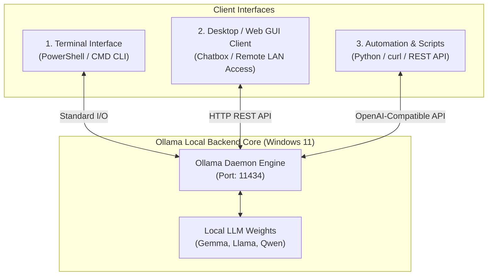
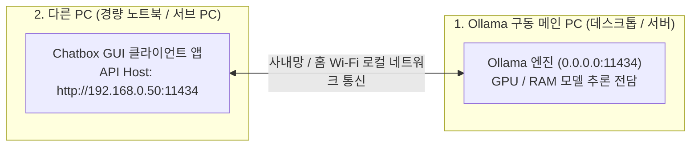

> **Author**: CK notes  
> **Environment**: Windows 11 (Standard business laptop)

> 📌 **Local LLM on My PC: Ollama Practical Series**
> 
> - **[Part 1. What is Ollama, a Local AI Running Free on My PC? (Concepts & Features)](../ollama-01-local-llm-intro/)**
> - **[Part 2. Windows 11 Ollama Installation & First Model Setup Guide](../ollama-02-windows-install-guide/)**
> - **[Current Post] [Part 3. Ollama Practical Applications: Terminal Chat, WebUI, and REST API](./)**

---

In Parts 1 and 2, we covered the architectural advantages of local LLMs in air-gapped environments and walked through installing Ollama on Windows 11 to run lightweight models in the terminal.

This final part focuses on practical integrations for daily engineering workflows.

We explore CLI management commands and shortcuts, setting up a desktop GUI client (Chatbox), configuring network bindings (`OLLAMA_HOST`) for remote access from secondary laptops, and integrating the engine into automation scripts via Python and REST APIs.

---

## 1. Local AI Integration Architecture

Ollama operates not merely as a terminal utility, but as a local **REST API daemon (`http://localhost:11434`)**. This architecture allows straightforward integration across multiple client interfaces:



---

## 2. Key terminal commands & tips for CLI power users

These are practical commands that efficiently manage models and improve conversation quality in a terminal (PowerShell) environment.

### 📋 Model life cycle management commands (`ollama list` & `ollama rm`)


```powershell
# 1. 로컬에 다운로드된 모델 목록 및 용량 확인
ollama list

# 2. 현재 메모리(VRAM/RAM)에 상주하여 구동 중인 모델 확인
ollama ps

# 3. 모델을 즉시 실행하지 않고 백그라운드로 다운로드만 받아두기
ollama pull llama3.2:3b

# 4. 안 쓰는 모델을 삭제하여 디스크 용량 확보하기
ollama rm gemma2:2b
```

### 💡 Useful shortcut commands inside the interactive prompt (`>>>`)

When you enter conversational mode with `ollama run <model name>`, you can control the session with the slash (`/`) command in the prompt window:

* **`/?`** or **`/help`**: Check the list of available shortcut commands.
* **`/show info`**: Check parameter size, context length, and architecture details of the current local model.
* **`/clear`**: Clear the previous conversation context (history) and start with a new topic.
* **`/set system "..."`**: Assign a specific role (persona) to AI
  ```text
  >>> /set system "너는 16년 차 시니어 리눅스 시스템 엔지니어 사수야. 모든 답변은 실무 위주 쉘 스크립트와 명령어 예시로 간결하게 설명해."
  ```
* **`/save <my_model_name>`**: Permanently save the system prompts you set and create your own custom AI model!
  ```text
  >>> /save my-linux-mentor
  ```
*(You can then immediately call your dedicated shooter with `ollama run my-linux-mentor` in the terminal)*
* **`/bye`**: End conversation and return to shell


---

## 3. As convenient as ChatGPT! Integrating GUI client (Chatbox)

The terminal black screen (CLI) is light and fast, but a graphic screen operated with a mouse is much more convenient for viewing long source code or classifying and managing previous conversation history.

The most recommended free tool for regular Windows 11 users is **`Chatbox`**. Integrates in just one minute with a single Windows-specific app installation file, without complicated Docker settings.


### 🛠️ How to set up and connect Chatbox in 1 minute

1. **Chatbox Download**: Download the **`Download for Windows`** installation file from the official website ([https://chatboxai.app/](https://chatboxai.app/)) and install it.
2. **Open the settings window**: After running the Chatbox, click the **[Settings]** icon in the bottom left.
3. **Select AI model provider**:
   * **Model Provider**: Select **`Ollama`**
   * **API Host**: Maintain the default value of `http://localhost:11434` (however, when connecting from another PC, refer to the tips below)
   * **Model**: Select the local model you have installed (e.g. `gemma2:2b`, `llama3.2:3b`, etc.)


4. **Start a conversation**: Now you can conveniently enjoy code highlighting, one-click code copy, Markdown table rendering, and conversation history saving features in the exact same beautiful UI as ChatGPT, all for free!

---

## 4. 💡 Special tip: How to use Ollama on one PC and connect to it from “another PC”!

> *"I work on a light sub-laptop in the living room or conference room. Is it not possible to remotely connect to Ollama on the main PC in my room (or a high-performance in-house server) and use it?"*

**Of course you can, and that's one of Ollama's strongest appeals!**

Heavy AI model calculations are handled by the high-performance main PC, and on a light laptop (another PC) with a low battery, you can conveniently ask questions and receive answers** remotely by simply turning on Chatbox.



### 🛠️ Super simple 2-step setup method for connecting to another PC

#### Step 1: Allow external access on the main PC where Ollama is installed
By default, Ollama is locked down to only receive requests from itself (`127.0.0.1`) for security reasons. Open an environment variable to allow access from other PCs on your corporate or home Wi-Fi network:

1. `Win + R` ➔ Enter `sysdm.cpl` (System Properties) ➔ Click **[Advanced] ➔ [Environment Variables]**
2. Click [New]:
   * **Variable Name**: **`OLLAMA_HOST`**
   * **Variable value**: **`0.0.0.0`** (All local IP connections allowed)
3. Right-click the Ollama icon in the taskbar system tray, quit with **`Quit Ollama`**, and run it again. (If the Windows Firewall notification window appears, click ‘Allow access’)
4. Check the internal IP address of your main PC (type `ipconfig` in PowerShell ➔ e.g. `192.168.0.50`).

#### Step 2: Just change the address in the Chatbox on another PC (sub-laptop)!
1. There is absolutely no need to install Ollama or a heavy model on a lightweight sub-notebook (another PC). **Install only the Chatbox app**.
2. In the Chatbox settings window, enter the **API Host** address as **`http://192.168.0.50:11434`** (IP of the main PC) instead of `http://localhost:11434`.
3. Now, on your sub-laptop, you can freely connect to the powerful AI engine of your main PC remotely and chat like ChatGPT, without fan noise or battery consumption!


---

## 5. Connect AI to my automation script (API & Python)

Another powerful weapon of Ollama is that it can be used as an ‘intelligent module’ in my business automation pipeline by linking with programming languages.

### ① Directly call API with `curl` in Windows PowerShell

You can immediately receive a JSON response in one line from a Windows terminal without a separate development environment:

```powershell
curl.exe http://localhost:11434/api/generate -d '{
  "model": "gemma2:2b",
  "prompt": "리눅스 디스크 용량 확인 명령어만 한 줄로 알려줘",
  "stream": false
}'
```

### ② Integrate with the Python official library (only 5 lines of code)

You can create a chatbot very easily by installing the Ollama dedicated package in a Python environment:

```bash
pip install ollama
```

```python
import ollama

# Call local Ollama model
response = ollama.chat(
    model='gemma2:2b',
    messages=[
        {'role': 'system', 'content': 'You are an infrastructure engineering assistant.'},
        {'role': 'user', 'content': 'Provide an Nginx reverse proxy configuration example.'}
    ]
)

# Print response
print(response['message']['content'])
```

### ③ OpenAI-Compatible API Endpoint (`/v1`)
Ollama provides built-in compatibility with the OpenAI API specification (`http://localhost:11434/v1`).  
Existing scripts or IDE extensions (such as Continue for VS Code) can point to `http://localhost:11434/v1` to switch to local models seamlessly without incurring cloud API costs.

---

## 6. Practical Field Engineering Scenarios

Here are three common patterns for leveraging local LLMs during infrastructure operations:

### 🎯 Scenario 1: Parsing Confidential Error Logs
When troubleshooting in a client's data center, pasting logs containing internal IP addresses or system parameters into external cloud AI services violates security policies. Feeding the raw log snippet directly to local Ollama with a prompt like *"Analyze the root cause of the fatal error in this log and suggest remediation commands"* yields structured troubleshooting guidance within seconds without data leaving the machine.

### 🎯 Scenario 2: Generating Automation Scripts
* "Write a PowerShell PowerCLI script to retrieve uptime and CPU utilization for VMware ESXi hosts."
* "Create a Bash script that locates log files older than 30 days, compresses them with gzip, and moves them to a backup archive directory."  
Describing the intended logic produces syntactically correct boilerplate scripts ready for field testing.

### 🎯 Scenario 3: Air-Gapped Technical Reference
When working inside isolated server rooms without internet access, local models serve as an immediate technical reference for unfamiliar regex syntax, switch VLAN trunk configurations, or Linux kernel parameter definitions (`sysctl.conf`).

---

## 7. Summary: Concluding the 3-Part Ollama Series

Across this three-part series, we explored deploying and leveraging the open-source Ollama engine on local workstations:

1. **[Part 1. Concepts and Features]**: Data privacy, air-gap utility, and why compact 2B–3B parameter models fit standard business laptops.
2. **[Part 2. Windows 11 Installation & Setup]**: Step-by-step installer deployment, model pulling, and interactive CLI verification.
3. **[Part 3. Practical Applications]**: CLI management, Chatbox GUI integration, remote access configuration, and Python/REST API automation.

Local LLMs provide infrastructure engineers with a secure, highly responsive copilot that functions independently of external internet access. Integrating these tools into your daily workflow enhances productivity while maintaining compliance with strict security requirements.

---

### 🔗 Series Navigation

| Previous Step | Next Step |
| :---: | :---: |
| **[⬅️ Part 2. Windows 11 Ollama Installation & Setup](../ollama-02-windows-install-guide/)** | **Series Complete** |