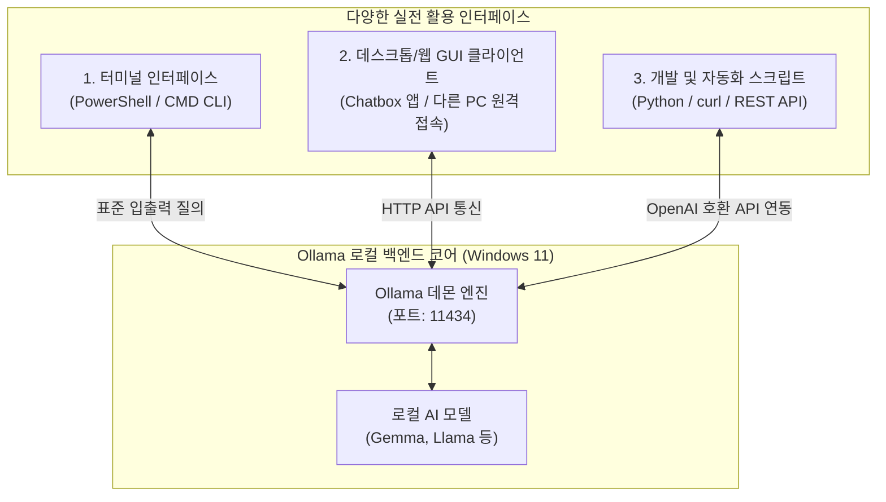
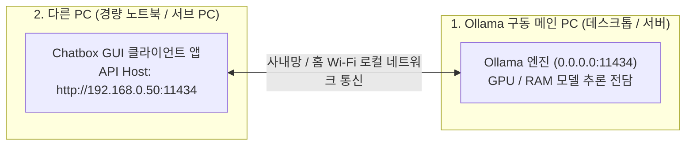

> **作成者**: 15年目のITフィールドエンジニア
> **環境**：Windows 11（一般業務用ノートパソコンベース）

> 📌 **私のPCで駆動するローカルLLM：Ollama本番連載目次**
> 
> - **[1編。私のPCから無料で回すローカルAI、Ollamaとは何ですか？ (概念と特徴)](../ollama-01-local-llm-intro/)**
> - **[2編。 Windows 11環境Ollamaのインストールと初モデルのダウンロード＆ドライブガイド](../ollama-02-windows-install-guide/)**
> - **[現在の記事] [3編。 Ollamaの実践活用法：CLIの高度なヒントからWebUIとAPIの連携まで]（./）**

---

こんにちは！ 15年目のITフィールドエンジニアです。

[1編]でローカルLLMの必要性とモデル選択基準をとり、[2編]でWindows 11ノートパソコンにOllamaを直接インストールして初めて軽量モデルを駆動してみました。

最後の3編では、**「設置したローカルAIを実務エンジニアリング業務でどのように200％活用するのか？」**の実践ガイドを取り上げます。

ターミナルショートカットとモデル管理の高度な命令から、**ChatGPTのようなきれいなWebブラウザチャットウィンドウ(Chatbox)をつける方法**、**私のメインPCにOllamaを置き、他の軽いノートパソコンからリモートで接続して使うハチチップ**、そして**PythonとREST APIを利用して自分の仕事自動化スクリプトにAI頭脳を接続する総まとめです。

---

## 1. ローカルAI実践活用アーキテクチャ

Ollamaは単純なターミナルツールではなく、バックグラウンドで強力な** REST APIサーバー（ `http://localhost：11434`）**として動作します。したがって、以下のようにさまざまなインターフェースと簡単に組み合わせて拡張できます。



---

## 2. CLIパワーユーザーのためのターミナルコアコマンド＆ヒント

ターミナル（PowerShell）環境でモデルを効率的に管理し、会話の品質を向上させる実践的な命令です。

### 📋 モデルライフサイクル管理命令(`ollama list` & `ollama rm`)


```powershell
# 1. 로컬에 다운로드된 모델 목록 및 용량 확인
ollama list

# 2. 현재 메모리(VRAM/RAM)에 상주하여 구동 중인 모델 확인
ollama ps

# 3. 모델을 즉시 실행하지 않고 백그라운드로 다운로드만 받아두기
ollama pull llama3.2:3b

# 4. 안 쓰는 모델을 삭제하여 디스크 용량 확보하기
ollama rm gemma2:2b
```

### 💡インタラクティブプロンプト（`>>>`）内部便利な短縮命令

`ollama run <モデル名>`で会話モードに入ると、プロンプトウィンドウでスラッシュ（`/`）コマンドでセッションを制御できます。

* **`/?`** または **`/help`**: 利用可能な短縮命令のリストを確認する
* **`/show info`**: 現在のローカルモデルのパラメータサイズ、コンテキスト長、アーキテクチャ詳細の確認
* **`/clear`**: 前の会話コンテキスト（履歴）をきれいに空にし、新しいトピックから始める
* **`/set system "..."`**: AIに特定の役割（ペルソナ）を与える
  ```text
  >>> /set system "너는 15년 차 시니어 리눅스 시스템 엔지니어 사수야. 모든 답변은 실무 위주 쉘 스크립트와 명령어 예시로 간결하게 설명해."
  ```
* **`/save <独自の_モデル名> `**：私が設定したシステムプロンプトを永久に保存し、独自のカスタムAIモデルにしよう！
  ```text
  >>> /save my-linux-mentor
  ```
*(以後ターミナルから`ollama run my-linux-mentor`ですぐに私の専任射手呼び出し可能)*
* **`/bye`**: 会話の終了とシェルの復帰


---

## 3. ChatGPTのように楽に！ GUIクライアント（Chatbox）を連携する

ターミナルブラックスクリーン（CLI）は軽くて高速ですが、長いソースコードを見たり、以前の会話履歴を分類して管理したりするには、マウスで操作するグラフィック画面がはるかに便利です。

一般的なWindows 11ユーザーに最もおすすめの無料ツールは** `Chatbox`**です。複雑なDocker設定なしでWindows用の専用アプリインストールファイルを1分で1分で連動します。


### 🛠️ Chatbox 1分の設定と連動方法

1. **Chatboxのダウンロード**：公式ウェブサイト（[https://chatboxai.app/]（https://chatboxai.app/））から** `Download for Windows`**インストールファイルを入手してインストールします。
2. **設定ウィンドウを開く**: Chatboxを実行した後、左下の**[設定]**アイコンをクリックします。
3. **AIモデルプロバイダの選択**：
   * **Model Provider**: **`Ollama`** 選択
   * **API Host**: デフォルトの `http://localhost:11434` 保持 (ただし、他のパソコンから接続時は以下のハチチップを参照)
   * **Model**：私がインストールしたローカルモデルの選択（例： `gemma2：2b`、 `llama3.2：3b`など）


4. **会話を開始**: ChatGPTとまったく同じような美しさのUIで、コードハイライト、ワンクリックコードのコピー、マークダウンテーブルのレンダリング、会話履歴の保存を無料で便利に楽しむことができます！

---

## ４．

> *「リビングルームや会議室で軽いサブノートパソコンで作業していますが、私の部屋のメインPC（または社内の高性能サーバー）にあるOllamaをリモートで接続して使うことはできませんか？」*

**当然可能で、これがオラマの最も強力な魅力の一つです！**

重いAIモデル演算は性能の良いメインPCが専担し、バッテリーの少ない軽いノートパソコン（他のPC）では**Chatboxだけをオンにして遠隔で快適に質問して回答**を受けることができます。



### 🛠️他のPC接続超簡単2段階設定法

#### ステップ1：OllamaがインストールされているメインPCから外部接続を許可する
デフォルトでは、Ollamaはセキュリティのために自分自身（「127.0.0.1」）からの要求のみを受け取るようにロックされています。社内ネットワークやホームWi-Fiネットワークの他のPCからもアクセスできるように環境変数を開きます。

1. `Win+R` ➔ `sysdm.cpl` 入力(システムプロパティ) ➔ **[詳細] ➔ [環境変数]** クリック
2. 「新規」をクリック:
   * **変数名**：** `OLLAMA_HOST`**
   * **変数値**：** `0.0.0.0`**（すべてのローカルIP接続を許可）
3. タスクバーのシステムトレイでOllamaアイコンを右クリックし、**`Quit Ollama`**で終了してもう一度実行します。 （Windowsファイアウォール通知ウィンドウが表示されたら「アクセスを許可」をクリック）
4. メインPCの内部IPアドレスを確認してください（PowerShellで `ipconfig`を入力➔例： `192.168.0.50`）。

#### ステップ2：他のPC（サブノートブック）のChatboxでアドレスだけを変更してください！
1. 軽いサブノートパソコン（他のPC）にはOllamaや重いモデルを敷く必要は全くありません。 **Chatboxアプリのみをインストール**します。
2. Chatbox設定ウィンドウで、** API Host **アドレスを `http://localhost:11434` ではなく ** `http://192.168.0.50:11434`** (メイン PC の IP) として入力します。
3. これで、サブノートブックでは、ファンの騒音やバッテリーの消費なしに、メインPCのパワフルなAIエンジンをリモートで自由に接続することで、ChatGPTのように会話することができます！


---

## 5. 私の自動化スクリプトにAIを接続する（API＆Python）

Ollamaのもう一つの強力な武器は、プログラミング言語と連動して**私の仕事の自動化パイプラインの「インテリジェントモジュール」**として書くことができるということです。

### ①Windows PowerShellから `curl`でAPIを直接呼び出す

独立した開発環境なしでWindowsターミナルから1行でJSONレスポンスをすぐに受け取ることができます。

```powershell
curl.exe http://localhost:11434/api/generate -d '{
  "model": "gemma2:2b",
  "prompt": "리눅스 디스크 용량 확인 명령어만 한 줄로 알려줘",
  "stream": false
}'
```

### ②Python公式ライブラリと連動する（たった5行コード）

Python環境でOllama専用パッケージをインストールすると、非常に簡単にチャットボットを作成できます。

```bash
pip install ollama
```

```python
import ollama

# 로컬 Ollama 모델 호출
response = ollama.chat(
    model='gemma2:2b',
    messages=[
        {'role': 'system', 'content': '너는 인프라 엔지니어 조수야.'},
        {'role': 'user', 'content': 'Nginx 기본 리버스 프록시 설정 예제 코드 작성해줘'}
    ]
)

# 답변 출력
print(response['message']['content'])
```

### ③OpenAI互換APIエンドポイントサポート（`/v1`）
Ollamaは独自に**OpenAI API準拠仕様（「http://localhost：11434/v1」）**を提供しています。
したがって、既存のChatGPT APIベースで作成されたLangChainコードやVS CodeのAIコーディングアシスタント拡張機能（Continueなど）で**エンドポイントURLのみを「http://localhost：11434/v1」に変更**すると、課金を心配せずにローカルAIに即座に切り替えられます！

---

## 6. 15年目のエンジニアのローカルLLM実務活用シナリオ3つ

実際のフィールドエンジニアリング現場で私が最も有用に使っている3つの活用パターンです。

### 🎯シナリオ1：機密エラーログ解析と原因分析
お客様のコンピュータ室で障害が発生した場合、サーバー内部IPとアカウント情報を含むシステムダンプログを外部AIに貼り付けると大変です。私のラップトップのOllamaにログの塊を丸ごと入れて*"このエラーログでFatalエラーの原因と解決命令を分析してください"*と質問すると、**データ漏洩心配0%状態で10秒で分析レポート**を得ることができます。

### 🎯シナリオ2：複雑なインフラストラクチャ自動化スクリプトの作成
* 「VMware ESXiホストのアップタイムとCPU使用率を取得するPowerShell PowerCLIスクリプトを絞り込む」
* 「特定のディレクトリから30日以上経過したログファイルを見つけてgzipで圧縮した後、バックアップディレクトリに移動させるBashスクリプトを書いてください」
頭の中で構想したロジックを言葉で説明するとすぐに文法エラーのない完成型スクリプトを抜き出します。

### 🎯シナリオ3：エアギャップオンサイトオフライン技術百科事典
外部インターネットがブロックされたデータセンターラックの背後で作業するときは、覚えていない正規表現（Regex）文法、CiscoスイッチVLANトランク設定コマンド、Linuxカーネルパラメータ（ `sysctl.conf`）の意味を即座に尋ねて解決できます。

---

## 7. 結論: Ollama 三部作シリーズを終えて

これまでに合計3本の連載を通じて**私のPCで安全かつ自由に駆動するローカルAI、Ollama**のすべてを見てきました：

1. **[1編。概念と特徴]**：データセキュリティ、無制限の無料、閉鎖ネットワーク（Air-gap）の価値と一般的なラップトップ用の軽量モデル（2B〜3B）の選択理由
2. **[2編。 Windows 11のインストールとドライブ]**：第13章のキャプチャで見るワンクリックインストール、モデルダウンロード、ターミナルチャット
3. **[3編。実践活用法]**: CLI パワーチップ、Chatbox WebUI 連動、他の PC リモートアクセスハニーチップ、Python/REST API オートメーションおよび実務シナリオ

ローカルLLMは、もはやAI研究者だけの専有物ではありません。 **私が毎日持っているWindows 11ノートパソコンを1台しか持っていない場合は、いつでもどこでもインターネットの有無にかかわらず私を助ける強力な人工知能エンジニアリングパートナー**を置くことができます。

皆さんもぜひ直接設置して自分だけのプライベートAI秘書を作ってみることを強くお勧めします！

### 🔗連載シリーズショートカット

| 前のステップ | 次のステップ |
| :---: | :---: |
| **[⬅️ 2編。 Windows 11 Ollama インストール & モデル駆動ガイド](../ollama-02-windows-install-guide/)** | **シリーズ完結🎉** |

---
Ollamaの活用中に詰まった部分や、さらに知りたい自動化のヒントがある場合は、いつでもコメントしてください！