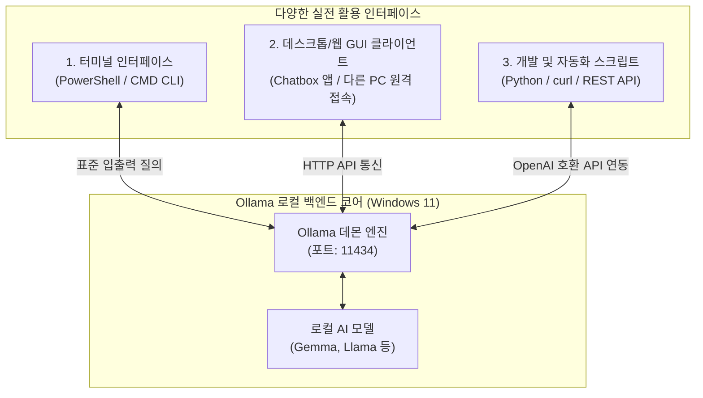
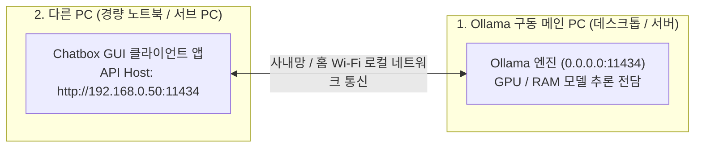

> **작성자**: 15년 차 IT 필드 엔지니어  
> **환경**: Windows 11 (일반 업무용 노트북 기준)

> 📌 **내 PC에서 구동하는 로컬 LLM: Ollama 실전 연재 목차**
> 
> - **[1편. 내 PC에서 무료로 돌리는 로컬 AI, Ollama란 무엇인가? (개념 및 특징)](../ollama-01-local-llm-intro/)**
> - **[2편. Windows 11 환경 Ollama 설치 및 첫 모델 다운로드 & 구동 가이드](../ollama-02-windows-install-guide/)**
> - **[현재글] [3편. Ollama 실전 활용법: CLI 고급 팁부터 WebUI 및 API 연동까지](./)**

---

안녕하세요! 15년 차 IT 필드 엔지니어입니다.

[1편]에서 로컬 LLM의 필요성과 모델 선택 기준을 잡고, [2편]에서 Windows 11 노트북에 Ollama를 직접 설치하여 첫 경량 모델을 구동해 보았습니다.

이제 마지막 3편에서는 **"설치한 로컬 AI를 실무 엔지니어링 업무에서 어떻게 200% 활용할 것인가?"**에 대한 실전 가이드를 다룹니다.

터미널 단축키와 모델 관리 고급 명령어부터, **ChatGPT처럼 예쁜 웹 브라우저 채팅창(Chatbox)을 붙이는 방법**, **내 메인 PC에 Ollama를 두고 다른 가벼운 노트북에서 원격으로 접속해 쓰는 꿀팁**, 그리고 **Python과 REST API를 이용해 내 업무 자동화 스크립트에 AI 두뇌를 연결하는 노하우**까지 실제 화면 캡처와 함께 알기 쉽게 총정리해 드립니다.

---

## 1. 로컬 AI 실전 활용 아키텍처

Ollama는 단순한 터미널 툴이 아니라, 백그라운드에서 강력한 **REST API 서버(`http://localhost:11434`)**로 동작합니다. 따라서 아래와 같이 다양한 인터페이스와 손쉽게 결합하여 확장할 수 있습니다.



---

## 2. CLI 파워 유저를 위한 터미널 핵심 명령어 & 팁

터미널(PowerShell) 환경에서 모델을 효율적으로 관리하고 대화 품질을 높이는 실전 명령어들입니다.

### 📋 모델 라이프사이클 관리 명령어 (`ollama list` & `ollama rm`)


```powershell
# 1. 로컬에 다운로드된 모델 목록 및 용량 확인
ollama list

# 2. 현재 메모리(VRAM/RAM)에 상주하여 구동 중인 모델 확인
ollama ps

# 3. 모델을 즉시 실행하지 않고 백그라운드로 다운로드만 받아두기
ollama pull llama3.2:3b

# 4. 안 쓰는 모델을 삭제하여 디스크 용량 확보하기
ollama rm gemma2:2b
```

### 💡 대화형 프롬프트(`>>>`) 내부 유용한 단축 명령어

`ollama run <모델명>`으로 대화 모드에 진입했을 때, 프롬프트 창에서 슬래시(`/`) 명령어로 세션을 제어할 수 있습니다:

* **`/?`** 또는 **`/help`**: 사용 가능한 단축 명령어 목록 확인
* **`/show info`**: 현재 로컬 모델의 파라미터 크기, 컨텍스트 길이, 아키텍처 상세 확인
* **`/clear`**: 이전 대화 문맥(히스토리)을 깨끗이 비우고 새로운 주제로 시작
* **`/set system "..."`**: AI에게 특정 역할(페르소나) 부여하기
  ```text
  >>> /set system "너는 15년 차 시니어 리눅스 시스템 엔지니어 사수야. 모든 답변은 실무 위주 쉘 스크립트와 명령어 예시로 간결하게 설명해."
  ```
* **`/save <나만의_모델명>`**: 내가 설정한 시스템 프롬프트를 영구 저장하여 나만의 커스텀 AI 모델로 만들기!
  ```text
  >>> /save my-linux-mentor
  ```
  *(이후 터미널에서 `ollama run my-linux-mentor`로 즉시 내 전담 사수 호출 가능)*
* **`/bye`**: 대화 종료 및 쉘 복귀


---

## 3. ChatGPT처럼 편하게! GUI 클라이언트(Chatbox) 연동하기

터미널 검은 화면(CLI)은 가볍고 빠르지만, 긴 소스코드를 보거나 이전 대화 히스토리를 분류해서 관리하기에는 마우스로 조작하는 그래픽 화면이 훨씬 편리합니다.

일반 Windows 11 사용자에게 가장 추천하는 무료 도구는 **`Chatbox`**입니다. 복잡한 도커(Docker) 세팅 없이 윈도우용 전용 앱 설치 파일 하나로 1분 만에 연동됩니다.


### 🛠️ Chatbox 1분 설정 및 연동 방법

1. **Chatbox 다운로드**: 공식 웹사이트([https://chatboxai.app/](https://chatboxai.app/))에서 **`Download for Windows`** 설치 파일을 받아 설치합니다.
2. **설정창 열기**: Chatbox 실행 후 좌측 하단 **[설정(Settings)]** 아이콘을 클릭합니다.
3. **AI 모델 제공자 선택**:
   * **Model Provider**: **`Ollama`** 선택
   * **API Host**: 기본값인 `http://localhost:11434` 유지 (단, 다른 PC에서 접속 시 아래 꿀팁 참고)
   * **Model**: 내가 설치한 로컬 모델 선택 (예: `gemma2:2b`, `llama3.2:3b` 등)


4. **대화 시작**: 이제 ChatGPT와 완전히 똑같은 미려한 UI에서 코드 하이라이팅, 원클릭 코드 복사, 마크다운 표 렌더링, 대화 내역 저장 기능을 무료로 편리하게 누릴 수 있습니다!

---

## 4. 💡 특급 꿀팁: 한 대의 PC에 Ollama를 두고 "다른 PC"에서 연결해 쓰는 방법!

> *"거실이나 회의실에서 가벼운 서브 노트북으로 작업하는데, 내 방의 메인 PC(또는 사내 고성능 서버)에 있는 Ollama를 원격으로 연결해서 쓸 수는 없을까?"*

**당연히 가능하며, 이것이 바로 Ollama의 가장 강력한 매력 중 하나입니다!**

무거운 AI 모델 연산은 성능 좋은 메인 PC가 전담하고, 배터리가 적은 가벼운 노트북(다른 PC)에서는 **Chatbox만 켜서 원격으로 쾌적하게 질문하고 답변**을 받을 수 있습니다.



### 🛠️ 다른 PC 연결 초간단 2단계 설정법

#### 1단계: Ollama가 설치된 메인 PC에서 외부 접속 허용하기
기본적으로 Ollama는 보안을 위해 자기 자신(`127.0.0.1`)의 요청만 받도록 잠겨 있습니다. 사내망이나 홈 Wi-Fi 네트워크의 다른 PC에서도 접속할 수 있도록 환경 변수를 열어줍니다:

1. `Win + R` ➔ `sysdm.cpl` 입력 (시스템 속성) ➔ **[고급] ➔ [환경 변수]** 클릭
2. [새로 만들기] 클릭:
   * **변수 이름**: **`OLLAMA_HOST`**
   * **변수 값**: **`0.0.0.0`** (모든 로컬 IP 접속 허용)
3. 작업표시줄 시스템 트레이에서 Ollama 아이콘을 우클릭하여 **`Quit Ollama`**로 종료 후 다시 실행합니다. (윈도우 방화벽 알림창이 뜨면 '액세스 허용' 클릭)
4. 메인 PC의 내부 IP 주소를 확인합니다 (PowerShell에서 `ipconfig` 입력 ➔ 예: `192.168.0.50`).

#### 2단계: 다른 PC(서브 노트북)의 Chatbox에서 주소만 바꿔주기!
1. 가벼운 서브 노트북(다른 PC)에는 Ollama나 무거운 모델을 깔 필요가 전혀 없습니다. **Chatbox 앱만 설치**합니다.
2. Chatbox 설정창에서 **API Host** 주소를 `http://localhost:11434` 대신 **`http://192.168.0.50:11434`** (메인 PC의 IP)로 입력합니다.
3. 이제 서브 노트북에서는 팬 소음이나 배터리 소모 없이, 메인 PC의 파워풀한 AI 엔진을 원격으로 자유롭게 연결하여 ChatGPT처럼 대화할 수 있습니다!


---

## 5. 내 자동화 스크립트에 AI 연결하기 (API & Python)

Ollama의 또 다른 강력한 무기는 프로그래밍 언어와 연동하여 **내 업무 자동화 파이프라인의 '지능형 모듈'**로 쓸 수 있다는 점입니다.

### ① Windows PowerShell에서 `curl`로 API 직접 호출

별도 개발 환경 없이 윈도우 터미널에서 한 줄로 JSON 응답을 즉시 받아올 수 있습니다:

```powershell
curl.exe http://localhost:11434/api/generate -d '{
  "model": "gemma2:2b",
  "prompt": "리눅스 디스크 용량 확인 명령어만 한 줄로 알려줘",
  "stream": false
}'
```

### ② Python 공식 라이브러리로 연동하기 (단 5줄 코드)

파이썬 환경에서 Ollama 전용 패키지를 설치하면 아주 쉽게 챗봇을 만들 수 있습니다:

```bash
pip install ollama
```

```python
import ollama

# 로컬 Ollama 모델 호출
response = ollama.chat(
    model='gemma2:2b',
    messages=[
        {'role': 'system', 'content': '너는 인프라 엔지니어 조수야.'},
        {'role': 'user', 'content': 'Nginx 기본 리버스 프록시 설정 예제 코드 작성해줘'}
    ]
)

# 답변 출력
print(response['message']['content'])
```

### ③ OpenAI 호환 API 엔드포인트 지원 (`/v1`)
Ollama는 자체적으로 **OpenAI API 호환 규격(`http://localhost:11434/v1`)**을 제공합니다.  
따라서 기존에 ChatGPT API 기반으로 작성된 LangChain 코드나 VS Code의 AI 코딩 어시스턴트 확장 프로그램(Continue 등)에서 **엔드포인트 URL만 `http://localhost:11434/v1`로 변경**하면 과금 걱정 없이 로컬 AI로 즉시 전환됩니다!

---

## 6. 15년 차 엔지니어의 로컬 LLM 실무 활용 시나리오 3가지

실제 필드 엔지니어링 현장에서 제가 가장 유용하게 써먹고 있는 3가지 활용 패턴입니다:

### 🎯 시나리오 1: 기밀 에러 로그 파싱 및 원인 분석
고객사 전산실에서 장애가 발생했을 때, 서버 내부 IP와 계정 정보가 포함된 시스템 덤프 로그를 외부 AI에 붙여넣으면 큰일 납니다. 내 노트북의 Ollama에 로그 덩어리를 통째로 넣고 *"이 에러 로그에서 Fatal 오류의 원인과 해결 명령어를 분석해줘"*라고 질의하면, **데이터 유출 걱정 0% 상태에서 10초 만에 분석 보고서**를 얻을 수 있습니다.

### 🎯 시나리오 2: 복잡한 인프라 자동화 스크립트 작성
* "VMware ESXi 호스트들의 업타임과 CPU 사용률을 가져오는 PowerShell PowerCLI 스크립트 짜줘"
* "특정 디렉토리에서 30일 이상 지난 로그 파일을 찾아 gzip으로 압축 후 백업 디렉토리로 이동시키는 Bash 스크립트 작성해줘"  
머릿속으로 구상한 로직을 말로 설명하면 즉시 문법 오류 없는 완성형 스크립트를 뽑아줍니다.

### 🎯 시나리오 3: 에어갭(Air-gap) 현장 오프라인 기술 백과사전
외부 인터넷이 차단된 데이터센터 랙 뒤에서 작업할 때, 기억이 잘 안 나는 정규표현식(Regex) 문법이나 Cisco 스위치 VLAN 트렁크 설정 명령어, 리눅스 커널 파라미터(`sysctl.conf`)의 의미를 즉석에서 물어보고 해결할 수 있습니다.

---

## 7. 결론: Ollama 3부작 시리즈를 마치며

지금까지 총 3편의 연재를 통해 **내 PC에서 안전하고 자유롭게 구동하는 로컬 AI, Ollama**의 모든 것을 살펴보았습니다:

1. **[1편. 개념 및 특징]**: 데이터 보안, 무제한 무료, 폐쇄망(Air-gap) 가치와 일반 노트북용 경량 모델(2B~3B) 선정 이유
2. **[2편. Windows 11 설치 및 구동]**: 13장 캡처로 보는 원클릭 설치, 모델 다운로드 및 터미널 대화
3. **[3편. 실전 활용법]**: CLI 파워 팁, Chatbox WebUI 연동, 다른 PC 원격 접속 꿀팁, Python/REST API 자동화 및 실무 시나리오

로컬 LLM은 더 이상 AI 연구원들만의 전유물이 아닙니다. **내가 매일 들고 다니는 Windows 11 노트북 한 대만 있으면, 언제 어디서든 인터넷 유무와 상관없이 나를 돕는 강력한 인공지능 엔지니어링 파트너**를 둘 수 있습니다.

여러분도 꼭 직접 설치해서 나만의 프라이빗 AI 비서를 만들어 보시길 강력히 추천합니다!

### 🔗 연재 시리즈 바로가기

| 이전 단계 | 다음 단계 |
| :---: | :---: |
| **[⬅️ 2편. Windows 11 Ollama 설치 & 모델 구동 가이드](../ollama-02-windows-install-guide/)** | **시리즈 완결 🎉** |

---
Ollama 활용 중 막히는 부분이나 추가로 알고 싶은 자동화 팁이 있다면 언제든 댓글로 남겨주세요!