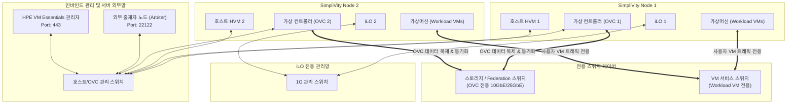

> **Author**: CK Log
> **Baseline document**: HPE SimpliVity 6.2.0 for HPE Morpheus VM Essentials Software Guide (sd00006914en_us)

---

> 📌 **HPE SimpliVity 6.2.0 (HVM) Practical Deployment Series Table of Contents**
> 
> - **[Current post] [PreStep. Pre-Installation Preparation & 2-Node Network Design Guide](./)**
> - **[Step 1. Management server BaseOS HVM 24.04 & NTP/DNS/NFS configuration](../simplivity-01-baseos-infra-setup/)**
> - **[Step 2. Install management server VME Manager VM & Arbiter VM](../simplivity-02-vme-mgr-arbiter/)**
> - **[Step 3. SimpliVity Node Firmware Update & Initial Setup](../simplivity-03-node-initial-setup/)**
> - **[Step 4. VM Essentials Manager-based HVM Cluster Creation & OVC Deployment](../simplivity-04-hvm-cluster-ovc-deploy/)**

---

Hello! I am a field engineer who has been in the field for 15 years, building servers, storage, and HCI in numerous data centers and computer rooms.

Whenever I go to the HPE SimpliVity work site, there is something I always emphasize to my junior engineers.
**"90% of the success of an HCI deployment depends on how thoroughly the engineer organizes the network IP sheet before going to the site."**

If you don't prepare properly in advance, you often end up working all night when you arrive at the client's site because IPs are duplicated, VLANs aren't open, and arbiter communication isn't working. In this post, we will very easily summarize the essential information and network design diagrams** that you must keep when building a 2-node cluster based on **HPE SimpliVity 6.2.0 (VM Essentials target)**.

---

## 1. 5-minute summary of key terms that even beginners can understand

When you look at technical documentation, there are a lot of English abbreviations. I'll explain it in an easy way, so just remember this!

* **HCI (Hyper-Converged Infrastructure)**: It is an **integrated infrastructure** created by cramming the existing complex configuration of ‘server + SAN storage + SAN switch’ into 1 or 2 servers.
* **OVC (OmniStack Virtual Controller)**: It is a **'brain virtual machine'** that floats one on each SimpliVity node. Dedicated to real-time data deduplication, compression, backup and storage processing.
* **Arbiter**: In a two-node configuration, when one node dies, it is a lightweight program that acts as a judge and determines “who is the truly alive node?” (Split-Brain Prevention)
* **Federation**: An inter-node communication network** in which OVCs of multiple SimpliVity nodes are tightly connected to each other and operate as a single storage pool.
* **HPE VM Essentials (Morpheus)**: A **next-generation management platform** that provides integrated management of SimpliVity virtualization resources in one place.

---

## 2. Two-node cluster network configuration diagram (exact topology)

When configuring a two-node configuration, it is key to accurately separate and understand network traffic flows.

### 💡 Network Flow (Mermaid Diagram)

---

## 3. Checklist of required information to be collected in advance (IP Allocation Sheet)

Before going to the site, you must receive a **static IP** in advance by providing the table below to the customer's IT manager. **Use of DHCP is absolutely prohibited**!

### 📋 [Based on 2 nodes] Required IP allocation list

| Category | Equipment/Role | quantity | Required specifications and network separation Remarks |
| :--- | :--- | :---: | :--- |
| **iLO Management Network** | iLO remote management IP | 2 | **Physically independent isolation**, dedicated to server hardware control |
| **Inbind Management Network** | HVM Host IP | 2 | For managing Node 1 and Node 2 hosts |
| | OVC Mgmt IP | 2 | For Node 1, Node 2 OVC management |
| | External Arbiter IP | 1 | **SimpliVity External** Physical/Virtual Server IP (Port 22122) |
| | VM Essentials Manager IP | 1 | Virtualization integrated management appliance (Port 443) |
| **Storage/Federation Network** | OVC Storage & Federation IP | 2 to 4 | **OVC only!** (Workload VM not accessible, 10G/25G required) |
| **VM Service Network** | Workload VM IP Band | Customized for customer | **User virtual machine dedicated network** (completely separate from storage network) |
| **Infrastructure Services** | Gateway/Netmask | 1 set | Subnet mask and gateway for each subnet |
| | DNS/NTP IP | 1-2 | **Time synchronization (NTP) required!** (If the time is different, OVC will be downloaded) |

---

## 4. VLAN separation & port opening guide (engineer key points)

### 1) Network separation principle
1. **iLO OOB management network**: Connects to OOB (Out of Band) dedicated ports and switches that are physically separate from the general server management network.
2. **Management VLAN (Inbound)**: Management communication network between Host, OVC Mgmt, Arbiter, and VM Essentials.
3. **Storage / Federation VLAN (OVC only)**: **Workload virtual machines never use this storage network directly.** It is only used for data deduplication/replication transfer between OVC nodes and ESXi internal NFS connection, and **10GbE or higher high-speed switch** and **MTU 9000 (Jumbo Frame)** settings are required.
4. **VM Traffic VLAN (virtual machine only)**: This is a dedicated service communication network for business workload virtual machines.

### 2) Firewall (Port) open check
* **TCP 22122**: Health check heartbeat port between OVC and Arbiter. If blocked, the two-node quorum is broken.
* **TCP 443 (HTTPS)**: Required port for the VM Essentials appliance to control ESXi hosts and OVC.
* **UDP 123 (NTP)**: If the times of all nodes and OVC are different by even 1 second, data consistency will be problematic.

---

## 5. Practical tips from an engineer with 15 years of experience (Troubleshooting & Pitfalls)

> ⚠️ **Top 3 most common mistakes made in the field**
> 
> 1. **When there is no distinction between the iLO network and the host management network**
>    -> iLO must be connected to a dedicated management network switch through a physical out-of-band port to ensure remote access even in the event of hardware failure.
> 2. **Mistake in binding storage VLAN to Workload virtual machine**
>    -> When general virtual machine (Workload VM) traffic is mixed with the OVC storage/federation network, a serious bottleneck occurs in data replication performance. Be sure to separate it.
> 3. **When installing Arbiter in a SimpliVity virtual machine (VM)**
>    -> Absolutely not! When the power is turned off, the quorum decision cannot be made and the entire system does not turn on. Be sure to install it on a separate external server.

---

## 6. Conclusion and key takeaways

The first step in building an HPE SimpliVity 6.2.0 2-node cluster is **designing correct network traffic separation**.

### 📌 3 key takeaways from today
1. **iLO network independence**: The iLO management network is physically/logically independent from the host/OVC inbound management network.
2. **Storage network is dedicated to OVC**: The Storage/Federation network is dedicated to node replication between OVCs, and general workload virtual machines only use the VM service network.
3. **Arbiter external placement & NTP**: The 2-node quorum arbiter is placed on the external network and verifies NTP time synchronization of all nodes.

---

In the next post, we will come to **[Step 1. [Management Server] BaseOS HVM 24.04 Installation & Essential Infrastructure Services (NTP, DNS, NFS) Configuration Guide](../simplivity-01-baseos-infra-setup/)**.