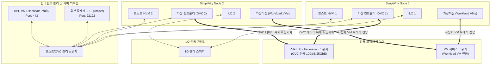

> **作成者**: CK Log
> **リファレンスドキュメント**: HPE SimpliVity 6.2.0 for HPE Morpheus VM Essentials Software Guide (sd00006914en_us)

---

> 📌 **HPE SimpliVity 6.2.0(HVM)実戦構築連載目次**
> 
> - **[現在の記事] [PreStep。プレインストール準備＆2ノードネットワーク設計ガイド]（./）**
> - **[Step 1. 管理サーバー BaseOS HVM 24.04 & NTP/DNS/NFS の構成](../simplivity-01-baseos-infra-setup/)**
> - **[Step 2. 管理サーバー VME Manager VM & Arbiter VM のインストール](../simplivity-02-vme-mgr-arbiter/)**
> - **[Step 3. SimpliVity ノードファームウェアアップデート & Initial Setup](../simplivity-03-node-initial-setup/)**
> - **[Step 4. VM Essentials Manager ベースの HVM Cluster の作成と OVC のデプロイ](../simplivity-04-hvm-cluster-ovc-deploy/)**

---

こんにちは！ 15年間現場を歩き回り、数多くのデータセンターや電算室でサーバー・ストレージ・HCIを構築してきたフィールドエンジニアです。

HPE SimpliVityの作業現場に出るたびに、後輩のエンジニアに常に強調する言葉があります。
**「HCI構築成功の90％は、エンジニアが現場に行く前に、ネットワークIPシートをどれだけ完璧に整理したかにかかっています」**

事前準備がしっかりしていない場合は、お客様のサイトに到着してIP重複し、VLANを開けていて、Arbiter通信できなくて一晩作業することができます。今回の投稿では、**HPE SimpliVity 6.2.0（VM Essentialsターゲット）**ベースの2ノードクラスターを構築する際に、**必要な情報とネットワーク設計図**を簡単にまとめていきます。

---

## 1. 初心者も理解するコア用語5分まとめ

技術文書を見ると、英語の略語があふれます。簡単に解いて説明しますので、これだけ覚えてください！

* **HCI (Hyper-Converged Infrastructure)**: 従来の「サーバー+ SAN ストレージ + SAN スイッチ」 複雑な構成をサーバー 1 ～ 2 台にまとめて作った **統合型インフラストラクチャ**です。
* **OVC (OmniStack Virtual Controller)**: SimpliVity ノードごとに 1 つずつ浮いている **'脳仮想マシン'** です。リアルタイムデータ重複排除、圧縮、バックアップ、およびストレージ処理を担当します。
* **Arbiter (アービター - 仲裁者)**: 2 ノード構成時、ノード 1 つが死んだときに「誰が本当の生きているノードか？」を判定してくれる **裁判官の役割の軽量プログラム** です。 (Split-Brain防止)
* **Federation（連携/連合）**：複数のSimpliVityノードのOVCが互いにしっかりと接続され、1つのストレージプールのように動作する**ノード間通信ネットワーク**。
* **HPE VM Essentials (Morpheus)**: SimpliVity 仮想化リソースを 1 か所で統合管理する **次世代管理プラットフォーム** です。

---

## 2. 2ノードクラスタネットワーク構成図（正確なトポロジ）

2ノードを構成するときは、ネットワークトラフィックフローを正確に分離して理解することが重要です。

### 💡 ネットワークフロー (Mermaid Diagram)

---

## 3. 事前収集必須情報チェックリスト（IP Allocation Sheet）

現場に行く前に、顧客会社の計算担当者に次の表を渡して、**固定IP（Static IP）**を事前に割り当てられている必要があります。 **DHCPの使用は絶対禁物**です！

### 📋[2ノードベース]必須IP割り当てリスト

| 区分 | 機器/役割 | 数量 | 必須仕様とネットワーク分離 備考 |
| :--- | :--- | :---: | :--- |
| **iLO管理ネットワーク** | iLOリモート管理IP | 2個 | **物理独立分離**、サーバーハードウェア制御のみ |
| **インバインド管理ネットワーク** | HVM Host IP | 2個 | Node 1、Node 2 ホスト管理用 |
| | OVC Mgmt IP | 2個 | Node 1、Node 2 OVC管理用 |
| | External Arbiter IP | 1個 | **SimpliVity外部**物理/仮想サーバーIP（Port 22122） |
| | VM Essentials Manager IP | 1個 | 仮想化統合管理アプライアンス (Port 443) |
| **ストレージ/Federationネットワーク** | OVC Storage & Federation IP | 2～4個 | **OVCのみ！**（Workload VMアクセス不可、10G/25G必須） |
| **VMサービスネットワーク** | Workload VM IP 帯域 | 顧客のカスタマイズ | **ユーザー仮想マシン専用ネットワーク**（ストレージネットワークと完全に分離） |
| **インフラサービス** | ゲートウェイ/ネットマスク | 1セット | サブネットごとにサブネットマスクとゲートウェイ |
| | DNS/NTP IP | 1～2個 | **時間同期（NTP）必須！**（時間が異なる場合はOVCダウン） |

---

## 4. VLAN 分離&ポートオープンガイド(エンジニアコアポイント)

### 1) ネットワーク分離の原則
1. **iLO OOB管理ネットワーク**：一般的なサーバー管理ネットワークと物理的に分割されたOOB（Out of Band）専用ポートとスイッチに接続します。
2. **Management VLAN（インバインド）**：Host、OVC Mgmt、Arbiter、およびVM Essentials間の管理ネットワーク。
3. **Storage / Federation VLAN（OVCのみ）**：**Workload仮想マシンはこのストレージネットワークを直接使用しません。**OVC間のノード間のデータの重複排除/複製転送とESXi内部NFS接続専用で、**10GbE以上の高速スイッチ**および**MTU 9000（Jumbo Frame）**設定が必須です。
4. **VM Traffic VLAN (仮想マシンのみ)**: 業務用 Workload 仮想マシンのサービス通信専用ネットワークです。

### 2) ファイアウォール(Port)オープンチェック
* **TCP 22122**：OVCとArbiterの間のヘルスチェックハートビートポート。詰まると、2ノードクォーラムが壊れます。
* **TCP 443 (HTTPS)**: VM Essentials アプライアンスが ESXi ホストと OVC を制御するために必要なポートです。
* **UDP 123（NTP）**：すべてのノードとOVCの時間が1秒でも異なると、データの整合性に問題が発生します。

---

## 5. 15年目のエンジニアの実戦のヒント (Troubleshooting & Pitfalls)

> ⚠️ **現場で最も多くするミス Top 3**
> 
> 1. **iLOネットワークとホスト管理ネットワークを区別しない場合**
>    -> iLOは物理Out-of-Bandポートで専用管理ネットワークスイッチに接続する必要があり、ハードウェア障害が発生した場合でもリモートアクセスが保証されます。
> 2. **Workload仮想マシンにストレージVLANをバインドする間違い**
>    ->一般的な仮想マシン（Workload VM）トラフィックがOVCストレージ/フェデレーションネットワークに混在すると、データ複製のパフォーマンスに重大なボトルネックが発生します。必ず取り外してください。
> 3. **Arbiter を SimpliVity 仮想マシン (VM) 内にインストールする場合**
>    ->絶対にならない！電源を切ると、定足数判定が行われず、システム全体がオンになります。必ず別の外部サーバーにインストールしてください。

---

## 6. 結論と鍵のまとめ

HPE SimpliVity 6.2.0 2ノードクラスタ構築の第一歩は、**正確なネットワークトラフィック分離設計**です。

### 📌今日の主な要約3つ
1. **iLO ネットワーク独立**: iLO 管理ネットワークは、ホスト/OVC インバインド管理ネットワークと物理的/論理的に独立して構成します。
2. **ストレージネットワークはOVCのみ**：Storage / FederationネットワークはOVC間のノード複製専用であり、一般的なWorkload仮想マシンはVMサービスネットワークのみを使用します。
3. **Arbiter 外部配置 & NTP**: 2 ノード クォーラム アービタは、外部ネットワークに配置し、すべてのノードの NTP 時間同期を検証します。

---

次の投稿では、**[Step 1. [管理サーバー] BaseOS HVM 24.04 インストール＆必須インフラストラクチャサービス (NTP, DNS, NFS) 構成ガイド] (../simplivity-01-baseos-infra-setup/)** を参照してください。