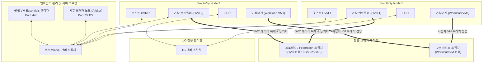

> **작성자**: CK Log  
> **기준 문서**: HPE SimpliVity 6.2.0 for HPE Morpheus VM Essentials Software Guide (sd00006914en_us)

---

> 📌 **HPE SimpliVity 6.2.0 (HVM) 실전 구축 연재 목차**
> 
> - **[현재글] [PreStep. 사전 설치 준비 & 2노드 네트워크 설계 가이드](./)**
> - **[Step 1. 관리서버 BaseOS HVM 24.04 & NTP/DNS/NFS 구성](../simplivity-01-baseos-infra-setup/)**
> - **[Step 2. 관리서버 VME Manager VM & Arbiter VM 설치](../simplivity-02-vme-mgr-arbiter/)**
> - **[Step 3. SimpliVity 노드 펌웨어 업데이트 & Initial Setup](../simplivity-03-node-initial-setup/)**
> - **[Step 4. VM Essentials Manager 기반 HVM Cluster 생성 & OVC 배포](../simplivity-04-hvm-cluster-ovc-deploy/)**

---

안녕하세요! 15년 동안 현장을 누비며 수많은 데이터센터와 전산실에서 서버·스토리지·HCI를 구축해 온 필드 엔지니어입니다.

HPE SimpliVity 작업 현장에 나갈 때마다 후배 엔지니어들에게 항상 강조하는 말이 있습니다.
**"HCI 구축 성공의 90%는 엔지니어가 현장에 가기 전, 네트워크 IP 시트를 얼마나 완벽하게 정리했느냐에 달려있다."**

사전 준비가 제대로 안 되어 있으면 고객사 사이트 도착해서 IP 중복나고, VLAN 안 뚫려 있고, Arbiter 통신 안 돼서 밤샘 작업하기 일쑤입니다. 이번 포스팅에서는 **HPE SimpliVity 6.2.0 (VM Essentials 타겟)** 기반 2노드 클러스터 구축 시 **반드시 챙겨야 할 필수 정보와 네트워크 설계 다이어그램**을 아주 쉽게 정리해 드리겠습니다.

---

## 1. 초보도 이해하는 핵심 용어 5분 정리

기술 문서를 보다 보면 영어 약자가 넘쳐납니다. 쉽게 풀어 설명해 드릴 테니 이것만 기억하세요!

* **HCI (Hyper-Converged Infrastructure)**: 기존의 '서버 + SAN 스토리지 + SAN 스위치' 복잡한 구성을 서버 1~2대에 다 쑤셔 넣어 만든 **통합형 인프라**입니다.
* **OVC (OmniStack Virtual Controller)**: SimpliVity 노드마다 1개씩 떠 있는 **'두뇌 가상머신'**입니다. 실시간 데이터 중복 제거, 압축, 백업 및 스토리지 처리를 전담합니다.
* **Arbiter (아비터 - 중재자)**: 2노드 구성 시, 노드 하나가 죽었을 때 "누가 진짜 살아있는 노드인가?"를 판정해 주는 **재판관 역할의 경량 프로그램**입니다. (Split-Brain 방지)
* **Federation (연동/연합)**: 여러 SimpliVity 노드의 OVC들이 서로 끈끈하게 연결되어 하나의 스토리지 풀처럼 동작하는 **노드 간 통신 망**입니다.
* **HPE VM Essentials (Morpheus)**: SimpliVity 가상화 자원을 한곳에서 통합 관리해 주는 **차세대 관리 플랫폼**입니다.

---

## 2. 2노드 클러스터 네트워크 구성 다이어그램 (정확한 토폴로지)

2노드 구성 시 네트워크 트래픽 흐름을 정확히 분리하여 이해하는 것이 핵심입니다.

### 💡 네트워크 흐름 (Mermaid Diagram)

---

## 3. 사전 수집 필수 정보 체크리스트 (IP Allocation Sheet)

현장에 가기 전, 고객사 전산 담당자에게 아래 표를 전달하여 **고정 IP(Static IP)**를 미리 할당받아야 합니다. **DHCP 사용은 절대 금물**입니다!

### 📋 [2노드 기준] 필수 IP 할당 리스트

| 구분 | 장비/역할 | 수량 | 필수 사양 및 네트워크 분리 비고 |
| :--- | :--- | :---: | :--- |
| **iLO 관리망** | iLO 원격 관리 IP | 2개 | **물리적 독립 분리**, 서버 하드웨어 제어 전용 |
| **인바인드 관리망** | HVM Host IP | 2개 | Node 1, Node 2 호스트 관리용 |
| | OVC Mgmt IP | 2개 | Node 1, Node 2 OVC 관리용 |
| | External Arbiter IP | 1개 | **SimpliVity 외부** 물리/가상 서버 IP (Port 22122) |
| | VM Essentials Manager IP | 1개 | 가상화 통합 관리 어플라이언스 (Port 443) |
| **스토리지/Federation망** | OVC Storage & Federation IP | 2~4개 | **OVC 전용!** (Workload VM 접근 불가, 10G/25G 필수) |
| **VM 서비스망** | Workload VM IP 대역 | 고객사 맞춤 | **사용자 가상머신 전용망** (스토리지 망과 완전히 분리) |
| **인프라 서비스** | Gateway / Netmask | 1세트 | 각 Subnet별 서브넷 마스크 및 게이트웨이 |
| | DNS / NTP IP | 1~2개 | **시간 동기화(NTP) 필수!** (시간 다르면 OVC 다운) |

---

## 4. VLAN 분리 & 포트 오픈 가이드 (엔지니어 핵심 포인트)

### 1) 네트워크 분리 원칙
1. **iLO OOB 관리망**: 일반 서버 관리망과 물리적으로 나뉜 OOB(Out of Band) 전용 포트 및 스위치에 연결합니다.
2. **Management VLAN (인바인드)**: Host, OVC Mgmt, Arbiter, VM Essentials 간 관리 통신망입니다.
3. **Storage / Federation VLAN (OVC 전용)**: **Workload 가상머신은 이 스토리지 망을 절대 직접 사용하지 않습니다.** OVC끼리 노드 간 데이터 중복제거/복제 전송 및 ESXi 내부 NFS 연결 전용이며, **10GbE 이상 고속 스위치** 및 **MTU 9000 (Jumbo Frame)** 설정이 필수입니다.
4. **VM Traffic VLAN (가상머신 전용)**: 업무용 Workload 가상머신들의 서비스 통신 전용망입니다.

### 2) 방화벽(Port) 오픈 체크
* **TCP 22122**: OVC와 Arbiter 사이의 헬스체크 심장소리(Heartbeat) 포트입니다. 막히면 2노드 쿼럼(Quorum)이 깨집니다.
* **TCP 443 (HTTPS)**: VM Essentials 어플라이언스가 ESXi 호스트 및 OVC를 제어하기 위한 필수 포트입니다.
* **UDP 123 (NTP)**: 모든 노드와 OVC의 시간이 1초라도 다르면 데이터 정합성에 문제가 생깁니다.

---

## 5. 15년 차 엔지니어의 실전 팁 (Troubleshooting & Pitfalls)

> ⚠️ **현장에서 가장 많이 하는 실수 Top 3**
> 
> 1. **iLO 망과 호스트 Management 망을 구분하지 않는 경우**  
>    -> iLO는 물리 Out-of-Band 포트로 전용 관리망 스위치에 연결해야 하드웨어 장애 시에도 원격 접근이 보장됩니다.
> 2. **Workload 가상머신에 스토리지 VLAN을 바인딩하는 실수**  
>    -> 일반 가상머신(Workload VM) 트래픽이 OVC 스토리지/Federation 망에 섞이면 데이터 복제 성능에 심각한 병목이 발생합니다. 반드시 분리하세요.
> 3. **Arbiter를 SimpliVity 가상머신(VM) 안에 설치하는 경우**  
>    -> 절대 안 됩니다! 전원 꺼지면 쿼럼 판정을 못 내려서 전체 시스템이 안 켜집니다. 반드시 별도의 외부 서버에 설치하세요.

---

## 6. 결론 및 핵심 요약

HPE SimpliVity 6.2.0 2노드 클러스터 구축의 첫걸음은 **정확한 네트워크 트래픽 분리 설계**입니다.

### 📌 오늘의 핵심 요약 3가지
1. **iLO 네트워크 독립**: iLO 관리망은 호스트/OVC 인바인드 관리망과 물리적/논리적으로 독립 구성합니다.
2. **스토리지망은 OVC 전용**: Storage/Federation 망은 OVC 간 노드 복제 전용이며, 일반 Workload 가상머신은 VM 서비스망만 사용합니다.
3. **Arbiter 외부 배치 & NTP**: 2노드 쿼럼 중재자(Arbiter)는 외부 망에 배치하고, 모든 노드의 NTP 시간 동기화를 검증합니다.

---

다음 포스팅에서는 **[Step 1. [관리서버] BaseOS HVM 24.04 설치 & 필수 인프라 서비스(NTP, DNS, NFS) 구성 가이드](../simplivity-01-baseos-infra-setup/)**로 찾아오겠습니다.