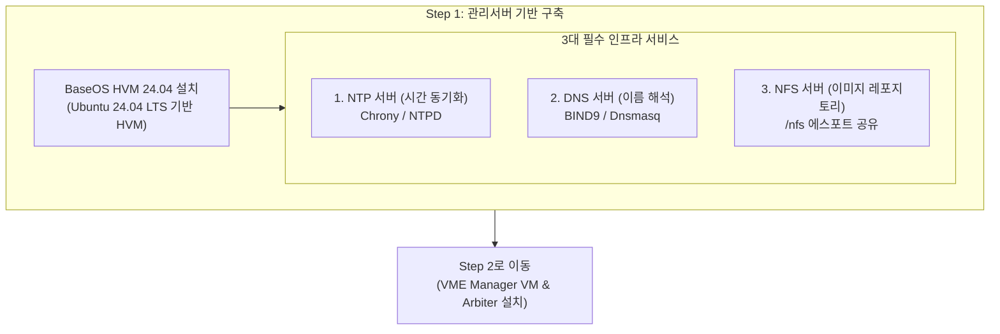
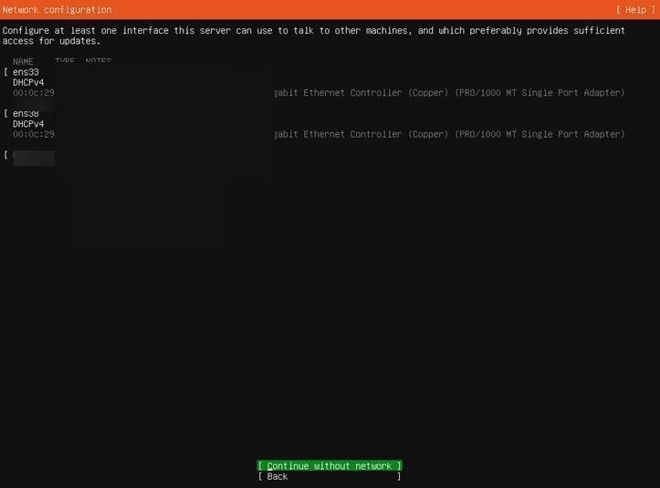
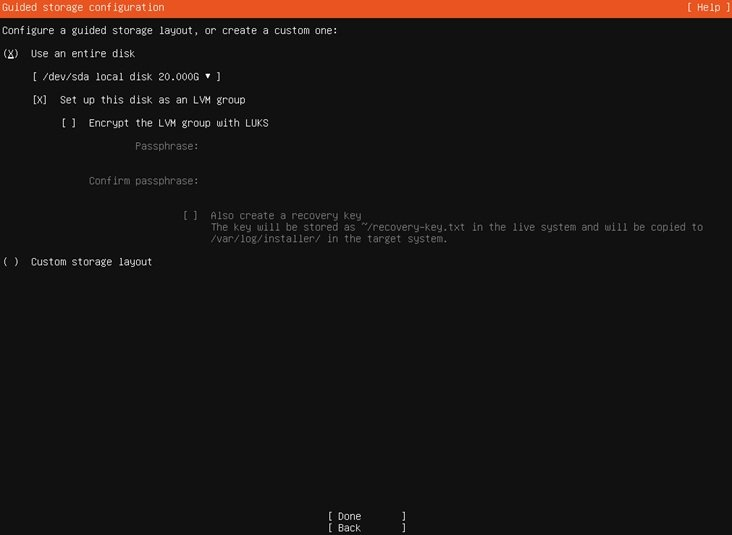

> **Author**: IT field engineer with 15 years of experience
> **Baseline document**: HPE SimpliVity 6.2.0 for HPE Morpheus VM Essentials Software Guide (sd00006914en_us)

> 📌 **HPE SimpliVity 6.2.0 (HVM) Practical Deployment Series Table of Contents**
> 
> - **[PreStep. Pre-Installation Prep & 2-Node Network Design Guide](../simplivity-00-install-prep/)**
> - **[Current post] [Step 1. Management server BaseOS HVM 24.04 & NTP/DNS/NFS configuration](./)**
> - **[Step 2. Install management server VME Manager VM & Arbiter VM](../simplivity-02-vme-mgr-arbiter/)**
> - **[Step 3. SimpliVity Node Firmware Update & Initial Setup](../simplivity-03-node-initial-setup/)**
> - **[Step 4. VM Essentials Manager-based HVM Cluster Creation & OVC Deployment](../simplivity-04-hvm-cluster-ovc-deploy/)**

---

Hello! I am a field engineer who has been in the field for 15 years, building servers, storage, and HCI in numerous data centers and computer rooms.

When building HPE SimpliVity (Morpheus VM Essentials) infrastructure in the field, **the prerequisite task that becomes the central axis of the virtualization environment is 'building a management server base'**.

Many novice engineers try to start with the SimpliVity node right away, but in actual sites, all subsequent steps will stop unless **BaseOS HVM 24.04 is installed on the management server and the three major infrastructure services, NTP, DNS, and NFS** are not installed properly.

In this post, we will provide a detailed summary of **Practical know-how on installing management server BaseOS HVM 24.04 and configuring three major infrastructure services** along with screen captures of actual field construction.

---

## 1. Actual construction process and workflow

This is the complete deployment sequence for HPE SimpliVity 6.2.0 (HVM based) in action in the field. This post covers **the first step above (management server BaseOS & infrastructure services)**.


### 💡 Management server construction traffic flow (Mermaid Diagram)



---

## 2. 5-minute summary of key terms that even beginners can understand

* **BaseOS HVM 24.04**: This is a **base operating system exclusively for management servers** based on Ubuntu (Ubuntu 24.04 LTS) that supports the HPE Morpheus VM Essentials environment.
* **NTP (Network Time Protocol)**: A time synchronization protocol that synchronizes the clocks of all SimpliVity nodes, OVCs, and management VMs to the same **1 millisecond error. (OVC down when time error occurs)
* **DNS (Domain Name System)**: A **name resolution service** that translates IP addresses into human-readable host names.
* **NFS (Network File System)**: A **network file sharing protocol** that shares files, ISO/OVA/QCOW2 images, and backup data over a network.

---

## 3. Management server BaseOS HVM 24.04 actual installation steps (on-site screen capture)

### Step 1: Set up network interface and static IP
When you mount **BaseOS HVM 24.04 ISO** on the management server physical device and boot it, the network configuration window (`Network configuration`) appears.



* **Check Ethernet interface**: Check whether the physical NIC port (`ens33`, `ens38`, etc.) is recognized properly.
* **Manual IP designation (Static IP)**: If DHCP is used in the field, the IP will change when the equipment is rebooted, paralyzing the management network. Select an interface and specify **Subnet, Address, Gateway, Name Servers (DNS)** as static IPs.
* **Bonding configuration (if necessary)**: If network redundancy is required, create an LACP/Active-Backup bonding interface through the `[ Create bond ]` menu.

### Step 2: Storage Layout & LVM Group Settings
After completing the network setup, enter the disk partition stage (`Guided storage configuration`).



* **[X] Use an entire disk**: Select the entire system disk (e.g. `/dev/sda`) for OS installation.
* **[X] Set up this disk as an LVM group**: **Be sure to check the LVM (Logical Volume Manager) group settings**. By configuring it with LVM, you can flexibly extend the partition (LVExtend) in the future when the management server volume capacity is insufficient.
* **LUKS encryption or not**: Unless you have data security requirements, leave `Encrypt the LVM group with LUKS` off to avoid boot delays.

---

## 4. Management server 3 major infrastructure service essential configuration guide

After completing the OS installation and booting, configure the three major services that make the management server the central axis of the infrastructure.

### 1) Configure NTP time synchronization service (most important!)
To ensure data consistency in the SimpliVity cluster, the management server must act as an internal authoritative NTP Master.

```bash
# chrony NTP 서비스 설치 및 활성화
sudo apt-get update && sudo apt-get install -y chrony
sudo systemctl enable --now chrony

# NTP 서비스 동작 및 시간 동기화 상태 확인
chronyc tracking
chronyc sources -v
```

### 2) DNS server settings
* Register FQDN (forward/reverse lookup) records for the management server, HVM host, OVC, Arbiter, and VME Manager.

### 3) NFS service actual settings (`insecure` option required!)
Create an NFS shared directory (`/nfs`) for serving VME Manager VM and OVC template (QCOW2/OVA) images and apply esport options.

```bash
# 1. NFS 서버 패키지 설치 및 /nfs 공유 디렉토리 생성
sudo apt-get install -y nfs-kernel-server
sudo mkdir -p /nfs

# 2. /etc/exports 에스포트 설정 적용 (insecure 옵션 적용)
echo "/nfs *(rw,sync,no_root_squash,insecure)" | sudo tee -a /etc/exports

# 3. 설정 반영 및 NFS 서비스 재시작
sudo exportfs -arv
sudo systemctl restart nfs-kernel-server
```

---

## 5. Practical tips (Troubleshooting) from an engineer with 15 years of experience

> ⚠️ **Top 3 most common mistakes made in the field**
> 
> 1. **NFS `insecure` option missing**
>    -> If you omit the `insecure` option when NFS esporting, a `Permission Denied` or `RPC Access Denied` mount error will occur in VME Manager and OVC deployment scripts that use non-privileged ports above 1024. ** Be sure to include the `insecure` option!**
> 2. **NTP local server setting missing**
>    -> External Internet NTP is not open in a closed network computer room environment. If you do not designate the management server itself as a `local stratum` NTP server, all subsequent nodes will stop deploying due to an NTP synchronization error.
> 3. **Missing DNS reverse (PTR) records**
>    -> SimpliVity OVC and VME Manager perform IP -> Hostname reverse lookup. If there is no PTR record in DNS, a timeout error occurs.

---

## 6. Conclusion and key takeaways

A solid foundation for building HPE SimpliVity 6.2.0 begins with **management server OS (LVM settings) and three major infrastructure services (NTP, DNS, NFS `/nfs` insecure)**.

### 📌 3 key takeaways from today
1. **BaseOS HVM static IP and LVM configuration**: During installation, assign a static IP and select an LVM disk group for partition expansion.
2. **NTP time synchronization required**: Establish a synchronization system so that all infrastructure devices view the management server NTP.
3. **NFS `/nfs` insecure share settings**: `echo "/nfs *(rw,sync,no_root_squash,insecure)" | Prevent mount timeout with the sudo tee -a /etc/exports` command.

---

### 🔗 Go to serial series

| previous steps | next steps |
| :---: | :---: |
| This is the first post | **[Step 2. Install VME Manager & Arbiter VM ➡️](../simplivity-02-vme-mgr-arbiter/)** |

---
If you have any questions, please leave a comment!
