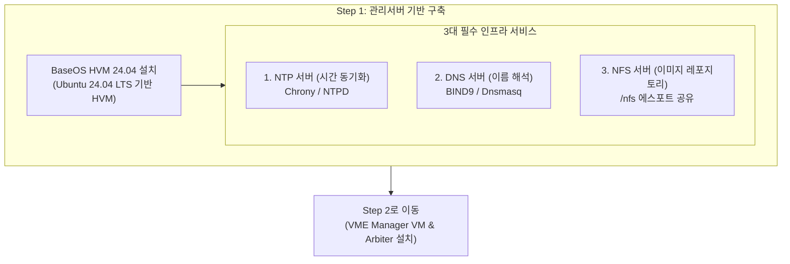

> **作成者**: 15年目のITフィールドエンジニア
> **リファレンスドキュメント**: HPE SimpliVity 6.2.0 for HPE Morpheus VM Essentials Software Guide (sd00006914en_us)

> 📌 **HPE SimpliVity 6.2.0(HVM)実戦構築連載目次**
> 
> - **[PreStep。プレインストールの準備 & 2ノードネットワーク設計ガイド](../simplivity-00-install-prep/)**
> - **[現在の記事] [Step 1. 管理サーバー BaseOS HVM 24.04 & NTP/DNS/NFS 構成](./)**
> - **[Step 2. 管理サーバー VME Manager VM & Arbiter VM のインストール](../simplivity-02-vme-mgr-arbiter/)**
> - **[Step 3. SimpliVity ノードファームウェアアップデート & Initial Setup](../simplivity-03-node-initial-setup/)**
> - **[Step 4. VM Essentials Manager ベースの HVM Cluster の作成と OVC のデプロイ](../simplivity-04-hvm-cluster-ovc-deploy/)**

---

こんにちは！ 15年間現場を歩き回り、数多くのデータセンターや電算室でサーバー・ストレージ・HCIを構築してきたフィールドエンジニアです。

現場でHPE SimpliVity（Morpheus VM Essentials）インフラストラクチャを構築するとき**仮想化環境の中心軸となる先行作業は、まさに「管理サーバー（Management Server）ベースの構築」**です。

多くの初心者のエンジニアがSimpliVityノードからすぐに触れようとしていますが、実際の現場では管理サーバーに**BaseOS HVM 24.04をインストールし、NTP、DNS、NFSの3つのインフラストラクチャサービス**を完全に上げておかないと、以降のステップはすべて停止してしまいます。

今回の投稿では、実際の現場構築画面のキャプチャとともに、**管理サーバーBaseOS HVM 24.04のインストールおよび3大インフラサービス構成実践ノウハウ**を詳細にまとめていきます。

---

## 1.本番構築プロセスとワークフロー

現場で実際に作業する HPE SimpliVity 6.2.0 (HVM ベース) の完全な展開順序です。今回の投稿では、**上の最初のステップ（管理サーバーBaseOS＆インフラストラクチャサービス）**をカバーしています。


### 💡管理サーバー構築トラフィックフロー（Mermaid Diagram）



---

## 2. 初心者も理解するコア用語5分まとめ

* **BaseOS HVM 24.04**：HPE Morpheus VM Essentials環境をサポートするUbuntu 24.04 LTSベースの**管理サーバー専用の基本オペレーティングシステム**。
* **NTP (Network Time Protocol)**: すべての SimpliVity ノード、OVC、管理 VM の時計を **1 millisecond 誤差なしに等しく合わせる時間同期プロトコル** です。 （時間誤差発生時のOVCダウン）
* **DNS (Domain Name System)**: IP アドレスを人間が読みやすいホスト名に変換する **名前解決サービス** です。
* **NFS (Network File System)**: ネットワーク経由でファイルと ISO/OVA/QCOW2 イメージ、バックアップデータを共有する **ネットワークファイル共有プロトコル** です。

---

## 3. 管理サーバ BaseOS HVM 24.04 本番インストール手順（現場画面キャプチャ）

### ステップ1：ネットワークインターフェイスと静的IPを設定する
管理サーバーの物理機器に**BaseOS HVM 24.04 ISO**をマウントして起動すると、ネットワーク設定ウィンドウ（「Network configuration」）が表示されます。


* **イーサネットインターフェイスの確認**：物理NICポート（「ens33」、「ens38」など）が正常に認識されていることを確認します。
* **IP手動指定（Static IP）**：現場でDHCPを使用すると、機器の再起動時にIPが変更され、管理ネットワークが麻痺します。インターフェイスを選択し、**Subnet、Address、Gateway、Name Servers（DNS）**を固定IPとして指定します。
* **Bonding設定（必要）**：ネットワークの冗長性が必要な場合は、[[Create bond]]メニューからLACP / Active-Backupボンディングインターフェイスを作成します。

### ステップ2：ストレージレイアウト＆LVMグループの設定
ネットワーク設定が完了したら、ディスクパーティションステップ（「Guided storage configuration」）に入ります。


* **[X] Use an entire disk**: OS インストール先のシステムディスク (例: `/dev/sda`) を完全に選択します。
* **[X] Set up this disk as an LVM group**: **LVM (Logical Volume Manager) グループ設定を必ずチェック**します。 LVMで構成する必要がある場合は、後で管理サーバーのボリューム容量が不足している場合は、柔軟にパーティションを拡張（LVExtend）できます。
* **LUKS暗号化可否**：データセキュリティ要件がない限り、 `Encrypt the LVM group with LUKS`エントリは無効になり、ブート遅延を防ぎます。

---

## 4. 管理サーバー 3大インフラサービス必須構成ガイド

OSのインストールが完了して起動したら、管理サーバーをインフラストラクチャの中心軸にする3つのサービスを構成します。

### 1) NTP時間同期サービスの設定(最も重要!)
SimpliVityクラスターのデータ整合性のために、管理サーバーは内部authoritative NTP Masterの役割を実行する必要があります。

```bash
# chrony NTP 서비스 설치 및 활성화
sudo apt-get update && sudo apt-get install -y chrony
sudo systemctl enable --now chrony

# NTP 서비스 동작 및 시간 동기화 상태 확인
chronyc tracking
chronyc sources -v
```

### 2) DNSサーバーの設定
* 管理サーバー、HVMホスト、OVC、Arbiter、およびVME ManagerのFQDN（フォワード/リバースルックアップ）レコードを登録します。

### 3) NFSサービスの実稼働設定(`insecure`オプション必須!)
VME Manager VMおよびOVCテンプレート（QCOW2 / OVA）イメージを提供するためのNFS共有ディレクトリ（ `/ nfs`）を作成し、エクスポートオプションを適用します。

```bash
# 1. NFS 서버 패키지 설치 및 /nfs 공유 디렉토리 생성
sudo apt-get install -y nfs-kernel-server
sudo mkdir -p /nfs

# 2. /etc/exports 에스포트 설정 적용 (insecure 옵션 적용)
echo "/nfs *(rw,sync,no_root_squash,insecure)" | sudo tee -a /etc/exports

# 3. 설정 반영 및 NFS 서비스 재시작
sudo exportfs -arv
sudo systemctl restart nfs-kernel-server
```

---

## 5. 15年目のエンジニアの実戦のヒント（Troubleshooting）

> ⚠️ **現場で最も多くするミス Top 3**
> 
> 1. **NFS `insecure` オプションがありません**
>    -> NFS エスポート時に `insecure` オプションを欠落すると、1024 以上の非特権 (Non-privileged) ポートを使用する VME Manager および OVC デプロイスクリプトで `Permission Denied` または `RPC Access Denied` マウントエラーが発生します。 **必ず `insecure`オプションを含めてください！**
> 2. **NTPローカルサーバー設定が見つかりません**
>    ->閉鎖ネットワークコンピュータルームでは、外部インターネットNTPが開いていません。管理サーバー自体を `local stratum` NTPサーバーとして指定しないと、それ以降はすべてのノードがNTP同期エラーとして配布停止されます。
> 3. **DNS リバース（PTR）レコードの欠落**
>    -> SimpliVity OVC および VME Manager は IP -> Hostname リバースルックアップを実行します。 DNSにPTRレコードがないと、タイムアウトエラーが発生します。

---

## 6. 結論と鍵のまとめ

HPE SimpliVity 6.2.0の構築の堅牢な基盤は、**管理サーバーOS（LVM設定）と3つのインフラストラクチャサービス（NTP、DNS、NFS `/ nfs` insecure）**で始まります。

### 📌今日の主な要約3つ
1. **BaseOS HVM固定IPおよびLVM構成**：インストール時に固定IPを割り当て、パーティション拡張用にLVMディスクグループを選択します。
2. **NTP時間同期必須**：すべてのインフラストラクチャ機器が管理サーバーNTPを見るように同期スキームを備えています。
3. **NFS `/nfs` insecure 共有設定**: `echo "/nfs *(rw,sync,no_root_squash,insecure)" | sudo tee -a /etc/exports`コマンドでマウントタイムアウトを防ぎます。

---

### 🔗連載シリーズを移動する

| 前のステップ | 次のステップ |
| :---: | :---: |
| 最初の投稿です | **[Step 2. VME Manager & Arbiter VM のインストール ➡️](../simplivity-02-vme-mgr-arbiter/)** |

---
気になる点はコメントとして残してください！
