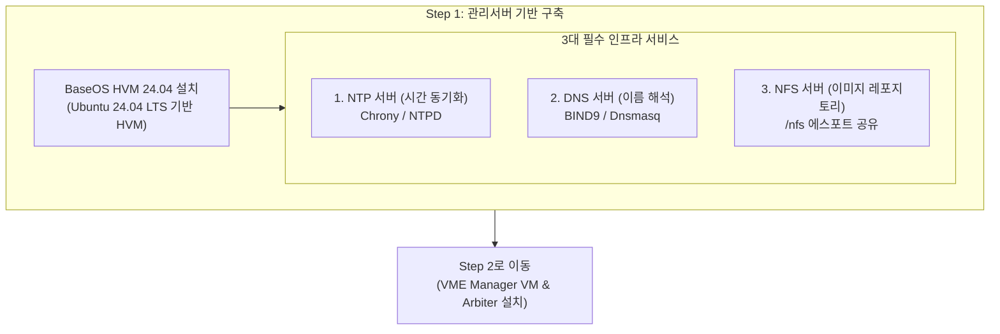

> **작성자**: 15년 차 IT 필드 엔지니어  
> **기준 문서**: HPE SimpliVity 6.2.0 for HPE Morpheus VM Essentials Software Guide (sd00006914en_us)

> 📌 **HPE SimpliVity 6.2.0 (HVM) 실전 구축 연재 목차**
> 
> - **[PreStep. 사전 설치 준비 & 2노드 네트워크 설계 가이드](../simplivity-00-install-prep/)**
> - **[현재글] [Step 1. 관리서버 BaseOS HVM 24.04 & NTP/DNS/NFS 구성](./)**
> - **[Step 2. 관리서버 VME Manager VM & Arbiter VM 설치](../simplivity-02-vme-mgr-arbiter/)**
> - **[Step 3. SimpliVity 노드 펌웨어 업데이트 & Initial Setup](../simplivity-03-node-initial-setup/)**
> - **[Step 4. VM Essentials Manager 기반 HVM Cluster 생성 & OVC 배포](../simplivity-04-hvm-cluster-ovc-deploy/)**

---

안녕하세요! 15년 동안 현장을 누비며 수많은 데이터센터와 전산실에서 서버·스토리지·HCI를 구축해 온 필드 엔지니어입니다.

현장에서 HPE SimpliVity (Morpheus VM Essentials) 인프라를 구축할 때 **가상화 환경의 중심축이 되는 선행 작업은 바로 '관리서버(Management Server) 기반 구축'**입니다.

많은 초보 엔지니어들이 SimpliVity 노드부터 바로 만지려고 하지만, 실제 현장에서는 관리서버에 **BaseOS HVM 24.04를 설치하고 NTP, DNS, NFS 3대 인프라 서비스**를 완벽하게 올려두지 않으면 이후 단계가 모두 멈춰버립니다. 

이번 포스팅에서는 실제 현장 구축 화면 캡처와 함께 **관리서버 BaseOS HVM 24.04 설치 및 3대 인프라 서비스 구성 실전 노하우**를 상세히 정리해 드리겠습니다.

---

## 1. 실전 구축 프로세스 및 워크플로우

현장에서 실제로 작업하는 HPE SimpliVity 6.2.0 (HVM 기반) 전체 배포 순서입니다. 이번 포스팅은 **상단 첫 번째 단계(관리서버 BaseOS & 인프라 서비스)**를 다룹니다.


### 💡 관리서버 구축 트래픽 흐름 (Mermaid Diagram)



---

## 2. 초보도 이해하는 핵심 용어 5분 정리

* **BaseOS HVM 24.04**: HPE Morpheus VM Essentials 환경을 지원하는 우분투(Ubuntu 24.04 LTS) 기반의 **관리서버 전용 기본 운영체제**입니다.
* **NTP (Network Time Protocol)**: 모든 SimpliVity 노드, OVC, 관리 VM의 시계를 **1 millisecond 오차 없이 동일하게 맞추는 시간 동기화 프로토콜**입니다. (시간 오차 발생 시 OVC 다운)
* **DNS (Domain Name System)**: IP 주소를 사람이 읽기 쉬운 호스트 이름으로 변환해 주는 **이름 해석 서비스**입니다.
* **NFS (Network File System)**: 네트워크를 통해 파일과 ISO/OVA/QCOW2 이미지, 백업 데이터를 공유하는 **네트워크 파일 공유 프로토콜**입니다.

---

## 3. 관리서버 BaseOS HVM 24.04 실전 설치 단계 (현장 화면 캡처)

### 1단계: 네트워크 인터페이스 및 고정 IP 설정
관리서버 물리 장비에 **BaseOS HVM 24.04 ISO**를 마운트하여 부팅하면 네트워크 설정 창(`Network configuration`)이 나타납니다.


* **이더넷 인터페이스 확인**: 물리 NIC 포트(`ens33`, `ens38` 등)가 정상 인식되었는지 확인합니다.
* **IP 수동 지정 (Static IP)**: 현장에서 DHCP를 사용할 경우 장비 재부팅 시 IP가 변경되어 관리망이 마비됩니다. 인터페이스를 선택하고 **Subnet, Address, Gateway, Name Servers(DNS)**를 고정 IP로 지정합니다.
* **Bonding 구성 (필요시)**: 네트워크 이중화가 필요한 경우 `[ Create bond ]` 메뉴를 통해 LACP/Active-Backup 본딩 인터페이스를 생성합니다.

### 2단계: 스토리지 레이아웃 & LVM 그룹 설정
네트워크 설정 완료 후 디스크 파티션 단계(`Guided storage configuration`)로 진입합니다.


* **[X] Use an entire disk**: OS 설치 대상 시스템 디스크(예: `/dev/sda`)를 전체 선택합니다.
* **[X] Set up this disk as an LVM group**: **LVM(Logical Volume Manager) 그룹 설정을 반드시 체크**합니다. LVM으로 구성해야 추후 관리서버 볼륨 용량이 부족할 때 유연하게 파티션을 확장(LVExtend)할 수 있습니다.
* **LUKS 암호화 여부**: 데이터 보안 요구사항이 없는 한 `Encrypt the LVM group with LUKS` 항목은 해제하여 부팅 지연을 방지합니다.

---

## 4. 관리서버 3대 인프라 서비스 필수 구성 가이드

OS 설치 완료 및 부팅 후, 관리서버를 인프라의 중심축으로 만드는 3대 서비스를 구성합니다.

### 1) NTP 시간 동기화 서비스 구성 (가장 중요!)
SimpliVity 클러스터의 데이터 정합성을 위해 관리서버가 내부 authoritative NTP Master 역할을 수행해야 합니다.

```bash
# chrony NTP 서비스 설치 및 활성화
sudo apt-get update && sudo apt-get install -y chrony
sudo systemctl enable --now chrony

# NTP 서비스 동작 및 시간 동기화 상태 확인
chronyc tracking
chronyc sources -v
```

### 2) DNS 서버 설정
* 관리서버, HVM 호스트, OVC, Arbiter, VME Manager의 FQDN(정방향/역방향 조회) 레코드를 등록합니다.

### 3) NFS 서비스 실전 설정 (`insecure` 옵션 필수!)
VME Manager VM 및 OVC 템플릿(QCOW2/OVA) 이미지 제공을 위한 NFS 공유 디렉토리(`/nfs`)를 생성하고 에스포트 옵션을 적용합니다.

```bash
# 1. NFS 서버 패키지 설치 및 /nfs 공유 디렉토리 생성
sudo apt-get install -y nfs-kernel-server
sudo mkdir -p /nfs

# 2. /etc/exports 에스포트 설정 적용 (insecure 옵션 적용)
echo "/nfs *(rw,sync,no_root_squash,insecure)" | sudo tee -a /etc/exports

# 3. 설정 반영 및 NFS 서비스 재시작
sudo exportfs -arv
sudo systemctl restart nfs-kernel-server
```

---

## 5. 15년 차 엔지니어의 실전 팁 (Troubleshooting)

> ⚠️ **현장에서 가장 많이 하는 실수 Top 3**
> 
> 1. **NFS `insecure` 옵션 누락**  
>    -> NFS 에스포트 시 `insecure` 옵션을 빠뜨리면 1024 이상의 비권한(Non-privileged) 포트를 사용하는 VME Manager 및 OVC 배포 스크립트에서 `Permission Denied` 또는 `RPC Access Denied` 마운트 에러가 발생합니다. ** 반드시 `insecure` 옵션을 포함하세요!**
> 2. **NTP 로컬 서버 설정 누락**  
>    -> 폐쇄망 전산실 환경에서는 외부 인터넷 NTP가 안 열려 있습니다. 관리서버 자체를 `local stratum` NTP 서버로 지정하지 않으면 이후 모든 노드가 NTP 동기화 에러로 배포 정지됩니다.
> 3. **DNS 역방향(PTR) 레코드 누락**  
>    -> SimpliVity OVC 및 VME Manager는 IP -> Hostname 역방향 조회를 수행합니다. DNS에 PTR 레코드가 없으면 타임아웃 오류가 발생합니다.

---

## 6. 결론 및 핵심 요약

HPE SimpliVity 6.2.0 구축의 탄탄한 기반은 **관리서버 OS(LVM 설정)와 3대 인프라 서비스(NTP, DNS, NFS `/nfs` insecure)**에서 시작됩니다.

### 📌 오늘의 핵심 요약 3가지
1. **BaseOS HVM 고정 IP 및 LVM 구성**: 설치 시 고정 IP를 할당하고 파티션 확장을 위해 LVM 디스크 그룹을 선택합니다.
2. **NTP 시간 동기화 필수**: 모든 인프라 장비가 관리서버 NTP를 바라보도록 동기화 체계를 갖춥니다.
3. **NFS `/nfs` insecure 공유 설정**: `echo "/nfs *(rw,sync,no_root_squash,insecure)" | sudo tee -a /etc/exports` 명령어로 마운트 타임아웃을 방지합니다.

---

### 🔗 연재 시리즈 이동하기

| 이전 단계 | 다음 단계 |
| :---: | :---: |
| 첫 번째 글입니다 | **[Step 2. VME Manager & Arbiter VM 설치 ➡️](../simplivity-02-vme-mgr-arbiter/)** |

---
궁금한 점은 댓글로 남겨주세요!
