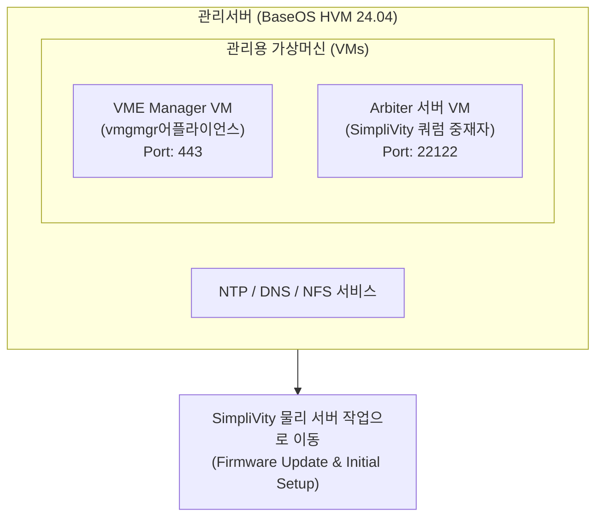

> **Author**: IT field engineer with 15 years of experience
> **Baseline document**: HPE SimpliVity 6.2.0 for HPE Morpheus VM Essentials Software Guide (sd00006914en_us)

> 📌 **HPE SimpliVity 6.2.0 (HVM) Practical Deployment Series Table of Contents**
> 
> - **[PreStep. Pre-Installation Prep & 2-Node Network Design Guide](../simplivity-00-install-prep/)**
> - **[Step 1. Management server BaseOS HVM 24.04 & NTP/DNS/NFS configuration](../simplivity-01-baseos-infra-setup/)**
> - **[Current post] [Step 2. Install management server VME Manager VM & Arbiter VM](./)**
> - **[Step 3. SimpliVity Node Firmware Update & Initial Setup](../simplivity-03-node-initial-setup/)**
> - **[Step 4. VM Essentials Manager-based HVM Cluster Creation & OVC Deployment](../simplivity-04-hvm-cluster-ovc-deploy/)**

---

Hello! I am an IT field engineer with 15 years of experience.

If you have solidified the infrastructure of the management server in [Step 1. Management server BaseOS HVM 24.04 installation & NTP/DNS/NFS configuration], it is now time to install the VME Manager VM (vmgmgr), the core control core, and the Arbiter VM for split brain prevention** on the management server.

In this post, we will explain in detail the VME Manager VM installation parameter settings and Arbiter server VM creation know-how using the `hpe-vm` console, along with the actual field text UI console capture screen.

---

## 1. Actual construction process and workflow

This post covers the **Management Server 2nd & 3rd steps (VME Manager VM & Arbiter VM)** in the field deployment flowchart below.


### 💡 VME Manager & Arbiter Deployment Architecture (Mermaid Diagram)



---

## 2. 5-minute summary of key terms that even beginners can understand

* **VME Manager VM (vmgmgr)**: A **core management appliance virtual machine** that centrally controls and manages HPE Morpheus VM Essentials virtualization infrastructure from a web GUI.
* **`hpe-vm` console tool**: A **HPE-specific console installation tool** that enters VME Manager appliance parameters and executes deployment in the management server TUI (Text User Interface) environment.
* **Arbiter Server VM**: **Independent arbiter service** that prevents data loss and split-brain by identifying surviving nodes when one node fails in a 2-node SimpliVity cluster environment.
* **TCP Port 22122**: **Required quorum port** for exchanging heartbeat packets between the OVC virtual controller and the Arbiter service.

---

## 3. Actual deployment of VME Manager VM using `hpe-vm` console (field capture)

When you run the `hpe-vm` console utility in the management server terminal, the **VME Manager Installation Options** settings screen is called.


### 📋 Detailed guide to text UI main setting parameters

1. **VM Config Options (Appliance Network & Accounts)**
   * **IP Address / Netmask / Gateway**: Specify static IP information to be used by the VME Manager virtual machine.
   * **DNS Server**: Specify the **management server DNS IP** built in [Step 1].
   * **Appliance URL**: An HTTPS address is automatically generated for web browser access (`https://<VME_Manager_IP>`).
   * **Hostname**: Enter the VME Manager hostname. (e.g. `vmemgr05`)
   * **Admin User / Password**: Set the administrator account (`vmeadmin`) and password for the first web console login.
   * **Image URI**: Click the `<Browse Files>` button to mount the image file (`hpe-vm-essentials-8.0.7-4.qcow`) on the CD-ROM or NFS path.
   * **Select VM Size**: Select the VM size (`Small` / `Medium` / `Large`) according to the cluster size.
     > 💡 **Field Engineer Tip (VM ​​Size Selection)**: A 2-node small environment can be deployed as `Small`, but the management server equipped with VME Manager usually comes with a dedicated server such as DL380. In order to prevent scale-up work and service interruption time due to lack of VME Manager resources when expanding nodes in the future, it is strongly recommended that you select **`Large` specification when deploying for the first time.

2. **Host Config Options (Network Binding)**
   * **Management Interface**: Select the network interface port of the management server.
     > ⚠️ **Operating environment essential rules (Active/Standby bonding & `miimon` settings)**: A single physical NIC port (e.g. `ens224`) is a Single Network Test/Lab example. In an actual operating environment, to prevent network port and switch failures (Link Down), **Active/Standby bonding must be configured in advance and the created Bond device (e.g. `bond0`) must be selected**.
     > 💡 **Practical key points for bonding configuration**: When setting up Active/Standby bonding, do not forget the **`miimon` value (e.g., `miimon=100`), which periodically detects physical line disconnection, and be sure to set it** so that when a link failure occurs, normal failover will immediately operate through the standby port.
   * **`[ ] Use Compute VLAN?`**: Check if VLAN tagging is required for management traffic and specify the VLAN ID.

3. **Run Deployment (`<Install>`)**
   * After completing the setup, press the `<Install>` button and the VME Manager appliance VM creation will be completed in about 10 to 15 minutes.

---

## 4. Arbiter server VM creation and service installation step 3

> ⚠️ **Important**: The Arbiter must be configured independently on the **external management server**, not on the SimpliVity physical node!
> 
> 💡 **Arbiter installation location & CLI manual configuration guide**: Arbiter is an external installation item, but it can be installed as a virtual machine (or Linux service) inside the management server where VME Manager is installed. For manual KVM VM creation and package detailed building procedures using CLI commands, please refer to the posting **[Manually creating Arbiter VM in HPE VME Manager]()**.

### Step 1: Create a lightweight VM dedicated to the Arbiter
* Create one small Linux (or Windows) VM on the management server. (Specs: 1~2 vCPU, 2~4GB RAM)
* Assign a static IP and name the host `arbiter-node`.

### Step 2: Install the HPE SimpliVity Arbiter package
* Upload and install the `HPE SimpliVity Arbiter` installation package downloaded from the HPE Support Portal to the Arbiter VM.

```bash
# Linux 기반 Arbiter 설치 예시
sudo dpkg -i hpe-simplivity-arbiter*.deb
sudo systemctl status svt-arbiter
```

### Step 3: Verify firewall permission for quorum port (22122)
```bash
# 쿼럼 포트(22122) 수신(Listening) 상태 및 UFW 방화벽 확인
netstat -tulpn | grep 22122
sudo ufw allow 22122/tcp
```

---

## 5. Practical tips from an engineer with 15 years of experience (Troubleshooting & Tips)

> 💡 **Tips for measures taken by customers who have not established computer room infrastructure services (DNS / NTP / NFS) **
> There is no need to worry even if a dedicated DNS, NTP, or NFS server is not installed in the customer's computer room. You can perfectly provide infrastructure services to the SimpliVity cluster by installing it directly as a Linux daemon service (Chrony, BIND9, NFS-Kernel-Server) inside the management server or by easily configuring a service environment with a lightweight dedicated VM.

> ⚠️ **Top 2 most common mistakes made in the field**
> 
> 1. **Image file path error when installing `hpe-vm` console**
>    -> When selecting `Browse Files` in `Image URI`, if the CD-ROM mount path (`/cdrom/hpe-vm-essentials-*.qcow`) or NFS share path is incorrect, a file reading error will occur during deployment. Be sure to check file access permissions.
> 2. **Arbiter port (22122) firewall blocking**
>    -> If you do not open the `TCP 22122` port in the firewall after installing the Arbiter VM, a quorum interlocking error will occur during the subsequent OVC deployment in step 4. Be sure to allow firewall.

---

## 6. Conclusion and key takeaways

Once **VME Manager VM and Arbiter VM** are installed on the management server, you are now ready to welcome SimpliVity physical nodes.

### 📌 3 key takeaways from today
1. **Set `hpe-vm` console parameters**: Deploy VME Manager by specifying a static IP, DNS, and QCOW2 image path in the TUI screen.
2. **Arbiter external independent deployment**: To prevent split brain, the Arbiter VM must be installed on a SimpliVity external management server.
3. **Open port 22122**: After installing the Arbiter service, check the `TCP 22122` port listening and firewall status in advance.

---

### 🔗 Go to serial series

| previous steps | next steps |
| :---: | :---: |
| **[⬅️ Step 1. BaseOS & Infrastructure Service](../simplivity-01-baseos-infra-setup/)** | **[Step 3. SimpliVity Node Initial Setup ➡️](../simplivity-03-node-initial-setup/)** |

---
If you have any questions, please leave a comment!
