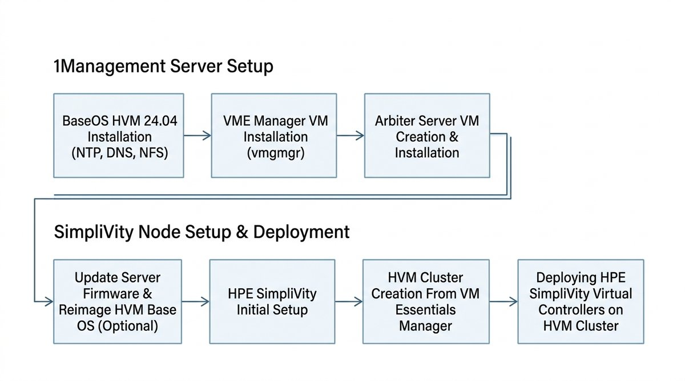
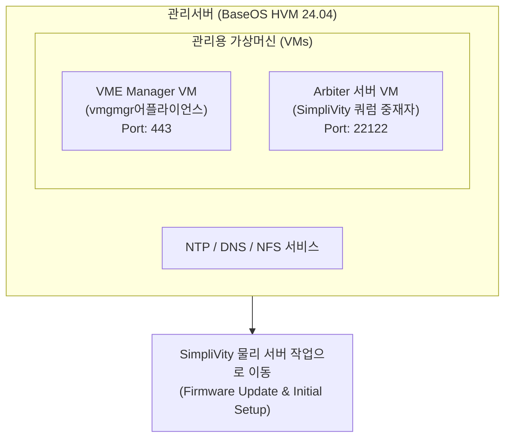
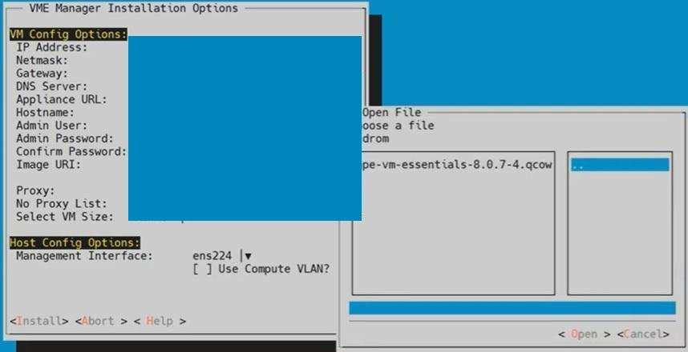

> **作成者**: 15年目のITフィールドエンジニア
> **リファレンスドキュメント**: HPE SimpliVity 6.2.0 for HPE Morpheus VM Essentials Software Guide (sd00006914en_us)

> 📌 **HPE SimpliVity 6.2.0(HVM)実戦構築連載目次**
> 
> - **[PreStep。プレインストールの準備 & 2ノードネットワーク設計ガイド](../simplivity-00-install-prep/)**
> - **[Step 1. 管理サーバー BaseOS HVM 24.04 & NTP/DNS/NFS の構成](../simplivity-01-baseos-infra-setup/)**
> - **[現在の記事] [Step 2. 管理サーバー VME Manager VM & Arbiter VM のインストール](./)**
> - **[Step 3. SimpliVity ノードファームウェアアップデート & Initial Setup](../simplivity-03-node-initial-setup/)**
> - **[Step 4. VM Essentials Manager ベースの HVM Cluster の作成と OVC のデプロイ](../simplivity-04-hvm-cluster-ovc-deploy/)**

---

こんにちは！ 15年目のITフィールドエンジニアです。

[Step 1. 管理サーバー BaseOS HVM 24.04 インストール & NTP/DNS/NFS 構成編] で管理サーバーのインフラ基盤をしっかりと固めたら、今管理サーバー上に **コア制御コアである VME Manager VM(vmgmgr)とスプリットブレーン防止用 Arbiter VM** を上げる順番です。

今回の投稿では、実際の現場テキストUIコンソールキャプチャ画面とともに、**`hpe-vm`コンソールを使用したVME Manager VMインストールパラメータの設定とArbiterサーバーVMの作成ノウハウ**を詳細にまとめます。

---

## 1.本番構築プロセスとワークフロー

今回の投稿では、以下のサイト構築フローチャートの「管理サーバーの2番目と3番目のステップ（VME Manager VM＆Arbiter VM）**」について説明します。



### 💡 VME Manager & Arbiter 配置アーキテクチャ (Mermaid Diagram)



---

## 2. 初心者も理解するコア用語5分まとめ

* **VME Manager VM（vmgmgr）**：HPE Morpheus VM Essentials仮想化インフラストラクチャを一元的にWeb GUIで制御および管理する**コア管理アプライアンス仮想マシン**。
* ** `hpe-vm`コンソールツール**：管理サーバーテキストユーザーインターフェース（TUI）環境でVME Managerアプライアンスパラメータを入力して展開を実行する** HPE専用コンソールインストールツール**。
* **Arbiter Server VM**: 2 ノードの SimpliVity クラスタ環境で片側のノードが故障した場合、生きているノードを遮断してデータの損失やスプリットブレーンを防止する **独立したモデレータサービス**。
* **TCP Port 22122**: OVC 仮想コントローラーと Arbiter サービス間でハートビートパケットを送受信する **必須クォーラムポート**。

---

## 3. `hpe-vm`コンソールを使用したVME Manager VMの実稼働展開(現場でのキャプチャ)

管理サーバー端末で `hpe-vm`コンソールユーティリティを起動すると、** VME Manager Installation Options **設定画面が呼び出されます。



### 📋テキストUIメイン設定パラメータ詳細ガイド

1. **VM Config Options（アプライアンスネットワーク＆アカウント）**
   * **IP Address / Netmask / Gateway**: VME Manager 仮想マシンが使用する固定 IP 情報を指定します。
   * **DNS Server**: [Step 1]で構築した**管理サーバDNS IP**を指定します。
   * **Appliance URL**: Web ブラウザー接続用の HTTPS アドレスが自動的に生成されます (`https://<VME_Manager_IP>`)。
   * **Hostname**：VME Managerのホスト名を入力します。 （例： `vmemgr05`）
   * **Admin User / Password**：Webコンソールの最初のログイン管理者アカウント（ `vmeadmin`）とパスワードを設定します。
   * **Image URI**：「<Browse Files>」ボタンを押して、CD-ROMまたはNFSパス上のイメージファイル（ `hpe-vm-essentials-8.0.7-4.qcow`）をマウントします。
   * **Select VM Size**: クラスタサイズに合わせて VM サイズ (`Small` / `Medium` / `Large`) を選択します。
     > 💡 **フィールドエンジニアのヒント（VM Sizeを選択）**：2ノードの小規模環境も `Small`で展開できますが、VME Managerを搭載した管理サーバーには通常DL380のような専用サーバーが入っています。今後のノード拡張時のVME Managerのリソース不足によるスケールアップ（Scale-up）操作やサービスのダウンタイムを予防するために、最初の展開時に** `Large`仕様で選択することを強くお勧めします**。

2. **Host Config Options (ネットワークバインディング)**
   * **Management Interface**: 管理サーバーのネットワークインターフェイスポートを選択します。
     > ⚠️ **運用環境必須規則（Active / Standbyボンディング＆ `miimon`設定）**：シングル物理NICポート（「ens224」など）は、Single Networkテスト/Labの例です。実際の運用環境では、ネットワークポートとスイッチ障害（Link Down）を防ぐために**Active / Standbyボンディング（Bonding）を事前設定してから、作成したBondデバイス（「bond0」など）を必ず選択してください。
     > 💡 **ボンディング構成実務の中核**: Active/Standbyボンディング設定時に物理回線の途切れを周期的に検出する**`miimon`値(例えば`miimon=100`)を忘れずに必ず設定**しなければリンク障害発生時にStandbyポートで直ちに正常なフェイルオーバー(Failover)が動作します。
   * **`[ ] Use Compute VLAN?`**: 管理トラフィックに VLAN タグが必要な場合はチェックして、VLAN ID を指定します。

3. **配布実行(`<Install>`)**
   * 設定が完了したら、「<Install>」ボタンを押すと、約10〜15分でVME ManagerアプライアンスVMの作成が完了します。

---

## 4. Arbiter サーバー VM の作成とサービスのインストール ステップ 3

> ⚠️ **重要**: Arbiter は SimpliVity 物理ノードではなく、**外部管理サーバー** に独立して構成する必要があります。
> 
> 💡 **Arbiterのインストール場所＆CLI手動設定ガイド**：Arbiterは外部インストールエントリですが、VME Managerが上がる管理サーバー内に一緒に仮想マシン（またはLinuxサービス）としてインストールできます。 CLIコマンドを使用した手動KVM VMの作成とパッケージの詳細な構築手順については、** [HPE VME Managerで手動でArbiter VMを作成する]（）**の投稿を参照してください。

### ステップ1：Arbiter専用の軽量VMを作成する
* 管理サーバー上に小型Linux（またはWindows）VMを1台作成します。 （仕様：1～2 vCPU、2～4GB RAM）
* 静的IPを割り当て、ホスト名を `arbiter-node`として指定します。

### ステップ2：HPE SimpliVity Arbiterパッケージをインストールする
* HPEサポートポータルからダウンロードした「HPE SimpliVity Arbiter」インストールパッケージをArbiter VMにアップロードしてインストールします。

```bash
# Linux 기반 Arbiter 설치 예시
sudo dpkg -i hpe-simplivity-arbiter*.deb
sudo systemctl status svt-arbiter
```

### ステップ3：クォーラムポート（22122）ファイアウォールの許可を確認する
```bash
# 쿼럼 포트(22122) 수신(Listening) 상태 및 UFW 방화벽 확인
netstat -tulpn | grep 22122
sudo ufw allow 22122/tcp
```

---

## 5. 15年目のエンジニアの実戦のヒント (Troubleshooting & Tips)

> 💡 **電算室インフラサービス（DNS / NTP / NFS）未構築の顧客の行動のヒント**
> お客様のコンピュータ室に専用のDNS、NTP、NFSサーバーが構築されていなくても心配する必要はありません。管理サーバー内にLinuxデーモンサービス（Chrony、BIND9、NFS-Kernel-Server）として直接インストールするか、軽量専用VMで簡単にサービス環境を構成することで、SimpliVityクラスタにインフラストラクチャサービスを完全に提供できます。

> ⚠️ **現場で最も多くするミス Top 2**
> 
> 1. **`hpe-vm`コンソールのインストール時のイメージファイルパスエラー**
>    -> `Image URI`で `Browse Files`を選択すると、CD-ROMマウントパス（ `/cdrom/hpe-vm-essentials-*.qcow`）またはNFS共有パスが正しくないと、展開中にファイル読み取りエラーが発生します。ファイルのアクセス権を確認してください。
> 2. **Arbiter ポート(22122) ファイアウォールのブロック**
>    -> Arbiter VMのインストール後にファイアウォールで `TCP 22122`ポートを開かないと、将来のステップ4のOVC展開でクォーラムインターロックエラーが発生します。必ずファイアウォールを許可してください。

---

## 6. 結論と鍵のまとめ

管理サーバー内に** VME Manager VMとArbiter VM**のインストールが完了したら、SimpliVity物理ノードを迎える準備が整いました。

### 📌今日の主な要約3つ
1. ** `hpe-vm`コンソールパラメータ設定**：TUI画面で固定IP、DNS、QCOW2イメージパスを指定してVMEマネージャを展開します。
2. **Arbiter外部独立配置**：スプリットブレーンを防ぐために、Arbiter VMは必ずSimpliVity外部管理サーバーにインストールします。
3. **ポート22122オープン**：Arbiterサービスのインストール後、 `TCP 22122`ポートの受信とファイアウォールの状態を事前に確認してください。

---

### 🔗連載シリーズを移動する

| 前のステップ | 次のステップ |
| :---: | :---: |
| **[⬅️ Step 1. BaseOS & インフラサービス](../simplivity-01-baseos-infra-setup/)** | **[Step 3. SimpliVity ノード Initial Setup ➡️](../simplivity-03-node-initial-setup/)** |

---
気になる点はコメントとして残してください！
