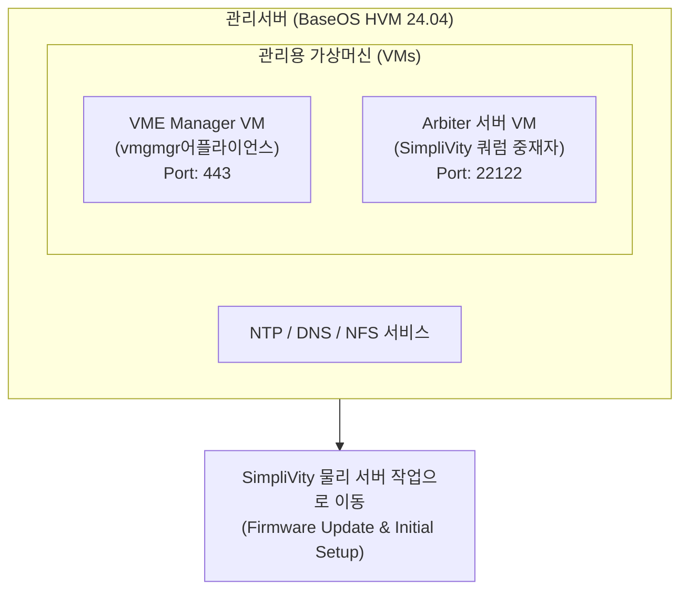

> **작성자**: 15년 차 IT 필드 엔지니어  
> **기준 문서**: HPE SimpliVity 6.2.0 for HPE Morpheus VM Essentials Software Guide (sd00006914en_us)

> 📌 **HPE SimpliVity 6.2.0 (HVM) 실전 구축 연재 목차**
> 
> - **[PreStep. 사전 설치 준비 & 2노드 네트워크 설계 가이드](../simplivity-00-install-prep/)**
> - **[Step 1. 관리서버 BaseOS HVM 24.04 & NTP/DNS/NFS 구성](../simplivity-01-baseos-infra-setup/)**
> - **[현재글] [Step 2. 관리서버 VME Manager VM & Arbiter VM 설치](./)**
> - **[Step 3. SimpliVity 노드 펌웨어 업데이트 & Initial Setup](../simplivity-03-node-initial-setup/)**
> - **[Step 4. VM Essentials Manager 기반 HVM Cluster 생성 & OVC 배포](../simplivity-04-hvm-cluster-ovc-deploy/)**

---

안녕하세요! 15년 차 IT 필드 엔지니어입니다.

[Step 1. 관리서버 BaseOS HVM 24.04 설치 & NTP/DNS/NFS 구성 편]에서 관리서버의 인프라 기반을 탄탄히 다졌다면, 이제 관리서버 상에 **핵심 제어 코어인 VME Manager VM(vmgmgr)과 스플릿 브레인 방지용 Arbiter VM**을 올릴 차례입니다.

이번 포스팅에서는 실제 현장 텍스트 UI 콘솔 캡처 화면과 함께 **`hpe-vm` 콘솔을 이용한 VME Manager VM 설치 파라미터 세팅과 Arbiter 서버 VM 생성 노하우**를 상세히 정리해 드리겠습니다.

---

## 1. 실전 구축 프로세스 및 워크플로우

이번 포스팅은 아래 현장 구축 순서도의 **관리서버 두 번째 & 세 번째 단계 (VME Manager VM & Arbiter VM)**를 다룹니다.


### 💡 VME Manager & Arbiter 배치 아키텍처 (Mermaid Diagram)



---

## 2. 초보도 이해하는 핵심 용어 5분 정리

* **VME Manager VM (vmgmgr)**: HPE Morpheus VM Essentials 가상화 인프라를 중앙 집중식으로 웹 GUI에서 제어하고 관리하는 **핵심 관리 어플라이언스 가상머신**입니다.
* **`hpe-vm` 콘솔 툴**: 관리서버 TUI(Text User Interface) 환경에서 VME Manager 어플라이언스 파라미터를 입력하고 배포를 실행하는 **HPE 전용 콘솔 설치 도구**입니다.
* **Arbiter 서버 VM**: 2노드 SimpliVity 클러스터 환경에서 한쪽 노드 장애 시, 살아있는 노드를 가려내어 데이터 유실 및 스플릿 브레인(Split-Brain)을 방지하는 **독립된 중재자 서비스**입니다.
* **TCP Port 22122**: OVC 가상 컨트롤러와 Arbiter 서비스 간에 심장소리(Heartbeat) 패킷을 주고받는 **필수 쿼럼 포트**입니다.

---

## 3. `hpe-vm` 콘솔을 이용한 VME Manager VM 실전 배포 (현장 캡처)

관리서버 터미널에서 `hpe-vm` 콘솔 유틸리티를 구동하면 **VME Manager Installation Options** 설정 화면이 호출됩니다.


### 📋 텍스트 UI 주요 설정 파라미터 상세 가이드

1. **VM Config Options (어플라이언스 네트워크 & 계정)**
   * **IP Address / Netmask / Gateway**: VME Manager 가상머신이 사용할 고정 IP 정보를 지정합니다.
   * **DNS Server**: [Step 1]에서 구축한 **관리서버 DNS IP**를 지정합니다.
   * **Appliance URL**: 웹 브라우저 접속용 HTTPS 주소가 자동 생성됩니다 (`https://<VME_Manager_IP>`).
   * **Hostname**: VME Manager 호스트 이름을 입력합니다. (예: `vmemgr05`)
   * **Admin User / Password**: 웹 콘솔 최초 로그인 관리자 계정(`vmeadmin`)과 암호를 설정합니다.
   * **Image URI**: `<Browse Files>` 버튼을 눌러 CD-ROM 또는 NFS 경로상의 이미지 파일(`hpe-vm-essentials-8.0.7-4.qcow`)을 마운트합니다.
   * **Select VM Size**: 클러스터 규모에 맞춰 VM 크기(`Small` / `Medium` / `Large`)를 선택합니다.
     > 💡 **필드 엔지니어 팁 (VM Size 선택)**: 2노드 소규모 환경도 `Small`로 배포 가능하지만, VME Manager가 장착되는 관리서버는 보통 DL380과 같은 전용 서버가 들어옵니다. 추후 노드 확장 시 VME Manager 자원 부족으로 인한 스케일 업(Scale-up) 작업과 서비스 중단 시간을 미리 예방하기 위해, 최초 배포 시 **`Large` 사양으로 선택하는 것을 강력히 추천**합니다.

2. **Host Config Options (네트워크 바인딩)**
   * **Management Interface**: 관리서버의 네트워크 인터페이스 포트를 선택합니다.
     > ⚠️ **운영 환경 필수 수칙 (Active/Standby 본딩 & `miimon` 세팅)**: 단일 물리 NIC 포트(예: `ens224`)는 Single Network 테스트/Lab 예시입니다. 실제 운영 환경에서는 네트워크 포트 및 스위치 장애(Link Down) 방지를 위해 **Active/Standby 본딩(Bonding)을 미리 구성한 후, 생성된 Bond 디바이스(예: `bond0`)를 반드시 선택**해야 합니다.  
     > 💡 **본딩 구성 실무 핵심**: Active/Standby 본딩 설정 시 물리 회선 끊김을 주기적으로 감지하는 **`miimon` 값(예: `miimon=100`)을 잊지 말고 반드시 세팅**해야 링크 장애 발생 시 Standby 포트로 즉시 정상 장애조치(Failover)가 작동합니다.
   * **`[ ] Use Compute VLAN?`**: 관리 트래픽에 VLAN 태깅이 필요한 경우 체킹하고 VLAN ID를 지정합니다.

3. **배포 실행 (`<Install>`)**
   * 설정 완료 후 `<Install>` 버튼을 누르면 약 10~15분 내에 VME Manager어플라이언스 VM 생성이 완료됩니다.

---

## 4. Arbiter 서버 VM 생성 및 서비스 설치 3단계

> ⚠️ **중요**: Arbiter는 반드시 SimpliVity 물리 노드가 아닌, **외부 관리서버**에 독립 구성해야 합니다!
> 
> 💡 **Arbiter 설치 위치 & CLI 수동 구성 가이드**: Arbiter는 외부 설치 항목이지만 VME Manager가 올라가는 관리서버 내부에 함께 가상머신(또는 리눅스 서비스)으로 설치할 수 있습니다. CLI 명령어를 이용한 수동 KVM VM 생성 및 패키지 상세 구축 절차는 **[HPE VME Manager에 수동으로 Arbiter VM 생성]()** 포스팅을 참고하세요.

### 1단계: Arbiter 전용 경량 VM 생성
* 관리서버 상에 소형 Linux(또는 Windows) VM을 1대 생성합니다. (사양: 1~2 vCPU, 2~4GB RAM)
* 고정 IP를 할당하고 호스트 이름을 `arbiter-node`로 지정합니다.

### 2단계: HPE SimpliVity Arbiter 패키지 설치
* HPE 지원 포털에서 다운로드한 `HPE SimpliVity Arbiter` 설치 패키지를 Arbiter VM으로 업로드하고 설치합니다.

```bash
# Linux 기반 Arbiter 설치 예시
sudo dpkg -i hpe-simplivity-arbiter*.deb
sudo systemctl status svt-arbiter
```

### 3단계: 쿼럼 포트(22122) 방화벽 허용 확인
```bash
# 쿼럼 포트(22122) 수신(Listening) 상태 및 UFW 방화벽 확인
netstat -tulpn | grep 22122
sudo ufw allow 22122/tcp
```

---

## 5. 15년 차 엔지니어의 실전 팁 (Troubleshooting & Tips)

> 💡 **전산실 인프라 서비스(DNS / NTP / NFS) 미구축 고객사 조치 팁**  
> 고객사 전산실에 전용 DNS, NTP, NFS 서버가 구축되어 있지 않더라도 걱정하실 필요가 없습니다. 관리서버(Management Server) 내부에 리눅스 데몬 서비스(Chrony, BIND9, NFS-Kernel-Server)로 직접 설치하거나 경량 전용 VM으로 손쉽게 서비스 환경을 구성하여 SimpliVity 클러스터에 인프라 서비스를 완벽하게 제공할 수 있습니다.

> ⚠️ **현장에서 가장 많이 하는 실수 Top 2**
> 
> 1. **`hpe-vm` 콘솔 설치 시 이미지 파일 경로 오류**  
>    -> `Image URI`에서 `Browse Files` 선택 시 CD-ROM 마운트 경로(`/cdrom/hpe-vm-essentials-*.qcow`)나 NFS 공유 경로가 올바르지 않으면 배포 중 파일 읽기 에러가 발생합니다. 파일 접근 권한을 꼭 확인하세요.
> 2. **Arbiter 포트(22122) 방화벽 블로킹**  
>    -> Arbiter VM 설치 후 방화벽에서 `TCP 22122` 포트를 열지 않으면, 차후 4단계 OVC 배포 시 쿼럼 연동 에러가 발생합니다. 반드시 방화벽 허용 조치를 하세요.

---

## 6. 결론 및 핵심 요약

관리서버 내에 **VME Manager VM과 Arbiter VM** 설치가 완료되면, 이제 SimpliVity 물리 노드들을 맞이할 모든 준비가 끝납니다.

### 📌 오늘의 핵심 요약 3가지
1. **`hpe-vm` 콘솔 파라미터 설정**: TUI 화면에서 고정 IP, DNS, QCOW2 이미지 경로를 지정하여 VME Manager를 배포합니다.
2. **Arbiter 외부 독립 배치**: 스플릿 브레인 방지를 위해 Arbiter VM은 반드시 SimpliVity 외부 관리서버에 설치합니다.
3. **포트 22122 오픈**: Arbiter 서비스 설치 후 `TCP 22122` 포트 수신 및 방화벽 상태를 사전에 확인합니다.

---

### 🔗 연재 시리즈 이동하기

| 이전 단계 | 다음 단계 |
| :---: | :---: |
| **[⬅️ Step 1. BaseOS & 인프라서비스](../simplivity-01-baseos-infra-setup/)** | **[Step 3. SimpliVity 노드 Initial Setup ➡️](../simplivity-03-node-initial-setup/)** |

---
궁금한 점은 댓글로 남겨주세요!
