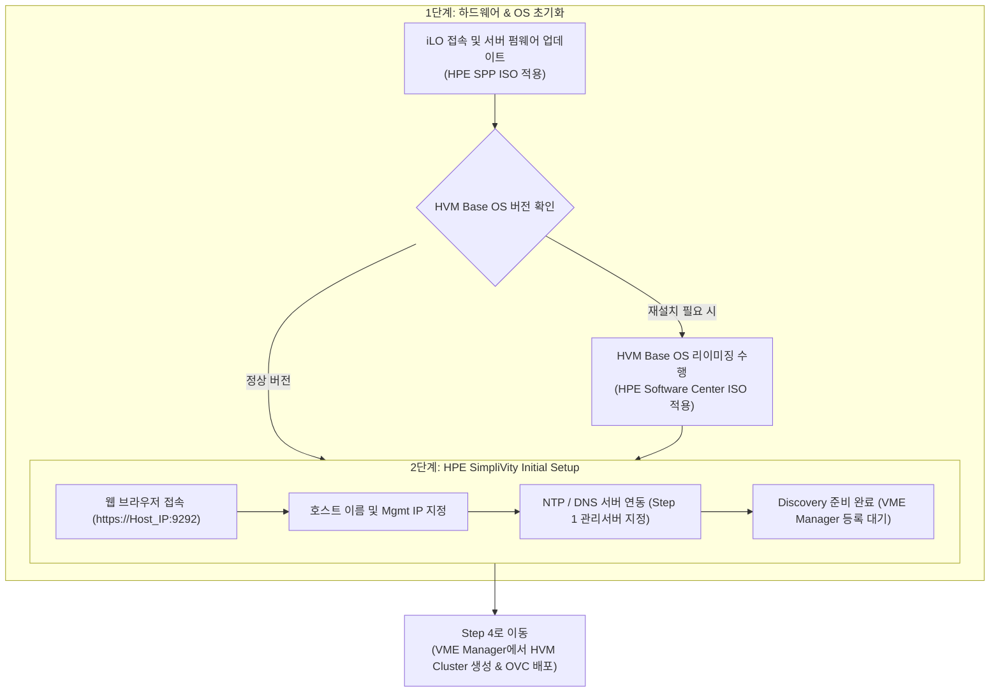

> **Author**: IT field engineer with 15 years of experience
> **Baseline document**: HPE SimpliVity 6.2.0 for HPE Morpheus VM Essentials Software Guide (sd00006914en_us)

> 📌 **HPE SimpliVity 6.2.0 (HVM) Practical Deployment Series Table of Contents**
> 
> - **[PreStep. Pre-Installation Prep & 2-Node Network Design Guide](../simplivity-00-install-prep/)**
> - **[Step 1. Management server BaseOS HVM 24.04 & NTP/DNS/NFS configuration](../simplivity-01-baseos-infra-setup/)**
> - **[Step 2. Install management server VME Manager VM & Arbiter VM](../simplivity-02-vme-mgr-arbiter/)**
> - **[Current Post] [Step 3. SimpliVity Node Firmware Update & Initial Setup](./)**
> - **[Step 4. VM Essentials Manager-based HVM Cluster Creation & OVC Deployment](../simplivity-04-hvm-cluster-ovc-deploy/)**

---

Hello! I am an IT field engineer with 15 years of experience.

If you have completed building an external management server (BaseOS, NTP/DNS/NFS, VME Manager, Arbiter) through [Step 1 & Step 2], you can now finally enter the step of directly handling **two HPE SimpliVity physical servers** mounted on the data center rack.

In the field deployment flowchart, this step is the starting point for the bottom section, which involves updating the firmware (SPP) of the SimpliVity server, reimaging the HVM Base OS (if necessary), and Initial Setup of the host.

In this post, we will explain in detail the **SimpliVity physical server initialization and https://IP:9292 web GUI-based Initial Setup practical procedures and field know-how**.

---

## 1. Actual construction process and workflow

This post covers the **SimpliVity server area first & second steps** in the field deployment flowchart below.

### 💡 SimpliVity Node Initialization Process (Mermaid Diagram)

---

## 2. 5-minute summary of key terms that even beginners can understand

* **SPP (Service Pack for ProLiant)**: This is a **HPE-exclusive firmware package** that batch updates the firmware, drivers, and BIOS of HPE ProLiant/SimpliVity servers to the latest versions.
* **HVM Base OS Reimage**: This is the process of completely erasing factory or previous OS remnants and reinstalling the HVM Base OS to its stock** for HPE Morpheus VM Essentials compatibility only.
* **SimpliVity Initial Setup (`https://<Host_IP>:9292`)**: This is an initialization process that prepares **VME Manager to discover the node by injecting the host name, management IP, iLO information, and NTP/DNS address into the physical node through the web GUI wizard.

---

## 3. SimpliVity node initial setup 3-step guide

### Step 1: Server firmware update (Apply SPP)
1. Access the **iLO Web Interface** on Node 1 and Node 2.
2. Mount the **HPE Service Pack for ProLiant (SPP) ISO** via iLO Virtual Media and remote boot the server.
3. Select Automatic Firmware Update (Automatic Mode) to upgrade BIOS, iLO firmware, NIC drivers, and RAID controller firmware to the latest recommended versions.

---

### Step 2: Reimage the HVM Base OS (perform if necessary)
> 💡 **Note**: If it is a newly shipped device or the OS package version needs to be changed, perform reimaging (Factory Reset / Image Restore).

1. The HVM Host OS installation files required for reimaging are downloaded from **HPE Software Center**.
   * **Use Image File**: `HPE-SVT-HVM-HostOS-XXX-release.iso` (e.g. `HPE-SVT-HVM-HostOS-6.2.0-release.iso`)
2. Mount that ISO image on iLO Virtual Media and remote boot the server.
3. Follow the boot wizard instructions to reinstall HVM Base OS 24.04 and ensure that disk partitions and hardware components are properly initialized to their original state.

---

### Step 3: HPE SimpliVity Initial Setup (Web GUI access setup)

Follow the web wizard steps to set up step by step (refer to the step-by-step screen capture):

#### 1) Web access and initial welcome screen (`https://<Host_IP>:9292`)
After accessing `https://<Host_IP>:9292` using a web browser, check the initial welcome screen and log in.

#### 2) Specify host basic information (Host Information)
Set the node's hostname (e.g. `svt-node01`) and administrator account password.

#### 3) Management Network IP Settings (Management Network)
Enter the IP Address, Subnet Mask, and Gateway information of the Management Interface.

#### 4) DNS and NTP server connection
Specify the **management server DNS and NTP IP** established in [Step 1].
> ⚠️ **NTP configuration essential rules**: To ensure time synchronization and quorum stability of the SimpliVity cluster, **NTP servers must be entered/registered at least 3**! (Example: A total of 3 or more settings are required, including management server NTP IP, gateway/higher NTP IP, and external NTP IP)

#### 5) Upload and verify required distribution files (4 required files)
To deploy the SimpliVity Virtual Controller (OVC) and integrate the VME plugin, you must upload **a total of 4 core files** and complete signature verification:
* 1️⃣ **OVC image file**: `HPE-SimpliVity-Virtual-Controller-XXX-release.qcow2`
* 2️⃣ **OVC Image Signature File**: `HPE-SimpliVity-Virtual-Controller-XXX-release.qcow2.sig`
* 3️⃣ **Plugin file**: `plugin` (or `HPE-SimpliVity-VME-Plugin-XXX` package)
* 4️⃣ **Plugin signature file**: `plugin.sig`

#### 6) Confirm final settings and start (click Setup button)
Final check all input parameters and click the **`Setup`** button at the bottom of the screen to run the host binding and initialization process.

#### 7) Complete Initial Setup and wait for Discovery
Once the settings application is 100% complete, the node will enter the Discovery Ready state, allowing discovery and cluster creation in the [Step 4] VME Manager web console.

---

## 4. Practical tips (Troubleshooting) from an engineer with 15 years of experience

> ⚠️ **Top 2 most common mistakes made in the field**
> 
> 1. **HVM recognition error due to firmware not being updated**
>    -> If you skip the SPP firmware update and run the HVM with an old BIOS version, the accelerator card (OmniStack Accelerator Card) or 10G NIC will not be recognized properly when passing OVC in the future. SPP updates are required.
> 2. **Initial Setup connection URL and IP typo (`https://<Host_IP>:9292`)**
>    -> Do not mistake it for the iLO console, but access the web at `https://<Host_IP>:9292`. The host name and IP entered in Initial Setup will be used in the next step, VME Manager binding, so please verify them twice after entering them.

---

## 5. Conclusion and key takeaways

Once the SimpliVity physical server's **firmware update, HVM re-imaging, and https://IP:9292 web GUI Initial Setup** are completed, the node is ready to receive central control from the VME Manager.

### 📌 3 key takeaways from today
1. **Update SPP Firmware**: First update the server hardware firmware by uploading the SPP ISO via iLO.
2. **HPE Software Center HVM Reimaging**: If necessary, perform a stock restore of the HVM OS using the `HPE-SVT-HVM-HostOS-XXX-release.iso` file.
3. **`https://<Host_IP>:9292` Initial Setup Web Settings**: After connecting to the web, inject the host name, Mgmt IP, and management server NTP/DNS address through the wizard.

---

### 🔗 Go to serial series

| previous steps | next steps |
| :---: | :---: |
| **[⬅️ Step 2. Install VME Manager & Arbiter VM](../simplivity-02-vme-mgr-arbiter/)** | **[Step 4. HVM Cluster Creation & OVC Deployment ➡️](../simplivity-04-hvm-cluster-ovc-deploy/)** |

---

If you have any questions, please leave a comment!
