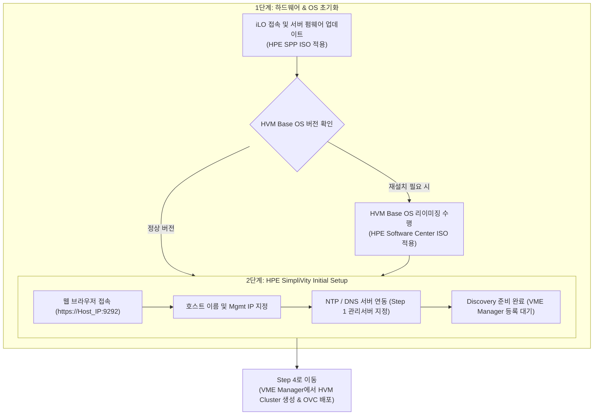

> **作成者**: 15年目のITフィールドエンジニア
> **リファレンスドキュメント**: HPE SimpliVity 6.2.0 for HPE Morpheus VM Essentials Software Guide (sd00006914en_us)

> 📌 **HPE SimpliVity 6.2.0(HVM)実戦構築連載目次**
> 
> - **[PreStep。プレインストールの準備 & 2ノードネットワーク設計ガイド](../simplivity-00-install-prep/)**
> - **[Step 1. 管理サーバー BaseOS HVM 24.04 & NTP/DNS/NFS の構成](../simplivity-01-baseos-infra-setup/)**
> - **[Step 2. 管理サーバー VME Manager VM & Arbiter VM のインストール](../simplivity-02-vme-mgr-arbiter/)**
> - **[現在の記事] [Step 3. SimpliVity ノードファームウェアアップデート & Initial Setup](./)**
> - **[Step 4. VM Essentials Manager ベースの HVM Cluster の作成と OVC のデプロイ](../simplivity-04-hvm-cluster-ovc-deploy/)**

---

こんにちは！ 15年目のITフィールドエンジニアです。

[Step 1 & Step 2]を通じて外部管理サーバー（BaseOS、NTP/DNS/NFS、VME Manager、Arbiter）の構築が完了したら、ついにデータセンターラックに搭載された**HPE SimpliVity物理サーバ2台**を直接扱う段階に入ります。

サイト構築フローチャートでは、このステップは下部領域の開始点で、**SimpliVityサーバーのファームウェア（SPP）アップデート、HVM Base OSリイメージング（必要）、およびホストのInitial Setup（初期設定）**に進みます。

今回の投稿では、**SimpliVity物理サーバーの初期化とhttps://IP:9292 Web GUIベースのInitial Setup実践手順と現場ノウハウ**を詳細にまとめます。

---

## 1.本番構築プロセスとワークフロー

今回の投稿では、以下のサイト構築フローチャートの**SimpliVityサーバー領域の最初と2番目のステップ**をカバーしています。

### 💡 SimpliVityノード初期化プロセス(Mermaid Diagram)

---

## 2. 初心者も理解するコア用語5分まとめ

* **SPP (Service Pack for ProLiant)**: HPE ProLiant/SimpliVity サーバーのファームウェア、ドライバ、BIOS を最新バージョンに一括更新してくれる **HPE 専用ファームウェアパッケージ**です。
* **HVM Base OS Reimage (リイメージング)**: 工場出荷状態または以前の OS 残留をきれいにクリアし、HPE Morpheus VM Essentials 互換専用 **HVM Base OS を純正状態に再インストール** する作業です。
* **SimpliVity Initial Setup (`https://<Host_IP>:9292`)**: Web GUI ウィザードを介して物理ノードにホスト名、管理 IP、iLO 情報、NTP/DNS アドレスを注入して **VME Manager がノードを検索 (Discovery) できるように準備する初期化プロセス** です。

---

## 3. SimpliVityノードの初期設定3段階ガイド

### ステップ1：サーバーファームウェアアップデート（SPPを適用）
1. ノード1とノード2の**iLO Web Interface**に接続します。
2. iLO Virtual Media を介して **HPE Service Pack for ProLiant (ISO) ISO** をマウントし、サーバーをリモート起動します.
3. 自動ファームウェアアップデートを選択して、BIOS、iLOファームウェア、NICドライバ、RAIDコントローラファームウェアを最新の推奨バージョンにアップグレードします。

---

### ステップ2：HVM Base OSのイメージング（必要に応じて実行）
> 💡 **注意**: 新しい出荷機器である場合、またはOSパッケージのバージョン変更が必要な場合は、イメージング（Factory Reset / Image Restore）を実行してください。

1. イメージングに必要なHVM Host OSインストールファイルは、**HPE Software Center**からダウンロードします。
   * **使用イメージファイル**： `HPE-SVT-HVM-HostOS-XXX-release.iso`（例： `HPE-SVT-HVM-HostOS-6.2.0-release.iso`）
2. iLO Virtual Mediaに対応するISOイメージをマウントし、サーバーをリモート起動します。
3. 起動ウィザードの指示に従って、HVM Base OS 24.04の再インストールを進め、ディスクパーティションとハードウェアコンポーネントが純正状態に正しく初期化されていることを確認します。

---

### ステップ3：HPE SimpliVity Initial Setup（Web GUI接続設定）

Webウィザードの手順に従って順番に設定を進めます（ステップバイステップのキャプチャ画面を参照）。

#### 1) Web アクセスおよび初期歓迎画面 (`https://<Host_IP>:9292`)
Webブラウザで `https://<Host_IP>:9292` 接続後、初期のウェルカム画面を確認してログインします。

#### 2) ホスト基本情報の指定(Host Information)
ノードのホスト名（「svt-node01」など）と管理者アカウントのパスワードを設定します。

#### 3) 管理ネットワークIPの設定(Management Network)
Management InterfaceのIPアドレス、サブネットマスク、ゲートウェイ情報を入力します。

#### 4) DNSとNTPサーバーの連携
[Step 1]で構築した**管理サーバDNSおよびNTP IP**を指定します。
> ⚠️ **NTP 構成必須規則**: SimpliVity クラスターの時間同期とクォーラムの安定性のために、**NTP サーバーは少なくとも 3 つ以上** を入力/登録する必要があります。 （例：管理サーバーNTP IP、ゲートウェイ/上位NTP IP、外部NTP IPなど合計3つ以上の設定が必要）

#### 5）必須配布ファイルのアップロードと検証（4つの必須ファイル）
SimpliVity仮想コントローラ（OVC）の展開とVMEプラグインの連携のために、**合計4つのコアファイル**をアップロードして署名検証を完了する必要があります。
* 1️⃣** OVCイメージファイル**： `HPE-SimpliVity-Virtual-Controller-XXX-release.qcow2`
* 2️⃣** OVCイメージ署名ファイル**： `HPE-SimpliVity-Virtual-Controller-XXX-release.qcow2.sig`
* 3️⃣ **Pluginファイル**: `plugin` (または `HPE-SimpliVity-VME-Plugin-XXX` パッケージ)
* 4️⃣**プラグイン署名ファイル**： `plugin.sig`

#### 6) 最終設定の確認と開始(Setupボタンをクリック)
入力パラメータ全体を最後に確認し、画面下部の**`Setup`**ボタンをクリックしてホストバインディングと初期化プロセスを実行します。

#### 7) Initial Setup 完了と Discovery 待機
設定の適用が 100% 完了すると、ノードが Discovery 準備状態に切り替わり、[Step 4] VME Manager Web コンソールで検索およびクラスタ作成が可能になります。

---

## 4. 15年目のエンジニアの実戦のヒント（Troubleshooting）

> ⚠️ **現場で最も多くするミス Top 2**
> 
> 1. **ファームウェア未更新によるHVM認識エラー**
>    -> SPPファームウェアアップデートをスキップして古いBIOSバージョンでHVMをドライブすると、将来のOVCパススルー時にアクセラレータカード（OmniStack Accelerator Card）または10G NIC認識不良が発生します。 SPPアップデートは必須です。
> 2. **Initial Setup 接続 URL および IP オタルザ (`https://<Host_IP>:9292`)**
>    -> iLOコンソールで勘違いせず、`https://<Host_IP>:9292`でWebにアクセスしてください。 Initial Setupで入力したホスト名とIPは、次のステップであるVME Managerバインディングにそのまま使用されるため、入力後に2回確認してください。

---

## 5. 結論と鍵のまとめ

SimpliVity物理サーバーの**ファームウェアの最新化、HVMイメージング、およびhttps://IP:9292 Web GUI Initial Setup**が完了すると、初めてノードがVME Managerの集中管理を受ける準備が整います。

### 📌今日の主な要約3つ
1. **SPPファームウェアの最新化**：iLOを介してSPP ISOを上げて、最初にサーバーハードウェアファームウェアを最新化します。
2. **HPE Software Center HVM イメージング**: 必要に応じて `HPE-SVT-HVM-HostOS-XXX-release.iso` ファイルで HVM OS を純粋に修復します。
3. **`https://<Host_IP>:9292` Initial Setup Web 設定**: Web 接続後、ウィザードを通じてホスト名、Mgmt IP、管理サーバー NTP/DNS アドレスを注入します。

---

### 🔗連載シリーズを移動する

| 前のステップ | 次のステップ |
| :---: | :---: |
| **[⬅️ Step 2. VME Manager & Arbiter VM のインストール](../simplivity-02-vme-mgr-arbiter/)** | **[Step 4. HVM Cluster の作成 & OVC デプロイ ➡️](../simplivity-04-hvm-cluster-ovc-deploy/)** |

---

気になる点はコメントとして残してください！
