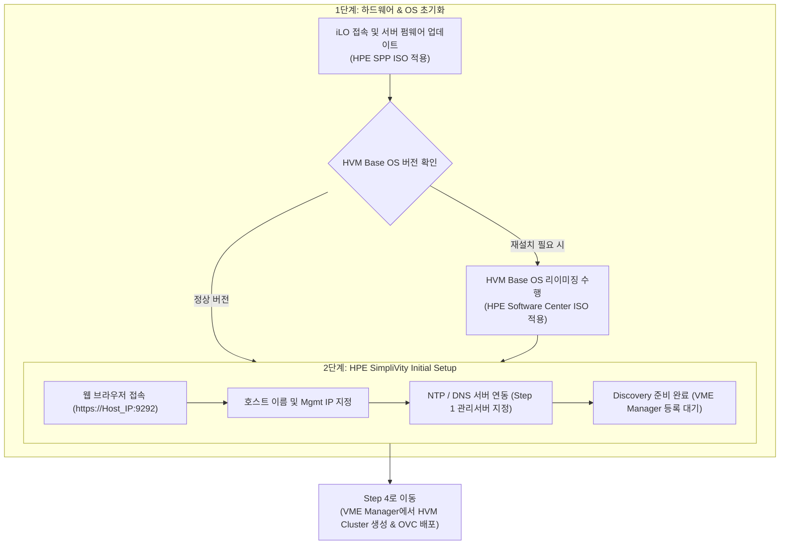
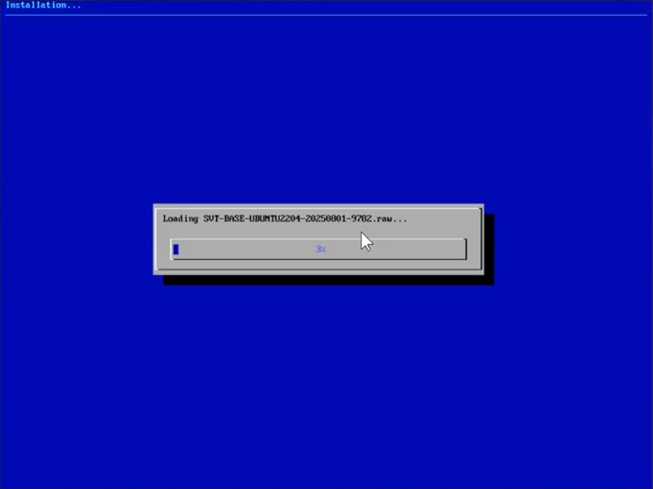
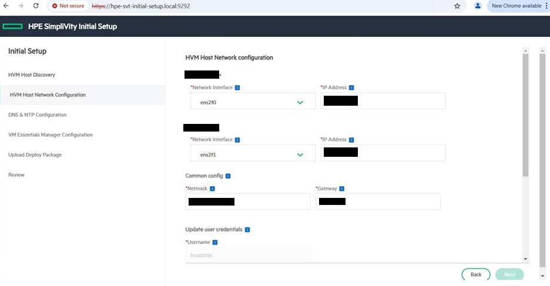
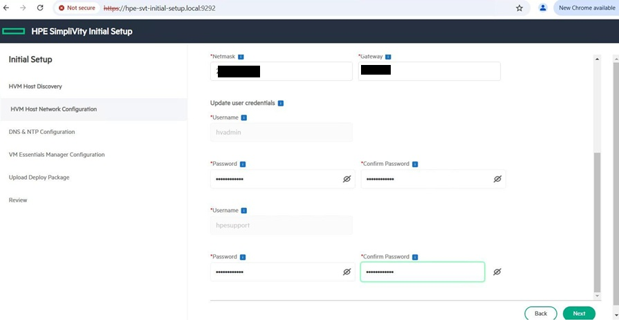
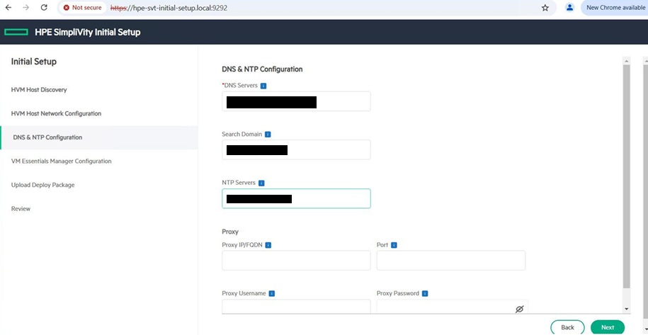
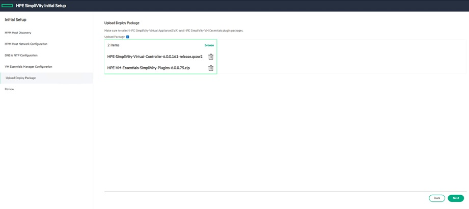
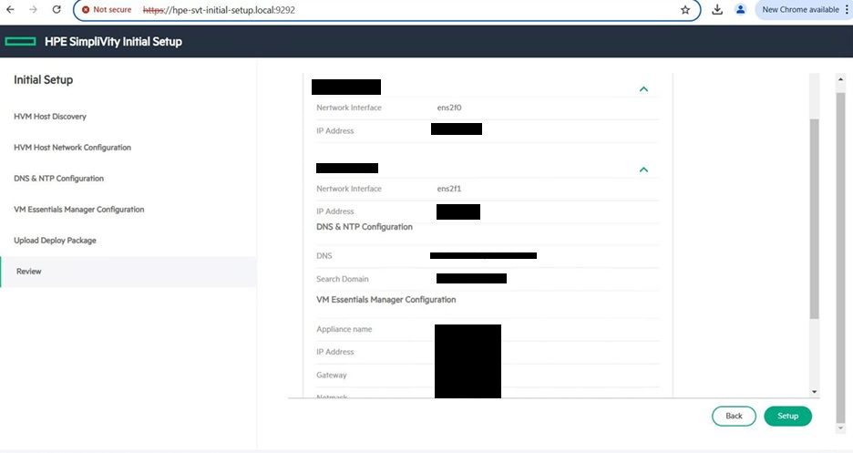
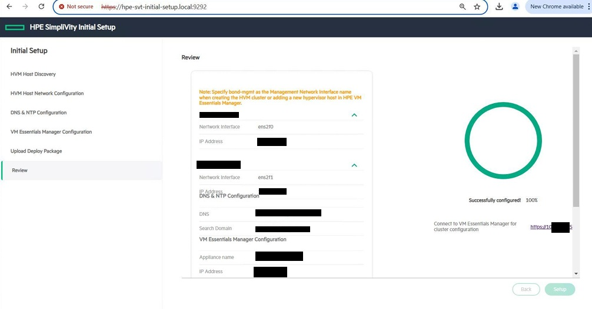

> **작성자**: 15년 차 IT 필드 엔지니어  
> **기준 문서**: HPE SimpliVity 6.2.0 for HPE Morpheus VM Essentials Software Guide (sd00006914en_us)

> 📌 **HPE SimpliVity 6.2.0 (HVM) 실전 구축 연재 목차**
> 
> - **[PreStep. 사전 설치 준비 & 2노드 네트워크 설계 가이드](../simplivity-00-install-prep/)**
> - **[Step 1. 관리서버 BaseOS HVM 24.04 & NTP/DNS/NFS 구성](../simplivity-01-baseos-infra-setup/)**
> - **[Step 2. 관리서버 VME Manager VM & Arbiter VM 설치](../simplivity-02-vme-mgr-arbiter/)**
> - **[현재글] [Step 3. SimpliVity 노드 펌웨어 업데이트 & Initial Setup](./)**
> - **[Step 4. VM Essentials Manager 기반 HVM Cluster 생성 & OVC 배포](../simplivity-04-hvm-cluster-ovc-deploy/)**

---

안녕하세요! 15년 차 IT 필드 엔지니어입니다.

[Step 1 & Step 2]를 통해 외부 관리서버(BaseOS, NTP/DNS/NFS, VME Manager, Arbiter) 구축을 마쳤다면, 이제 드디어 데이터센터 랙에 장착된 **HPE SimpliVity 물리 서버 2대**를 직접 다루는 단계에 들어섭니다.

현장 구축 순서도에서 이 단계는 하단 영역의 시작점으로, **SimpliVity 서버의 펌웨어(SPP) 업데이트, HVM Base OS 리이미징(필요시), 그리고 호스트의 Initial Setup(초기 설정)**을 진행합니다.

이번 포스팅에서는 **SimpliVity 물리 서버 초기화 및 https://IP:9292 웹 GUI 기반 Initial Setup 실전 절차와 현장 노하우**를 상세히 정리해 드리겠습니다.

---

## 1. 실전 구축 프로세스 및 워크플로우

이번 포스팅은 아래 현장 구축 순서도의 **SimpliVity 서버 영역 첫 번째 & 두 번째 단계**를 다룹니다.

### 💡 SimpliVity 노드 초기화 프로세스 (Mermaid Diagram)

---

## 2. 초보도 이해하는 핵심 용어 5분 정리

* **SPP (Service Pack for ProLiant)**: HPE ProLiant/SimpliVity 서버의 펌웨어, 드라이버, BIOS를 최신 버전으로 일괄 업데이트해 주는 **HPE 전용 펌웨어 패키지**입니다.
* **HVM Base OS Reimage (리이미징)**: 공장 출하 상태 또는 이전 OS 잔재를 깨끗이 지우고, HPE Morpheus VM Essentials 호환 전용 **HVM Base OS를 순정 상태로 재설치**하는 작업입니다.
* **SimpliVity Initial Setup (`https://<Host_IP>:9292`)**: 웹 GUI 마법사를 통해 물리 노드에 호스트명, 관리 IP, iLO 정보, NTP/DNS 주소를 주입하여 **VME Manager가 노드를 검색(Discovery)할 수 있도록 준비하는 초기화 과정**입니다.

---

## 3. SimpliVity 노드 초기 세팅 3단계 가이드

### 1단계: 서버 펌웨어 업데이트 (SPP 적용)
1. 노드 1 및 노드 2의 **iLO Web Interface**에 접속합니다.
2. iLO Virtual Media를 통해 **HPE SPP (Service Pack for ProLiant) ISO**를 마운트하고 서버를 원격 부팅합니다.
3. 자동 펌웨어 업데이트(Automatic Mode)를 선택하여 BIOS, iLO 펌웨어, NIC 드라이버, RAID 컨트롤러 펌웨어를 최신 권장 버전으로 업그레이드합니다.

---

### 2단계: HVM Base OS 리이미징 (필요 시 수행)
> 💡 **참고**: 신규 출하 장비이거나 OS 패키지 버전 변경이 필요한 경우 리이미징(Factory Reset / Image Restore)을 수행합니다.

1. 리이미징에 필요한 HVM Host OS 설치 파일은 **HPE Software Center**에서 다운로드합니다.
   * **사용 이미지 파일**: `HPE-SVT-HVM-HostOS-XXX-release.iso` (예: `HPE-SVT-HVM-HostOS-6.2.0-release.iso`)
2. iLO Virtual Media에 해당 ISO 이미지를 마운트하고 서버를 원격 부팅합니다.
3. 부팅 마법사 안내에 따라 HVM Base OS 24.04 재설치를 진행하고, 디스크 파티션 및 하드웨어 구성 요소가 순정 상태로 올바르게 초기화되는지 확인합니다.

---

### 3단계: HPE SimpliVity Initial Setup (웹 GUI 접속 세팅)

웹 마법사 절차에 따라 순서대로 설정을 진행합니다 (단계별 캡처 화면 참고):

#### 1) 웹 접속 및 초기 환영 화면 (`https://<Host_IP>:9292`)
웹 브라우저로 `https://<Host_IP>:9292` 접속 후 초기 환영 화면을 확인하고 로그인합니다.

#### 2) 호스트 기본 정보 지정 (Host Information)
노드의 호스트명(예: `svt-node01`) 및 관리자 계정 암호를 설정합니다.

#### 3) 관리 네트워크 IP 설정 (Management Network)
Management Interface의 IP Address, Subnet Mask, Gateway 정보를 입력합니다.

#### 4) DNS 및 NTP 서버 연동
[Step 1]에서 구축한 **관리서버 DNS 및 NTP IP**를 지정합니다.
> ⚠️ **NTP 구성 필수 수칙**: SimpliVity 클러스터의 시간 동기화 및 쿼럼(Quorum) 안정성을 위해 **NTP 서버는 반드시 최소 3개 이상**을 입력/등록해야 합니다! (예: 관리서버 NTP IP, 게이트웨이/상위 NTP IP, 외부 NTP IP 등 총 3개 이상 세팅 필수)

#### 5) 필수 배포 파일 업로드 및 검증 (4가지 필수 파일)
SimpliVity 가상 컨트롤러(OVC) 배포 및 VME 플러그인 연동을 위해 **총 4가지 핵심 파일**을 반드시 업로드하고 서명(Signature) 검증을 완료해야 합니다:
* 1️⃣ **OVC 이미지 파일**: `HPE-SimpliVity-Virtual-Controller-XXX-release.qcow2`
* 2️⃣ **OVC 이미지 서명 파일**: `HPE-SimpliVity-Virtual-Controller-XXX-release.qcow2.sig`
* 3️⃣ **Plugin 파일**: `plugin` (또는 `HPE-SimpliVity-VME-Plugin-XXX` 패키지)
* 4️⃣ **Plugin 서명 파일**: `plugin.sig`

#### 6) 최종 설정 확인 및 시작 (Setup 버튼 클릭)
전체 입력 파라미터를 최종 확인하고 화면 하단의 **`Setup`** 버튼을 클릭하여 호스트 바인딩 및 초기화 프로세스를 실행합니다.

#### 7) Initial Setup 완료 및 Discovery 대기
설정 적용이 100% 완료되면 노드가 Discovery 준비 상태로 전환되어 [Step 4] VME Manager 웹 콘솔에서 검색 및 클러스터 생성이 가능해집니다.

---

## 4. 15년 차 엔지니어의 실전 팁 (Troubleshooting)

> ⚠️ **현장에서 가장 많이 하는 실수 Top 2**
> 
> 1. **펌웨어 미업데이트로 인한 HVM 인식 에러**  
>    -> SPP 펌웨어 업데이트를 건너뛰고 옛날 BIOS 버전에서 HVM을 구동하면, 차후 OVC 통과 시 가속 카드(OmniStack Accelerator Card) 또는 10G NIC 인식 불량이 발생합니다. SPP 업데이트는 필수입니다.
> 2. **Initial Setup 접속 URL 및 IP 오탈자 (`https://<Host_IP>:9292`)**  
>    -> iLO 콘솔로 착각하지 말고 `https://<Host_IP>:9292`로 웹 접속하세요. Initial Setup에서 입력한 호스트명과 IP는 다음 단계인 VME Manager 바인딩에 그대로 쓰이므로 입력 후 두 번 검증하세요.

---

## 5. 결론 및 핵심 요약

SimpliVity 물리 서버의 **펌웨어 최신화, HVM 리이미징, 그리고 https://IP:9292 웹 GUI Initial Setup**이 완료되면, 비로소 노드가 VME Manager의 중앙 제어를 받을 준비가 끝납니다.

### 📌 오늘의 핵심 요약 3가지
1. **SPP 펌웨어 최신화**: iLO를 통해 SPP ISO를 올려 서버 하드웨어 펌웨어를 먼저 최신화합니다.
2. **HPE Software Center HVM 리이미징**: 필요 시 `HPE-SVT-HVM-HostOS-XXX-release.iso` 파일로 HVM OS를 순정 복구합니다.
3. **`https://<Host_IP>:9292` Initial Setup 웹 세팅**: 웹 접속 후 마법사를 통해 호스트명, Mgmt IP, 관리서버 NTP/DNS 주소를 주입합니다.

---

### 🔗 연재 시리즈 이동하기

| 이전 단계 | 다음 단계 |
| :---: | :---: |
| **[⬅️ Step 2. VME Manager & Arbiter VM 설치](../simplivity-02-vme-mgr-arbiter/)** | **[Step 4. HVM Cluster 생성 & OVC 배포 ➡️](../simplivity-04-hvm-cluster-ovc-deploy/)** |

---

궁금한 점은 댓글로 남겨주세요!
