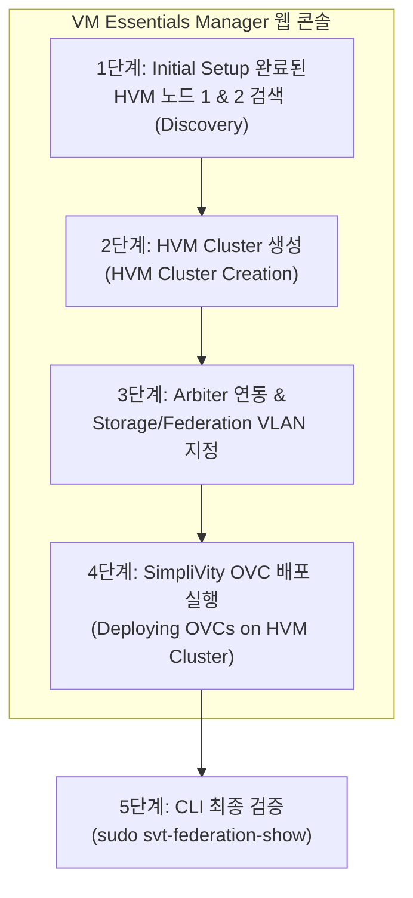

> **Author**: IT field engineer with 15 years of experience
> **Baseline document**: HPE SimpliVity 6.2.0 for HPE Morpheus VM Essentials Software Guide (sd00006914en_us)

> 📌 **HPE SimpliVity 6.2.0 (HVM) Practical Deployment Series Table of Contents**
> 
> - **[PreStep. Pre-Installation Prep & 2-Node Network Design Guide](../simplivity-00-install-prep/)**
> - **[Step 1. Management server BaseOS HVM 24.04 & NTP/DNS/NFS configuration](../simplivity-01-baseos-infra-setup/)**
> - **[Step 2. Install management server VME Manager VM & Arbiter VM](../simplivity-02-vme-mgr-arbiter/)**
> - **[Step 3. SimpliVity Node Firmware Update & Initial Setup](../simplivity-03-node-initial-setup/)**
> - **[Current post] [Step 4. VM Essentials Manager-based HVM Cluster creation & OVC deployment](./)**

---

Hello! I am an IT field engineer with 15 years of experience.

If you have successfully completed the lengthy preparation process from [Step 1 to Step 3] (building management server infrastructure, preparing VME Manager and Arbiter, physical node firmware & Initial Setup), you have now finally reached the final highlight of this series, the **'HVM cluster creation and SimpliVity virtual controller (OVC) deployment'** step!

As the final step in the field deployment flowchart, an HVM Cluster is created by combining two HVM nodes in the **VM Essentials Manager web console, and OVC (OmniStack Virtual Controller), the core brain of SimpliVity, is automatically deployed** on each node.

In this post, we will neatly summarize **the entire process from HVM cluster creation to OVC deployment and final CLI linkage verification** with a focus on actual practice.

---

## 1. Actual construction process and workflow

This post covers the **final stage (HVM Cluster creation & SimpliVity OVC deployment)** in the field construction flowchart below.


### 💡 HVM Cluster & OVC Deployment Flow (Mermaid Diagram)



---

## 2. 5-minute summary of key terms that even beginners can understand

* **HVM Cluster Creation**: The task of combining two independent HVM physical nodes into one **high availability virtualization cluster group** under the control of VM Essentials Manager.
* **Deploying OVCs (Virtual Controller Deployment)**: This is the process of automatically injecting and running** the **OVC virtual machine (OmniStack Virtual Controller), which is responsible for real-time data deduplication, compression, and backup, on each node in the HVM cluster.
* **Quorum Pairing**: During the deployment process, OVC establishes communication with the external **Arbiter VM (Port 22122)** created in [Step 2], creating a two-node split brain prevention system.
* **svt-federation-show**: **SimpliVity representative confirmation command** that verifies whether inter-node interconnection and arbiter quorum status are normal after deployment is completed.

---

## 3. HVM cluster creation & OVC practical deployment 4-step guide

### Step 1: Connect to VM Essentials Manager and discover HVM nodes
1. Open a web browser and log in to `https://<VME_Manager_IP>` with your administrator account.
2. Go to the **[Infrastructure] -> [Clusters] -> [Add Cluster]** menu.
3. In [Step 3], enter the management IP and root account of **HVM nodes 1 and 2** that completed Initial Setup to complete node discovery.

### Step 2: HVM Cluster Creation
1. Enter a cluster name. (e.g. `HVM-SVT-CLUSTER-01`)
2. Select discovered HVM nodes 1 and 2 and proceed with the cluster creation wizard.
3. Confirm high availability (HA) and default resource pool parameters.

### Step 3: Enter OVC deployment parameters & designate arbiter
1. Select **OVC Deployment Template (OVA/QCOW2)**.
2. **Specify Arbiter IP**: Enter the **External Arbiter VM IP** created on the management server in [Step 2].
3. **Enter network parameters**:
   - OVC Management IP (Node 1, Node 2)
   - OVC Storage IP (VLAN ID specification required)
   - OVC Federation IP (VLAN ID specification required)
   - Subnet Mask, Gateway, DNS IP, NTP IP ([Step 1] Designate management server)

### Step 4: Execute Pre-flight Check & OVC Automatic Deployment
1. Click the **[Validate]** button to automatically scan network ping, VLAN, NTP time synchronization, and Arbiter port (22122) status.
2. 🟢 After confirming **Pass overall verification**, click the **[Deploy OVCs]** button.
3. In approximately 30 to 45 minutes, VME Manager automatically creates, boots, mounts storage, and pairs quorum the OVC on both nodes.

---

## 4. CLI final verification after completion of deployment

Once the deployment wizard is completed, connect to OVC IP number 1 via SSH to finally verify that the cluster status is completely normal.

```bash
# 1. OVC SSH 접속
ssh admin@<OVC_Node1_Mgmt_IP>

# 2. 노드 간 연동 및 Arbiter 쿼럼 상태 확인
sudo svt-federation-show
```

### 📋 Example of normal output from `svt-federation-show`
* **Node 1 & Node 2**: Status is both `Alive`
* **Arbiter**: Status is `Connected`
* **Cluster Quorum**: `Normal` (or `Healthy`)

```bash
# 3. 하드웨어 및 스토리지 가속 카드 상태 확인
sudo svt-hardware-show
```
* Check if all components (PSU, Disk, Accelerator Card) are in `OK` status.

---

## 5. Practical tips (Troubleshooting) from an engineer with 15 years of experience

> ⚠️ **Top 2 frequently encountered field problems during final deployment**
> 
> 1. **Arbiter Connection Timeout Error During OVC Deployment**
>    -> This occurs when the Arbiter VM's `TCP 22122` port firewall is blocked or routing between OVC and Arbiter is not possible. Be sure to recheck the firewall status and IP communication of the Arbiter VM created in [Step 2].
> 2. **OVC service startup failure due to NTP error**
>    -> Immediately after booting the OVC, if the time between nodes deviates by more than 1 second, the storage service within the OVC is stopped for self-protection. Make sure all nodes are looking at the management server NTP in [Step 1].

---

## 6. Conclusion and key summary (complete series)

This completes all practical processes for building a **HPE SimpliVity 6.2.0 (HVM / Morpheus VM Essentials)** 2-node cluster!

### 📌 3 key takeaways from today
1. **VME Manager Integrated Deployment**: In the VME Manager console, proceed in the following order: Search for HVM nodes ➔ Create HVM Cluster ➔ Automatically deploy OVC.
2. **Arbiter & Network Verification**: Accurately passes external Arbiter IP and Storage/Federation VLAN information when deploying OVC.
3. **`svt-federation-show` period**: After deployment is complete, final check the status of the two nodes `Alive` and Arbiter `Connected` in the OVC CLI and complete the operation.

---

### 🔗 Go to serial series

| previous steps | next steps |
| :---: | :---: |
| **[⬅️ Step 3. SimpliVity Node Initial Setup](../simplivity-03-node-initial-setup/)** | Thank you for your hard work! Series complete 🥳 |

---
If you have any questions, please leave a comment anytime!
