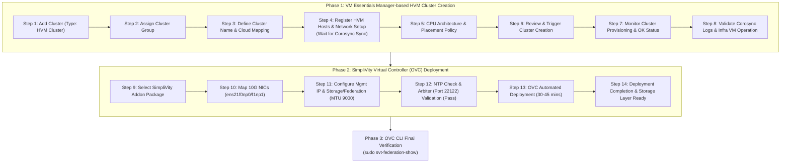

> **Author**: 16-year IT Field Systems Engineer (CK notes)  
> **Baseline document**: HPE SimpliVity 6.2.0 for HPE Morpheus VM Essentials Software Guide (sd00006914en_us)

> 📌 **HPE SimpliVity 6.2.0 (HVM) Practical Deployment Series Table of Contents**
> 
> - **[PreStep. Pre-Installation Prep & 2-Node Network Design Guide](../simplivity-00-install-prep/)**
> - **[Step 1. Management server BaseOS HVM 24.04 & NTP/DNS/NFS configuration](../simplivity-01-baseos-infra-setup/)**
> - **[Step 2. Install management server VME Manager VM & Arbiter VM](../simplivity-02-vme-mgr-arbiter/)**
> - **[Step 3. SimpliVity Node Firmware Update & Initial Setup](../simplivity-03-node-initial-setup/)**
> - **[Current post] [Step 4. VM Essentials Manager-based HVM Cluster creation & OVC deployment](./)**

---

Hello! I am **CK notes**, an IT field systems engineer with 16 years of experience.

If you have completed the thorough preparation process from [Step 1 to Step 3] (management server infrastructure setup, VME Manager and Arbiter VM deployment, physical node firmware updates, and Initial Setup), you have finally reached the ultimate highlight of this series: **'HVM Cluster Creation and SimpliVity Virtual Controller (OVC) Deployment'**!

As the final milestone in the deployment workflow, we combine independent physical nodes into a unified **HVM Cluster via the VM Essentials Manager web console, and automatically deploy OVC (OmniStack Virtual Controller) on each node** to establish an enterprise-grade high-performance HCI infrastructure.

In this guide, we walk through the **11 steps of HVM cluster creation and 9 steps of SimpliVity OVC deployment (with 20 real-world sanitized UI screenshots), concluding with CLI health check verification**.

---

## 1. Practical Deployment Process and Workflow

This post covers the **final completion phase (HVM Cluster creation & SimpliVity OVC deployment)** from the deployment flowchart below.


### 💡 HVM Cluster & OVC Deployment Flow (Mermaid Diagram)



---

## 2. 5-Minute Core Terminology Summary

* **HVM Cluster Creation**: Combining two (or more) independent HVM physical nodes into a **high-availability virtualization cluster domain** managed by VM Essentials Manager. Under the hood, Linux HA components (`Corosync`) and management agents synchronize automatically.
* **Deploying OVCs (Virtual Controller Deployment)**: Automatically provisioning a dedicated **OVC (OmniStack Virtual Controller / SVA) virtual machine on each physical node** to handle real-time deduplication, compression, and synchronous block replication.
* **Jumbo Frame (MTU 9000)**: A mandatory network standard that expands payload frames to **9,000 bytes** to minimize latency and maximize throughput for node-to-node storage mirroring.
* **Quorum Pairing**: Establishing communication with the external **Arbiter VM (Port 22122)** created in [Step 2] during OVC deployment to prevent split-brain conditions and ensure automated failover in 2-node clusters.
* **svt-federation-show**: The primary diagnostic command executed from the OVC CLI to verify node interconnectivity, storage health, and Arbiter quorum connectivity.

---

## 3. Step-by-Step Practical Guide: HVM Cluster Creation & OVC Deployment

---

### 3.1 Phase 1: VM Essentials Manager-based HVM Cluster Creation (Step 01 ~ Step 11)

With node Initial Setup completed in [Step 3], we now log in to the VM Essentials Manager web console to form the cluster.

#### Step 01. Add Cluster & Select Cluster Type (HVM Cluster)
Open a web browser, navigate to the VM Essentials Manager console (`https://<VME_Manager_IP>`), go to **[Infrastructure] -> [Clusters]**, and click **[+ Add Cluster]**. In the cluster type selection modal, choose **`HVM Cluster`**.


#### Step 02. Select Cluster Group
Assign the cluster to an appropriate management group based on your organizational policy (e.g., Default Group).


#### Step 03. Define Cluster Name and Cloud Mapping
Enter a unique cluster identifier (Name, e.g., `HVM-SVT-CLUSTER-01`) and map it to your target Private Cloud environment.


#### Step 04. Register HVM Hosts & Configure Management Network
Register the HVM Node 1 and Node 2 management IPs and root credentials (configured during [Step 3]). Map the primary management network interfaces.


> [!TIP]
> **💡 Field Engineer Tip: Time Required for Node Registration (Corosync Clustering Sync)**  
> When registering 2 (or 4) nodes into the cluster, background tasks initiate **Corosync clustering daemon startup, node-to-node cryptographic handshake, ring formation, and management agent injection**.  
> The web UI will show a working/synchronizing state that **takes several minutes**. This is expected behavior—do not refresh the browser or cancel the wizard; allow it to complete naturally.

#### Step 05. Configure CPU Architecture and Placement Policy
Confirm the physical CPU model and core architecture across hosts, and define resource scheduling and VM placement policies.


#### Step 06. Comprehensive Review and Cluster Creation Trigger
Review all configured settings (hosts, network, placement policies, and storage mappings) and click **[Complete]** to initiate cluster creation.


#### Step 07. Monitor Cluster Provisioning Status
Upon returning to the cluster list, the newly created HVM Cluster displays a status of `Provisioning` while background deployment runs.


#### Step 08. Confirm Cluster Healthy (OK) State
Once all node sync and quorum heartbeats are successfully established, the cluster status transitions to a healthy green **`OK`**.


#### Step 09. Verify History and Corosync Event Logs
Navigate to the **[History]** tab within cluster details to verify successful host joining, Corosync daemon binding, and agent synchronization events.


#### Step 10. Check Registered HVM Host List & Health
Go to **[Infrastructure] -> [Hosts]** to confirm both physical member hosts are displayed in `Active / Healthy` status.


#### Step 11. Verify VME Manager Infrastructure VM on Host
Open the host details view to verify that the **VM Essentials Manager infrastructure virtual machine** (deployed in [Step 2]) is actively running and recognized.


---

### 3.2 Phase 2: SimpliVity Virtual Controller (OVC) Deployment (Step 12 ~ Step 20)

With the HVM Cluster foundation established, we proceed with automated deployment of the SimpliVity Virtual Controller (OVC / SVA).

#### Step 12. Select SimpliVity Addon Package
In the cluster settings menu, launch the SimpliVity deployment wizard and select the **`SimpliVity Virtual Controller (OVC)`** deployment addon package.


#### Step 13. Discover Target Hosts and Check Readiness
The wizard automatically scans HVM Node 1 and Node 2 hardware resources, storage controller pass-through readiness, and prerequisite packages to confirm the `Ready` status.


#### Step 14. Map 10G High-Speed Network Interfaces
Map the high-speed 10GbE network interfaces (`ens21f0np0`, `ens21f1np1`) specifically for SimpliVity storage and federation backbone traffic.


> [!IMPORTANT]
> **🚀 Dedicated 10G NIC Mapping is Mandatory**  
> SimpliVity inline deduplication, compression, and real-time synchronous block replication require high bandwidth and sub-millisecond latency. Dedicated **10GbE or faster NICs (`ens21f0np0`, `ens21f1np1`)** must be assigned.

#### Step 15. Configure Host and OVC Management IP / Gateway
Specify the HVM host management IPs and the dedicated Management IP addresses, subnet mask, and default gateway for the OVCs (SVAs).


#### Step 16. Configure Storage Network IP and Jumbo Frames (MTU 9000)
Configure the Storage network subnet and dedicated VLAN (e.g., VLAN 151) used for intra-cluster block replication.


> [!IMPORTANT]
> **📦 Storage Network Jumbo Frames (MTU 9000) Mandatory**  
> For high-throughput storage block transfers, network MTU must be set to **`9000`**. Furthermore, the physical L2/L3 switch ports for this VLAN must have Jumbo Frames enabled (MTU 9000 or 9216) to prevent fragmentation and packet drops.

#### Step 17. Configure Federation Network IP and Jumbo Frames (MTU 9000)
Configure the Federation network subnet and dedicated VLAN (e.g., VLAN 153) used for global metadata sync and cross-cluster replication.


> [!NOTE]
> The Federation network also utilizes **MTU 9000** for optimized cluster metadata exchange.

#### Step 18. DNS, NTP, Credentials, and Arbiter Pre-flight Validation
Input domain names, corporate DNS IPs, and administrative credentials (`svtcli` and `hvadmin` passwords).  
Provide the NTP server addresses and the **External Arbiter VM IP** deployed in [Step 2], then click **[Validate]**.


> [!CAUTION]
> **⚠️ Pre-flight Checkpoints: NTP Communication & Arbiter Validation**  
> 1. **NTP Server Communication**: The hosts must successfully synchronize (UDP 123) with **at least one** of the registered corporate NTP servers for the validation to pass.  
> 2. **Arbiter Validation Required**: After entering the Arbiter VM IP, you must click **[Validate]** and ensure it turns into a green **Pass**. If `TCP 22122` is blocked by a firewall or unreachable, deployment will fail immediately.

#### Step 19. Automated OVC Deployment (Deploying SimpliVity Controllers)
Once validation succeeds, click **[Deploy OVCs]** to trigger deployment.  
VME Manager automatically clones the OVC virtual machines, assigns PCIe storage pass-through controllers, formats data volumes, pairs quorums, and starts storage daemons (takes approximately **30 to 45 minutes**).


#### Step 20. Confirm Deployment Completion and Storage Layer Readiness
The progress reaches 100% and the wizard status transitions to **`Completed`**. The SimpliVity 6.2.0 virtual storage layer is now fully active on the HVM cluster.


---

## 4. Post-Deployment CLI Verification

Once web deployment succeeds, open an SSH session to OVC Node 1 Management IP to verify cluster and hardware health via CLI.

```bash
# 1. SSH into OVC Node 1 (default user: svtcli or admin)
ssh svtcli@<OVC_Node1_Mgmt_IP>

# 2. Check Federation and Arbiter Quorum Status
sudo svt-federation-show
```

Below is the actual verification screenshot from the OVC CLI console executing `svt-federation-show` following the 2-node deployment.


### 📋 `svt-federation-show` Output Analysis
* **State (`Alive`)**: Both `svt-vme1` and `svt-vme2` communicate properly and maintain a green **`Alive`** status.
* **Arbiter (`Connected`)**: Paired with the external Arbiter VM deployed on the management server in [Step 2], showing green **`Connected`**.
* **Model & Version**: Accurately recognizes the hardware platform (`HPE SimpliVity 380 Gen11`) and software release (`Release 6.0.0.163` / HVM family).
* **Network Isolation**: Validates that Management IP, Federation IP, and Storage IP are correctly assigned to their respective designed subnets.

```bash
# 3. Check Hardware Components & Accelerator Card
sudo svt-hardware-show

# 4. Check Storage Pool & Datastore Capacities
sudo svt-storage-show
```
* Ensure power supplies (PSU), storage drives, and the PCIe Accelerator Card all report **`OK`**.

---

## 5. 16-Year Field Engineer Tips (Troubleshooting & Real-World Advice)

> [!WARNING]
> **🚨 Top 3 Field Deployment Troubleshooting Scenarios**
> 
> 1. **Arbiter Connection Timeout During OVC Deployment**  
>    * **Cause**: Port `TCP 22122` on the Arbiter VM is blocked by firewall (`ufw`), or L3 routing/gateway configuration between OVC management network and Arbiter is missing.  
>    * **Resolution**: On the Arbiter VM console, check `sudo ufw status` and verify listening sockets with `netstat -tlpn | grep 22122`. Test end-to-end connectivity using `telnet <Arbiter_IP> 22122`.
> 
> 2. **Storage / Federation MTU Mismatch (Block Mirroring Failure)**  
>    * **Cause**: MTU 9000 was specified in VME console, but upstream physical switch ports remain at default MTU 1500.  
>    * **Symptom**: ICMP ping works, but synchronous storage block replication fails, causing cluster state to fall into `Degraded`.  
>    * **Resolution**: Verify Jumbo Frames on physical switches. From OVC CLI, run a non-fragmented ping test: `ping -M do -s 8972 <Remote_OVC_Storage_IP>`.
> 
> 3. **OVC Storage Service Shutdown Due to NTP Drift**  
>    * **Cause**: If clock drift between nodes exceeds 1,000 ms (1 second), OVC storage daemons shut down automatically to prevent split-brain data corruption.  
>    * **Resolution**: Ensure all nodes and Arbiter synchronize with the Step 1 NTP server. Check clock offset with `chronyc tracking` or `ntpq -p` to verify drift is within 10 ms.

---

## 6. Conclusion & Summary (Series Complete 🎉)

This marks the completion of the entire 5-part deployment series for **HPE SimpliVity 6.2.0 on HPE Morpheus VM Essentials (HVM)**!

From initial network design to management infrastructure, physical server preparation, HVM cluster clustering, and OVC automated deployment—you have mastered every real-world engineering step.

### 📌 Key Takeaways
1. **Patience During Corosync Sync**: When registering nodes in VME Manager, Corosync background clustering takes several minutes.
2. **Dedicated 10G & Jumbo Frames (MTU 9000)**: Configure dedicated 10GbE interfaces and MTU 9000 for Storage and Federation networks.
3. **Pre-flight Validation & Arbiter Check**: Always pass NTP and Arbiter validation before deployment, and verify `Alive / Connected` status using `svt-federation-show`.

---

### 🔗 Full Series Navigation

| Step | Post Link | Summary |
| :---: | :--- | :--- |
| **PreStep** | **[Pre-Installation Prep & 2-Node Network Design](../simplivity-00-install-prep/)** | IP/VLAN planning, Jumbo Frames, required media |
| **Step 1** | **[BaseOS HVM 24.04 & Management Infra Setup](../simplivity-01-baseos-infra-setup/)** | Ubuntu BaseOS, corporate NTP/DNS/NFS services |
| **Step 2** | **[VME Manager VM & Arbiter VM Setup](../simplivity-02-vme-mgr-arbiter/)** | KVM deployment, VME web console, Arbiter daemon |
| **Step 3** | **[SimpliVity Node Firmware & Initial Setup](../simplivity-03-node-initial-setup/)** | SPP firmware, BaseOS reimaging, https://IP:9292 setup |
| **Step 4** | **[Current Post] [HVM Cluster Creation & OVC Deployment](./)** | HVM Cluster, 10G/MTU 9000 OVC deployment, CLI health check |

---

Thank you for following this series! Feel free to leave technical questions or comments below.
