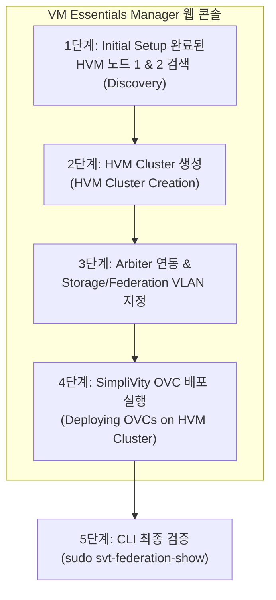

> **作成者**: 15年目のITフィールドエンジニア
> **リファレンスドキュメント**: HPE SimpliVity 6.2.0 for HPE Morpheus VM Essentials Software Guide (sd00006914en_us)

> 📌 **HPE SimpliVity 6.2.0(HVM)実戦構築連載目次**
> 
> - **[PreStep。プレインストールの準備 & 2ノードネットワーク設計ガイド](../simplivity-00-install-prep/)**
> - **[Step 1. 管理サーバー BaseOS HVM 24.04 & NTP/DNS/NFS の構成](../simplivity-01-baseos-infra-setup/)**
> - **[Step 2. 管理サーバー VME Manager VM & Arbiter VM のインストール](../simplivity-02-vme-mgr-arbiter/)**
> - **[Step 3. SimpliVity ノードファームウェアアップデート & Initial Setup](../simplivity-03-node-initial-setup/)**
> - **[現在の記事] [Step 4. VM Essentials Manager ベースの HVM Cluster の作成 & OVC デプロイ](./)**

---

こんにちは！ 15年目のITフィールドエンジニアです。

[Step 1 ～ Step 3]までの長い準備プロセス（管理サーバーインフラストラクチャの構築、VME Manager および Arbiter の準備、物理ノードファームウェア＆Initial Setup）をすべて成功裏に終えたら、いよいよ今回の連載シリーズの最終ハイライトである **'HVM クラスター作成と SimpliVity 仮想コントローラー (OVC) 展開'** 段階に到達しました

サイト構築フローチャートの最終段階として、**VM Essentials Manager Web コンソールで 2 台の HVM ノードをまとめて HVM Cluster を作成し、各ノード上に SimpliVity のコア脳である OmniStack Virtual Controller (OVC) を自動展開** します。

今回の投稿では、**HVMクラスタ作成からOVC展開、そして最終CLI連動検証までのすべてのプロセス**を実戦中心にきれいにまとめておきます。

---

## 1.本番構築プロセスとワークフロー

今回の投稿では、以下の現場構築フローチャートの「最終段階（HVM Clusterの作成＆SimpliVity OVCの導入）**」について説明します。


### 💡 HVM クラスター & OVC 導入フロー (Mermaid Diagram)



---

## 2. 初心者も理解するコア用語5分まとめ

* **HVM Cluster Creation**: VM Essentials Manager の制御下で独立した 2 台の HVM 物理ノードを 1 つの高可用性仮想化クラスターグループに結合するタスクです。
* **Deploying OVCs (仮想コントローラの展開)**: HVM クラスタ内の各ノードにリアルタイムのデータ重複除去、圧縮、バックアップを担当する **OVC 仮想マシン(OmniStack Virtual Controller)を自動的に注入して駆動**させるプロセスです。
* **Quorum Pairing (クォーラムペアリング)**: デプロイ中に OVC が [Step 2] で作成した外部 **Arbiter VM(Port 22122)** と通信を確立して 2 ノードスプリットブレーン防止方式を作成する連動プロセスです。
* **svt-federation-show**: デプロイ完了後にノード間の連動と Arbiter クォーラム状態が正常であることを検証する **SimpliVity 代表確認命令**です。

---

## 3. HVM クラスターの作成 & OVC 実践展開 4 段階ガイド

### ステップ1：VM Essentials Managerへの接続とHVMノードの検索
1. Webブラウザを開き、「https://<VME_Manager_IP>」に管理者アカウントでログインします。
2. **[Infrastructure] -> [Clusters] -> [Add Cluster]** メニューに移動します。
3. [Step 3] で、Initial Setup を終了した **HVM ノード 1 番と 2 回の Management IP および root アカウント** を入力してノード検索（Discovery）を完了します。

### ステップ2：HVM Clusterを作成する（HVM Cluster Creation）
1. クラスタ名を入力します。 （例： `HVM-SVT-CLUSTER-01`）
2. 検索されたHVMノードの1番と2番を選択し、クラスタ作成ウィザードに進みます。
3. 高可用性（HA）と基本リソースプールパラメータを確認します。

### ステップ3：OVC配置パラメータの入力＆アービターの指定
1. **OVC展開テンプレート（OVA / QCOW2）**を選択します。
2. **Arbiter IPの指定**：[Step 2]で、管理サーバー上に作成した**External Arbiter VM IP**を入力します。
3. **ネットワークパラメータの入力**：
   - OVC Management IP(ノード1、ノード2)
   - OVCストレージIP(VLAN ID指定必須)
   - OVC Federation IP (VLAN ID 指定必須)
   - Subnet Mask、Gateway、DNS IP、NTP IP（[Step 1]管理サーバー指定）

### ステップ4：プリフライトチェック＆OVC自動展開を実行する
1. **[Validate (検証)]** ボタンをクリックして、ネットワーク ping、VLAN、NTP 時間同期、Arbiter ポート（22122）の状態を自動スキャンします。
2. 🟢 **完全検証パス（Pass）**を確認して**[Deploy OVCs]**ボタンを押します。
3. 約30〜45分間、VME Managerは両方のノードでOVCを自動作成、起動、ストレージマウント、および定足数ペアリングします。

---

## 4. デプロイ完了後の CLI 最終検証 (Verification)

展開ウィザードが完了したら、OVC 1番IPでSSHに接続し、クラスタの状態が完全な正常であることを確認します。

```bash
# 1. OVC SSH 접속
ssh admin@<OVC_Node1_Mgmt_IP>

# 2. 노드 간 연동 및 Arbiter 쿼럼 상태 확인
sudo svt-federation-show
```

### 📋 `svt-federation-show`通常出力の例
* **Node 1 & Node 2**: Statusはすべて `Alive`
* **Arbiter**: Statusが `Connected`
* **Cluster Quorum**: `Normal` (または `Healthy`)

```bash
# 3. 하드웨어 및 스토리지 가속 카드 상태 확인
sudo svt-hardware-show
```
* すべてのコンポーネント（PSU、Disk、Accelerator Card）が「OK」状態であることを確認してください。

---

## 5. 15年目のエンジニアの実戦のヒント（Troubleshooting）

> ⚠️ **最終展開時に頻繁に発生する現場の問題 Top 2**
> 
> 1. **OVC デプロイ中の Arbiter Connection Timeout エラー**
>    -> Arbiter VMの `TCP 22122`ポートファイアウォールが詰まっているか、OVCとArbiter間のルーティングができない場合に発生します。 [Step 2]で作成したArbiter VMのファイアウォールの状態とIP通信を必ず再確認してください。
> 2. **NTPエラーによるOVCサービスの起動に失敗**
>    -> OVC起動直後にノード間の時間が1秒以上ずれると、OVC内のストレージサービスは自己保護のために停止します。すべてのノードが[Step 1]の管理サーバーNTPを見ていることを確認してください。

---

## 6. 結論とコアのまとめ（全シリーズ完結）

これで**HPE SimpliVity 6.2.0（HVM / Morpheus VM Essentials）**2ノードクラスタ構築のすべての実践プロセスが完成しました！

### 📌今日の主な要約3つ
1. **VME Manager統合展開**：VME ManagerコンソールでHVMノードを検索する➔HVM Clusterを作成する➔OVC自動展開順序に進みます。
2. **Arbiter＆ネットワーク検証**：OVC展開時に外部Arbiter IPおよびStorage / Federation VLAN情報を正確に転送します。
3. ** `svt-federation-show`ピリオド**: デプロイが完了したら、OVC CLIで2つのノード `Alive`とArbiter `Connected`のステータスを最終的に確認して操作を完了します。

---

### 🔗連載シリーズを移動する

| 前のステップ | 次のステップ |
| :---: | :---: |
| **[⬅️ Step 3. SimpliVity ノード Initial Setup](../simplivity-03-node-initial-setup/)** | お疲れ様でした！連載完結🥳 |

---
気になる点はいつでもコメントしてください！
