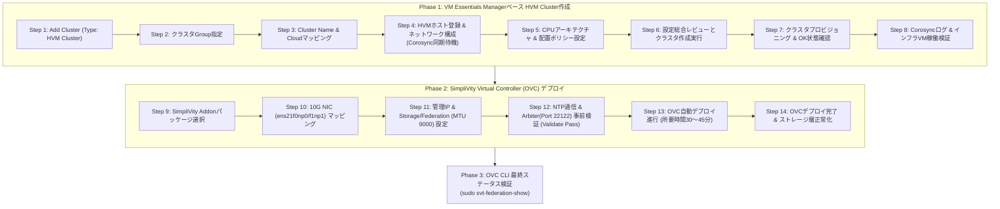

> **作成者**: 16年目のITフィールドエンジニア (CK notes)  
> **基準ドキュメント**: HPE SimpliVity 6.2.0 for HPE Morpheus VM Essentials Software Guide (sd00006914en_us)

> 📌 **HPE SimpliVity 6.2.0 (HVM) 実践構築連載 目次**
> 
> - **[PreStep. 事前導入準備 & 2ノードネットワーク設計ガイド](../simplivity-00-install-prep/)**
> - **[Step 1. 管理サーバ BaseOS HVM 24.04 & NTP/DNS/NFS 構成](../simplivity-01-baseos-infra-setup/)**
> - **[Step 2. 管理サーバ VME Manager VM & Arbiter VM インストール](../simplivity-02-vme-mgr-arbiter/)**
> - **[Step 3. SimpliVity ノード ファームウェア更新 & Initial Setup](../simplivity-03-node-initial-setup/)**
> - **[現在の記事] [Step 4. VM Essentials Managerベース HVM Cluster作成 & OVC デプロイ](./)**

---

こんにちは！16年目のITフィールドエンジニア **CK notes** です。

[Step 1 〜 Step 3]までの周到な事前準備（管理サーバインフラ構築、VME ManagerおよびArbiter VMの準備、物理ノードのファームウェア更新 & Initial Setup）をすべて終えられたら、いよいよ本連載の最終ハイライトである**「HVMクラスタ作成およびSimpliVity仮想コントローラ(OVC)デプロイ」**のステップに到達しました！

現場導入ワークフローの最終完成段階として、**VM Essentials Manager Webコンソールで独立した物理ノードを単一のHVM Clusterに統合し、各ノード上にSimpliVityの頭脳であるOVC(OmniStack Virtual Controller)を自動デプロイ**して、エンタープライズ級の超高速HCI環境を構築します。

本記事では、**HVMクラスタ作成11ステップとSimpliVity OVCデプロイ9ステップ（合計20枚の実践UIスクリーンショット）、そして最終CLI健全性検証までの全工程**をフィールドエンジニアの視点で分かりやすく解説します。

---

## 1. 実践構築プロセスとワークフロー

本記事は下記の現場導入フローチャートにおける**最終完成フェーズ（HVM Cluster作成 & SimpliVity OVCデプロイ）**を扱います。


### 💡 HVMクラスタ & OVCデプロイフロー (Mermaid Diagram)



---

## 2. 初心者も5分でわかる重要用語まとめ

* **HVM Cluster Creation**: VM Essentials Managerの制御下で独立した2台（または複数台）のHVM物理ノードを単一の**高可用性仮想化クラスタドメインに結合**する作業です。内部的にLinux HA中核モジュールである`Corosync`と管理エージェントが自動同期されます。
* **Deploying OVCs (仮想コントローラデプロイ)**: HVMクラスタ内の各物理ノードにリアルタイム重複排除、圧縮、ストレージレプリケーションを担当する**専用仮想マシンOVC(OmniStack Virtual Controller, SVA)を自動デプロイし、コントローラをパススルー**するプロセスです。
* **ジャンボフレーム (MTU 9000)**: ノード間の大容量ストレージブロックミラーリングおよびフェデレーション通信のレイテンシを極小化するため、**パケット転送単位を9,000バイトに拡張する必須ネットワーク規格**です。
* **Quorum Pairing (クォーラムペアリング)**: OVCデプロイ過程で[Step 2]で作成した外部**Arbiter VM(Port 22122)**と通信を確立し、スプリットブレイン(Split-brain)を防止して自動フェイルオーバーを保証する連携処理です。
* **svt-federation-show**: デプロイ完了後にOVCコンソールからノード間連携、ストレージ状態、Arbiterクォーラム接続が正常か検証する**SimpliVity最優先の確認コマンド**です。

---

## 3. HVMクラスタ作成 & OVC実践デプロイ ステップ別詳細ガイド

---

### 3.1 Phase 1: VM Essentials Managerベース HVM Cluster作成 (Step 01 〜 Step 11)

物理ノードに対するInitial Setup（[Step 3]）が完了したため、VM Essentials Manager Webコンソールでクラスタを作成しノードを結合します。

#### Step 01. クラスタ追加およびタイプ（HVM Cluster）選択
WebブラウザでVM Essentials Managerコンソール（`https://<VME_Manager_IP>`）にアクセスし、**[Infrastructure] -> [Clusters]**メニューに移動して右上の**[+ Add Cluster]**をクリックします。クラスタタイプ選択画面で**`HVM Cluster`**を指定します。


#### Step 02. クラスタグループ（Group）指定
クラスタが所属するテナントおよび管理グループを選択します。インフラ運用ポリシーに合わせてデフォルトグループ（Default Group）または事前定義グループを指定します。


#### Step 03. クラスタ名称およびCloud環境マッピング
クラスタ固有の識別名（Name、例: `HVM-SVT-CLUSTER-01`）を入力し、連携するPrivate Cloud環境をマッピングします。


#### Step 04. HVMホスト（ノード）登録および管理ネットワーク構成
[Step 3]で初期設定を完了したHVMノード1番と2番の管理IPおよびroot認証情報を入力し、クラスタメンバーとして登録します。


> [!TIP]
> **💡 フィールドエンジニアの実践TIPS: ノード登録時の所要時間（Corosync同期）**  
> ノード2台（または4台）をクラスタメンバーとして登録する際、バックグラウンドで各ホスト間の**Corosyncクラスタリングデーモンの起動、相互ノード認証、通信リングの形成、管理エージェントの自動配備**が実行されます。  
> そのためWeb画面上の登録処理状態が**数分間継続し、多少の時間を要します**。これは正常なクラスタ構築処理ですので、ブラウザをリロードしたり中止せず、完了までそのままお待ちください。

#### Step 05. CPUアーキテクチャおよび仮想マシン配置（Placement）ポリシー構成
物理サーバのCPUモデルおよびコアアーキテクチャを確認し、仮想マシンのリソース分散および配置ポリシーを設定します。


#### Step 06. 構成情報の総合確認（Review）およびクラスタ作成実行
入力したすべてのクラスタ設定（ホスト、ネットワーク、配置ポリシーなど）を総合確認（Review）し、**[Complete]**ボタンをクリックしてクラスタ作成を開始します。


#### Step 07. クラスタプロビジョニング（Provisioning）進行状態確認
クラスタ一覧画面に戻ると、新規作成されたHVM Clusterのステータスが`Provisioning`と表示され、バックグラウンドタスクが進行します。


#### Step 08. クラスタ正常（OK）状態のアクティブ化確認
すべての物理ノード間のクォーラムおよびエージェント同期が完了すると、クラスタステータスが緑色の**`OK`**に遷移します。


#### Step 09. HistoryおよびCorosyncクラスタリングイベントログの検証
クラスタ詳細画面の**[History]**タブに移動し、ホスト追加成功、Corosyncクラスタリング成功、監視エージェントのバインドログを確認します。


#### Step 10. 所属HVMホスト一覧およびヘルス状態確認
**[Infrastructure] -> [Hosts]**メニューで、クラスタに所属する物理ノード2台がすべて`Active / Healthy`状態として認識されていることを確認します。


#### Step 11. ホスト内稼働中のVME ManagerインフラVM確認
ホスト詳細画面で、[Step 2]で構築した**VM Essentials Managerインフラ仮想マシン**が正常稼働していることを確認します。


---

### 3.2 Phase 2: SimpliVity Virtual Controller (OVC) デプロイ (Step 12 〜 Step 20)

HVMクラスタの基盤が整ったため、SimpliVity仮想ストレージ層を構成するOVC(SVA)の自動デプロイを開始します。

#### Step 12. SimpliVity Addonパッケージ選択
クラスタメニューからSimpliVityデプロイウィザードを開始します。Addonパッケージ選択画面で**`SimpliVity Virtual Controller (OVC)`**パッケージを指定します。


#### Step 13. 対象ホストの検出および前提条件準備状態の確認
デプロイ対象となるHVMノード1番および2番のハードウェアリソース、ストレージコントローラ認識状態、前提パッケージを自動スキャンし、準備完了（Ready）状態を確認します。


#### Step 14. 10G高速ネットワークインターフェースのマッピング
各ノードのバックボーン通信を担う10GbEインターフェース（`ens21f0np0`, `ens21f1np1`）を、SimpliVityストレージおよびフェデレーション専用インターフェースとしてマッピングします。


> [!IMPORTANT]
> **🚀 10G NIC専用マッピングは必須**  
> SimpliVityのリアルタイム重複排除、圧縮、ノード間同期ブロックミラーリングは極めて高い帯域幅と低レイテンシを要求します。必ず**10GbE以上の高速NIC（`ens21f0np0`, `ens21f1np1`）**を専用に割り当ててください。

#### Step 15. ホストおよびOVC管理IP / Gateway設定
HVM物理ホストの管理IPと、各ノードにデプロイされるOVC(SVA)の管理用IP（Management IP）、サブネットマスク、デフォルトゲートウェイを入力します。


#### Step 16. StorageネットワークIPおよびジャンボフレーム(MTU 9000)設定
ノード間のブロック複製通信用Storage IP帯域と専用VLAN ID（例: VLAN 151）を設定します。


> [!IMPORTANT]
> **📦 Storageネットワーク ジャンボフレーム(MTU 9000)必須**  
> ストレージデータブロックの高速転送のため、ネットワークMTUは必ず**`9000`**に設定する必要があります。ノード設定だけでなく、対向する物理L2/L3スイッチポートでもジャンボフレーム（MTU 9000または9216）が有効化されている必要があります。

#### Step 17. FederationネットワークIPおよびジャンボフレーム(MTU 9000)設定
クラスタ間のメタデータ同期やリモートバックアップ通信を担当するFederation IP帯域と専用VLAN ID（例: VLAN 153）を設定します。


> [!NOTE]
> Federationネットワークも高速なメタデータ交換のために**MTU 9000**設定を維持します。

#### Step 18. DNS、NTP、認証情報およびArbiter事前検証(Validate)
ドメイン名、社内DNSサーバIP、OVC管理者認証情報（`svtcli`および`hvadmin`パスワード）を入力します。  
続いて社内NTPサーバアドレスと[Step 2]で構築した**External Arbiter VM IP**を指定し、画面下部の**[Validate]**を実行します。


> [!CAUTION]
> **⚠️ デプロイ前の最重要チェックポイント: NTP通信 & Arbiter事前検証 (Validate)**  
> 1. **NTPサーバ通信要件**: 登録した社内NTPサーバ（最大3台）のうち、**最低1台以上と時刻同期パケット(UDP 123)が正常疎通**していなければ検証を通過できません。  
> 2. **Arbiter連携検証の必須実行**: Arbiter VM IPを入力後、必ず**[Validate]**ボタンをクリックして結果が緑色の**Pass**になることを確認してください。Arbiter VMの`TCP 22122`ポートがファイアウォールで遮断されていると、デプロイ処理は即時失敗します。

#### Step 19. OVC自動デプロイ進行 (Deploying SimpliVity Controllers)
事前検証（Validate）がPassしたら、**[Deploy OVCs]**ボタンをクリックして自動デプロイを開始します。  
VME Managerが2台の物理ノード上にOVC仮想マシンを生成し、コントローラのパススルー、ボリュームフォーマット、クォーラムペアリングを自動実行します（環境により約**30〜45分所要**）。


#### Step 20. OVCデプロイ最終完了および仮想ストレージ層正常化確認
進捗バーが100%に達し、ウィザードステータスが**`Completed`**と表示されて正常終了します。HVMクラスタ上にSimpliVity 6.2.0仮想ストレージ層が完全に組み込まれました。


---

## 4. デプロイ完了後のCLI最終検証 (Verification)

Webコンソールでデプロイが完了したら、ターミナルからOVC 1番ノードの管理IPにSSH接続し、SimpliVity中核CLIコマンドでクラスタおよびハードウェア健全性を最終確認します。

```bash
# 1. OVC 1番ノードへSSH接続 (標準アカウント: svtcli または admin)
ssh svtcli@<OVC_Node1_Mgmt_IP>

# 2. フェデレーションおよびArbiterクォーラム接続状態確認
sudo svt-federation-show
```

### 📋 `svt-federation-show` 正常出力基準
* **Node 1 & Node 2 Status**: 2ノード共に**`Alive`**であること。
* **Arbiter Status**: [Step 2]のArbiter VMと正常接続され**`Connected`**であること。
* **Cluster Quorum Status**: **`Normal`**（または`Healthy`）と表示され、2ノード高可用性クォーラムが正常動作していることを確認します。

```bash
# 3. ハードウェアコンポーネントおよびアクセラレータカード状態確認
sudo svt-hardware-show

# 4. ストレージプールおよびデータストア容量状態確認
sudo svt-storage-show
```
* 電源ユニット(PSU)、ドライブディスク、PCIeアクセラレータカードの状態がすべて**`OK`**であることを確認します。

---

## 5. 16年目エンジニアの実践TIPS (トラブルシューティング)

> [!WARNING]
> **🚨 現場構築で最も頻発するトラブルシューティング Top 3**
> 
> 1. **OVCデプロイ中のArbiter Connection Timeoutエラー**  
>    * **原因**: Arbiter VMの`TCP 22122`ポートがOSファイアウォール(`ufw`)でブロックされているか、OVC管理網とArbiter間のルーティング設定が不足している場合です。  
>    * **解決策**: Arbiter VMコンソールで`sudo ufw status`および`netstat -tlpn | grep 22122`を確認し、疎通テスト（`telnet <Arbiter_IP> 22122`）を行ってください。
> 
> 2. **Storage / Federation ネットワークMTU不一致（ブロック同期不能）**  
>    * **原因**: VMEコンソールではMTU 9000を指定したが、上位物理L2/L3スイッチポートがデフォルトのMTU 1500のままである場合です。  
>    * **症状**: 通常のPingは通るものの、OVC間のリアルタイムストレージブロック同期トラフィックが通過できず、クラスタが`Degraded`になります。  
>    * **解決策**: スイッチポートのジャンボフレームを有効化し、OVC CLIからフラグメント禁止Ping（`ping -M do -s 8972 <対向_OVC_Storage_IP>`）で検証してください。
> 
> 3. **ノード間NTP時刻ズレによるストレージサービス自己保護停止**  
>    * **原因**: 2ノード間のシステム時刻が1,000ms（1秒）以上ズレると、データ整合性保護のためOVC内部ストレージサービスが自動停止します。  
>    * **解決策**: すべてのノードとArbiter VMが[Step 1]の社内NTPサーバを参照するよう同期し、`chronyc tracking`等で誤差が10ms以内であることを確認してください。

---

## 6. まとめおよび全シリーズ完結 🎉

これにて、**HPE SimpliVity 6.2.0 for HPE Morpheus VM Essentials (HVM)** 2ノードクラスタ構築の全実践プロセスが完結しました！

事前ネットワーク設計から管理インフラ構築、物理ノード初期化、HVMクラスタ作成、そしてOVC自動デプロイまで、全工程を完全にマスターしていただけました。

### 📌 本日の重要ポイント3選
1. **クラスタ作成時のCorosync同期待機**: VME Managerでノード登録時はクラスタリング処理に数分要するため待機します。
2. **10G専用マッピング & ジャンボフレーム(MTU 9000)**: ストレージおよびフェデレーション網は必ず10GbE専用NICとMTU 9000で構成します。
3. **事前検証(Validate) & Arbiter連携**: デプロイ前にNTP通信およびArbiter(Port 22122)検証を通過させ、CLIの`svt-federation-show`で最終`Alive / Connected`状態を確認します。

---

### 🔗 HPE SimpliVity 6.2.0 実践連載 全シリーズリンク

| ステップ | 記事リンク | 主な内容 |
| :---: | :--- | :--- |
| **PreStep** | **[事前導入準備 & 2ノードネットワーク設計ガイド](../simplivity-00-install-prep/)** | IP/VLAN設計、ジャンボフレーム、必須ソフトウェア |
| **Step 1** | **[管理サーバ BaseOS HVM 24.04 & インフラ構成](../simplivity-01-baseos-infra-setup/)** | Ubuntu BaseOS導入、社内NTP/DNS/NFS構築 |
| **Step 2** | **[管理サーバ VME Manager VM & Arbiter VM インストール](../simplivity-02-vme-mgr-arbiter/)** | KVM仮想マシン配備、VME Webコンソール初期設定、Arbiter |
| **Step 3** | **[SimpliVity ノード ファームウェア更新 & Initial Setup](../simplivity-03-node-initial-setup/)** | SPP更新、BaseOS再イメージング、https://IP:9292初期設定 |
| **Step 4** | **[現在の記事] [HVM Cluster作成 & SimpliVity OVCデプロイ](./)** | HVM Cluster作成、10G/MTU 9000 OVC自動配備、CLI検証 |

---

長編連載にお付き合いいただき、誠にありがとうございました！実務現場での技術的なご質問やトラブルシューティングに関するお問い合わせは、お気軽にコメント欄までお寄せください。
