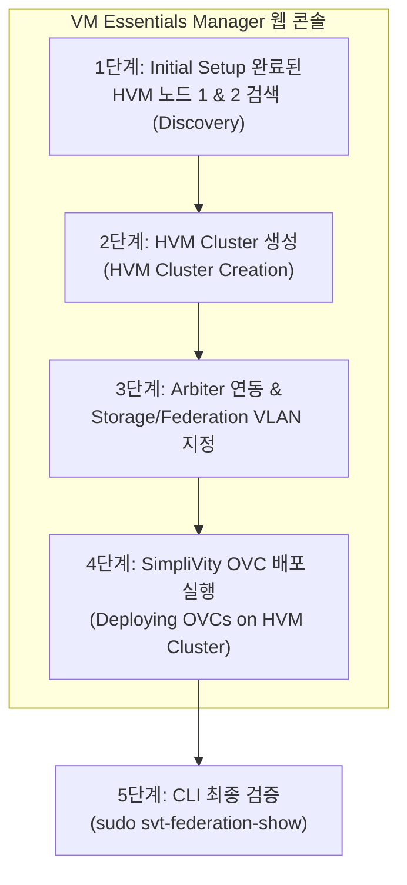

> **작성자**: 15년 차 IT 필드 엔지니어  
> **기준 문서**: HPE SimpliVity 6.2.0 for HPE Morpheus VM Essentials Software Guide (sd00006914en_us)

> 📌 **HPE SimpliVity 6.2.0 (HVM) 실전 구축 연재 목차**
> 
> - **[PreStep. 사전 설치 준비 & 2노드 네트워크 설계 가이드](../simplivity-00-install-prep/)**
> - **[Step 1. 관리서버 BaseOS HVM 24.04 & NTP/DNS/NFS 구성](../simplivity-01-baseos-infra-setup/)**
> - **[Step 2. 관리서버 VME Manager VM & Arbiter VM 설치](../simplivity-02-vme-mgr-arbiter/)**
> - **[Step 3. SimpliVity 노드 펌웨어 업데이트 & Initial Setup](../simplivity-03-node-initial-setup/)**
> - **[현재글] [Step 4. VM Essentials Manager 기반 HVM Cluster 생성 & OVC 배포](./)**

---

안녕하세요! 15년 차 IT 필드 엔지니어입니다.

[Step 1 ~ Step 3]까지의 기나긴 준비 과정(관리서버 인프라 구축, VME Manager 및 Arbiter 준비, 물리 노드 펌웨어 & Initial Setup)을 모두 성공적으로 마쳤다면, 이제 드디어 이번 연재 시리즈의 최종 하이라이트인 **'HVM 클러스터 생성 및 SimpliVity 가상 컨트롤러(OVC) 배포'** 단계에 도달했습니다!

현장 구축 순서도의 최종 단계로, **VM Essentials Manager 웹 콘솔에서 2대의 HVM 노드를 묶어 HVM Cluster를 생성하고, 각 노드 위에 SimpliVity의 핵심 두뇌인 OVC(OmniStack Virtual Controller)를 자동 배포**하게 됩니다.

이번 포스팅에서는 **HVM 클러스터 생성부터 OVC 배포, 그리고 최종 CLI 연동 검증까지의 모든 과정**을 실전 위주로 깔끔하게 정리해 드리겠습니다.

---

## 1. 실전 구축 프로세스 및 워크플로우

이번 포스팅은 아래 현장 구축 순서도의 **최종 단계(HVM Cluster 생성 & SimpliVity OVC 배포)**를 다룹니다.


### 💡 HVM 클러스터 & OVC 배포 흐름 (Mermaid Diagram)



---

## 2. 초보도 이해하는 핵심 용어 5분 정리

* **HVM Cluster Creation**: VM Essentials Manager 제어하에 독립된 2대의 HVM 물리 노드를 하나의 **고가용성 가상화 클러스터 그룹으로 결합**하는 작업입니다.
* **Deploying OVCs (가상 컨트롤러 배포)**: HVM 클러스터 내 각 노드에 실시간 데이터 중복제거, 압축, 백업을 담당하는 **OVC 가상머신(OmniStack Virtual Controller)을 자동으로 주입하고 구동**시키는 과정입니다.
* **Quorum Pairing (쿼럼 페어링)**: 배포 과정 중 OVC가 [Step 2]에서 생성한 외부 **Arbiter VM(Port 22122)**과 통신을 확립하여 2노드 스플릿 브레인 방지 체계를 만드는 연동 과정입니다.
* **svt-federation-show**: 배포 완료 후 노드 간 연동 및 Arbiter 쿼럼 상태가 정상이온지 검증하는 **SimpliVity 대표 확인 명령어**입니다.

---

## 3. HVM 클러스터 생성 & OVC 실전 배포 4단계 가이드

### 1단계: VM Essentials Manager 접속 및 HVM 노드 검색
1. 웹 브라우저를 열고 `https://<VME_Manager_IP>`에 관리자 계정으로 로그인합니다.
2. **[Infrastructure] -> [Clusters] -> [Add Cluster]** 메뉴로 이동합니다.
3. [Step 3]에서 Initial Setup을 마친 **HVM 노드 1번과 2번의 Management IP 및 root 계정**을 입력하여 노드 검색(Discovery)을 완료합니다.

### 2단계: HVM Cluster 생성 (HVM Cluster Creation)
1. 클러스터 이름을 입력합니다. (예: `HVM-SVT-CLUSTER-01`)
2. 검색된 HVM 노드 1번과 2번을 선택하고 클러스터 생성 마법사를 진행합니다.
3. 고가용성(HA) 및 기본 리소스 풀 파라미터를 확정합니다.

### 3단계: OVC 배포 파라미터 입력 & Arbiter 지정
1. **OVC 배포 템플릿(OVA/QCOW2)**을 선택합니다.
2. **Arbiter IP 지정**: [Step 2]에서 관리서버 상에 만든 **External Arbiter VM IP**를 입력합니다.
3. **네트워크 파라미터 입력**:
   - OVC Management IP (Node 1, Node 2)
   - OVC Storage IP (VLAN ID 지정 필수)
   - OVC Federation IP (VLAN ID 지정 필수)
   - Subnet Mask, Gateway, DNS IP, NTP IP ([Step 1] 관리서버 지정)

### 4단계: Pre-flight Check & OVC 자동 배포 실행
1. **[Validate (검증)]** 버튼을 클릭하여 네트워크 핑, VLAN, NTP 시간 동기화, Arbiter 포트(22122) 상태를 자동 스캔합니다.
2. 🟢 **전체 검증 통과(Pass)**를 확인한 후 **[Deploy OVCs]** 버튼을 누릅니다.
3. 약 30~45분 동안 VME Manager가 두 노드 상에 OVC를 자동 생성, 부팅, 스토리지 마운트 및 쿼럼 페어링을 수행합니다.

---

## 4. 배포 완료 후 CLI 최종 검증 (Verification)

배포 마법사가 완료되면 OVC 1번 IP로 SSH 접속하여 클러스터 상태가 완전한 정상인지 최종 검증합니다.

```bash
# 1. OVC SSH 접속
ssh admin@<OVC_Node1_Mgmt_IP>

# 2. 노드 간 연동 및 Arbiter 쿼럼 상태 확인
sudo svt-federation-show
```

### 📋 `svt-federation-show` 정상 출력 예시
* **Node 1 & Node 2**: Status가 모두 `Alive`
* **Arbiter**: Status가 `Connected`
* **Cluster Quorum**: `Normal` (또는 `Healthy`)

```bash
# 3. 하드웨어 및 스토리지 가속 카드 상태 확인
sudo svt-hardware-show
```
* 모든 구성 요소(PSU, Disk, Accelerator Card)가 `OK` 상태인지 확인합니다.

---

## 5. 15년 차 엔지니어의 실전 팁 (Troubleshooting)

> ⚠️ **최종 배포 시 자주 발생하는 현장 문제 Top 2**
> 
> 1. **OVC 배포 중 Arbiter Connection Timeout 에러**  
>    -> Arbiter VM의 `TCP 22122` 포트 방화벽이 막혀 있거나, OVC와 Arbiter 간 라우팅이 안 되는 경우 발생합니다. [Step 2]에서 만든 Arbiter VM의 방화벽 상태와 IP 통신을 반드시 재확인하세요.
> 2. **NTP 오차로 인한 OVC 서비스 시작 실패**  
>    -> OVC 부팅 직후 노드 간 시간이 1초 이상 어긋나면 OVC 내 스토리지 서비스가 자가 보호를 위해 정지됩니다. 모든 노드가 [Step 1]의 관리서버 NTP를 바라보는지 확인하세요.

---

## 6. 결론 및 핵심 요약 (전체 시리즈 완결)

이로써 **HPE SimpliVity 6.2.0 (HVM / Morpheus VM Essentials)** 2노드 클러스터 구축의 모든 실전 프로세스가 완성되었습니다!

### 📌 오늘의 핵심 요약 3가지
1. **VME Manager 통합 배포**: VME Manager 콘솔에서 HVM 노드 검색 ➔ HVM Cluster 생성 ➔ OVC 자동 배포 순서로 진행합니다.
2. **Arbiter & 네트워크 검증**: OVC 배포 시 외부 Arbiter IP 및 Storage/Federation VLAN 정보를 정확히 전달합니다.
3. **`svt-federation-show` 마침표**: 배포 완료 후 OVC CLI에서 2개 노드 `Alive` 및 Arbiter `Connected` 상태를 최종 확인하고 작업을 완료합니다.

---

### 🔗 연재 시리즈 이동하기

| 이전 단계 | 다음 단계 |
| :---: | :---: |
| **[⬅️ Step 3. SimpliVity 노드 Initial Setup](../simplivity-03-node-initial-setup/)** | 수고하셨습니다! 연재 완결 🥳 |

---
궁금한 점은 언제든 댓글로 남겨주세요!
