> **작성자**: 16년 차 IT 필드 엔지니어 (CK notes)  
> **기준 문서**: HPE SimpliVity 6.2.0 for HPE Morpheus VM Essentials Software Guide (sd00006914en_us)

> 📌 **HPE SimpliVity 6.2.0 (HVM) 실전 구축 연재 목차**
> 
> - **[PreStep. 사전 설치 준비 & 2노드 네트워크 설계 가이드](../simplivity-00-install-prep/)**
> - **[Step 1. 관리서버 BaseOS HVM 24.04 & NTP/DNS/NFS 구성](../simplivity-01-baseos-infra-setup/)**
> - **[Step 2. 관리서버 VME Manager VM & Arbiter VM 설치](../simplivity-02-vme-mgr-arbiter/)**
> - **[Step 3. SimpliVity 노드 펌웨어 업데이트 & Initial Setup](../simplivity-03-node-initial-setup/)**
> - **[현재글] [Step 4. VM Essentials Manager 기반 HVM Cluster 생성 & OVC 배포](./)**

---

안녕하세요! 16년 차 IT 필드 엔지니어 **CK notes**입니다.

[Step 1 ~ Step 3]까지의 철저한 사전 준비(관리서버 인프라 구축, VME Manager 및 Arbiter VM 준비, SimpliVity 물리 노드 펌웨어 업데이트 & Initial Setup)를 모두 마치셨다면, 드디어 이번 연재 시리즈의 최종 하이라이트인 **'HVM 클러스터 생성 및 SimpliVity 가상 컨트롤러(OVC) 배포'** 단계에 도달했습니다!

현장 구축 워크플로우의 최종 완성 단계로, **VM Essentials Manager 웹 콘솔에서 독립된 물리 노드들을 단일 HVM Cluster로 통합하고, 노드마다 SimpliVity의 두뇌인 OVC(OmniStack Virtual Controller)를 자동 배포**하여 엔터프라이즈급 초고속 HCI 환경을 구축하게 됩니다.

이번 포스팅에서는 **HVM 클러스터 생성 11단계와 SimpliVity OVC 배포 9단계(총 20개 실전 UI 스크린샷), 그리고 최종 CLI 헬스체크 검증까지의 모든 과정**을 현장 엔지니어의 시각에서 완벽하게 정리해 드리겠습니다.

---

## 1. 실전 구축 프로세스 및 워크플로우

이번 포스팅은 아래 현장 구축 순서도의 **최종 완성 단계(HVM Cluster 생성 & SimpliVity OVC 배포)**를 다룹니다.


### 💡 HVM 클러스터 & OVC 배포 흐름 (Mermaid Diagram)

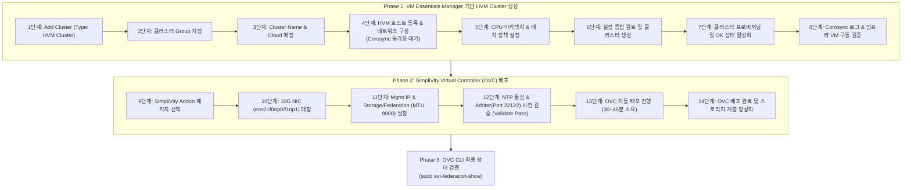

---

## 2. 초보도 이해하는 핵심 용어 5분 정리

* **HVM Cluster Creation**: VM Essentials Manager 제어하에 독립된 2대(또는 다수)의 HVM 물리 노드를 하나의 **고가용성 가상화 클러스터 도메인으로 결합**하는 작업입니다. 내부적으로 리눅스 고가용성 핵심 모듈인 `Corosync`와 관리 에이전트가 자동 동기화됩니다.
* **Deploying OVCs (가상 컨트롤러 배포)**: HVM 클러스터 내 각 물리 노드에 실시간 인라인 중복제거, 압축, 스토리지 복제를 전담하는 **전용 가상머신 OVC(OmniStack Virtual Controller, SVA)를 자동으로 배포하고 컨트롤러를 패스스루**하는 과정입니다.
* **Jumbo Frame (MTU 9000)**: SimpliVity 노드 간 대용량 스토리지 블록 미러링 및 페더레이션 통신 지연시간(Latency)을 최소화하기 위해 **패킷 전송 단위를 9,000 바이트로 확장하는 필수 네트워크 규격**입니다.
* **Quorum Pairing (쿼럼 페어링)**: OVC 배포 과정 중 [Step 2]에서 생성한 외부 **Arbiter VM(Port 22122)**과 통신을 확립하여 2노드 스플릿 브레인(Split-brain)을 방지하고 자동 장애조치(Failover)를 보장하는 절차입니다.
* **svt-federation-show**: 배포 완료 후 OVC 콘솔에서 노드 간 연동 상태, 스토리지 헬스 및 Arbiter 쿼럼 연결 상태가 완벽한지 검증하는 **SimpliVity 최우선 진단 명령어**입니다.

---

## 3. HVM 클러스터 생성 & OVC 실전 배포 단계별 상세 가이드

---

### 3.1 Phase 1: VM Essentials Manager 기반 HVM Cluster 생성 (Step 01 ~ Step 11)

물리 노드에 대한 Initial Setup([Step 3])이 완료되었으므로, VM Essentials Manager 웹 콘솔에서 클러스터를 생성하고 노드들을 결합합니다.

#### Step 01. 클러스터 추가 및 유형(HVM Cluster) 선택
웹 브라우저에서 VM Essentials Manager 콘솔(`https://<VME_Manager_IP>`)에 접속하여 **[Infrastructure] -> [Clusters]** 메뉴로 이동한 뒤 우측 상단의 **[+ Add Cluster]**를 클릭합니다. 클러스터 유형 선택 창에서 **`HVM Cluster`**를 지정합니다.


#### Step 02. 클러스터 그룹(Group) 지정
클러스터가 소속될 테넌트 및 관리 그룹을 선택합니다. 인프라 운영 정책에 맞춰 기본 그룹(Default Group) 또는 사전에 정의된 관리 그룹을 지정합니다.

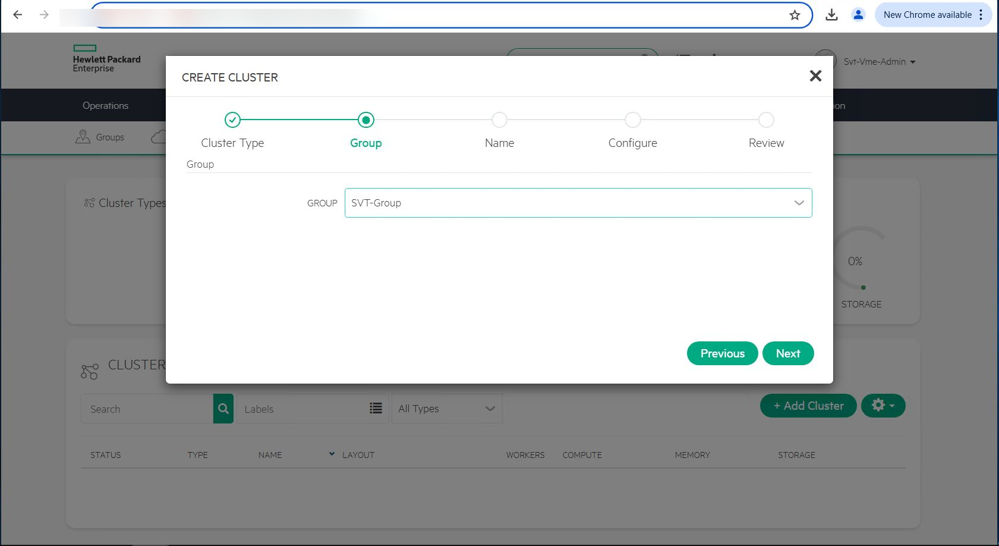

#### Step 03. 클러스터 명칭 및 Cloud 환경 매핑
클러스터의 고유 식별 명칭(Name, 예: `HVM-SVT-CLUSTER-01`)을 입력하고, 연동할 Private Cloud 환경을 매핑합니다.

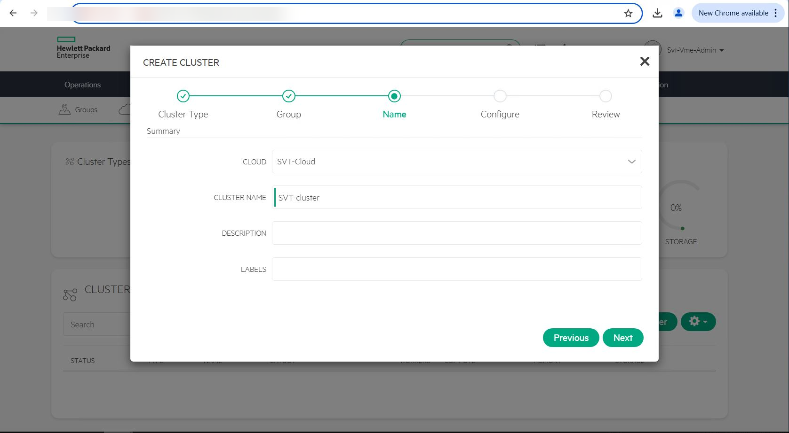

#### Step 04. HVM 호스트(노드) 등록 및 네트워크 구성
[Step 3]에서 초기 설정을 마친 HVM 노드 1번과 노드 2번의 관리 IP와 자격 증명을 입력하여 클러스터 멤버 호스트로 등록합니다. 관리 네트워크 인터페이스를 연결하고 검증합니다.

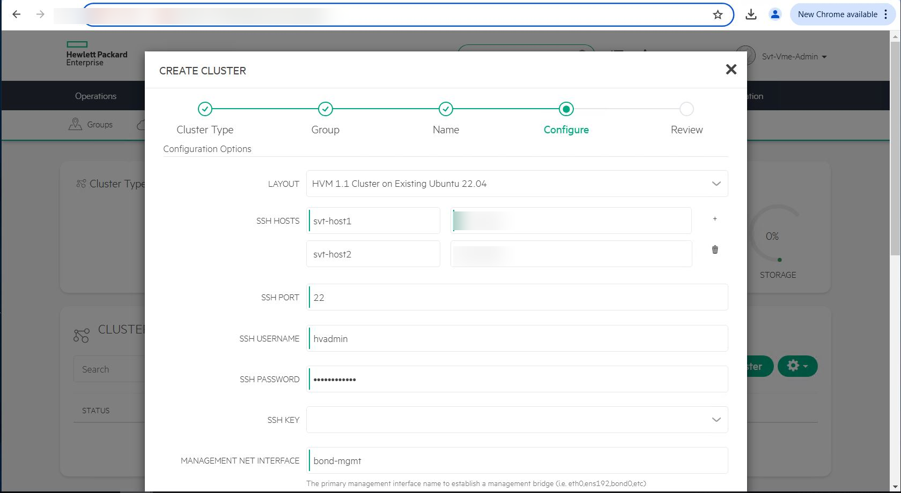

> [!TIP]
> **💡 실무 현장 팁: 노드 등록 시 소요 시간 (Corosync 클러스터 동기화)**  
> 노드 2대(또는 4대)를 클러스터 멤버로 등록할 때, 백그라운드에서 각 호스트 간 **Corosync 클러스터링 데몬 기동, 상호 노드 인증, 통신 링(Ring) 구성 및 관리 에이전트 자동 배포**가 진행됩니다.  
> 이로 인해 웹 화면에서 등록 진행 상태가 **수 분간 유지되며 다소 시간이 소요**됩니다. 이는 정상적인 클러스터 빌드업 과정이므로 브라우저를 새로고침하거나 창을 닫지 마시고 차분히 완료를 기다려 주시기 바랍니다.

#### Step 05. CPU 아키텍처 및 가상머신 배치(Placement) 정책 구성
클러스터 내 물리 서버의 CPU 모델 및 코어 아키텍처를 확인하고, 향후 구동될 가상머신들의 자원 분배 및 배치(Placement) 정책을 설정합니다.

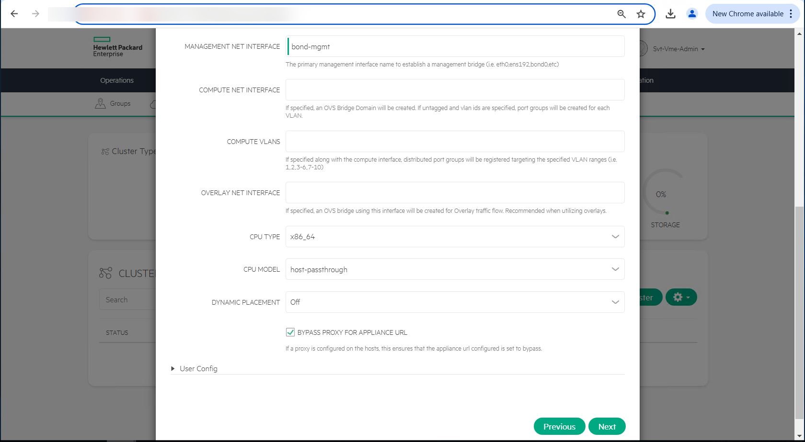

#### Step 06. 구성 정보 최종 검토(Review) 및 클러스터 생성 실행
호스트 멤버, 네트워크 파라미터, 스케줄링 정책 등 입력한 모든 클러스터 설정을 종합 검토(Review)한 후 **[Complete]** 버튼을 클릭하여 HVM 클러스터 생성을 최종 트리거합니다.

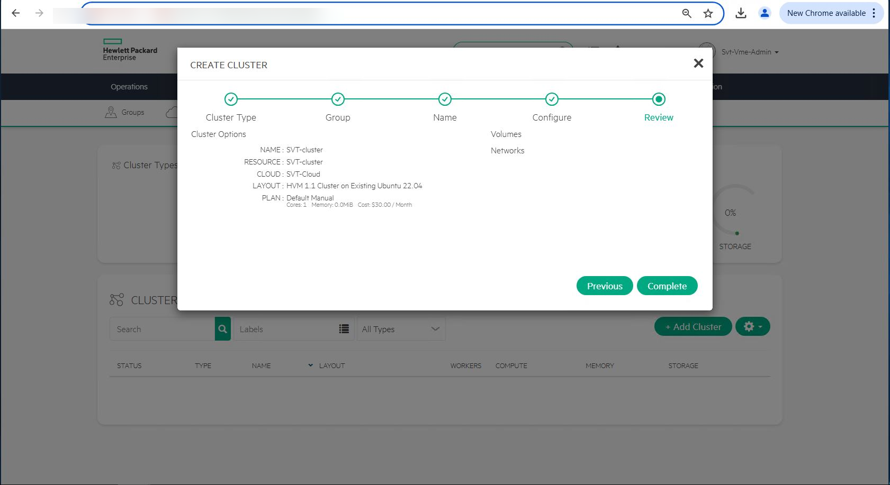

#### Step 07. 클러스터 프로비저닝(Provisioning) 진행 상태 확인
클러스터 관리 목록으로 돌아오면 신규 생성된 HVM Cluster의 상태가 `Provisioning`으로 표시되며 백그라운드 작업이 활발히 진행됩니다.


#### Step 08. 클러스터 정상(OK) 상태 활성화 확인
모든 물리 노드 간의 쿼럼 및 에이전트 동기화가 완료되면 클러스터 상태가 안정적인 녹색의 **`OK`**로 전환됩니다.

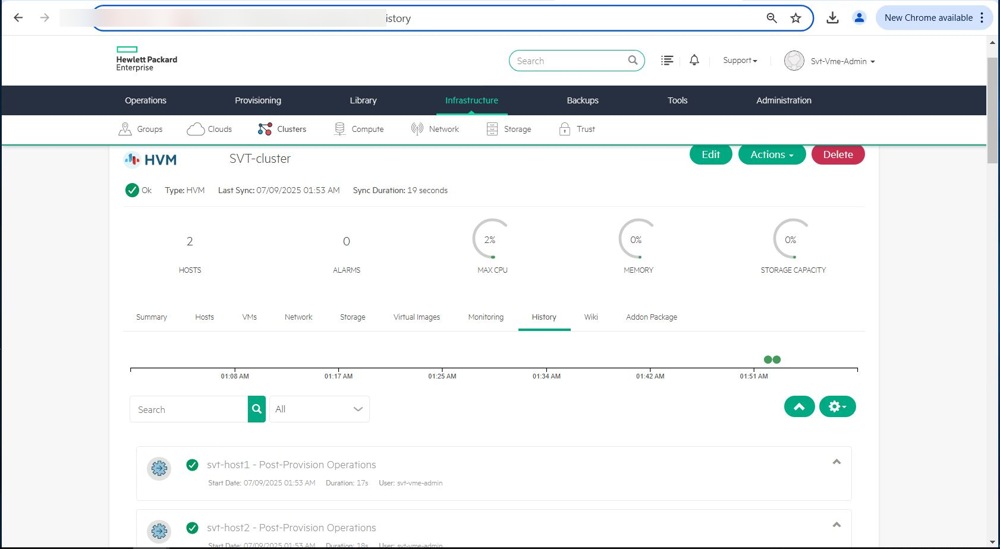

#### Step 09. History 및 Corosync 클러스터링 이벤트 로그 검증
클러스터 상세 화면의 **[History]** 탭으로 이동하여 호스트 추가 완료, Corosync 클러스터링 성공, 모니터링 에이전트 정상 바인딩 로그를 확인합니다.

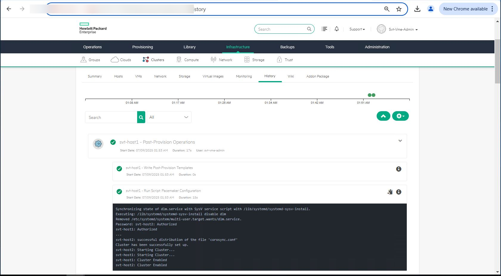

#### Step 10. 소속된 HVM 호스트 목록 및 헬스 상태 확인
**[Infrastructure] -> [Hosts]** 메뉴에서 클러스터에 소속된 물리 노드 2대가 모두 `Active / Healthy` 상태로 정상 인식되고 있는지 확인합니다.

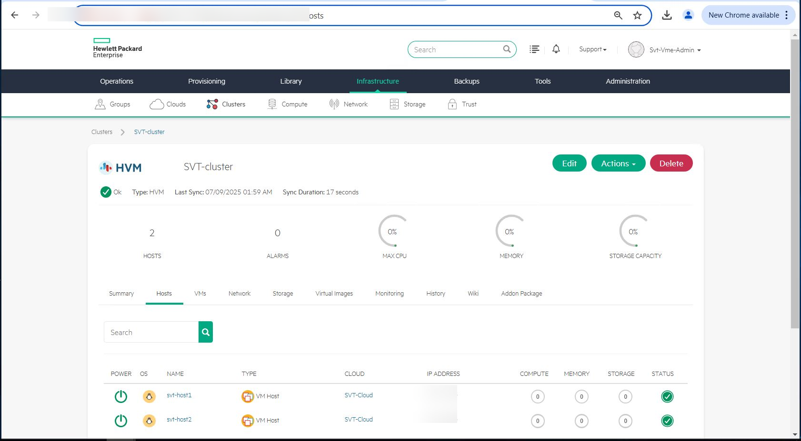

#### Step 11. 호스트 내 VME Manager 인프라 VM 구동 상태 최종 확인
호스트 상세 뷰에서 [Step 2]에서 관리 노드 상에 구축했던 **VM Essentials Manager 인프라 가상머신**이 정상적으로 서비스 중인지 교차 점검합니다.

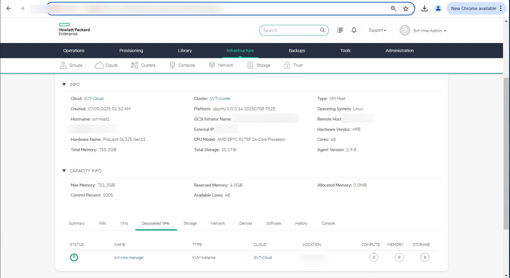

---

### 3.2 Phase 2: SimpliVity Virtual Controller (OVC) 배포 (Step 12 ~ Step 20)

HVM 클러스터 토대가 완성되었으므로, 이제 SimpliVity 가상 스토리지 계층을 구성하는 OVC(SVA) 자동 배포를 진행합니다.

#### Step 12. SimpliVity Addon 패키지 선택
클러스터 메뉴에서 SimpliVity 배포 마법사를 시작합니다. Addon 패키지 선택 화면에서 **`SimpliVity Virtual Controller (OVC)`** 배포 패키지를 지정합니다.

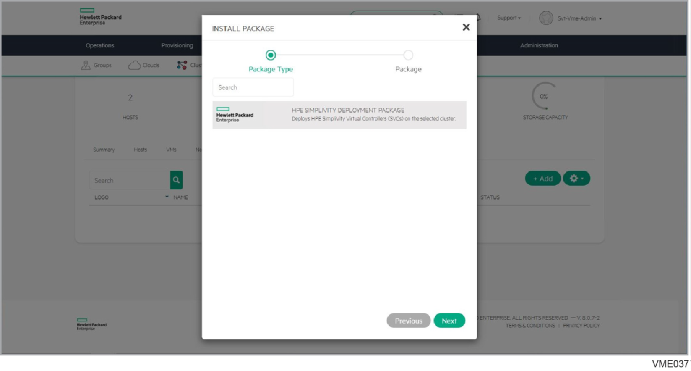

#### Step 13. 대상 호스트 검색 및 사전 요건 준비 상태 확인
배포 대상이 될 HVM 노드 1번과 2번의 하드웨어 리소스, 스토리지 컨트롤러 인식 상태 및 사전 요건을 자동 스캔하여 준비 완료(Ready) 상태를 확인합니다.

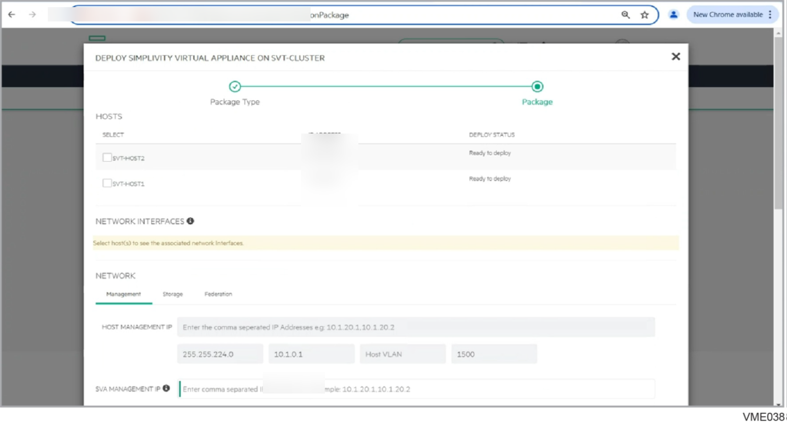

#### Step 14. 10G 고속 네트워크 인터페이스 매핑
각 노드의 백본 통신을 담당할 10GbE 인터페이스(`ens21f0np0`, `ens21f1np1`)를 SimpliVity 스토리지 및 페더레이션 트래픽 전용 인터페이스로 매핑합니다.

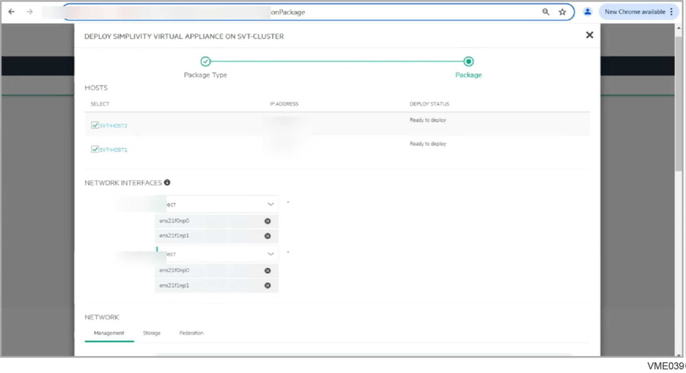

> [!IMPORTANT]
> **🚀 10G NIC 전용 매핑 필수**  
> SimpliVity의 실시간 인라인 중복제거, 압축 및 노드 간 실시간 동기식 블록 미러링은 매우 높은 대역폭과 극도로 낮은 지연시간을 요구합니다. 반드시 **10GbE 이상 고속 NIC(`ens21f0np0`, `ens21f1np1`)**를 전용으로 매핑해야 합니다.

#### Step 15. 호스트 및 OVC Management IP / Gateway 설정
HVM 물리 호스트의 관리 IP와 각 노드에 배포될 OVC(SVA)의 관리용 IP(Management IP), 서브넷 마스크, 디폴트 게이트웨이를 입력합니다.

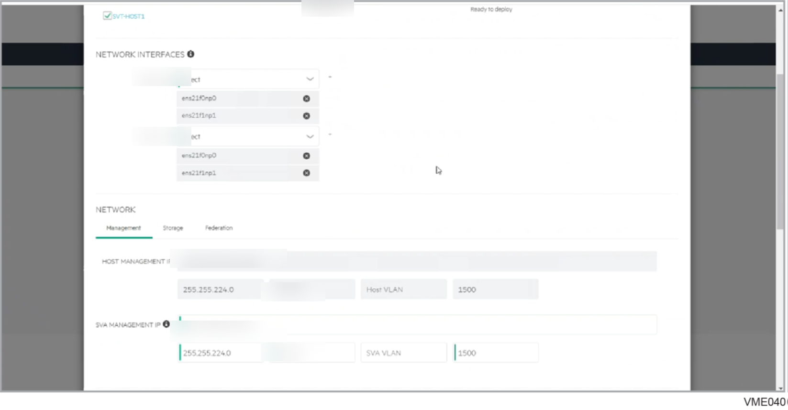

#### Step 16. Storage 네트워크 IP 및 점보 프레임(MTU 9000) 설정
SimpliVity 노드 간 전용 스토리지 블록 복제 통신을 위한 Storage IP 대역과 독립된 VLAN ID(예: VLAN 151)를 구성합니다.

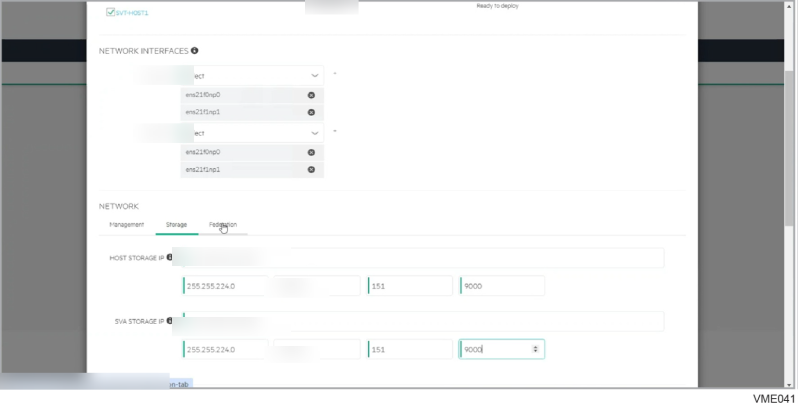

> [!IMPORTANT]
> **📦 Storage 네트워크 점보 프레임(MTU 9000) 필수**  
> 스토리지 데이터 블록의 고속 전송을 위해 네트워크 MTU는 반드시 **`9000`**으로 설정해야 합니다. 노드 설정뿐만 아니라 상단 물리 L2/L3 스위치의 해당 VLAN 포트에서도 점보 프레임(MTU 9000 or 9216)이 활성화되어 있어야 패킷 드롭이 발생하지 않습니다.

#### Step 17. Federation 네트워크 IP 및 점보 프레임(MTU 9000) 설정
글로벌 SimpliVity 클러스터 간 메타데이터 동기화 및 원격 백업 통신을 담당하는 Federation IP 대역과 독립된 VLAN ID(예: VLAN 153)를 구성합니다.

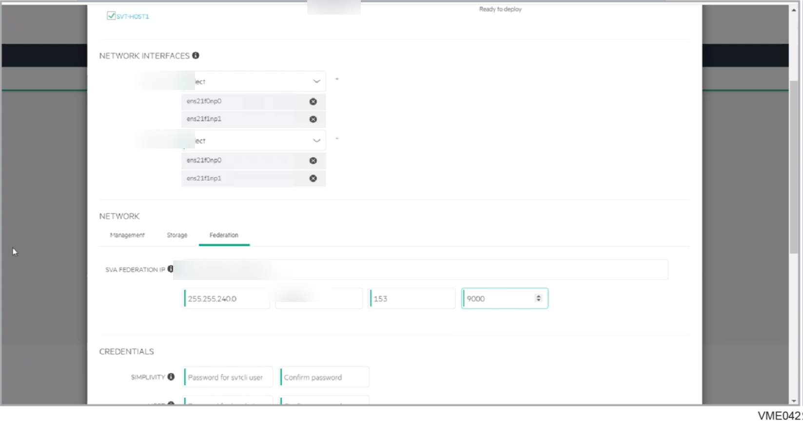

> [!NOTE]
> Federation 네트워크 역시 고속 클러스터 메타데이터 교환을 위해 **MTU 9000** 설정을 유지합니다.

#### Step 18. DNS, NTP, 자격 증명 및 Arbiter 연동 검증
도메인명, 사내 DNS 서버 IP, OVC 관리자 자격 증명(`svtcli` 및 `hvadmin` 패스워드)을 입력합니다.  
이어서 사내 NTP 서버 주소와 [Step 2]에서 구축한 **External Arbiter VM IP**를 지정한 후 하단의 **[Validate]**를 실행합니다.

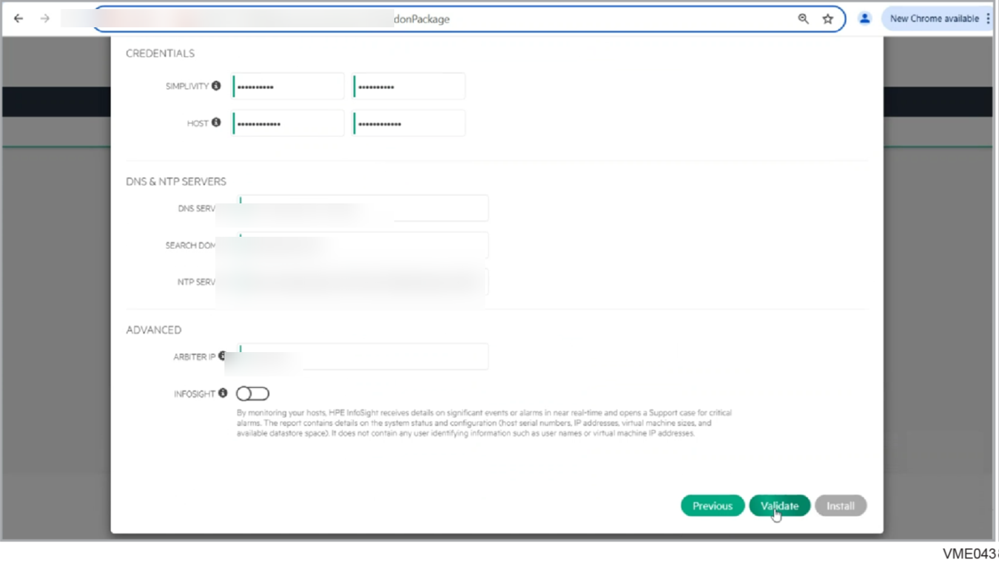

> [!CAUTION]
> **⚠️ 배포 전 필수 체크포인트: NTP 통신 & Arbiter 사전 검증 (Validate)**  
> 1. **NTP 서버 통신 요건**: 등록된 사내 NTP 서버(최대 3대) 중 **최소 1대 이상과 반드시 시간 동기화 패킷(UDP 123)이 정상 통신**되어야 사전 검증을 통과할 수 있습니다.  
> 2. **Arbiter 연동 검증 필수**: Arbiter VM IP를 입력한 후 반드시 **[Validate]** 버튼을 클릭하여 결과가 초록색 **Pass**로 나오는지 확인해야 합니다. [Step 2]에서 구축한 Arbiter VM의 `TCP 22122` 포트가 방화벽에 막혀있거나 통신이 되지 않으면 OVC 배포 작업이 즉시 실패합니다.

#### Step 19. OVC 자동 배포 진행 (Deploying SimpliVity Controllers)
사전 검증(Validate)이 정상 통과되면 **[Deploy OVCs]** 버튼을 눌러 자동 배포를 시작합니다.  
VME Manager가 두 물리 노드 상에 OVC 가상머신을 생성하고, 하드웨어 컨트롤러 패스스루, 전용 스토리지 볼륨 포맷, 쿼럼 페어링 및 서비스를 자동 구동합니다. (현장 환경에 따라 약 **30~45분 소요**)

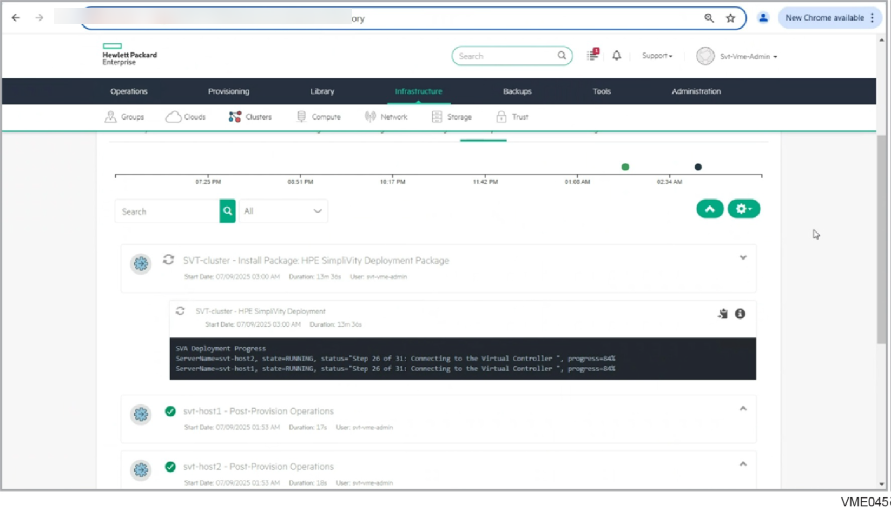

#### Step 20. OVC 배포 최종 완료 및 가상화 스토리지 계층 정상화 확인
배포 진행률이 100%에 도달하고 배포 마법사가 **`Completed`**로 성공적으로 종료됩니다. HVM 클러스터 상에 SimpliVity 6.2.0 가상 스토리지 계층이 완벽하게 안착되었습니다.

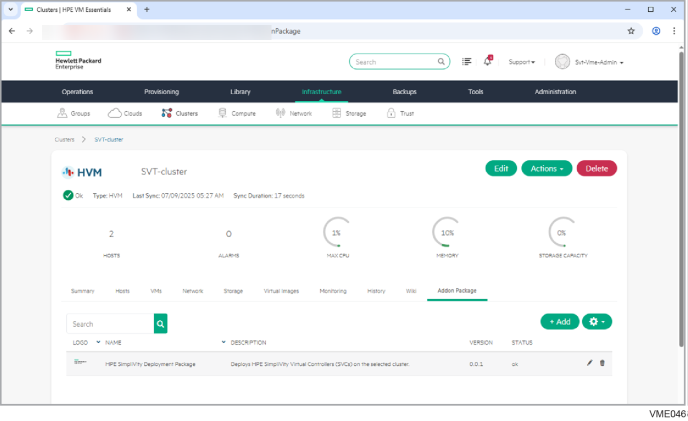

---

## 4. 배포 완료 후 CLI 최종 검증 (Verification)

웹 콘솔에서 배포가 성공적으로 완료되었다면, 터미널을 열고 OVC 1번 관리 IP로 SSH 접속하여 SimpliVity 핵심 CLI 명령어로 클러스터 및 하드웨어 헬스 상태를 최종 검증합니다.

```bash
# 1. OVC 1번 노드 SSH 접속 (기본 계정: svtcli 또는 admin)
ssh svtcli@<OVC_Node1_Mgmt_IP>

# 2. 페더레이션 및 Arbiter 쿼럼 연동 상태 확인
sudo svt-federation-show
```

### 📋 `svt-federation-show` 정상 출력 기준
* **Node 1 & Node 2 Status**: 두 노드 모두 **`Alive`** 상태여야 합니다.
* **Arbiter Status**: [Step 2]의 Arbiter VM과 정상 연결되어 **`Connected`**로 표시되어야 합니다.
* **Cluster Quorum Status**: **`Normal`** (또는 `Healthy`)로 표시되어 2노드 고가용성 쿼럼이 정상 작동 중임을 확인합니다.

```bash
# 3. 하드웨어 구성 요소 및 스토리지 가속기 상태 점검
sudo svt-hardware-show

# 4. 스토리지 풀 및 데이터스토어 용량 상태 점검
sudo svt-storage-show
```
* 파워서플라이(PSU), 드라이브 디스크, PCIe 스토리지 가속 카드(Accelerator Card) 상태가 모두 **`OK`**인지 확인합니다.

---

## 5. 16년 차 엔지니어의 실전 팁 (Troubleshooting & Real-world Tips)

> [!WARNING]
> **🚨 현장 구축 시 가장 빈번하게 마주치는 트러블슈팅 Top 3**
> 
> 1. **OVC 배포 중 Arbiter Connection Timeout 에러**  
>    * **원인**: Arbiter VM의 `TCP 22122` 포트가 OS 방화벽(`ufw` 등)에 의해 차단되었거나, OVC 관리망과 Arbiter VM 간 L3 라우팅/게이트웨이 설정이 누락된 경우입니다.  
>    * **해결**: [Step 2]에서 구성한 Arbiter VM 콘솔에서 `sudo ufw status` 또는 `netstat -tlpn | grep 22122` 명령으로 포트 수신 대기 상태를 점검하고, 양방향 핑 및 텔넷(`telnet <Arbiter_IP> 22122`) 테스트를 진행하세요.
> 
> 2. **Storage / Federation 네트워크 MTU 불일치 (블록 동기화 불가 현상)**  
>    * **원인**: VME 웹 콘솔에서는 MTU 9000으로 지정했으나, 상단 물리 L2/L3 스위치 포트가 기본 MTU 1500으로 설정되어 있는 경우입니다.  
>    * **증상**: 단순 Ping은 정상 전달되나, OVC 간 실시간 대용량 스토리지 블록 미러링 트래픽이 통과하지 못해 클러스터 상태가 `Degraded`로 떨어집니다.  
>    * **해결**: 스위치 포트 점보 프레임을 확인하고, OVC CLI에서 패킷 분할 금지 옵션(`ping -M do -s 8972 <상대_OVC_Storage_IP>`)으로 9000 바이트 통신을 물리적으로 검증하세요.
> 
> 3. **노드 간 NTP 시간 오차로 인한 스토리지 서비스 자가 보호 중단**  
>    * **원인**: 두 노드 간 시스템 시간이 1,000ms(1초) 이상 어긋나면 데이터 정합성 왜곡을 방지하기 위해 OVC 내부 스토리지 서비스가 자가 보호 모드로 정지됩니다.  
>    * **해결**: 모든 노드와 Arbiter VM이 [Step 1]에서 설정한 사내 NTP 서버를 바라보도록 동기화하고, `chronyc tracking` 또는 `ntpq -p`로 오차가 10ms 이내인지 확인하세요.

---

## 6. 결론 및 핵심 요약 (전체 5단계 시리즈 완결 🎉)

이로써 **HPE SimpliVity 6.2.0 for HPE Morpheus VM Essentials (HVM)** 2노드 클러스터 구축의 모든 실전 프로세스가 대단원의 막을 내렸습니다!

사전 네트워크 설계부터 관리 인프라 구축, 물리 서버 초기화, HVM 클러스터 생성, 그리고 OVC 자동 배포까지 전 과정을 완벽히 마스터하셨습니다.

### 📌 오늘의 핵심 요약 3가지
1. **클러스터 생성 시 Corosync 동기화 인내**: VME Manager에서 노드 등록 시 백그라운드 클러스터링 구성으로 수 분간 시간이 소요되므로 대기합니다.
2. **10G 전용 매핑 & 점보 프레임(MTU 9000)**: 스토리지와 페더레이션 네트워크는 반드시 10GbE 전용 인터페이스와 MTU 9000으로 구축합니다.
3. **사전 검증(Validate) & Arbiter 연동**: 배포 전 NTP 통신 및 Arbiter(Port 22122) 검증을 통과한 후 배포를 실행하고, CLI에서 `svt-federation-show`로 최종 `Alive / Connected` 상태를 확인합니다.

---

### 🔗 HPE SimpliVity 6.2.0 실전 연재 전체 시리즈 바로가기

| 단계 | 포스팅 링크 | 핵심 내용 |
| :---: | :--- | :--- |
| **PreStep** | **[사전 설치 준비 & 2노드 네트워크 설계 가이드](../simplivity-00-install-prep/)** | IP/VLAN 설계, 스위치 포트 점보프레임, 필수 소프트웨어 |
| **Step 1** | **[관리서버 BaseOS HVM 24.04 & 인프라 구성](../simplivity-01-baseos-infra-setup/)** | Ubuntu BaseOS 설치, 사내 NTP/DNS/NFS 인프라 구축 |
| **Step 2** | **[관리서버 VME Manager VM & Arbiter VM 설치](../simplivity-02-vme-mgr-arbiter/)** | KVM 가상머신 배포, VME 웹 콘솔 초기화, Arbiter 쿼럼 데몬 |
| **Step 3** | **[SimpliVity 노드 펌웨어 업데이트 & Initial Setup](../simplivity-03-node-initial-setup/)** | SPP 펌웨어 최신화, BaseOS 리이미징, https://IP:9292 초기 설정 |
| **Step 4** | **[현재글] [HVM Cluster 생성 & SimpliVity OVC 배포](./)** | HVM Cluster 생성, 10G/MTU 9000 OVC 자동 배포, CLI 검증 |

---

긴 연재 시리즈를 함께해 주셔서 진심으로 감사드립니다! 실무 구축 현장에서 발생하는 기술 문의나 트러블슈팅 질문은 언제든 댓글로 남겨주시면 성심껏 답변드리겠습니다.
