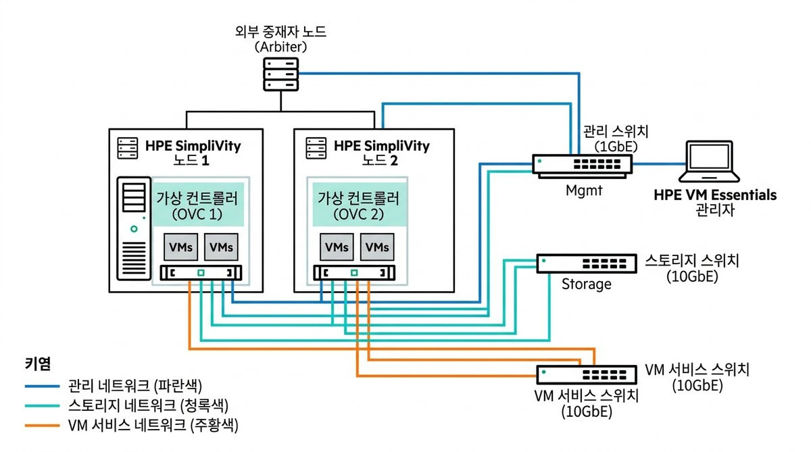
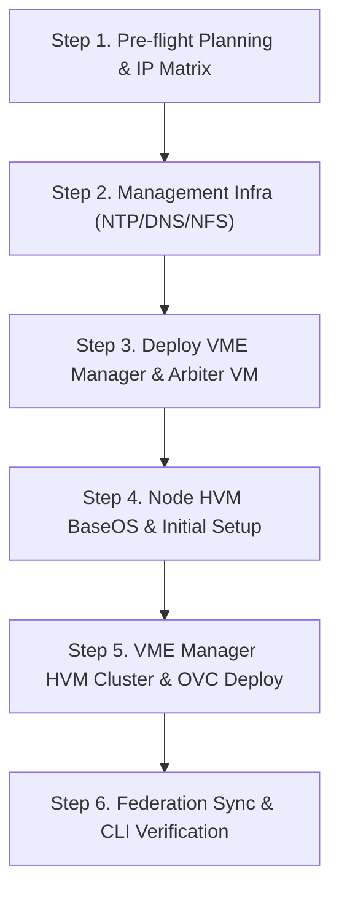
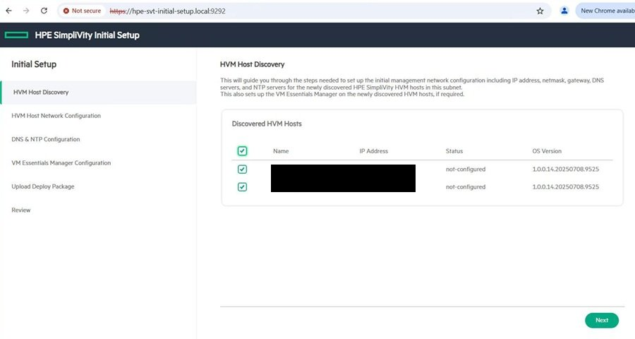
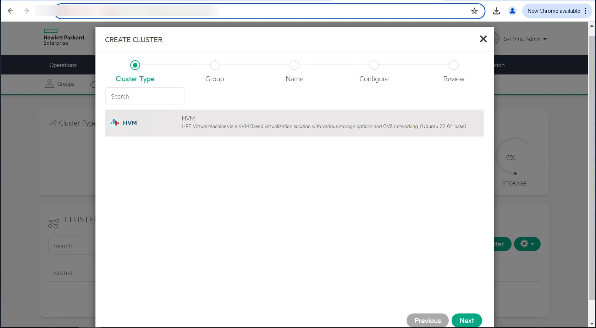
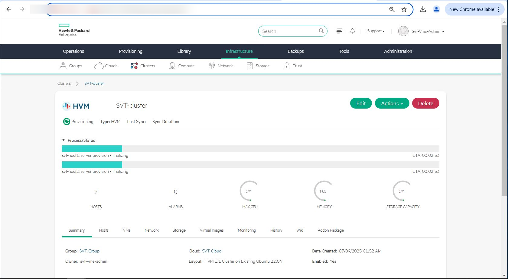
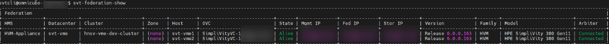

> **Author**: 16-Year IT Systems Field Engineer (CK notes)  
> **Environment**: HPE SimpliVity 380 Gen10/Gen11, HPE VM Essentials (VME / Morpheus-based), HVM 24.04 BaseOS

---

With VMware's recent licensing changes, many enterprise data centers are looking closely at lightweight, KVM-based virtualization alternatives. One viable enterprise solution is **HPE SimpliVity 6.2.0 powered by HPE VM Essentials (VME)**.

In my 16 years as an infrastructure engineer deploying servers and SAN fabrics, I have found that 90% of HCI deployment failures boil down to two things: **sloppy physical/VLAN network segmentation** and **misplaced quorum (Arbiter) architecture**.

This guide condenses the entire deployment lifecycle—from pre-flight network planning to management server staging, node initialization, and automated OVC provisioning via VME Manager—with battle-tested field troubleshooting insights.

---

## 1. 2-Node Network Architecture & Golden Rules

A 2-node SimpliVity cluster delivers high availability at a modest footprint. However, if physical links and logical VLANs are not strictly isolated, storage I/O and federation handshakes will collide, leading to split-brain or degraded clusters.



### Five Mandatory Network Segments

| Segment | Bandwidth | MTU | Purpose & Practical Field Tips |
| :--- | :---: | :---: | :--- |
| **1. iLO Out-of-Band** | 1 Gbps | 1500 | Dedicated out-of-band management & remote console (physically isolated switch recommended). |
| **2. Management** | 1 Gbps / 10 Gbps | 1500 | Host BaseOS, VME Manager UI, and OVC control communications. |
| **3. Storage** | **10 Gbps / 25 Gbps** | **9000 (Jumbo)** | **[CRITICAL]** Real-time node data mirroring. Must enable MTU 9000 end-to-end. |
| **4. Federation** | 10 Gbps | 1500 | SimpliVity inter-OVC cluster metadata catalog & synchronization. |
| **5. VM Workload** | 10 Gbps | 1500 | Production tenant VM service traffic (isolated customer VLANs). |

> 💡 **Field Troubleshooting Note: Jumbo Frame (MTU 9000) Mismatch**  
> If you set MTU 9000 on the host interface but forget to enable Jumbo frames on the upstream L2 top-of-rack switch port or SVI, packets will silently drop. If your OVC provisioning stalls at around 70-80%, check your storage switch MTU immediately.

---

## 2. End-to-End Workflow



---

## 3. External Management & Arbiter Quorum Setup

In a 2-node cluster, the **Arbiter** acts as an independent tie-breaker (quorum witness) to prevent split-brain scenarios when network connectivity between nodes degrades.


### ⚠️ Golden Rule for Arbiter Placement
* **Never** host the Arbiter VM inside the SimpliVity datastore it arbitrates.
* If a node fails and the Arbiter VM was on that crashed node, the surviving node loses quorum and storage services freeze immediately.
* **Best Practice**: Place the Arbiter on an independent 1U standalone management server, or a distinct third-party virtualization host outside the SimpliVity cluster.

### Strict NTP Time Synchronization
Ensure all components (physical hosts, VME Manager, OVCs, Arbiter) sync with a rock-solid NTP source. If clock drift exceeds **5 seconds**, TLS certificate handshakes and OVC federation authentication will fail.

---

## 4. Physical Node Setup: HVM BaseOS & Initial Setup

After rack mounting and cabling, boot the nodes via iLO Virtual Media to flash HVM 24.04 BaseOS.


1. **iLO Virtual Media**: Mount the HVM BaseOS ISO and execute a one-time boot installation.
2. **Initial Setup TUI**:
   * Log into the host console and run `initial_setup`.
   * Configure hostname, management IP, default gateway, DNS, and NTP.
   * Verify link status on 10G/25G physical adapters using `ethtool` before proceeding.



---

## 5. VME Manager: HVM Cluster Creation & OVC Auto-Deployment

Access the VME Manager web interface (`https://<VME-Manager-IP>`) to initiate the cluster deployment wizard.



### Key Deployment Wizard Parameters
1. **Cluster Type**: Select `HVM Cluster` and provide a descriptive name.
2. **Host Selection**: Discover and add the two physical nodes configured during `initial_setup`.
3. **SimpliVity Add-on**:
   * Select SimpliVity 6.2.0 package.
   * Allocate dedicated OVC Management, Storage, and Federation IPs.
   * Provide the Arbiter IP and root credentials.
4. **Automated Provisioning**:
   * OVC template rollout, interface binding, Corosync cluster setup, and storage datastore initialization proceed automatically.



Once finished, all host and cluster statuses turn green (`OK`), and the unified resilient storage pool becomes ready in the VME Manager dashboard.


---

## 6. Post-Deployment Verification CLI Cheat Sheet

Never rely solely on GUI green checkmarks. Log in via SSH to the OVC and run CLI diagnostic commands to verify cluster health:



```bash
# 1. Overall federation balance and health
dsv-balance-show

# 2. Node and OVC status check
svt-node-show

# 3. Verify 2-node Arbiter connection (Must state "Connected")
svt-arbiter-show

# 4. Inspect real-time deduplication and storage capacity
svt-datastore-show
```

---

## 7. Real-World Field FAQ & Troubleshooting

### Q1. OVC provisioning freezes around 75% and times out.
* **Cause**: Storage network (10G/25G) MTU mismatch or blocked Arbiter ports (TCP 9999).
* **Fix**: Run a jumbo ping from the host console to verify MTU integrity:
  ```bash
  ping -M do -s 8972 <remote_storage_ip>
  ```
  If it fails, audit your upstream switch ports and VLAN MTU settings.

### Q2. If one node powers down unexpectedly, does storage failover immediately?
* **Answer**: If the Arbiter is `Connected`, failover is instantaneous (0 seconds) with no storage disruption to surviving VMs. For planned maintenance, however, always perform a live migration of workloads to the healthy node first.

---

## Wrap-Up

HPE SimpliVity with VME offers a reliable enterprise alternative for modern HCI. Adhering to the fundamentals—strict network isolation, end-to-end jumbo frame verification, and external Arbiter placement—guarantees a smooth, error-free deployment on day one.
