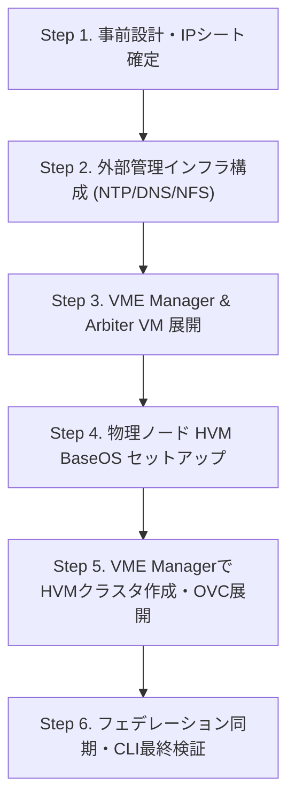

> **執筆者**: 16年目ITシステムエンジニア (CK notes)  
> **検証環境**: HPE SimpliVity 380 Gen10/Gen11, HPE VM Essentials (VME / Morpheusベース), HVM 24.04 BaseOS

---

昨今、VMwareのライセンス体系刷新を契機に、KVMベースの軽量な仮想化基盤への移行を検討する企業が急速に増えています。その有力なエンタープライズ選択肢の一つが、**HPE SimpliVity 6.2.0 と HPE VM Essentials (VME)** によるHCI基盤です。

16年間にわたり現場でサーバーやストレージを構築してきた経験から断言できるのは、HCI構築の成否は**「事前にネットワークセグメントとArbiter（仲裁者）構造をどれだけ緻密に設計したか」**に9割以上かかっているということです。

本記事では、**事前ネットワーク設計から外部管理インフラ構築、物理ノード初期化、VME Managerを通じたクラスタおよびOVC（仮想コントローラ）自動展開まで**の全工程を、現場エンジニアの視点で要点だけを凝縮して解説します。

---

## 1. 失敗しない2ノードネットワーク設計（現場の鉄則）

2ノード構成は高いコストパフォーマンスを誇りますが、物理リンクと論理VLANが厳密に分離されていないと、ストレージトラフィックと制御通信が干渉しクラスタ障害を引き起こします。


### 必須5大ネットワークセグメント

| セグメント名 | 推奨帯域 | MTU | 役割および現場の注意事項 |
| :--- | :---: | :---: | :--- |
| **1. iLO Out-of-Band** | 1 Gbps | 1500 | 物理サーバーのリモート監視および仮想コンソール専用。 |
| **2. Management（管理網）** | 1 Gbps / 10 Gbps | 1500 | ホストBaseOS、VME Manager UI、OVC管理通信用。 |
| **3. Storage（ストレージ網）** | **10 Gbps / 25 Gbps** | **9000 (ジャンボ)** | **【最重要】** ノード間のリアルタイムデータミラーリング。エンドツーエンドでMTU 9000必須。 |
| **4. Federation（連携網）** | 10 Gbps | 1500 | SimpliVity OVC間のクラスタメタデータ同期用。 |
| **5. VM Workload（業務網）** | 10 Gbps | 1500 | 稼働するテナント仮想マシンのサービス通信用（VLAN分離）。 |

> 💡 **現場トラブルシューティングのツボ：ジャンボフレーム（MTU 9000）不整合**  
> ホスト側だけMTU 9000に設定し、対向のL2スイッチ側でジャンボフレームを有効化し忘れると、パケットが静かにドロップされます。OVC展開が70〜80%でタイムアウト停止する場合、99%ストレージスイッチのMTU設定漏れが原因です。

---

## 2. 全体構築ワークフロー



---

## 3. 外部管理サーバーおよびArbiter（仲裁者）構成

2ノード構成では、スプリットブレイン（両ノードが自分がアクティブだと誤認してデータが破損する現象）を防ぐために**Arbiter（アービター）**が不可欠です。


### ⚠️ Arbiter配置における絶対厳禁事項
* **厳禁**: Arbiter VMを、構築対象であるSimpliVityの内部データストア上に配置しては**絶対になりません**。
* **理由**: ノード障害時にArbiterごとダウンすると、残った健全なノードもクォーラム（定足数）を喪失してストレージI/Oが全面停止するためです。
* **正解**: Arbiterは外部の独立した1U管理サーバー、または既存の別仮想化ホスト上に配置します。

---

## 4. 物理ノード初期化：HVM BaseOS & Initial Setup

サーバーのケーブリング完了後、iLO Virtual Media経由でHVM 24.04 BaseOSをインストールします。


1. **iLO Virtual Media**: HVM BaseOS ISOをマウントしOne-Time Bootで導入。
2. **Initial Setup TUI**:
   * コンソールで `initial_setup` を実行。
   * ホスト名、Management IP、ゲートウェイ、DNS、NTPを設定。
   * `ethtool` 等で10G/25GインターフェースのLink UP状態を確認。


---

## 5. VME Managerによるクラスタ作成＆OVC自動展開

準備が整ったらVME ManagerのWebコンソールにアクセスし、OVC展開ウィザードを実行します。


* **Cluster Type**: `HVM Cluster` を選択。
* **ホスト追加**: 初期設定を終えた2台の物理ノードを検出・指定。
* **SimpliVity Add-on**: OVC用の各IP（管理・ストレージ・フェデレーション）およびArbiter IPを入力。
* **自動プロビジョニング**: OVCテンプレート展開、Corosync構成、ストレージプール初期化が全自動で進行。


---

## 6. CLIによる最終稼働検証

GUIのグリーン表示だけでなく、SSHでノードにログインしてCLIレベルでクォーラム状態を検証します。


```bash
# 1. クラスタ全体のバランシングと健全性確認
dsv-balance-show

# 2. SimpliVityノードおよびOVCステータス確認
svt-node-show

# 3. Arbiter接続状態の確認 (Connected必須)
svt-arbiter-show

# 4. 重複排除・圧縮率とストレージ容量確認
svt-datastore-show
```

---

## 現場トラブルFAQ

### Q. OVCの展開が75%付近でタイムアウトエラーになります。
* **原因**: ノード間ストレージ通信のMTU不整合、またはArbiterポート（TCP 9999等）のFW遮断です。
* **対策**: ホストコンソールからジャンボPing（`ping -M do -s 8972 <対向Storage_IP>`）を実行し、L2スイッチのMTUを再確認してください。

---

## おわりに

HPE SimpliVity with VMEは、今後の仮想化基盤として極めて実用的なソリューションです。ネットワーク分離とArbiter配置の原則を徹底すれば、現場での無用なトラブルを防ぎ、安定した本番稼働を実現できます。
