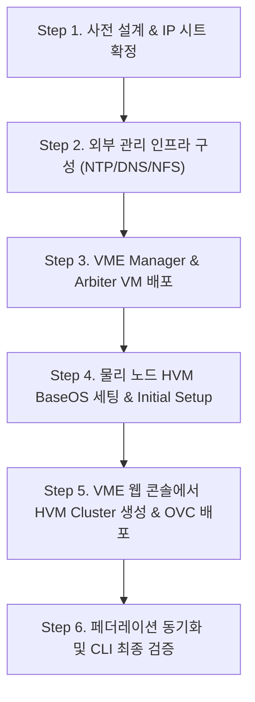

> **글쓴이**: 16년 차 IT 시스템 엔지니어 (CK notes)  
> **환경 기준**: HPE SimpliVity 380 Gen10/Gen11, HPE VM Essentials (VME / Morpheus 기반), HVM 24.04 BaseOS

---

최근 엔터프라이즈 인프라 시장에서 VMware 라이선스 정책 변화로 인해 KVM 기반의 경량 가상화 솔루션을 검토하는 기업이 크게 늘었습니다. 그 대안 중 하나로 주목받는 솔루션이 바로 **HPE SimpliVity 6.2.0에 적용된 HPE VM Essentials (VME)** 기반의 HCI 인프라입니다.

16년 동안 필드에서 수많은 서버와 스토리지를 납품하고 구축해 보았지만, HCI 구축 작업의 성패는 **"엔지니어가 사전에 네트워크 세그먼트와 쿼럼(Arbiter) 구조를 얼마나 치밀하게 설계했는가"**에 90% 이상 달려 있습니다. 공식 설치 매뉴얼만 대충 보고 현장에 들어갔다가는 VLAN 태깅 누락, 스토리지 점보프레임 불일치, OVC 배포 중단 등으로 야간 철야 작업을 하기 십상입니다.

이번 글에서는 **사전 설계부터 관리 인프라 구성, 노드 초기화, VME Manager를 통한 클러스터 및 OVC(두뇌 가상머신) 배포까지의 전 과정**을 실무 엔지니어 시각에서 핵심만 압축해 총정리합니다.

---

## 1. 실패 없는 2노드 네트워크 설계 (현장 엔지니어의 골든룰)

SimpliVity 2노드 구성은 적은 비용으로 고가용성을 확보할 수 있는 강력한 아키텍처이지만, 물리 케이블과 논리 VLAN이 철저히 분리되지 않으면 스토리지 트래픽이 꼬여 클러스터가 깨집니다.


### 필수 5대 네트워크 세그먼트 분리 기준

| 네트워크 구분 | 권장 대역폭 | MTU 설정 | 설명 및 주의사항 |
| :--- | :---: | :---: | :--- |
| **1. iLO 원격 관리망** | 1Gbps | 1500 | 서버 하드웨어 원격 콘솔 및 상태 점검 전용 (별도 스위치 분리 권장) |
| **2. Management (관리망)** | 1Gbps / 10Gbps | 1500 | 호스트 BaseOS, VME Manager 웹 콘솔, OVC 관리 통신용 |
| **3. Storage (스토리지망)** | **10Gbps / 25Gbps** | **9000 (점보프레임)** | **[핵심]** 노드 간 실시간 데이터 복제망. 스위치 전체에 MTU 9000 적용 필수 |
| **4. Federation (연합망)** | 10Gbps | 1500 | SimpliVity OVC 간 클러스터 메타데이터 및 카탈로그 동기화 망 |
| **5. VM Workload (서비스망)** | 10Gbps | 1500 | 실제 생성될 고객 업무용 가상머신 서비스 트래픽 (VLAN 분리) |

> 💡 **현장 트러블슈팅 꿀팁: 점보프레임(MTU 9000) 미스매치 주의**  
> 스토리지망에서 호스트 인터페이스만 MTU 9000으로 잡고, 상단 L2 스위치 포트나 VLAN 인터페이스에 점보프레임을 활성화하지 않으면 패킷이 무음으로 드롭(Silent Drop)됩니다. OVC 배포 시 70% 구간에서 원인 모를 타임아웃이 발생한다면 99% 스토리지 스위치 MTU 문제입니다.

---

## 2. 전체 구축 워크플로우 한눈에 보기

현장에서 작업할 때 단계가 꼬이지 않도록 아래의 표준 순서를 반드시 준수해야 합니다.



---

## 3. 외부 관리서버 및 아비터(Arbiter) 구성

2노드 SimpliVity 환경에서는 두 노드 사이에서 투표권(Quorum)을 행사하여 **스플릿 브레인(Split-Brain, 두 노드가 서로 자기가 살아있다고 우기며 데이터가 꼬이는 현상)**을 방지하는 **Arbiter(아비터)**가 필수입니다.


### ⚠️ 아비터 배치 시 절대 금기 사항
* **금기**: Arbiter VM을 구축 중인 SimpliVity 2노드 클러스터의 내부 스토리지에 올리면 **절대 안 됩니다.**
* **이유**: 두 노드 중 한 노드가 장애로 다운되었을 때 아비터까지 함께 멈춰버리면 남은 노드가 쿼럼을 상실하여 전체 스토리지 서비스가 먹통이 됩니다.
* **정석**: 아비터는 외부의 독립된 1U 단독 관리서버, 또는 별도의 인프라 가상화 호스트 위에 배포해야 안전합니다.

### NTP 시간 동기화의 엄격성
클러스터에 참여하는 물리 호스트, VME Manager, OVC, Arbiter 간의 시스템 시계가 **5초 이상 차이나면 TLS 인증서 핸드셰이크와 OVC 페더레이션 인증이 실패**합니다. 사내 신뢰할 수 있는 NTP 서버를 지정하거나 관리서버에 로컬 NTP 데몬(Chrony)을 띄워 완벽히 동기화하세요.

---

## 4. 물리 노드 HVM BaseOS 세팅 & Initial Setup

하드웨어 랙 마운트와 케이블링이 끝났다면 iLO 가상 미디어를 통해 HVM 24.04 BaseOS를 리이미징하고 기초 네트워크를 주입합니다.


1. **iLO Virtual Media**: HVM BaseOS ISO 이미지를 마운트하고 1회성 부팅(One-Time Boot)으로 설치를 완료합니다.
2. **Initial Setup (TUI 콘솔)**:
   * 콘솔 로그인 후 `initial_setup` 명령어를 실행합니다.
   * 호스트네임, Management IP, 게이트웨이, DNS, NTP 정보를 주입합니다.
   * 10G/25G 물리 인터페이스의 링크 상태(`ethtool`)를 점검하여 광케이블 연결 누락이 없는지 확인합니다.


---

## 5. VME Manager 기반 클러스터 생성 & OVC 자동 배포

기초 준비가 끝났다면 이제 웹 브라우저로 VME Manager(`https://<VME-Manager-IP>`)에 접속하여 SimpliVity 가상 스토리지 컨트롤러인 OVC를 배포합니다.


### 배포 위저드 핵심 설정
1. **Cluster Type**: `HVM Cluster`를 선택하고 클러스터 명칭을 지정합니다.
2. **Host Selection**: 앞서 `initial_setup`을 마친 물리 노드 2대를 검색하여 클러스터 멤버로 추가합니다.
3. **SimpliVity Add-on 활성화**:
   * OVC 배포 옵션을 체크하고 SimpliVity 6.2.0 패키지를 선택합니다.
   * 노드별 OVC 관리 IP, 스토리지 IP, 페더레이션 IP를 주입합니다.
   * 사전에 준비한 **Arbiter IP**와 **루트 비밀번호**를 정확히 입력합니다.
4. **배포 시작 및 진행 모니터링**:
   * OVC 템플릿 배포, 네트워크 바인딩, Corosync 클러스터 형성, 스토리지 볼륨 초기화가 전자동으로 진행됩니다.


배포가 완료되면 노드 상태가 `OK`로 전환되고, VME Manager 대시보드에서 2노드가 묶인 통합 가상 스토리지 풀을 확인할 수 있습니다.


---

## 6. 현장 최종 점검 CLI 치트시트

GUI에서 초록색 불이 들어왔다고 작업을 끝내면 프로 엔지니어가 아닙니다. 반드시 노드 콘솔에 SSH로 붙어 CLI 레벨에서 쿼럼과 복제 상태를 점검해야 합니다.


```bash
# 1. 페더레이션 전체 클러스터 상태 점검 (Alive 및 Connected 확인)
dsv-balance-show

# 2. SimpliVity 노드 상태 및 OVC 정상 작동 점검
svt-node-show

# 3. 2노드 아비터(Arbiter) 쿼럼 연결 상태 확인 (Connected 필수)
svt-arbiter-show

# 4. 스토리지 중복제거/압축 효율 및 실시간 용량 확인
svt-datastore-show
```

---

## 7. 16년 차 엔지니어가 전하는 현장 FAQ & 트러블슈팅

### Q1. OVC 배포 진행률이 75%에서 멈추더니 타임아웃 실패가 뜹니다.
* **원인**: 노드 간 스토리지 네트워크(10G) 통신 실패 또는 Arbiter 포트(TCP 9999 등) 방화벽 차단입니다.
* **해결**: 노드 콘솔에서 상대 노드의 스토리지 IP로 점보프레임 핑을 날려보세요:
  ```bash
  ping -M do -s 8972 <상대방_Storage_IP>
  ```
  핑이 나가지 않는다면 L2 스위치 포트의 MTU 설정 및 VLAN 태깅을 즉시 재점검해야 합니다.

### Q2. 2노드 중 1대를 재부팅하거나 전원을 내리면 서비스가 끊기나요?
* **해결**: Arbiter가 정상 작동(`Connected`) 중이라면, 1개 노드가 완전히 전원 차단되어도 0초 즉시 남은 노드가 스토리지 I/O를 전담하며 가상머신은 무중단 운영됩니다. 다만 유지보수 목적이라면 사전에 가상머신들을 정상 노드로 실시간 마이그레이션(Live Migration)한 뒤 작업하는 것이 원칙입니다.

---

## 마치며

SimpliVity with VME는 VMware 대안을 찾는 고객사들에게 매우 매력적인 고성능 HCI 솔루션입니다. 

하지만 아무리 좋은 솔루션이라도 **"정확한 네트워크 분리"**와 **"아비터 쿼럼 관리"**라는 기본 인프라 원칙을 지키지 않으면 현장에서 큰 난관에 부딪히게 됩니다. 이 가이드의 체크리스트를 바탕으로 사전 준비를 철저히 진행하신다면, 현장에서 단 한 번의 에러 없이 성공적인 클러스터 오픈을 이루실 수 있을 것입니다!
