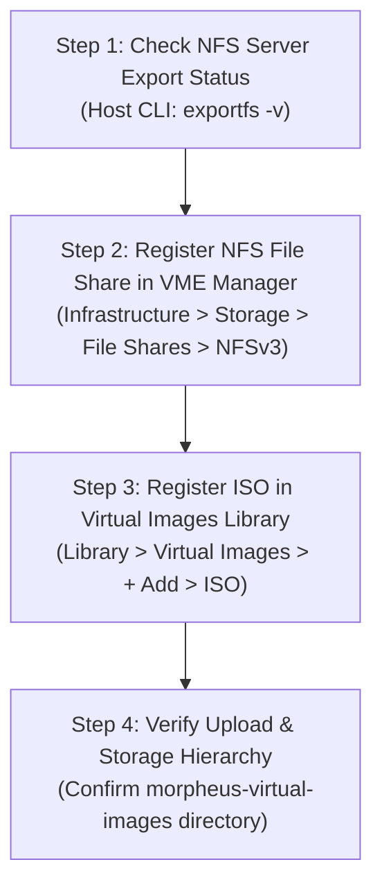

> **Author**: 16-year IT Field Systems Engineer (CK notes)  
> **Environment**: HPE Morpheus VM Essentials (VME) / HPE SimpliVity 6.2.0 (HVM 24.04 BaseOS)  
> **Reference Guide**: SimpliVity ISO Image Registration Method Guide

---

Hello! I am **CK notes**, an IT field systems engineer with 16 years of experience.

After deploying an HPE SimpliVity 6.2.0 and HPE Morpheus VM Essentials (VME) cluster, the next essential step is preparing to **create virtual machines (VMs/Instances) and install operating systems (Linux, Windows, etc.)**.

To provision virtual machines and install guest OSs in VM Essentials, you must **register OS installation ISO images into the VME Virtual Images library**. To ensure these large ISO files are safely stored and accessible across all cluster nodes, an **NFS File Share** must be connected to VME Manager.

In this guide, we walk through the entire process: **mounting the management server's NFS export folder from [Step 1] as an image datastore, uploading Ubuntu 22.04/Windows ISOs, and validating the storage layout (with 9 real-world sanitized screenshots)**!

---

## 1. End-to-End Workflow for ISO Image Registration & NFS Integration

Registering an ISO image in VME Manager follows a 4-stage process: **Storage Backend Verification ➔ File Share Registration ➔ ISO Image Upload ➔ Storage Structure Validation**.



---

## 2. 3 Key Field Engineer Pro-Tips

> [!TIP]
> **💡 Pro-Tip 1: Always Enable 'Default Virtual Image Store'!**  
> When registering the NFS File Share in VME Manager, always check **`[✔] Default Virtual Image Store`**. Enabling this ensures the NFS share is automatically selected as the target storage bucket when uploading virtual images, allowing all hosts in the cluster to mount ISOs seamlessly during VM provisioning.

> [!IMPORTANT]
> **💡 Pro-Tip 2: NFS Export Permissions (`no_root_squash` Required)**  
> To prevent write permission errors when VME Manager uploads files and creates folders, verify that the `/etc/exports` file on the Step 1 management server contains **`rw,no_root_squash,no_subtree_check`**.

> [!NOTE]
> **💡 Pro-Tip 3: Understanding VME's Internal Storage Structure**  
> When an ISO is uploaded via the VME web console, it is stored under **`/nfs/morpheus-virtual-images/<Numeric_ID>/<filename.iso>`** rather than the root `/nfs` directory. Knowing this layout is invaluable when transferring large images directly via CLI.

---

## 3. Step-by-Step ISO Registration Guide

---

### Step 01. Verify NFS Export Status (CLI)

Verify that the NFS service configured on the Step 1 infrastructure management server is actively sharing the `/nfs` directory:

```bash
# Check active NFS exports
root@vmemgr:/home/vmeadmin# exportfs -v
```


* Ensure output contains `/nfs <world>(sync,wdelay,hide,no_subtree_check,sec=sys,rw,insecure,no_root_squash,no_all_squash)`.

---

### Step 02. Navigate to Storage File Shares in VME Manager

Log in to the VME Manager console (`https://<VME_Manager_IP>`):
1. Navigate to **[Infrastructure] -> [Storage]**.
2. Select the **`File Shares`** tab.
3. Click the **`[+ Add]`** dropdown button on the right and select **`NFSv3`**.


---

### Step 03. Configure New File Share Parameters

Fill in the `New File Share` modal:


* **Name**: Storage identifier (e.g., `nfs`)
* **Host**: IP address of the NFS server (Step 1 management server)
* **Export Folder**: Path to the shared folder (e.g., `/nfs`)
* **Checkbox Options**:
  - **`[✔] Active`**: Checked
  - **`[ ] Default Backup Target`**: Unchecked (recommend separating backup storage)
  - **`[ ] Default Archive Target`**: Unchecked
  - **`[✔] Default Virtual Image Store`**: **Must be checked!**
* Click **`[Save Changes]`**.

---

### Step 04. Confirm File Share Registration

Upon returning to the File Shares list, the NFS storage displays with active parameters:
* **Name**: `nfs`
* **Provider Type**: `Nfs`
* **Share Path**: `<NFS_Server_IP>:/nfs`


---

### Step 05. Navigate to Virtual Images & Select Add ISO

To upload the ISO image:
1. Go to **[Library] -> [Virtual Images]**.
2. Click the **`[+ Add]`** dropdown and select **`ISO`**.


---

### Step 06. Configure Virtual Image Metadata & Target Bucket

Provide image details:


* **Name**: Friendly name displayed during provisioning (e.g., `Ubuntu 22.04` or `Windows Server 2022`)
* **Operating System**: Select guest OS (e.g., `ubuntu 22.04 64-bit`)
* **Min Memory**: Keep default `0` MB
* **Bucket**: Select **`nfs`** from the dropdown
* **Image ID Generation**: Select **`● File`**

---

### Step 07. Upload ISO File & Configure Advanced Options

Scroll down to upload the media and specify hypervisor options:


1. **Add File**: Select the ISO file (e.g., `ubuntu-22.04.5-live-server-amd64.iso`) or drag-and-drop it into the upload box. Wait for progress to reach 100%.
2. **Advanced Options**:
   - **`[✔] Are VirtIO drivers loaded?`**: Checked (built-in on Linux; ensure VirtIO ISO injection for Windows)
   - **`[✔] Are VM tools installed?`**: Checked
   - Check UEFI / Secure Boot / vTPM if applicable.
3. Click **`[Save Changes]`**.

---

### Step 08. Verify Upload Completion in Virtual Images List

In the Virtual Images catalog, verify the newly added ISO:
* **Type**: `ISO`
* **Name**: `Ubuntu`
* **Platform**: `ubuntu 22.04 64-bit`
* **Size**: Actual image size (e.g., `2.0 GiB`)
* **Source**: `Uploaded`
* **Status**: **`Active`**


---

### Step 09. Verify Storage Directory Structure in File Share

Check how VME structured the file on the backend:
* Go to **[Infrastructure] -> [Storage] -> [File Shares] -> `nfs`**.
* Under the file browser, verify the structure:
  - **`nfs / morpheus-virtual-images / 19 / ubuntu-22.04.5-live-server-amd64.iso`**


---

## 4. Mounting the Registered ISO During VM Provisioning

With the ISO in the library, mounting it during instance creation is simple:

1. Go to **[Provisioning] -> [Instances] -> [+ Add]**.
2. Select **`KVM`** or **`HVM`** instance type.
3. In the storage section, select **`Ubuntu (ISO)`** under the **`CD ROM`** drive dropdown.
4. Power on the VM to boot directly into the OS installation wizard.

---

## 5. Frequently Asked Questions & Troubleshooting (FAQ)

> [!WARNING]
> **Q1. Browser timeout during large ISO upload (e.g., Windows Server 5GB+).**  
> * **Cause**: Client body timeout on web reverse proxies or load balancers.  
> * **Solution**: Instead of web upload, copy the file directly to `/nfs` via SCP on the management host. Then in the VME image upload modal, select **`● URL/PATH`** (`file:///nfs/...`) to index the local file in under 1 second.

> [!WARNING]
> **Q2. Virtual image status shows 'Error' or 'Failed Upload'.**  
> * **Cause**: Insufficient disk space on the NFS volume or `Permission Denied` preventing VME from creating subdirectories.  
> * **Solution**: Check disk usage with `df -h /nfs` and verify permissions with `chmod -R 777 /nfs`.

---

## 6. Conclusion & Summary

You have successfully integrated an NFS file share into HPE SimpliVity and VME and populated the virtual image repository with OS ISOs.

### 📌 Summary Points
1. **Enable `Default Virtual Image Store`** on NFS configuration for automatic image targeting.
2. **Understand the storage hierarchy**: VME organizes media under `/nfs/morpheus-virtual-images/<ID>/`.
3. **Rapid provisioning**: Mount registered ISOs onto any new instance with a few clicks.

---

Feel free to leave comments or questions below!
