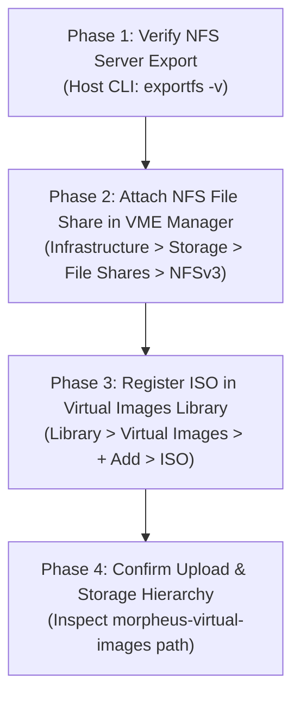
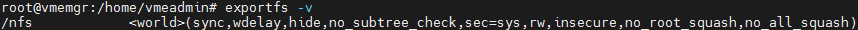
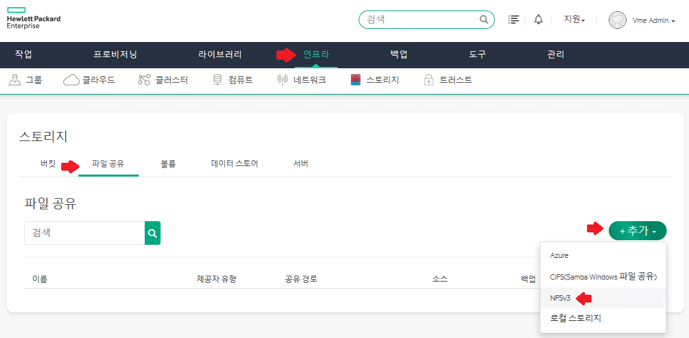
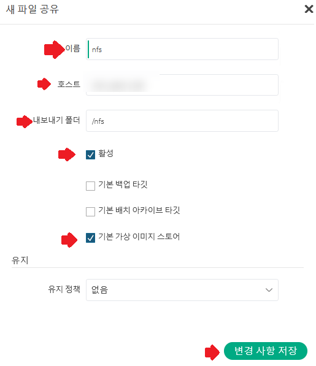
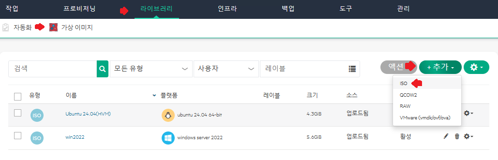
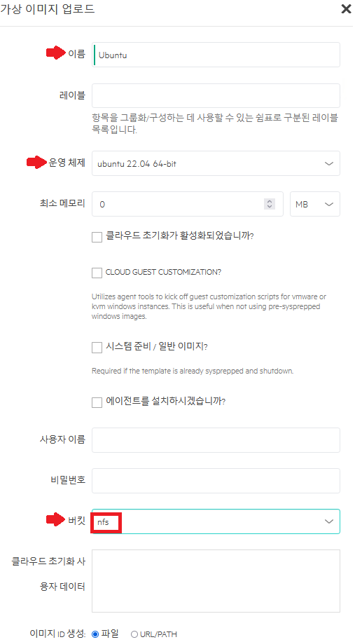
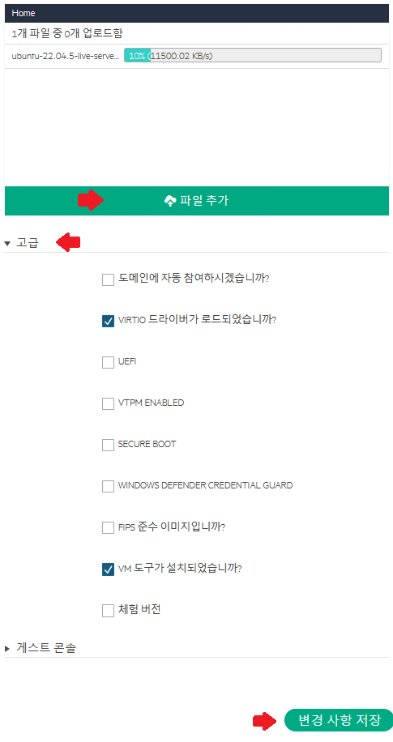
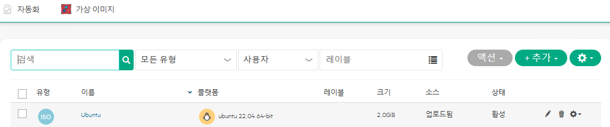
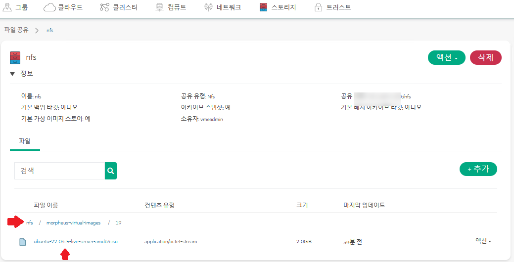

> **Environment**: HPE Morpheus VM Essentials (VME) / HPE SimpliVity 6.2.0 (HVM 24.04 BaseOS)  
> **Reference Guide**: SimpliVity ISO Image Registration Procedure Guide

---

After completing the deployment of an HPE SimpliVity 6.2.0 and VME (VM Essentials) cluster, the next operational milestone is provisioning workload virtual machines (VMs, Instances) and installing target guest operating systems (Linux, Windows Server).

In VM Essentials, deploying virtual machines from scratch requires registering OS installation ISO media in the Virtual Image Library. To ensure high-capacity ISO files are stably retained and universally accessible across all cluster nodes, an NFS file share storage backend must be pre-integrated into VME Manager.

This guide details the complete operational procedure—from registering the management server's NFS export folder as a VME image store to uploading OS installation ISO files and verifying their backend directory paths. It also covers practical workarounds for browser upload timeouts on large ISO files and essential NFS export permission considerations.

---

## 1. End-to-End Workflow

Registering virtual images into VME Manager involves four sequential phases: backend verification, file share attachment, ISO upload, and storage path validation.



---

## 2. Essential Prerequisites & Verification

Review these three prerequisites before initiating uploads to avoid provisioning roadblocks:

1. **Enable 'Default Virtual Image Store'**  
   When configuring an NFS file share in VME Manager, always check `Default Virtual Image Store`. This flag designates the share as the default repository bucket for virtual images, ensuring cluster nodes can reference the images during VM provisioning without path resolution errors.
2. **NFS Export Permissions (`no_root_squash`)**  
   VME Manager service daemons require write permissions to create subdirectories and stream multi-gigabyte ISO files. Ensure the host `/etc/exports` includes `rw,no_root_squash,no_subtree_check`.
3. **Internal Directory Structure of VME Images**  
   VME does not dump uploaded ISO files into the root of `/nfs`. Instead, it stores them within an isolated directory hierarchy: `/nfs/morpheus-virtual-images/<NumericID>/<filename.iso>`.

---

## 3. Step-by-Step ISO Registration Guide

---

### Step 01. Verify NFS Server Export Status (CLI)

Verify that the NFS service on the management server (Ubuntu BaseOS) is actively exporting the target directory (`/nfs`):

```bash
# Verify active NFS exports
root@vmemgr:/home/vmeadmin# exportfs -v
```



Confirm that the output includes proper export options such as `/nfs <world>(sync,wdelay,hide,no_subtree_check,sec=sys,rw,insecure,no_root_squash,no_all_squash)`.

---

### Step 02. Navigate to Storage File Shares Menu

Log into the VM Essentials Manager console (`https://<VME_Manager_IP>`):
1. Navigate to **[Infrastructure] -> [Storage]**.
2. Select the **`File Shares`** tab.
3. Click the **`[+ Add]`** dropdown on the right and select **`NFSv3`**.



---

### Step 03. Configure New File Share Parameters

In the `New File Share` modal, enter the configuration parameters:



* **NAME**: Identifier for the share (e.g., `nfs`)
* **HOST**: IP address of the NFS host (management server IP)
* **EXPORT**: Export directory path (e.g., `/nfs`)
* **Checkbox Options**:
  - `[✔] Active`: Checked
  - `[ ] Default Backup Target`: Unchecked
  - `[ ] Default Deployment Archive Target`: Unchecked
  - `[✔] Default Virtual Image Store`: **Required**
* Click `[Save Changes]` at the bottom right.

---

### Step 04. Confirm File Share Attachment

Upon returning to the File Shares view, the registered NFS share will be listed:
* **NAME**: `nfs`
* **TYPE**: `Nfs`
* **PATH**: `<NFS_Server_IP>:/nfs`


---

### Step 05. Open Virtual Images Library

To upload the ISO file:
1. Navigate to **[Library] -> [Virtual Images]**.
2. Click the top-right **`[+ Add]`** dropdown and select `ISO`.



---

### Step 06. Specify Virtual Image Metadata & Storage Bucket

In the `Upload Virtual Image` modal, enter the image properties:



* **NAME**: Display name for VM provisioning (e.g., `Ubuntu 22.04` or `Windows Server 2022`)
* **OS**: Target operating system family (e.g., `ubuntu 22.04 64-bit`)
* **MIN MEMORY**: Default `0` MB
* **STORAGE BUCKET**: Select the `nfs` share created in Step 03
* **IMAGE ID SOURCE**: Select the `● File` radio button

---

### Step 07. Upload Image File and Configure Virtualization Flags

Scroll down to upload the media file and confirm compatibility flags:



1. **File Upload**: Click `[Add File]` or drag and drop the ISO image (e.g., `ubuntu-22.04.5-live-server-amd64.iso`). Wait until the upload progress reaches 100%.
2. **Advanced Settings**:
   - `[✔] VirtIO Drivers Loaded?`: Checked for modern Linux distributions (verify VirtIO injection for Windows)
   - `[✔] VM Tools Installed?`: Checked
   - Specify UEFI, Secure Boot, or vTPM flags based on OS requirements.
3. Click `[Save Changes]`.

---

### Step 08. Verify Image Active Status in Library

Once uploaded, the new ISO image appears in the Virtual Images table:
* **TYPE**: `ISO`
* **NAME**: `Ubuntu`
* **PLATFORM**: `ubuntu 22.04 64-bit`
* **SIZE**: Actual file size (e.g., `2.0 GiB`)
* **SOURCE**: `Uploaded`
* **STATUS**: `Active`



---

### Step 09. Verify Storage Directory Structure

Inspect the backend NFS filesystem path:
* Navigate to **[Infrastructure] -> [Storage] -> [File Shares] -> `nfs`**.
* The file browser confirms the path:
  - `nfs / morpheus-virtual-images / 19 / ubuntu-22.04.5-live-server-amd64.iso`  
  VME cleanly assigns a dedicated numeric ID subdirectory to maintain structured isolation.



---

## 4. Attaching the ISO to Virtual Machines

With the image registered, attach it to guest instances during provisioning:

1. Navigate to **[Provisioning] -> [Instances] -> [+ Add]**.
2. Select instance technology (`KVM` or `HVM`).
3. In the storage phase, map the `CD ROM` drive to `Ubuntu (ISO)`.
4. Power on the VM to boot directly from the media and proceed with installation.

---

## 5. Field Troubleshooting: Upload Timeouts and Permissions

> [!WARNING]
> **Browser Disconnect During Large ISO Uploads (5GB+)**  
> * **Cause**: Short client body timeout configurations on ingress proxies or load balancers.  
> * **Resolution**: Instead of browser-based uploads, copy the file directly to `/nfs` via SCP on the management host. In the VME image registration dialog, select `● URL/PATH` (`file:///nfs/...`) to index the local file instantly without network streaming delays.

> [!WARNING]
> **Virtual Image Status Displays 'Error' or 'Failed'**  
> * **Cause**: Insufficient capacity on the NFS volume or permission denial when creating `morpheus-virtual-images`.  
> * **Resolution**: Check available disk capacity with `df -h /nfs` and verify write permissions on the directory (`chmod -R 775 /nfs`).

---

## 6. Summary

Configuring the ISO library in HPE VME bridges foundational cluster deployment with active workload provisioning.

Ensuring that the NFS share has `Default Virtual Image Store` enabled and `no_root_squash` configured eliminates common permission and discovery issues, providing a seamless foundation for ongoing VM deployments.
