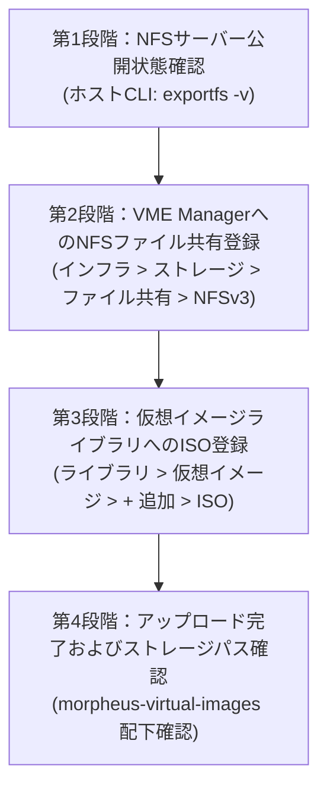

> **環境基準**: HPE Morpheus VM Essentials (VME) / HPE SimpliVity 6.2.0 (HVM 24.04 BaseOS)  
> **参照マニュアル**: SimpliVity ISOイメージ登録手順ガイド

---

HPE SimpliVity 6.2.0およびVME（VM Essentials）クラスターのデプロイが完了したら、次はインフラ上で実業務を担う仮想マシン（VM、Instance）を作成し、OS（Linux、Windowsなど）をインストールする段階に入ります。

VME環境で仮想マシンを作成してOSをセットアップするには、OSインストール用ISOファイルを仮想イメージライブラリにあらかじめ登録しておく必要があります。特に大容量のISOファイルが安定して保存され、クラスター内の全ホストから共通参照できるように、事前にNFSファイル共有ストレージ（File Share）をVME Managerに連携しておくことが基本設計となります。

本記事では、管理サーバー上のNFS共有フォルダーをVME Managerのイメージストアとして登録し、実際のOSインストール用ISOイメージをアップロードしてストレージパスを検証するまでの全手順を整理しました。現場での大容量ファイルアップロード時のタイムアウト回避策やアクセス権限のポイントも併せて解説します。

---

## 1. 全体作業ワークフロー

VME ManagerへのISO仮想イメージ登録は、ストレージバックエンド確認からファイル共有登録、ISOアップロード、ストレージパス検証までの4段階で進行します。



---

## 2. 作業前の重要チェックポイント

作業をスムーズに進めるため、事前に以下の3点を確認しておきます。

1. **「デフォルトの仮想イメージストア」の指定**  
   VME ManagerでNFSファイル共有を登録する際、画面下部の `デフォルトの仮想イメージストア (Default Virtual Image Store)` チェックボックスを必ず有効化します。これにより、今後仮想イメージを登録する際に該当NFSが既定のストレージバケットとして自動割り当てされ、VM作成時に全ホストからスムーズに参照できるようになります。
2. **NFSアクセス権限の設定 (`no_root_squash`)**  
   VME ManagerサービスがNFSサーバー上にISOファイルを書き込み、内部フォルダーを作成できるように、管理サーバーの `/etc/exports` に `rw,no_root_squash,no_subtree_check` オプションが正しく設定されていることを確認します。
3. **VMEにおけるISO保存ディレクトリ構造**  
   VME Webコンソール経由でISOを登録すると、NFS公開フォルダー（例: `/nfs`）の直下ではなく、`/nfs/morpheus-virtual-images/<固有数字ID>/<ファイル名.iso>` という階層で整理されて安全に保管されます。

---

## 3. ISOイメージ登録手順

---

### Step 01. NFSサーバー公開状態の確認 (CLI)

管理サーバー（Ubuntu BaseOS）に構築したNFSサービスが、共有ディレクトリ（`/nfs`）を正常にエクスポートしているかをターミナルで確認します。

```bash
# NFSエクスポート状態確認
root@vmemgr:/home/vmeadmin# exportfs -v
```


出力結果に `/nfs <world>(sync,wdelay,hide,no_subtree_check,sec=sys,rw,insecure,no_root_squash,no_all_squash)` のように正常なオプションが含まれていることを確認します。

---

### Step 02. VME Manager ストレージファイル共有メニューへ移動

WebブラウザでVM Essentials Managerコンソール（`https://<VME_Manager_IP>`）にアクセスします。
1. 上部メニューから **[インフラ (Infrastructure)] -> [ストレージ (Storage)]** へ移動します。
2. 上部タブで **`ファイル共有 (File Shares)`** を選択します。
3. 右側の **`[+ 追加]`** ドロップダウンから **`NFSv3`** をクリックします。


---

### Step 03. 新規ファイル共有（NFS）パラメーターの入力

`新規ファイル共有` モーダル画面で各パラメーターを入力します。


* **名前**: 識別しやすいストレージ名（例: `nfs`）
* **ホスト**: NFSサーバーのIPアドレス（管理サーバーIP）
* **エクスポート**: NFS共有ディレクトリパス（例: `/nfs`）
* **チェックボックス設定**:
  - `[✔] アクティブ (Active)`: チェック
  - `[ ] デフォルトのバックアップターゲット`: チェック解除
  - `[ ] デフォルトの配置アーカイブターゲット`: チェック解除
  - `[✔] デフォルトの仮想イメージストア`: **チェック必須**
* 入力完了後、右下の `[変更を保存]` をクリックします。

---

### Step 04. ファイル共有登録の完了確認

ファイル共有一覧画面に戻り、登録したNFSストレージが正常に表示されていることを確認します。
* **名前**: `nfs`
* **プロバイダータイプ**: `Nfs`
* **共有パス**: `<NFSサーバーIP>:/nfs`


---

### Step 05. 仮想イメージメニューへの移動とISO追加

ISOファイルをアップロードするため、ライブラリ画面へ移動します。
1. 上部メニューから **[ライブラリ (Library)] -> [仮想イメージ (Virtual Images)]** へ進みます。
2. 右上の **`[+ 追加]`** ドロップダウンをクリックし、`ISO` を選択します。


---

### Step 06. 仮想イメージアップロード情報およびバケット選択

`仮想イメージのアップロード` 画面でメタデータを入力します。


* **名前**: VMデプロイ時に表示されるイメージ名（例: `Ubuntu 22.04` または `Windows Server 2022`）
* **OS**: 対象のOS種別（例: `ubuntu 22.04 64-bit`）
* **最小メモリ**: デフォルト `0` MB
* **ストレージバケット**: ドロップダウンからStep 03で作成した `nfs` を選択
* **イメージIDソース**: `● ファイル` を選択

---

### Step 07. ファイルアップロードおよび仮想化オプション設定

画面下部で実際のISOファイルを指定し、仮想化オプションを設定します。


1. **ファイル追加**: ローカルPC内のISOファイル（例: `ubuntu-22.04.5-live-server-amd64.iso`）を `[ファイルを追加]` ボタンまたはドラッグ＆ドロップで指定します。進捗バーが100%になるまで待機します。
2. **詳細 (Advanced) オプション**:
   - `[✔] VirtIOドライバーはロードされていますか？`: Linux系OSはチェック（Windowsの場合はVirtIOドライバ組み込み有無を確認）
   - `[✔] VM Toolsはインストールされていますか？`: チェック
   - UEFI / Secure Boot / vTPM の必要性に応じて各フラグを指定
3. 右下の `[変更を保存]` をクリックします。

---

### Step 08. 仮想イメージ一覧でのアクティブ状態確認

仮想イメージ一覧に戻ると、アップロードしたISOが正常に登録されて表示されます。
* **タイプ**: `ISO`
* **名前**: `Ubuntu`
* **プラットフォーム**: `ubuntu 22.04 64-bit`
* **サイズ**: 実際のファイルサイズ（例: `2.0 GiB`）
* **ソース**: `アップロード済み`
* **ステータス**: `アクティブ (Active)`


---

### Step 09. ストレージファイル共有のディレクトリ構造検証

NFSストレージ上にISOがどのように配置されたかを検証します。
* **[インフラ] -> [ストレージ] -> [ファイル共有] -> `nfs`** の詳細画面を開きます。
* 下部のファイルブラウザを確認すると：
  - `nfs / morpheus-virtual-images / 19 / ubuntu-22.04.5-live-server-amd64.iso`  
  のように固有IDサブディレクトリ配下に隔離保存されていることが確認できます。


---

## 4. 仮想マシン作成時のISOマウント手順

登録されたISOイメージは、仮想マシンのプロビジョニング時にマウントして起動できます。

1. **[Provisioning] -> [Instances] -> [+ Add]** を実行します。
2. インスタンスタイプで `KVM` または `HVM` を選択します。
3. ストレージ設定フェーズで `CD ROM` ドライブに `Ubuntu (ISO)` を割り当てます。
4. VMを起動すると該当ISOからブートし、OSインストール作業に進むことができます。

---

## 5. 現場トラブルシューティング

> [!WARNING]
> **大容量ISO（5GB以上）アップロード中のWebブラウザ切断**  
> * **原因**: Webプロキシやロードバランサーのクライアントボディタイムアウトが短く設定されている場合に発生します。  
> * **対策**: 管理サーバーのターミナルからSCP等でホストの `/nfs` にファイルを直接転送し、VMEのイメージ登録画面で `● URL/PATH`（`file:///nfs/...`）を指定してローカルパスから即時インデックス登録すると、ネットワーク遅延なく確実に登録できます。

> [!WARNING]
> **仮想イメージのステータスが「エラー」になる場合**  
> * **原因**: NFSボリュームの容量不足、またはパーミッション不足により `morpheus-virtual-images` ディレクトリが作成できなかったケースです。  
> * **対策**: `df -h /nfs` で空き容量を確認し、`/nfs` の書き込み権限（`chmod -R 775 /nfs` など）を再設定してください。

---

## 6. まとめ

HPE VME環境におけるISOイメージライブラリの整備は、クラスター構築を終えて実業務仮想マシンを立ち上げるための重要な準備段階です。

NFS共有時の「デフォルト仮想イメージストア」の有効化と `no_root_squash` 権限の事前確認さえ徹底しておけば、その後のVMプロビジョニングを極めてスムーズに進めることができます。
