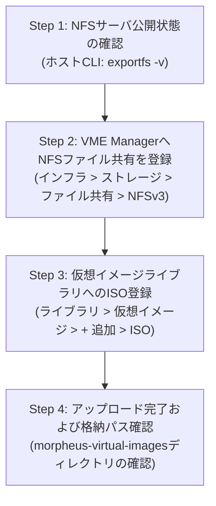

> **作成者**: 16年目のITフィールドエンジニア (CK notes)  
> **基準環境**: HPE Morpheus VM Essentials (VME) / HPE SimpliVity 6.2.0 (HVM 24.04 BaseOS)  
> **参照マニュアル**: SimpliVity ISO イメージ登録方法ガイド

---

こんにちは！16年目のITフィールドシステムエンジニア **CK notes** です。

HPE SimpliVity 6.2.0およびHPE Morpheus VM Essentials(VME)クラスタのデプロイが完了したら、次はいよいよ業務を担う**仮想マシン(VM/Instance)を作成し、OS(Linux, Windows等)をインストールする準備**を進める必要があります。

VM Essentials環境で仮想マシンをプロビジョニングしてOSをインストールするには、**OSインストール用ISOファイルをVMEの仮想イメージライブラリに登録**しておく必要があります。また、これらの大容量ISOファイルが安全に保管され、クラスタ内の全ホストからアクセスできるよう、**NFSファイル共有ストレージ(File Share)**をVME Managerに連携しておく必要があります。

本記事では、**[Step 1]で構築した管理サーバのNFS共有フォルダをVME Managerのイメージストアとして登録し、Ubuntu 22.04やWindowsのISOイメージをアップロードして実際のストレージ格納構造を検証するまでの全手順（合計9枚の実践UIスクリーンショット）**を分かりやすく解説します！

---

## 1. ISOイメージ登録およびNFS連携全体ワークフロー

VME ManagerへのISO仮想イメージ登録は、**ストレージバックエンド確認 ➔ ファイル共有登録 ➔ ISOアップロード ➔ 格納先検証**の4ステップで構成されます。



---

## 2. 16年目エンジニアの実践TIPS 3選

> [!TIP]
> **💡 実践TIPS 1: 「デフォルト仮想イメージストア」チェックは必須！**  
> VME ManagerでNFSファイル共有を登録する際、下部の**`[✔] デフォルト仮想イメージストア (Default Virtual Image Store)`**チェックボックスを必ず有効にしてください。このオプションを有効にしておくことで、今後の仮想イメージアップロード時に自動的に該当NFSが保存先バケットとして選択され、クラスタ内の全ホストがVMプロビジョニング時にスムーズに参照できます。

> [!IMPORTANT]
> **💡 実践TIPS 2: NFSアクセス権限設定 (`no_root_squash` 必須)**  
> VME ManagerがNFSサーバにファイルを書き込みサブフォルダを自動作成する際、権限エラーを防止するため、[Step 1]管理サーバの`/etc/exports`で**`rw,no_root_squash,no_subtree_check`**が付与されていることを確認してください。

> [!NOTE]
> **💡 実践TIPS 3: VMEのISO格納ディレクトリ構造**  
> VME Webコンソール経由でアップロードされたISOは、NFS公開フォルダ直下ではなく、**`/nfs/morpheus-virtual-images/<固有ID>/<ファイル名.iso>`**という階層構造で安全に分離管理されます。

---

## 3. ステップ別 ISOイメージ登録実践ガイド

---

### Step 01. NFSサーバ公開状態の確認 (CLI)

まず、[Step 1]で管理サーバに設定したNFSサービスが正常に`/nfs`を公開しているかターミナルで確認します。

```bash
# NFSエクスポート状態確認
root@vmemgr:/home/vmeadmin# exportfs -v
```


* 出力結果に`/nfs <world>(sync,wdelay,hide,no_subtree_check,sec=sys,rw,insecure,no_root_squash,no_all_squash)`が表示されていることを確認します。

---

### Step 02. VME Manager ストレージ ファイル共有メニューへ移動

WebブラウザでVME Manager（`https://<VME_Manager_IP>`）にログインし:
1. 上部メニューから**[インフラ (Infrastructure)] -> [ストレージ (Storage)]**へ移動します。
2. 上部タブで**`ファイル共有 (File Shares)`**を選択します。
3. 右側の**`[+ 追加]`**プルダウンをクリックし、**`NFSv3`**を選択します。


---

### Step 03. 新規ファイル共有パラメータの入力

`新規ファイル共有`モーダルで各項目を入力します:


* **名前**: 識別用ストレージ名（例: `nfs`）
* **ホスト**: NFSサーバのIPアドレス（[Step 1]管理サーバIP）
* **エクスポートフォルダ**: NFS公開パス（例: `/nfs`）
* **チェックボックス設定**:
  - **`[✔] アクティブ (Active)`**: チェック
  - **`[ ] デフォルトバックアップターゲット`**: 未チェック
  - **`[ ] デフォルトアーカイブターゲット`**: 未チェック
  - **`[✔] デフォルト仮想イメージストア`**: **必ずチェック！**
* **`[変更を保存]`**をクリックします。

---

### Step 04. ファイル共有登録完了の確認

一覧画面で登録されたNFSストレージを確認します:
* **名前**: `nfs`
* **プロバイダータイプ**: `Nfs`
* **共有パス**: `<NFS_サーバ_IP>:/nfs`


---

### Step 05. 仮想イメージメニューへ移動しISO追加を選択

ISOファイルを登録するためライブラリへ移動します:
1. 上部メニューから**[ライブラリ (Library)] -> [仮想イメージ (Virtual Images)]**へ移動します。
2. 右上の**`[+ 追加]`**プルダウンをクリックし、**`ISO`**を選択します。


---

### Step 06. 仮想イメージ属性入力およびバケット選択

イメージ情報を入力します:


* **名前**: VM作成時に表示される名前（例: `Ubuntu 22.04` または `Windows Server 2022`）
* **オペレーティングシステム**: 対象OS（例: `ubuntu 22.04 64-bit`）
* **最小メモリ**: デフォルト`0` MBのまま
* **バケット (Bucket)**: ドロップダウンから**`nfs`**を選択
* **イメージID生成**: **`● ファイル`**を選択

---

### Step 07. ファイルアップロードおよび高度な仮想化オプション設定

画面下部でファイルをアップロードし、仮想化オプションを設定します:


1. **ファイル追加**: ローカルPC内のISOファイル（例: `ubuntu-22.04.5-live-server-amd64.iso`）を選択またはドラッグ＆ドロップし、アップロード進捗が100%になるまで待機します。
2. **詳細オプションの確認**:
   - **`[✔] VirtIOドライバーはロードされていますか？`**: チェック（Linuxは標準内蔵）
   - **`[✔] VMツールはインストールされていますか？`**: チェック
   - 必要に応じてUEFI/Secure Boot/vTPMを選択。
3. **`[変更を保存]`**をクリックします。

---

### Step 08. 仮想イメージ一覧でのアップロード完了確認

仮想イメージカタログで登録されたISOを確認します:
* **タイプ**: `ISO`
* **名前**: `Ubuntu`
* **プラットフォーム**: `ubuntu 22.04 64-bit`
* **サイズ**: 実際の容量（例: `2.0 GiB`）
* **ソース**: `アップロード済み`
* **ステータス**: **`アクティブ (Active)`**


---

### Step 09. ファイル共有ストレージ内の格納構造の確認

NFSストレージ上の実際の配置パスを確認します:
* **[インフラ] -> [ストレージ] -> [ファイル共有] -> `nfs`** を開きます。
* ファイルブラウザを確認すると:
  - **`nfs / morpheus-virtual-images / 19 / ubuntu-22.04.5-live-server-amd64.iso`**  
  のように、VMEが固有IDフォルダを自動生成して安全に格納していることが分かります。


---

## 4. 仮想マシン(VM)作成時のISOマウント手順

登録されたISOは、VM新規プロビジョニング時に簡単にマウントできます:

1. **[Provisioning] -> [Instances] -> [+ 追加]** を選択します。
2. インスタンスタイプで**`KVM`**または**`HVM`**を指定します。
3. ストレージ構成画面の**`CD ROM`**プルダウンで登録した**`Ubuntu (ISO)`**を選択します。
4. VMを起動すると、自動的にISOからブートしてOSインストーラーが起動します。

---

## 5. よくある質問およびトラブルシューティング (FAQ)

> [!WARNING]
> **Q1. 大容量ISO(Windows Server 5GB+)のアップロード中にブラウザがタイムアウトします。**  
> * **解決策**: Web GUIアップロードの代わりに、ホストの`/nfs`ディレクトリに直接SCP等でファイルを転送し、VMEのアップロード画面で**`● URL/PATH`**（`file:///nfs/...`）を指定すると、数秒でインデックス登録が完了します。

> [!WARNING]
> **Q2. 仮想イメージのステータスがエラーになります。**  
> * **解決策**: NFSサーバの空き容量(`df -h /nfs`)およびディレクトリ書き込み権限(`chmod -R 777 /nfs`)を確認してください。

---

## 6. まとめ

これにて、HPE SimpliVityおよびVME環境で**NFSファイル共有を連携し、OSインストール用ISOイメージをライブラリに登録する全工程**が完了しました！

### 📌 重要ポイントまとめ
1. **NFS登録時は「デフォルト仮想イメージストア」を必ず有効化**
2. **ストレージ階層 `/nfs/morpheus-virtual-images/<ID>/` の理解**
3. **登録したISOによるスムーズなVMプロビジョニング**

---

ご不明な点や実務でのご質問がございましたら、お気軽にコメント欄までお寄せください！
